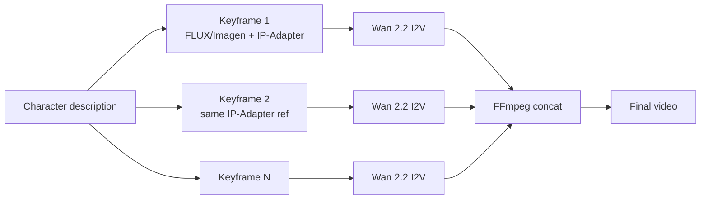

# Lip-Sync and Character Consistency (May 2026)

Two of the hardest problems in generative video. Each has a clear leader.

---

## Lip-Sync from Image + Audio

The standard pipeline:

```
Script text → TTS (ElevenLabs / Chatterbox / Hume) → Audio file
                ↓
Reference image (face) → Lip-Sync engine → Talking-head video
```

For TTS detail see the `generative-music-audio` skill.

### Hosted Comparison

| Service | Tier | Notes |
|---|---|---|
| **Hedra Character-3 / Omnia** | Hosted, polished | Creator $24/mo (~11 min of 720p Character-3 / month). Free tier 300 credits with watermark. **Best end-to-end product** for "image + audio → talking character video." Ships an actual API. |
| **Sync.so** | Hosted | Hobbyist $5/mo. **Strongest pure lip-sync API.** Pick this if embedding into a product pipeline — billing model designed for programmatic use. |
| **HeyGen** | Hosted | Avatar-led, captions in 120+ languages. Best for talking-head training video at scale. Subscription-only. |
| **Argil** | Hosted | Personal-avatar replicas from a 2-min selfie video. Best for "make me look like I posted today" social workflows. |
| **LatentSync** | Open | Wav2Lip-derived. Cleanest open lip-sync in ComfyUI. Lower quality than Hedra/Sync at the high end. |
| **MuseTalk / EchoMimic / Sonic / Hallo** | Open | Specialized variants. Use for keep-it-local pipelines. |

### Decision

| Need | Pick |
|---|---|
| End-to-end talking character (image + audio → video) | **Hedra Character-3** |
| Pure lip-sync API for product pipeline | **Sync.so** |
| Talking-head training video at scale | **HeyGen** |
| Personal avatar from selfie video | **Argil** |
| Local / open / private | **LatentSync** in ComfyUI |

### Hedra API — quick reference

```python
import requests, time

# 1. Upload image + audio
img = requests.post("https://api.hedra.com/v1/assets",
    headers={"X-API-Key": "..."}, files={"file": open("face.png", "rb")}).json()
aud = requests.post("https://api.hedra.com/v1/assets",
    headers={"X-API-Key": "..."}, files={"file": open("voice.mp3", "rb")}).json()

# 2. Generate (Character-3)
job = requests.post("https://api.hedra.com/v1/character", json={
    "image_id": img["id"],
    "audio_id": aud["id"],
    "model": "character-3",
    "aspect_ratio": "9:16",
}, headers={"X-API-Key": "..."}).json()

# 3. Poll
while True:
    status = requests.get(f"https://api.hedra.com/v1/jobs/{job['id']}",
        headers={"X-API-Key": "..."}).json()
    if status["status"] == "completed":
        print(status["output_url"])
        break
    time.sleep(5)
```

Verify exact endpoint paths against current Hedra docs — schema evolves.

### Local lip-sync (LatentSync in ComfyUI)

1. Install via ComfyUI-Manager: search "LatentSync".
2. Generate or import audio (Chatterbox / F5-TTS — see `generative-music-audio` skill).
3. Drag a reference image into LoadImage.
4. Run the LatentSync node with audio + image + face-detection.
5. Output to VHS_VideoCombine.

Quality is below Hedra/Sync at the high end but acceptable for personal projects + zero per-minute cost.

---

## Character Consistency Across Shots

The hardest hosted-video problem in 2026. No single tool is perfect.

### Veo 3.1 Ingredients — the hosted SOTA

- Upload up to **3 reference images** (face + outfit + background).
- Veo holds them stable across a project.
- **Closest thing the hosted world has to a real character library.**
- Pair with explicit motion prompts per shot.
- Limitation: still drifts on close-ups, hands, outfit details across very different lighting.

### Sora 2 Cameos — high quality, low flexibility

- **In-app iOS recording only** (count 1–10 turning your head).
- ~95% likeness when used legitimately.
- **NOT in the API as of May 2026.**
- Photo-upload was banned Feb 2026.
- Verdict: not a programmatic option. Use only if you have a recorded cameo and are working in the iOS Sora app.

### Runway References + Act-Two — best motion + named-reference combo

- **Runway References**: a library of named references you can re-invoke in prompts.
- **Act-Two**: phone-cam performance → any character image.
- The combination is uniquely good for "drive my fictional character with my own performance."

### Open: IP-Adapter + Keyframes pipeline

For full control on local hardware:



1. Generate all keyframes from FLUX (or Imagen, or SDXL) with **IP-Adapter** locked to a reference character image.
2. For each shot, run **Wan 2.2 I2V** from its keyframe.
3. Concatenate via FFmpeg.

This is laborious but **the highest control** path. Best for animators / studios who care about exact identity.

### Decision

| Need | Pick |
|---|---|
| Hosted, "just works" 80% | **Veo 3.1 Ingredients** (3 ref images) |
| Hosted, performance transfer | **Runway References + Act-Two** |
| Local, exact identity, willing to do the work | **IP-Adapter keyframes + Wan I2V** |
| You happen to have a Sora cameo recorded | Sora 2 (in-app only) |

---

## Anti-Patterns

### Pattern: "I'll just use Sora cameos via API"
**Detection**: any code expecting `cameo_id` parameter. **Fact**: not exposed in API May 2026. Use Veo Ingredients or local IP-Adapter pipeline instead.

### Pattern: "One Hedra call for a 10-min video"
**Detection**: single API call expecting >5min output. **Fact**: Hedra is per-clip. Chunk into 30-60s segments + concat in FFmpeg. Watch credit consumption.

### Pattern: "Lip-sync after rendering full video"
**Detection**: pipeline that lip-syncs the final composite. **Fact**: Lip-sync per shot, **before** any cuts/transitions. Stitching synced clips is much cleaner than syncing a stitched video.

### Pattern: "Character consistency = same prompt"
**Detection**: relying on prompt text alone for character continuity. **Fact**: identity drifts even with identical prompts. Use Ingredients (Veo) / References (Runway) / IP-Adapter (local).

---

## Cost Notes (Lip-sync + Consistency)

| Service | Cost approx |
|---|---|
| Hedra Character-3 Creator | ~11 min/month at $24/mo = ~$2/min finished |
| Hedra Character-3 pay-as-you-go | per-clip, watch the credits |
| Sync.so | $5/mo Hobbyist tier covers most personal use |
| LatentSync local | electricity only |
| Veo 3.1 Ingredients | included in Veo per-second pricing |
| Runway References + Act-Two | Act-Two ~$0.025/s; References included in subscription |

For pipeline orchestration (script → keyframes → I2V → audio → lip-sync), see `hybrid-pipeline.md`. For the underlying TTS choices, see the `generative-music-audio` skill.
