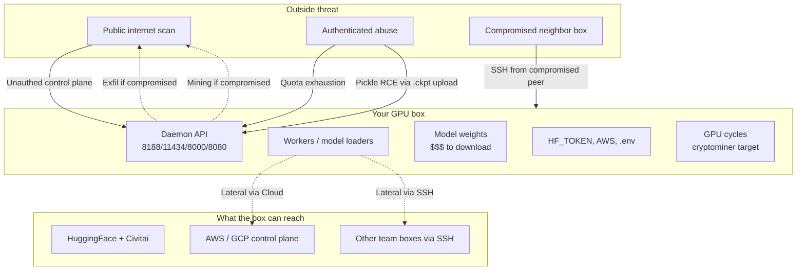
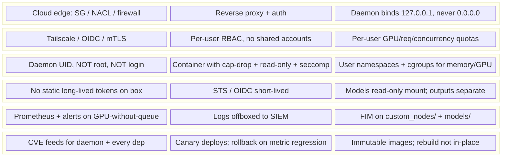

# GPU-Hosted Asset Hardening

The runtime hardening playbook for the long-lived GPU box. Not one-shot serverless inference — that's the platform's problem. This is for the persistent daemons: a ComfyUI rig, an Ollama box for self-hosted LLMs, a vLLM cluster, a Triton inference server, a JupyterHub for the team, a Ray head node for distributed training. Same threat model, slightly different specifics per daemon.

---

## When to Use

✅ Use for:
- Provisioning a new long-lived GPU box (any daemon: ComfyUI, Ollama, vLLM, Triton, TGI, Ray, JupyterHub, KServe).
- Hardening an existing GPU daemon that wasn't built defensively.
- Reviewing a deployment for production readiness ("can this be exposed to untrusted users?").
- Designing a multi-tenant GPU service.
- Operating a research lab GPU rig used by multiple people.

❌ NOT for:
- One-shot serverless inference on Modal/Replicate/fal.ai/Beam — those platforms manage runtime hardening; you focus on the supply chain (`supply-chain-defense-for-ml-extensions`) and the deployment artifact (`media-gen-deployment`).
- Active incident response on a suspected-compromised box — go to `comfyui-incident-response`.
- Ecosystem-side software supply chain (custom nodes, npm/PyPI deps) — that's `supply-chain-defense-for-ml-extensions`.
- Network design for non-GPU services — apply normal SRE / cloud-security practices.

---

## The threat model in one diagram

**The asset model**: GPU cycles, model weights, secrets the box can read, and the network position the box has. **The threats**: external scan, authenticated insider abuse, lateral compromise from a peer box, and software-supply-chain compromise (covered separately in `supply-chain-defense-for-ml-extensions`).

This skill addresses outside, insider, and lateral threats. For software-supply-chain threats, use the supply-chain skill.

---

## The Hardening Stack

Each layer is independently necessary. Skip a layer and you've created a single point of failure.

---

## Daemon-Specific Specifics

The threat model is universal but the *details* vary per daemon. Quick reference; deep dives in references.

| Daemon | Default port | Default bind | Auth out of the box? | Highest-leverage hardening step |
|---|---|---|---|---|
| ComfyUI | 8188 | 127.0.0.1 (default; tutorials say `--listen 0.0.0.0` ← danger) | None | Reverse proxy + auth; never `--listen 0.0.0.0` |
| Ollama | 11434 | 127.0.0.1 (default) | None | Bind explicit; firewall block 11434 from public |
| vLLM | 8000 | 0.0.0.0 (default!) | None | Reverse proxy + API key gate |
| Triton | 8000 (HTTP), 8001 (gRPC), 8002 (metrics) | 0.0.0.0 (default!) | None (until configured) | Reverse proxy + per-tenant model isolation |
| TGI (Text Generation Inference) | 80 (default in container) | 0.0.0.0 | Optional `HF_API_TOKEN` for downloading; no API auth | Reverse proxy + per-user quota |
| KServe | varies | k8s service | k8s RBAC | k8s NetworkPolicy + Istio mTLS |
| Ray dashboard | 8265 | 0.0.0.0 (default!) | None | Bind 127.0.0.1 + Tailscale, OR Ray's auth proxy |
| JupyterHub | 8000 (default) | 0.0.0.0 | OAuth/PAM | OAuth + per-user pod isolation |
| Hugging Face Inference Endpoints | n/a (managed) | n/a | platform-managed | Use platform's "private" endpoint type |

**The pattern**: most ML daemons default to `0.0.0.0` listening with no auth. The first hardening rule for *any* of them: change that.

See `references/network-hardening.md` for daemon-by-daemon network configs.

---

## The "1% effort, 80% safety" minimum

If you do nothing else, do these six things:

1. **Bind 127.0.0.1, not 0.0.0.0.** Reverse-proxy or Tailscale for actual access.
2. **Daemon UID is dedicated and low-priv** — not root, not your login user.
3. **Egress allowlist** — only HF / GitHub / PyPI / Civitai / your S3/R2.
4. **Secrets are short-lived and per-purpose** — STS for AWS, scoped HF tokens, no `.env` with long-lived keys.
5. **Observability**: Prometheus on GPU + outbound, alert on "GPU busy with no queue."
6. **Pinned-digest immutable image** — never `pip install` at runtime in production.

These six defeat ~85% of published 2024–26 attacks against GPU daemons. Half a day to set up. Maintenance: minor.

---

## Anti-Patterns

### "It's behind a firewall"

**Novice**: "We're on a private subnet, no external traffic can reach the box."
**Expert**: "Behind a firewall" decays. Today the subnet is private; tomorrow someone adds a public NAT for "just one quick test"; next month a new VPC peering connects you to a vendor. The defense layer that survives is: bind 127.0.0.1, require auth even for internal traffic, allowlist egress at the host. Network-only defense is a single point of failure that you don't notice until it's failed.
**Timeline**: 2018–present every "private subnet" exposure incident. April 2026 ComfyUI botnet caught a meaningful fraction of "I thought it was internal" boxes.
**Detection**: If your security model is "we just don't expose it," your security model is "we hope it stays unexposed." That's not a model.

---

### "Auth is configured at the load balancer"

**Novice**: "The reverse proxy authenticates, the backend doesn't need to."
**Expert**: Auth at the LB only is fine *if* the backend is unreachable any other way. In practice: someone SSHes into the box and `curl localhost:8188/prompt` — bypassing the LB entirely. Or there's a Tailscale tunnel to the box. Or someone running on the same VPC. **Auth must be at the daemon's port too**, even if redundant. Defense in depth is the principle; same-port auth is the implementation.
**Timeline**: Standard "service-mesh assumed mTLS" failures from 2019+. Triton's no-auth control plane has been a recurring case.
**Detection**: Try `curl http://127.0.0.1:8188/prompt` from another process on the same box. Should fail; if it succeeds, your "behind the LB" assumption is wrong.

---

### "Static long-lived tokens are fine for a service account"

**Novice**: "It's a service account; we generated a long-lived token; it's in the .env."
**Expert**: Long-lived tokens are not a defense; they're a single-point-of-compromise that lasts forever. The right pattern: STS (AWS), Workload Identity (GCP), short-lived OAuth (HF), or instance-bound credentials with auto-rotation. A leaked short-lived token is recoverable; a leaked long-lived one is a quarter of fire-fighting.
**Timeline**: 2018+ post-Capital-One incident; cloud providers have had STS / Workload Identity since before then; widespread adoption since 2020.
**Detection**: `grep -rE 'AKIA[0-9A-Z]{16}' /etc /home /root` — should return zero hits. If it returns any, those are static keys you should kill.

---

### "We don't need monitoring on this box, the cloud provider does it"

**Novice**: "We get CloudWatch / Stackdriver metrics; that's enough."
**Expert**: Cloud-side metrics tell you CPU/memory/disk. They don't tell you GPU utilization (need NVML). They don't tell you per-process network connections. They don't tell you that your custom node directory just changed. You need both: cloud-side for infra signal + on-box (Prometheus node_exporter + nvidia_gpu_exporter + auditd) for runtime signal. Without the second, you'll find out about a cryptominer because the *power bill* changed.
**Timeline**: 2020+ widespread cloud adoption made cloud-only monitoring tempting; 2023+ GPU-rig-specific incidents show its limits.
**Detection**: If your dashboard doesn't show GPU utilization vs. queue depth on the same chart, your dashboard can't see cryptomining.

---

### "Patching is a quarterly thing"

**Novice**: "We patch CVEs every quarter; it's on the roadmap."
**Expert**: ComfyUI-Manager CVE-2025-45076 had public PoC within 24 hours of disclosure. Some npm and PyPI typosquats reach top-100-most-downloaded inside a week. Quarterly patching means you carry every fresh CVE for ~90 days. The right cadence: subscribe to security feeds for *every* daemon and key dep you run; fast-track patching of any CVE rated high or critical. Daily check, automated where possible.
**Timeline**: 2018+ widespread CVE-feed tooling (Dependabot, Snyk, Trivy); 2024+ cloud-native security providers offer auto-patching.
**Detection**: How many days from a public CVE disclosure of a daemon you run until it's patched in production? If you don't know, the answer is "too many."

---

### "Ray's dashboard is fine on 0.0.0.0; it's just metrics"

**Novice**: "The Ray dashboard is read-only; we don't need to lock it down."
**Expert**: Ray's dashboard isn't read-only — it has a "submit job" endpoint. Past versions had unauthenticated job submission, allowing arbitrary code execution. The April 2024 Ray ShadowRay campaign exploited exactly this against tens of thousands of public Ray clusters; reported losses ran into millions of dollars (compute, exfiltrated training data, stolen credentials). Same shape as the April 2026 ComfyUI botnet, different daemon. Same fix: never expose Ray dashboard to public internet; ingress through a reverse proxy with auth.
**Timeline**: April 2024 — Ray ShadowRay campaign. CVE-2023-48022 is the formal disclosure.
**Detection**: `curl http://your-ray-head:8265/api/jobs` from outside your network. Should fail; if it returns JSON, you're vulnerable.

---

## Reference Files

| File | Consult When |
|---|---|
| `references/threat-model.md` | First time hardening; or when adding a new daemon to your stack and you need the threat-class breakdown. |
| `references/network-hardening.md` | Daemon-by-daemon network configs (ComfyUI, Ollama, vLLM, Triton, Ray, etc.). Reverse proxy, Tailscale, Cloudflare Access, K8s NetworkPolicy. |
| `references/auth-and-quotas.md` | Designing auth (OIDC, mTLS) and quota systems (per-user GPU, request, concurrency limits) for multi-tenant GPU services. |
| `references/sandboxing.md` | Container sandbox configs, seccomp profiles, user namespaces, AppArmor/SELinux for GPU daemons. |
| `references/secrets-and-storage.md` | Removing static long-lived tokens; STS / OIDC / Workload Identity patterns; read-only model mounts; output isolation. |
| `references/observability.md` | Prometheus exporters (node, GPU, daemon-specific), alert rules that catch cryptomining and exfil, log offloading, FIM. |
| `references/patching-strategy.md` | Daemon + dep CVE feed subscription, automated rebuilds, canary deploys, fast-track CVE response cadence. |

---

## Output Contract

When this skill is invoked for a hardening review:

1. **Identify the daemon(s)** running on the target box.
2. **Walk the 6-layer hardening stack** in order: network, auth, sandbox, secrets, observability, patching.
3. **For each layer, state**: current state, target state, gap, concrete remediation step.
4. **Surface the highest-leverage gap first** — the one that, if closed, prevents the largest class of attacks. Usually network bind or egress allowlist.
5. **Don't over-prescribe.** A research lab doesn't need the same hardening as a customer-facing service. Ask about stakes; default to the minimum-six if unspecified.
6. **Cross-reference incidents**: when you cite a defense layer, name the historical attack it would have prevented (April 2026 ComfyUI botnet, ShadowRay, Pickai, etc.). The mechanism becomes credible because the cost of skipping it is concrete.

The goal is a hardened box that survives the *next* attack, not the last one — but the last attack is the most concrete evidence available, so use it.
