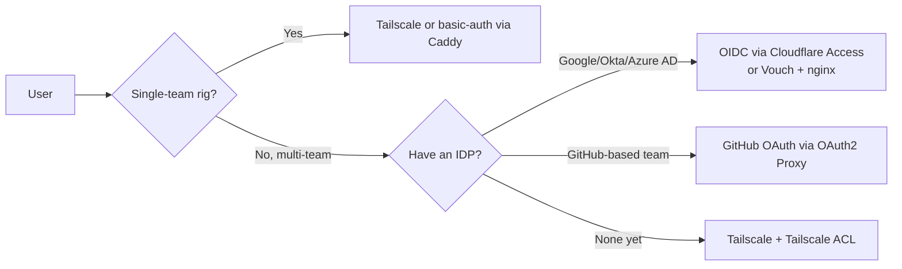

# Auth + Quotas — Identity, RBAC, and Per-User Limits

Network hardening blocks unauthorized access. Auth + quotas controls *authorized* access — making sure that the people who *can* use the daemon don't crash it, exhaust it, or pivot through it. Especially relevant for shared rigs and multi-tenant services.

---

## Authentication options (pick one minimum)



### Tailscale (best default for small teams)

- Identity: each tailnet member's email/SSO.
- ACL: per-user / per-group access to specific machines and ports.
- Audit: dashboard shows who connected to what, when.

```jsonc
// Tailnet ACL example
{
  "tagOwners": {
    "tag:gpu-rig": ["alice@example.com"]
  },
  "acls": [
    // Engineers can SSH + reach ComfyUI
    {"action": "accept", "src": ["group:engineers"], "dst": ["tag:gpu-rig:22,8188"]},
    // Researchers can only reach ComfyUI (read-only via reverse proxy)
    {"action": "accept", "src": ["group:researchers"], "dst": ["tag:gpu-rig:8188"]},
  ],
  "groups": {
    "group:engineers": ["alice@example.com", "bob@example.com"],
    "group:researchers": ["carol@example.com"]
  }
}
```

### Cloudflare Access (best for customer-facing or multi-org)

- Identity: any OIDC IDP (Google, Microsoft, Okta, Azure AD, generic OIDC).
- ACL: per-app rules; can require MFA, certain country, certain IP range.
- Audit: detailed login + denied-attempt logs.
- Cost: free up to 50 users; ~$3/user/month above.

```yaml
# Application policy in Cloudflare Access dashboard
application: comfy.example.com
policies:
  - name: engineers
    decision: allow
    include:
      - email_domain: example.com
      - github_team: example-org/engineers
    require:
      - mfa: true
```

### OAuth2 Proxy (self-hosted)

```bash
oauth2-proxy \
  --provider=github \
  --github-org=example-org \
  --github-team=engineers \
  --upstream=http://127.0.0.1:8188 \
  --http-address=127.0.0.1:4180 \
  --redirect-url=https://comfy.example.com/oauth2/callback \
  --cookie-secret=$RANDOM_32_BYTES \
  --client-id=$GITHUB_OAUTH_CLIENT_ID \
  --client-secret=$GITHUB_OAUTH_CLIENT_SECRET
```

Then reverse-proxy `comfy.example.com` → `127.0.0.1:4180` → `127.0.0.1:8188`.

### mTLS (service-to-service)

When the consumer is another service, not a human:

```bash
# Generate per-service client cert
openssl req -newkey rsa:2048 -nodes -keyout client.key -x509 -days 30 -out client.crt \
  -subj "/CN=video-pipeline-prod"

# Caddy will validate against your CA
your-comfy.example.com {
  tls {
    client_auth {
      mode require_and_verify
      trust_pool file /etc/caddy/client-ca.pem
    }
  }
  reverse_proxy 127.0.0.1:8188
}
```

Short-lived certs (30 days) + automated rotation via Vault or cert-manager.

---

## RBAC (role-based access control)

Even with auth, not every authenticated user should do everything. Map users to roles to permissions.

### Minimal RBAC sketch

```
Roles:
  admin       — install/remove custom nodes, restart daemon, view logs
  user        — submit workflows, view own outputs
  viewer      — view outputs only (read-only API)

Mapping:
  alice@example.com → admin
  bob@example.com → user
  carol@example.com → viewer
```

ComfyUI itself doesn't have RBAC. Implement it at the reverse proxy:

```caddy
your-comfy.example.com {
  @admin {
    forward_auth /authcheck {
      copy_headers X-Forwarded-User
    }
    header X-Forwarded-User "alice@example.com"
  }
  @write_paths path /prompt /upload /api/manager/*
  handle @write_paths {
    @admin reverse_proxy 127.0.0.1:8188
    respond "Forbidden" 403
  }
  reverse_proxy 127.0.0.1:8188
}
```

(The exact syntax varies by reverse proxy; the principle is "gate write paths to admin role.")

### Triton multi-tenant

Triton's `--auth-config` plus per-model RBAC: each model has an authorization rule mapping API keys → which models they can invoke. For multi-tenant production: one Triton instance per tenant + Istio AuthorizationPolicies as the outer layer.

### JupyterHub

JupyterHub has Roles (admin, user) and per-user containers. Add resource limits per role:

```yaml
hub:
  config:
    KubeSpawner:
      mem_limit: '8G'
      cpu_limit: 2
      extra_resource_limits:
        nvidia.com/gpu: 1
```

---

## Quotas: GPU, requests, concurrency

Auth says who. Quotas say how much.

### Per-user GPU quota

```yaml
# k8s ResourceQuota per namespace (one ns per user/team)
apiVersion: v1
kind: ResourceQuota
metadata:
  name: gpu-quota-alice
  namespace: alice
spec:
  hard:
    requests.nvidia.com/gpu: "1"
    limits.memory: "32Gi"
    limits.cpu: "8"
```

### Per-user request rate / concurrency

For a service in front of the daemon (the recommended pattern):

```python
# FastAPI sketch with per-user concurrency limit
import asyncio
from collections import defaultdict
from fastapi import FastAPI, Request, HTTPException, Depends

PER_USER_CONCURRENT = 2  # max concurrent jobs per user
locks: dict[str, asyncio.Semaphore] = defaultdict(lambda: asyncio.Semaphore(PER_USER_CONCURRENT))
app = FastAPI()

async def get_user(req: Request) -> str:
    # Pull from your auth header
    return req.headers["x-forwarded-user"]

@app.post("/submit")
async def submit(workflow: dict, user: str = Depends(get_user)):
    sem = locks[user]
    if sem.locked():
        raise HTTPException(429, "Too many concurrent jobs; wait for one to finish")
    async with sem:
        return await call_comfy(workflow)
```

### Request rate limiting

Use a real rate limiter (Redis-backed `slowapi`, Cloudflare Rate Limiting, nginx `limit_req`). Per-user, not per-IP — a real user behind a corporate NAT shouldn't share a limit with thousands of strangers.

### Per-request resource ceilings

Submission validation step: parse the workflow, reject if it would exceed limits.

```python
# Reject workflows that exceed per-job VRAM budget
def validate_workflow(workflow: dict, max_vram_gb: int = 16) -> None:
    estimated_vram = estimate_vram(workflow)  # daemon-specific
    if estimated_vram > max_vram_gb:
        raise ValueError(f"Workflow needs ~{estimated_vram} GB VRAM; max {max_vram_gb}")

    # Reject specific high-risk node types
    if any(n["class_type"] == "ComfyUI-Manager" for n in workflow["nodes"]):
        raise ValueError("Manager API not allowed via submission")
```

---

## Audit logging

For every auth event and every state-changing API call, log:

```json
{
  "ts": "2026-04-15T14:23:00Z",
  "user": "alice@example.com",
  "action": "submit_workflow",
  "request_id": "req_xxx",
  "workflow_hash": "sha256:abc...",
  "client_ip": "100.x.y.z",
  "result": "accepted"
}
```

Send to a centralized log sink (Datadog, Honeycomb, Loki, ELK). Retention: 90+ days for security forensics.

What you want to query later:

- "Who submitted any workflow that took more than 30 minutes in the last 7 days?"
- "Which users have been getting 401s?" (cred rotation needed?)
- "Which IPs are submitting from outside our tailnet?" (auth bypass attempt?)

---

## "We share a service account" — don't

The pattern: one `comfy-bot` service account is used by everything. No traceability. No revocation granularity. One credential leak = full compromise.

The right pattern: per-purpose, per-actor, short-lived credentials.

- One human user → one identity (OIDC).
- One service caller → one mTLS cert / scoped API key.
- One CI job → one short-lived OIDC token (GitHub Actions OIDC, GitLab OIDC).

Each credential has a purpose, an owner, an expiry, and a rotation procedure.

---

## What "done" looks like

- [ ] Authentication is enforced at the daemon's port (not just the LB).
- [ ] Identity is per-actor (no shared service accounts).
- [ ] Roles are defined; write operations gated to authorized roles.
- [ ] Per-user GPU/CPU/concurrency quotas enforced.
- [ ] Per-request resource ceilings (VRAM budget, max runtime) validated at submission.
- [ ] Rate limiting per user in addition to per-IP.
- [ ] All auth events + state-changing API calls logged centrally with 90+ day retention.
- [ ] Tested: a non-admin user cannot install custom nodes, restart daemon, or invoke admin paths.
- [ ] Tested: a user at quota cannot submit additional workloads.

Move next to `sandboxing.md` for the runtime isolation layer.
