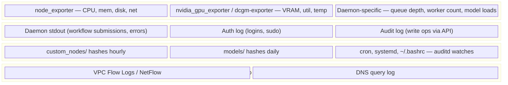

# Observability — Catching Compromise Before the Power Bill Does

The point of observability for security is **time-to-detection**. Cloud provider metrics tell you when CPU is high; they don't tell you when GPU util is 95% with an empty queue, or when outbound traffic is going to an unfamiliar IP, or when a custom node directory just changed. You need both layers.

---

## The signal stack



Cloud-side gives you infra signal. On-box gives you runtime signal. Combined gives you the cryptominer alert at minute 2 instead of week 2.

---

## Prometheus exporters to install

```bash
# node_exporter — CPU/mem/disk/net
docker run -d --name node-exporter --net host \
  --pid host --restart unless-stopped \
  -v /:/host:ro,rslave \
  quay.io/prometheus/node-exporter:latest \
  --path.rootfs=/host

# nvidia_gpu_exporter — VRAM, util, temp
docker run -d --name dcgm-exporter --net host \
  --gpus all \
  nvcr.io/nvidia/k8s/dcgm-exporter:latest

# Container metrics (cAdvisor)
docker run -d --name cadvisor --net host \
  -v /:/rootfs:ro -v /var/run:/var/run:ro \
  -v /sys:/sys:ro -v /var/lib/docker:/var/lib/docker:ro \
  gcr.io/cadvisor/cadvisor:latest
```

Wire these into Grafana / Datadog / Prometheus / whatever you use.

---

## Alert rules that catch real attacks

### Cryptominer signal (the canonical one)

```yaml
# Prometheus alert: GPU busy with no daemon work
- alert: GPUBusyNoQueue
  expr: |
    max(DCGM_FI_DEV_GPU_UTIL) > 80
    and
    max(comfyui_queue_running + comfyui_queue_pending) == 0
  for: 5m
  labels:
    severity: critical
  annotations:
    summary: "GPU at {{ $value }}% utilization with no queued workflows — cryptominer suspected"
    runbook: "https://wiki.example.com/incident-response/comfyui-incident-response"
```

This single alert catches the canonical compromise pattern and would have caught the April 2026 botnet within minutes. **If you do nothing else, build this alert.**

### Outbound to non-allowlist host

```yaml
- alert: OutboundToNonAllowlist
  expr: |
    sum by (dst) (rate(node_netstat_Tcp_OutSegs{dst!~"hf.co|github.com|civitai.com|pypi.org|comfy.org|<your-r2>"}[5m])) > 0
  for: 2m
  labels:
    severity: high
  annotations:
    summary: "Outbound TCP to non-allowlist host {{ $labels.dst }}"
```

In practice this needs proper VPC Flow Log analysis (per-IP, not per-hostname); use Datadog NDM, AWS GuardDuty, or a custom log-side aggregator.

### File-integrity changes

```yaml
- alert: CustomNodesChanged
  expr: |
    increase(comfyui_custom_nodes_modified_files_total[1h]) > 0
  for: 5m
  annotations:
    summary: "Files in custom_nodes/ modified outside an admin-initiated install"
```

This requires emitting a metric from your FIM cron (see below).

### Spike in error rate

```yaml
- alert: ComfyUIErrorRateSpike
  expr: |
    rate(comfyui_execution_errors_total[5m]) > 0.5
  for: 10m
  annotations:
    summary: "ComfyUI error rate spiked — could indicate hostile workflow submissions"
```

Catches the "attacker probing the API" phase.

### New listening socket

```yaml
- alert: NewListeningPort
  expr: |
    count(node_netstat_Tcp_listenSockets) - count(node_netstat_Tcp_listenSockets offset 1h) > 0
  annotations:
    summary: "Number of listening TCP sockets increased — investigate"
```

A reverse shell that opens a new listener will trigger this.

---

## File-integrity monitoring (FIM)

### Hourly hash check (cheap)

```bash
#!/bin/bash
# /etc/cron.hourly/comfyui-fim
set -e
BASELINE=/var/lib/comfyui/custom_nodes.sha256
CURRENT=$(mktemp)

cd /opt/comfyui/custom_nodes
find . -type f -name '*.py' -exec sha256sum {} + | sort > $CURRENT

if [ -f $BASELINE ]; then
  DIFF=$(diff $BASELINE $CURRENT | wc -l)
  if [ $DIFF -gt 0 ]; then
    # Emit a metric for Prometheus to scrape
    echo "comfyui_custom_nodes_modified_files_total $DIFF" \
      > /var/lib/node_exporter/textfile/comfyui-fim.prom
    diff $BASELINE $CURRENT | mail -s "ComfyUI custom_nodes change" you@example.com
  fi
fi

mv $CURRENT $BASELINE
```

### auditd watches (kernel-level)

```bash
# Persistence-mechanism watches
sudo auditctl -w /opt/comfyui/custom_nodes -p wa -k comfyui_nodes
sudo auditctl -w /etc/cron.d -p wa -k cron_changes
sudo auditctl -w /etc/cron.daily -p wa -k cron_changes
sudo auditctl -w /etc/systemd/system -p wa -k systemd_changes
sudo auditctl -w /etc/ld.so.preload -p wa -k preload_changes
sudo auditctl -w /home/comfyui/.bashrc -p wa -k shell_init
```

Persist via `/etc/audit/rules.d/comfyui.rules`. Query with `ausearch -k comfyui_nodes -ts today`.

### AIDE (Advanced Intrusion Detection Environment)

For higher-assurance: AIDE compares filesystem state against a cryptographic baseline.

```bash
# Initial baseline (run once, store the DB on a separate read-only volume)
sudo aide --init

# Periodic check (cron daily)
sudo aide --check
```

---

## Logs offboxed to a SIEM

If logs only live on the box, an attacker tampers with them. Always ship to a central sink:

```bash
# vector.toml
[sources.comfyui]
type = "file"
include = ["/var/log/comfyui/*.log", "/var/log/auth.log", "/var/log/audit/audit.log"]

[sinks.datadog]
type = "datadog_logs"
inputs = ["comfyui"]
default_api_key = "${DD_API_KEY}"

[sinks.s3_archive]
type = "aws_s3"
inputs = ["comfyui"]
bucket = "logs-archive-with-object-lock"  # write-once retention
key_prefix = "comfyui/"
```

The `s3_archive` sink with object lock means even if the attacker has the box's IAM role, they can't modify or delete archived logs.

Tag every log line with: deployment SHA, image digest, daemon UID, hostname, environment. So you can filter to "all events from the compromised box in the compromise window" trivially.

---

## Daemon-specific instrumentation

### ComfyUI

ComfyUI doesn't expose Prometheus metrics by default. Two approaches:

1. **Crystools** custom node provides a `/metrics` endpoint with VRAM/queue.
2. **Custom middleware** that wraps `/prompt` and `/queue` to emit:
   - `comfyui_workflow_submitted_total{user="alice"}`
   - `comfyui_workflow_duration_seconds`
   - `comfyui_execution_errors_total`
   - `comfyui_queue_running`, `comfyui_queue_pending`

### Ollama

`OLLAMA_DEBUG=1` exposes more verbose logging. For metrics, scrape the box's `node_exporter` + `dcgm-exporter` and correlate with Ollama's stdout.

### vLLM

```bash
python -m vllm.entrypoints.openai.api_server --enable-metrics
# /metrics endpoint exposes Prometheus-format metrics
```

Useful: `vllm:request_success_total`, `vllm:gpu_cache_usage_perc`.

### Triton

`--allow-metrics=true --metrics-port=8002` (default on, but on `0.0.0.0` — bind to localhost). Scrape `/metrics`.

### Ray

Ray dashboard exposes Prometheus at `/metrics`. Don't expose to public.

---

## Dashboards

Build one dashboard per concern:

1. **Health**: GPU util, VRAM, CPU, memory, daemon up/down.
2. **Quality**: queue depth, error rate, p95 latency, model loads.
3. **Security**: outbound connections by destination, FIM changes, auth events, anomaly count.

The security dashboard is the one you check during an incident. Make it bookmark-able and runbook-linked.

---

## What the canonical "GPU is busy with no queue" alert would have caught

Cross-referencing real incidents:

| Incident | Detection signal | Time-to-detection if rule had been active |
|---|---|---|
| April 2026 ComfyUI botnet | GPU > 80% + empty queue | ~5 min |
| Akira upscalers (Oct 2025) | Outbound to non-allowlist host | ~2 min |
| Pickai C++ backdoor (May 2025) | New listening socket + outbound to C2 | ~5 min |
| Ray ShadowRay (Apr 2024) | Same: GPU busy with no Ray job | ~5 min |

A single alert cluster (GPU + outbound + listener delta) catches the entire opportunistic attack class.

---

## What "done" looks like

- [ ] node_exporter, dcgm-exporter, cAdvisor scraped to a central Prometheus.
- [ ] Daemon-specific metrics endpoint scraped (Crystools / vLLM / Triton / Ray).
- [ ] Alert: GPU > 80% with empty queue → page within 5 min.
- [ ] Alert: outbound to non-allowlist host → page within 2 min.
- [ ] Alert: custom_nodes/ FIM diff → email within 1 hour.
- [ ] Alert: new listening socket → page within 5 min.
- [ ] Alert: auth-log anomalies (failed-login spike, sudo from unfamiliar user) → page.
- [ ] All logs ship offsite to a SIEM and a write-once archive (S3 object lock or equivalent).
- [ ] auditd watches on cron/systemd/`~/.bashrc`/`/etc/ld.so.preload`.
- [ ] Dashboards: health + quality + security; bookmarked + linked from runbooks.
- [ ] Tested: simulate a "GPU pegged with empty queue" condition; verify the alert fires.

Move to `patching-strategy.md` for the maintenance cadence.
