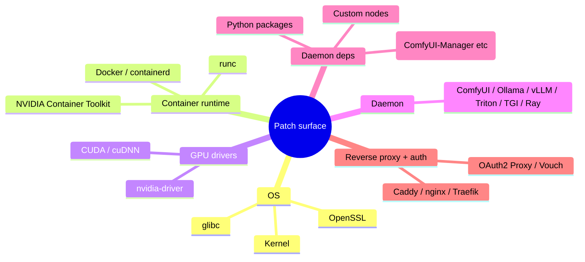
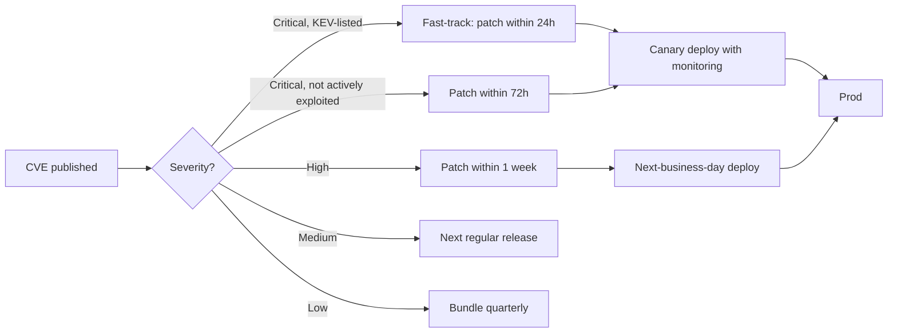
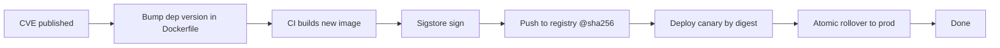

# Patching Strategy — Cadence, Automation, and the "Day 0 Bug" Plan

The goal: zero-day → patched in production within 24–72 hours for high/critical CVEs in the daemon stack. Quarterly patching is for the OS base layer; the ML daemon stack moves faster than that.

---

## The patching surface for an ML rig



Each layer has its own CVE feed and its own patching cadence. The patching-strategy skill: subscribe to all of them, automate the easy parts, fast-track the hard ones.

---

## CVE feeds to subscribe to

| Source | Coverage | Format |
|---|---|---|
| **NVD** | All registered CVEs | API + RSS |
| **GitHub Advisory Database** | Per-package; supports GitHub repos via Dependabot | Dependabot alerts on your repos |
| **Trivy DB** | OS + language packages | `trivy image` periodically in CI |
| **Snyk** | Per-package; commercial | Snyk dashboards + GitHub PRs |
| **Daemon-specific GitHub Security tab** | Each daemon's own CVEs | Watch the repo for "security" advisories |
| **NVIDIA Security Bulletin** | Drivers, CUDA, CTK | RSS at developer.nvidia.com |
| **The Hacker News + krebsonsecurity** | News-style; lower latency on big incidents | RSS |
| **CISA KEV (Known Exploited Vulnerabilities) catalog** | What's actively exploited; prioritize ruthlessly | RSS |

For ML-specific:

- **Comfy-Org/ComfyUI security** — watch the repo's Security tab and #security channel.
- **ComfyUI-Manager** — same; CVE-2025-45076 is the model.
- **vLLM** — `vllm-project/vllm` Security tab.
- **Ray** — `ray-project/ray` Security tab; ShadowRay's CVE was here.
- **PyTorch** — `pytorch/pytorch` Security tab.

Aggregate to one place — Slack channel, Linear board, GitHub Security alerts inbox. Subscribe, don't wait for someone to escalate.

---

## Automated scanning in CI

```yaml
# .github/workflows/security-scan.yml
name: security-scan
on:
  push: { branches: [main] }
  schedule: { cron: '0 6 * * *' }  # daily

jobs:
  trivy:
    runs-on: ubuntu-latest
    steps:
      - uses: actions/checkout@v4
      - name: Build image
        run: docker build -t comfyui:scan .
      - name: Trivy scan (filesystem + image)
        uses: aquasecurity/trivy-action@master
        with:
          image-ref: comfyui:scan
          format: 'sarif'
          output: 'trivy-results.sarif'
          severity: 'HIGH,CRITICAL'
          exit-code: '1'  # fail the build on H/C findings
      - name: Upload to GitHub Security tab
        uses: github/codeql-action/upload-sarif@v3
        with:
          sarif_file: trivy-results.sarif

  pip-audit:
    runs-on: ubuntu-latest
    steps:
      - uses: actions/checkout@v4
      - run: pip install pip-audit
      - run: pip-audit --requirement requirements.txt
```

`trivy` for OS + language packages. `pip-audit` for Python. `npm audit` if you have JS. `cargo audit` for Rust.

Block deploys on critical CVEs. For high CVEs: warn, but allow with a documented exception that auto-expires.

---

## Patching cadence by severity



The first two categories — anything KEV-listed or critical — go through the fast-track path. Everything else follows normal release cadence.

Define this in your team's SLA so it's enforced, not opinionated.

---

## Fast-track playbook (for the bad day)

When a critical CVE drops on a daemon you're running:

1. **Within 1 hour: triage**
   - Read the advisory; determine if your config is affected.
   - Check if a patched version exists.
   - If not, identify a temporary mitigation (disable affected feature, add WAF rule, etc.).

2. **Within 4 hours: build**
   - Bump the dep in your Dockerfile / requirements.
   - Build the new image.
   - Run the smoke test suite in CI.

3. **Within 8 hours: canary**
   - Deploy to a canary instance.
   - Monitor for regression in: error rate, latency, GPU util.
   - 30-minute soak.

4. **Within 24 hours: full rollout**
   - Roll forward to all production instances.
   - Communicate to stakeholders.

5. **Within 7 days: postmortem**
   - Why was this in our stack? Could a prior dep diff have caught it?
   - Did our defense layers reduce blast radius pre-patch?
   - Any runbook improvements?

Each step has an owner. Each step has a clear "done" definition.

---

## Patching custom nodes specifically

Custom nodes are the *fastest-moving* part of the stack and the most security-sensitive.

```bash
# Diff every custom-node update
cd /opt/comfyui/custom_nodes
for d in */; do
  pushd "$d" >/dev/null
  if [ -d .git ]; then
    git fetch origin --depth 50
    LOG=$(git log HEAD..origin/HEAD --oneline)
    if [ -n "$LOG" ]; then
      echo "=== $d ==="
      echo "$LOG"
      git diff HEAD..origin/HEAD --stat
    fi
  fi
  popd >/dev/null
done
```

Run weekly. For each diff:
- Read the changes.
- If it touches `__init__.py` or imports anything new → review carefully.
- If it just bumps a version string → safe.
- Update the lockfile (`manager-snapshot.json`) only after explicit review.

**Auto-update for custom nodes is malpractice.** A compromised maintainer pushes a bad version; auto-update propagates it before you see it.

---

## Immutable images, never in-place patches

The wrong pattern:

```bash
# Don't do this in production
ssh prod-rig
sudo apt update && sudo apt upgrade
pip install --upgrade comfyui-manager
sudo systemctl restart comfyui
```

In-place patches mean the prod box's state is unique and undocumented. The right pattern:



Atomic rollover: blue/green or rolling restart with health checks. The old image stays around for 1–2 weeks for fast rollback.

For ComfyUI specifically: this means the model weights aren't baked into the image (they're on a mounted volume), so rebuilds are seconds, not "wait for 50GB to download."

---

## Rollback plan

Every deploy has a rollback plan. Document it for the daemon you're running.

```bash
# Roll back ComfyUI
docker stop comfyui
docker rm comfyui
docker run -d --name comfyui ... comfyui:previous-sha

# Verify health
curl -fsS http://127.0.0.1:8188/system_stats | jq
```

Practice the rollback during a non-incident period. A rollback you've never tested is theater.

---

## Patch verification

After patching, verify the fix actually closed the gap:

```bash
# CVE-2025-45076: ComfyUI-Manager pre-v3.31 had unauth RCE
# Verify by sending the exploit payload — should now return 401 / 403
curl -X POST http://127.0.0.1:8188/manager/install \
  -H 'Content-Type: application/json' \
  -d '{"node":"https://example/malicious"}'
# After patch: 401 Unauthorized
```

Add a regression test for every patched CVE so you can't reintroduce it.

---

## Patching the patching infrastructure itself

Your CI runner, your container registry, your secrets store — these are also targets. Patch them too. Subscribe to advisories for:

- Your CI provider (GitHub Actions, GitLab, Buildkite, etc.).
- Your registry (ECR, GAR, Docker Hub, Harbor).
- Your secrets store (Vault, AWS Secrets Manager, etc.).
- Your reverse proxy + auth proxy.

CI/CD compromise is the high-leverage attack: one foothold and the attacker controls every deploy.

---

## What "done" looks like

- [ ] CVE feeds subscribed for OS, container runtime, GPU drivers, daemon, daemon deps, reverse proxy, auth proxy.
- [ ] Daily automated scan in CI (Trivy, pip-audit, npm audit).
- [ ] Dependabot / Renovate enabled on the daemon-config repo.
- [ ] Patching SLA defined: critical/KEV in 24h, critical in 72h, high in 1wk.
- [ ] Fast-track playbook documented and rehearsed.
- [ ] Custom-node updates reviewed, never auto-merged.
- [ ] Immutable images: no in-place patching in production.
- [ ] Rollback procedure documented and tested.
- [ ] Regression tests for past CVEs in your stack.
- [ ] Patching SLA tracked: percentage of CVEs patched within their target window.

Cycle back to `threat-model.md` quarterly to verify the threat model still matches your deployment.
