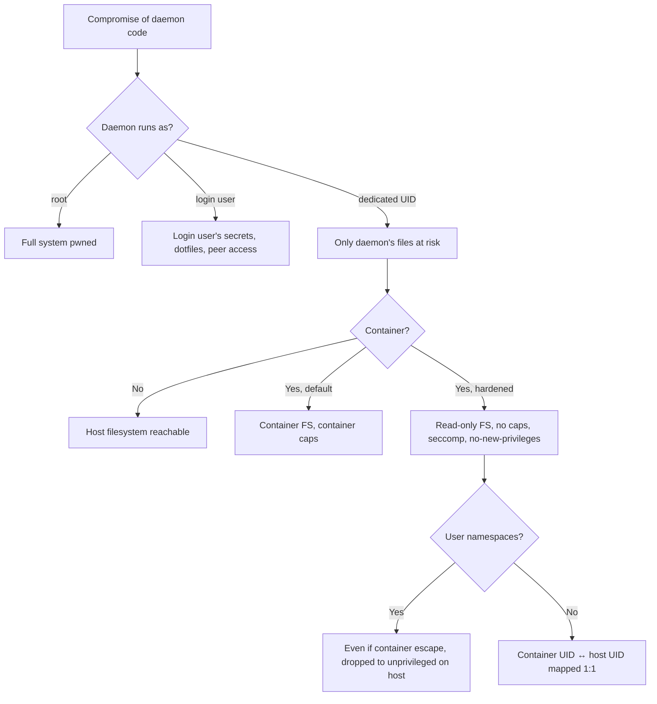

# Sandboxing — Capability Isolation for the Daemon Process

The principle: assume the daemon will eventually be compromised. Limit what it can do when that happens. The blast radius of a compromise is exactly the set of capabilities the daemon has.

---

## The capability stack



Each layer cuts the blast radius further. Aim for I + J in production.

---

## Layer 1 — Dedicated UID

**Mandatory.** Don't run the daemon as root or as your login user.

```bash
# Create a dedicated user
sudo useradd -r -s /bin/false -d /opt/comfyui -m comfyui
sudo chown -R comfyui:comfyui /opt/comfyui

# Run the daemon as that user
sudo -u comfyui /opt/comfyui/venv/bin/python main.py

# Or via systemd
# /etc/systemd/system/comfyui.service
[Service]
User=comfyui
Group=comfyui
ExecStart=/opt/comfyui/venv/bin/python main.py
WorkingDirectory=/opt/comfyui
```

Verify:

```bash
ps -eo pid,user,comm | grep main.py
# user column should say `comfyui`, not `root` and not `your_login_name`

# The daemon UID can't read your secrets
sudo -u comfyui cat ~/.aws/credentials  # should fail with "Permission denied"
```

---

## Layer 2 — Filesystem capability minimization

Even within the daemon UID, restrict reach.

```bash
# Models read-only
sudo chown -R comfyui:comfyui /srv/models
sudo chmod -R 555 /srv/models  # read+execute, no write

# Outputs writable, but separate from code
sudo install -d -m 770 -o comfyui -g comfyui /srv/outputs

# Code read-only at runtime (so a compromise can't modify it for persistence)
sudo chmod -R 555 /opt/comfyui  # except venv site-packages if installs happen at runtime
```

For ComfyUI specifically: pre-install all custom nodes at image build time, then make `custom_nodes/` read-only at runtime. Updates require a new image, not in-place mutation.

---

## Layer 3 — Container sandbox (Linux)

Run the daemon in a container with restrictive flags.

```bash
docker run \
  --name comfyui \
  --user 1000:1000 \
  --read-only \
  --tmpfs /tmp:size=2g,exec \
  --tmpfs /home/comfyui:size=512m \
  --cap-drop ALL \
  --security-opt no-new-privileges \
  --security-opt seccomp=/etc/comfyui-seccomp.json \
  --pids-limit 256 \
  --memory 32g \
  --memory-swap 32g \
  --cpus 8 \
  --gpus all \
  -v /srv/models:/app/models:ro \
  -v /srv/outputs:/app/outputs:rw \
  -p 127.0.0.1:8188:8188 \
  comfyui:pinned-sha
```

What each flag does:

| Flag | Effect |
|---|---|
| `--user 1000:1000` | Container UID/GID; not root inside container |
| `--read-only` | Root filesystem is RO; payloads can't write to it |
| `--tmpfs /tmp:size=2g,exec` | RW scratch in RAM; gone on restart |
| `--cap-drop ALL` | No Linux capabilities (no raw sockets, ptrace, mount, etc.) |
| `--security-opt no-new-privileges` | setuid binaries can't escalate |
| `--security-opt seccomp=...` | Whitelist of syscalls (see below) |
| `--pids-limit 256` | Caps fork-bomb damage |
| `--memory 32g`, `--cpus 8` | Cgroup limits |
| `models:ro` | Models can't be tampered with by the daemon |
| `127.0.0.1:8188` | Bound to localhost; reverse proxy routes external traffic |

### Seccomp profile

Use Docker's default seccomp as a starting point. For higher security, build a daemon-specific profile that whitelists only the syscalls the daemon actually uses.

```bash
# Trace syscalls during normal operation to derive a profile
sudo strace -f -e trace=all -o trace.log -p $(pgrep -f comfyui)

# Convert to a seccomp profile (use a tool like `seccomp-profiler` or hand-craft)
```

Default Docker seccomp blocks ~44 dangerous syscalls (`mount`, `unshare`, `bpf`, `kexec_load`, etc.) — that alone defeats most container escapes.

---

## Layer 4 — User namespaces (extra defense)

User namespaces map container UIDs to non-overlapping host UIDs. Even if a container escape happens, the attacker is "user 100000" on the host, not "root."

```bash
# /etc/docker/daemon.json
{
  "userns-remap": "default"
}
```

Trade-off: can break some volume mount patterns; test before enabling in production.

For higher isolation: gVisor (`runsc` runtime) intercepts syscalls in userspace. Not GPU-friendly out of the box; check current support before relying on it.

---

## Layer 5 — Apple Silicon / macOS

For local dev on Apple Silicon (mlx-based stacks):

- Run the daemon as a non-admin user (System Settings → Users).
- Use `launchd` with `EnvironmentVariables` scoped to the daemon.
- macOS sandboxing via `sandbox-exec` (undocumented but powerful):
  ```bash
  # /etc/comfyui.sb
  (version 1)
  (deny default)
  (allow process-fork)
  (allow file-read* (subpath "/opt/comfyui"))
  (allow file-read* (subpath "/srv/models"))
  (allow file-write* (subpath "/srv/outputs"))
  (allow network-bind (local ip "*:8188"))
  (allow network-outbound (remote tcp "huggingface.co:443"))

  sudo sandbox-exec -f /etc/comfyui.sb /opt/comfyui/venv/bin/python main.py
  ```
- Or use Docker Desktop's built-in VM-level isolation (good enough for most cases; trades CPU for safety).

---

## Layer 6 — Windows

```powershell
# Run daemon as a low-priv local account (not Administrator)
$cred = Get-Credential
Start-Process -Credential $cred -FilePath "python" -ArgumentList "main.py"

# For higher isolation: Windows Sandbox or Hyper-V container
# Windows Sandbox (.wsb file)
<Configuration>
  <VGpu>Enable</VGpu>
  <Networking>Default</Networking>
  <MappedFolders>
    <MappedFolder>
      <HostFolder>C:\Models</HostFolder>
      <SandboxFolder>C:\Models</SandboxFolder>
      <ReadOnly>true</ReadOnly>
    </MappedFolder>
  </MappedFolders>
  <LogonCommand>
    <Command>python C:\app\main.py</Command>
  </LogonCommand>
</Configuration>
```

Windows Sandbox is throwaway by design — restart, fresh state. Good for treating the daemon as ephemeral.

---

## GPU-specific considerations

- **NVIDIA Container Toolkit + `--gpus`** gives the container access to the GPU device.
- Default config exposes ALL GPUs; for multi-tenant boxes, use `--gpus 'device=0'` to scope.
- MIG (Multi-Instance GPU) on A100/H100 hardware-partitions one GPU into up to 7 isolated slices. Use for genuine multi-tenant inference where slices map to tenants.
- **Don't use `--privileged`**. Some tutorials suggest it for "GPU access"; it's wrong. NVIDIA Container Toolkit handles GPU access without privilege escalation.

---

## Sandboxing the model load (pickle defense)

Pickle (`.ckpt`/`.pt`) executes arbitrary code on load. Even with a sandboxed daemon, pickle can run as the daemon UID. Defenses:

1. **Safetensors-only policy.** Reject `.ckpt` / `.pt`. This is the strongest defense.
2. **Restricted unpickler.** When you must:

   ```python
   import io, pickle
   
   class RestrictedUnpickler(pickle.Unpickler):
       ALLOWED = {
           ("torch", "Tensor"),
           ("torch", "FloatStorage"),
           ("collections", "OrderedDict"),
           # Add only what you need
       }
       def find_class(self, module, name):
           if (module, name) in self.ALLOWED:
               return super().find_class(module, name)
           raise pickle.UnpicklingError(f"Forbidden global: {module}.{name}")
   
   def safe_load(path):
       with open(path, "rb") as f:
           return RestrictedUnpickler(f).load()
   ```

3. **Run pickle loads in a one-shot subprocess** with even tighter sandboxing (a separate container with no network, no FS write).

For Hugging Face: always pass `trust_remote_code=False` (default) when calling `from_pretrained`. The opt-in `trust_remote_code=True` allows the model repo to ship Python code that runs on load — equivalent to pickle in attack surface.

---

## Sandboxing custom-node imports

ComfyUI imports every custom node at startup. A malicious node runs at that time, with the daemon UID and full network reach.

Mitigation:

1. **Pre-adoption review.** (See `supply-chain-defense-for-ml-extensions`.)
2. **Network-cut the daemon during initial node import.** ComfyUI's first-time setup will probably need network for downloads; subsequent restarts shouldn't. Add a startup mode where egress is blocked.
3. **`importtime` profiling**, then alert on slow imports — payloads that download stage-2 components show up as slow imports.

---

## Verification

```bash
# Daemon UID
ps -eo pid,user,comm | grep -E 'comfyui|main\.py'  # should show dedicated UID

# Capabilities (in container)
docker exec comfyui capsh --print  # should show "Current: =" (empty)

# Filesystem
docker exec comfyui ls -la /  # / should be RO (writes fail with EROFS)
docker exec comfyui touch /test  # should fail
docker exec comfyui touch /tmp/test  # should succeed (tmpfs RW)

# Network
docker exec comfyui curl -m 5 https://example.com  # should fail (egress allowlist)
```

Run these checks weekly via cron and alert on any drift.

---

## What "done" looks like

- [ ] Daemon runs as dedicated low-priv UID, not root, not your login user.
- [ ] Container with `--read-only`, `--cap-drop ALL`, `--no-new-privileges`, seccomp profile.
- [ ] Resource limits (memory, CPUs, pids) enforced.
- [ ] Models mounted read-only.
- [ ] Outputs in a separate volume.
- [ ] User namespaces enabled (or `runsc` / equivalent).
- [ ] Pickle defense: safetensors-only or restricted unpickler.
- [ ] `trust_remote_code=False` everywhere it matters.
- [ ] Verification cron checks UID, capabilities, FS RO, egress allowlist weekly.

Move to `secrets-and-storage.md` for the credential side.
