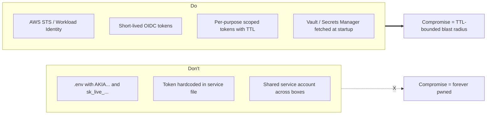

# Secrets + Storage — Removing the Long-Lived Footgun

The principle: **no static long-lived credentials on the box**. A leaked short-lived token is a half-day of cleanup. A leaked long-lived `AKIA...` is weeks of fire-fighting.

---

## What "no static long-lived credentials" looks like



---

## AWS — STS / Instance Profile

For an EC2 instance:

```bash
# Attach an IAM role to the instance, NOT a static access key
# Role policy: only the specific S3 paths the daemon needs

# In code: use the default credential chain (boto3 picks up the IMDSv2 creds)
import boto3
s3 = boto3.client("s3")  # no credentials needed in code or env
```

Make sure IMDSv2 is enforced:

```bash
aws ec2 modify-instance-metadata-options \
  --instance-id $INSTANCE \
  --http-tokens required \
  --http-put-response-hop-limit 1
```

This blocks the SSRF-style attack where a vulnerable daemon's HTTP client is tricked into hitting `169.254.169.254` and exfilling instance creds.

For ECS / Fargate / EKS: **task role** (ECS) or **IRSA** (EKS). Same principle: the runtime gets a scoped role, not a static key.

---

## GCP — Workload Identity

```bash
# k8s + GCP: bind a Kubernetes ServiceAccount to a GCP ServiceAccount
gcloud iam service-accounts add-iam-policy-binding \
  comfyui@PROJECT.iam.gserviceaccount.com \
  --role roles/iam.workloadIdentityUser \
  --member "serviceAccount:PROJECT.svc.id.goog[NAMESPACE/comfyui]"
```

In code: GCP libraries auto-detect Workload Identity, no key file needed.

---

## Azure — Managed Identity

```bash
# Assign a system-assigned managed identity to the VM
az vm identity assign --resource-group rg --name comfyui-vm
```

In code: `DefaultAzureCredential()` picks it up.

---

## HuggingFace tokens

HF doesn't have STS-like ephemeral tokens (yet — fine-grained tokens since 2024 are the closest). Defense:

1. **Use fine-grained tokens** (HF settings → Access Tokens → Fine-grained), scoped to specific repos and read-only when possible.
2. **One token per box, not one shared token**. So you can revoke per-box if one is compromised.
3. **Rotate weekly via cron**. Generate new token, deploy, revoke old.
4. **Don't put the token in a `.env` file the daemon UID can read forever.** Mount it from a secrets store at startup.

---

## OpenAI / Anthropic / Replicate / Stripe

Same rule: scoped, per-purpose, rotated.

- **OpenAI**: project keys (multi-project for OpenAI orgs); restrict to specific models if possible.
- **Anthropic**: workspace-scoped keys; rotate.
- **Replicate**: per-model API tokens; can scope to read-only.
- **Stripe**: restricted keys; never use the secret key on a daemon that serves user content.

---

## Secrets at startup, not at rest

```bash
# Bad: secrets in .env on disk forever
cat /opt/comfyui/.env
HF_TOKEN=hf_...
AWS_ACCESS_KEY_ID=AKIA...

# Good: secrets fetched at startup, in memory only
# systemd unit
[Service]
ExecStartPre=/usr/local/bin/fetch-secrets.sh
EnvironmentFile=-/run/secrets/env  # tmpfs-mounted, gone on reboot
ExecStart=/opt/comfyui/venv/bin/python main.py
```

`fetch-secrets.sh`:

```bash
#!/bin/bash
set -euo pipefail
mkdir -p /run/secrets
chmod 700 /run/secrets

# Fetch from Vault / AWS Secrets Manager / GCP Secret Manager
HF_TOKEN=$(aws secretsmanager get-secret-value --secret-id comfyui/hf_token \
  --query SecretString --output text)

# Write to a tmpfs (RAM-only) file
{
  echo "HF_TOKEN=$HF_TOKEN"
} > /run/secrets/env
chmod 600 /run/secrets/env
chown comfyui:comfyui /run/secrets/env
```

Result: secrets live in RAM, not on disk. `find / -name '.env'` returns nothing useful to an attacker.

---

## Mounting secrets in containers

```yaml
# k8s — secret as a volume, not as env vars (env vars leak into /proc/$PID/environ)
apiVersion: v1
kind: Pod
spec:
  containers:
    - name: comfyui
      volumeMounts:
        - name: secrets
          mountPath: /run/secrets
          readOnly: true
  volumes:
    - name: secrets
      secret:
        secretName: comfyui-secrets
        defaultMode: 0400
```

In the daemon: read `/run/secrets/hf_token` at startup, hold in process memory, discard on shutdown.

For Docker Compose: use `secrets:` blocks; for raw Docker: mount a tmpfs and `docker run --secret` (Swarm) or `docker compose --env-file`.

---

## Storage layout for ML rigs

```
/opt/comfyui/         # code, RO at runtime
/srv/models/          # weights, RO mounted
/srv/outputs/         # generated content, RW; per-user subdirs
/run/secrets/         # secrets from secret manager, tmpfs, 0400
/var/log/comfyui/     # daemon logs, tail-shipped to log sink
/tmp/                 # scratch, tmpfs, daemon-writable
```

What this layout buys you:

- A pickle RCE in a model load can't modify `/opt/comfyui/` (RO).
- A pickle RCE can write `/tmp` and `/srv/outputs` but those are non-persistent / non-code paths.
- Secrets aren't reachable via `find /opt -name '.env'`.
- Logs are shipped offsite; the attacker can't tamper with them by deleting on-box log files.

---

## Per-user output isolation (multi-tenant)

If multiple users share a box:

```bash
/srv/outputs/
├── alice/      # 0700 owned by alice
├── bob/        # 0700 owned by bob
└── carol/      # 0700 owned by carol
```

Daemon serves output through an authenticated API that maps user → directory. Don't expose `/output/<filename>` directly with no auth (that's a directory-traversal incident waiting to happen).

---

## Backup + retention

For models: HF Hub / Civitai / your R2 bucket are the canonical sources. The local copies are caches; a wipe-and-redownload is OK.

For outputs: tier by user. Customer outputs need their normal retention policy + lifecycle (auto-delete after N days). Internal / dev outputs can be more aggressively pruned.

For logs: 90+ days retention in a centralized sink.

For configs: in git.

**Don't back up secrets to disk.** A backup of `.env` on a network share has all the same problems as the original `.env`, plus more places to forget about.

---

## What NOT to put on the box

- **Long-lived AWS access keys**. Use STS / IAM roles.
- **Personal SSH keys (private halves) for unrelated repos**. The daemon doesn't need to reach your `dotfiles` repo; don't give it the keys.
- **Passwordless `~/.netrc` files for GitHub**. Use deploy keys per-purpose.
- **Cached browser credentials** (cookies, session tokens). The daemon shouldn't have a browser anyway.
- **kubeconfig with cluster-admin RBAC**. Scope it: kubeconfig with the minimum role needed.

The audit:

```bash
sudo find / -type f \( -name '.env' -o -name '*.netrc' -o -name 'credentials' \
  -o -name '*.pem' -o -name 'id_rsa' -o -name 'kubeconfig' \) 2>/dev/null
```

Every hit deserves a "should this be here?" review.

---

## What "done" looks like

- [ ] No long-lived static cloud keys on the box (AWS, GCP, Azure use STS / Workload Identity / Managed Identity).
- [ ] HF / OpenAI / Anthropic tokens are scoped, per-purpose, rotated weekly.
- [ ] Secrets fetched at startup from a secret manager, written to tmpfs, never to disk.
- [ ] Container secrets via volume mounts, not env vars.
- [ ] Models mounted RO; outputs isolated per-user.
- [ ] IMDSv2 enforced (AWS).
- [ ] Logs shipped offsite for tamper-resistance.
- [ ] Periodic audit: `find / -name '.env'` etc. returns nothing surprising.

Move to `observability.md` for the runtime visibility layer.
