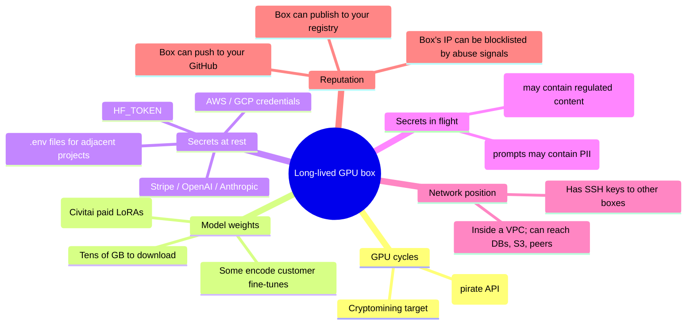
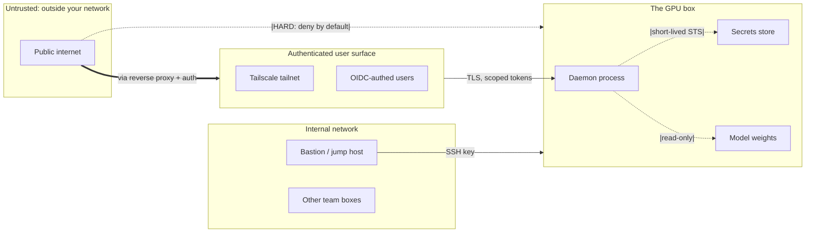

# Threat Model — Long-Lived GPU Boxes

The asset map and adversary classes for any persistent GPU daemon: ComfyUI, Ollama, vLLM, Triton, TGI, Ray, JupyterHub, KServe. Use this when you're new to the daemon you're hardening — the *specifics* differ but the threat shape is universal.

---

## Asset map



The trick: each asset attracts a different threat class. A research student rig has very different secrets-at-rest than a customer-facing inference service. Calibrate the hardening to which assets are actually present.

---

## Adversary classes

```mermaid
quadrantChart
  title Adversary class by capability and motivation
  x-axis Low capability --> High capability
  y-axis Opportunistic --> Targeted
  quadrant-1 APT — targeted + capable
  quadrant-2 Insider abuse — targeted + low-cap
  quadrant-3 Mass scanner — opportunistic + low-cap
  quadrant-4 Crimeware crew — opportunistic + capable
  Mass cryptojacker: [0.2, 0.15]
  Script-kiddie scan: [0.2, 0.05]
  Authenticated insider: [0.4, 0.85]
  Crimeware operator: [0.7, 0.3]
  State-aligned APT: [0.9, 0.95]
  Supply-chain (Akira-class): [0.8, 0.5]
```

### Mass scanner / opportunistic

- **Capability**: low to moderate. Uses public exploit code, mass-scans the internet for known ports.
- **Motivation**: monetize whatever they find. Mining, ransomware, credential resale.
- **Targets**: public-facing daemons with no auth, default ports, default configs.
- **Cost to deploy a defense that defeats them**: extremely low (don't expose ports). Cost of being hit: moderate (rebuild + cred rotation).
- **Canonical example**: April 2026 ComfyUI botnet; April 2024 Ray ShadowRay.

### Crimeware crew / supply-chain class

- **Capability**: high. Build malicious packages, run social engineering, maintain infrastructure.
- **Motivation**: steal credentials at scale, monetize via fraud / mining / extortion.
- **Targets**: anyone who installs their package. Indiscriminate but less random than scanners.
- **Cost to defend**: moderate (code review, lockfiles, egress allowlist).
- **Canonical example**: Akira upscalers Oct 2025–Jan 2026; ua-parser-js 2021.

### Authenticated insider

- **Capability**: low (just normal user). Uses their legitimate access in unintended ways.
- **Motivation**: usually exhaustion (using more than their share), occasionally malice (stealing models, exfiltrating training data, running cryptominer on team rig).
- **Targets**: shared GPU rigs, JupyterHubs, multi-tenant inference services.
- **Cost to defend**: per-user quotas, RBAC, audit logging.
- **Canonical example**: any "the intern crashed the cluster" or "the contractor downloaded all our model weights" story.

### Targeted APT

- **Capability**: very high. Will burn 0-days and develop custom tooling for a specific target.
- **Motivation**: model weight theft (proprietary fine-tunes, frontier base model exfil), training data theft, sabotage (poison the training set).
- **Targets**: research labs at frontier AI orgs, defense contractors, big-tech model teams.
- **Cost to defend**: very high. SLSA L4-equivalent, hermetic builds, full audit, separate networks, hardware HSM.
- **Canonical example**: rumored 2024–25 frontier-lab incidents (most undisclosed publicly).

**The right threat model for your box**: the lowest-tier adversary you can imagine *plus* one tier up to give yourself margin. A hobbyist box should defend against mass scanners + supply-chain compromise. A customer-facing service should defend against everything except APT. A frontier lab should plan for APT.

---

## STRIDE applied to GPU daemons

| Threat | Concrete example for an ML rig |
|---|---|
| **S**poofing | Attacker submits API requests with spoofed user identity (no auth → trivial). |
| **T**ampering | Attacker modifies a custom node's `.py` files in place; compromises next restart. |
| **R**epudiation | Insider runs a non-trivial workload, claims they didn't; no audit log. |
| **I**nformation disclosure | Daemon UID can read `~/.aws/credentials`; pickle RCE leaks them. |
| **D**enial of service | Submit very-high-VRAM workflow; OOMs the rig and crashes it. |
| **E**levation of privilege | Pickle RCE in a `.ckpt` upload runs as daemon UID; chains to root via local kernel exploit. |

The defense layers in `defense-layers.md` map back to each STRIDE class.

---

## Trust boundaries — where to draw lines



The trust boundaries:

1. **Public ↔ Authenticated**: the reverse proxy / Tailscale exit. Auth happens here; deny by default.
2. **Authenticated ↔ Daemon**: the daemon's port. Re-check auth here too (defense in depth).
3. **Daemon ↔ Secrets**: the credentials surface. Use STS/OIDC, never long-lived static keys; daemon UID reads them just-in-time.
4. **Daemon ↔ Models**: the data plane. Models read-only mounted; outputs writable but in a separate volume.

Every defense layer in this skill is implementing one of these boundaries.

---

## What changes by daemon

The threat model is universal but emphasis shifts:

| Daemon | Highest-leverage threat | Specific concern |
|---|---|---|
| ComfyUI | Custom node supply chain + public exposure | Pickle RCE via `.ckpt` upload; April 2026 botnet pattern. |
| Ollama | Public exposure + data exfil | Default `127.0.0.1` is good; people break it with `OLLAMA_HOST=0.0.0.0`. |
| vLLM | Public exposure + abuse | Default `0.0.0.0` is bad; people deploy it raw. |
| Triton | Multi-tenant isolation | One backend can read another tenant's inputs if not isolated. |
| TGI (HF) | Public exposure + token theft | `HF_API_TOKEN` env var leaks via `/info`-like endpoints. |
| Ray | Public exposure + RCE | CVE-2023-48022 ShadowRay; `submit_job` without auth = full RCE. |
| JupyterHub | Insider abuse + per-user isolation | Default per-user containers but shared GPU; quota enforcement matters. |
| KServe | k8s blast radius | Compromised model server can `exec` into peer pods if RBAC is loose. |

For a multi-daemon rig (e.g., ComfyUI + Ollama on the same box for a team), the threat model is the *union* — you defend against all of them.

---

## What "done" with the threat model looks like

You know:

- Which assets your specific deployment has (and which it doesn't — saves work).
- Which adversary classes are realistic for your stakes.
- Where the trust boundaries are; which layer enforces each.
- Which threats are highest-leverage for your specific daemon.

Now move to `network-hardening.md` to start closing the gaps.
