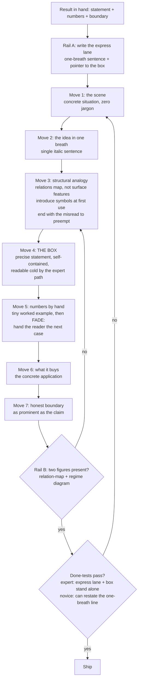

# Harbor Exposition: Seven Moves + Two Rails

Present every result so a smart engineer who has never read the source volume believes it before they see it formalized — and knows exactly where it stops holding.

## When to Use
✅ Use for: writing or reviewing result write-ups, execution reports, paper sections, explainer posts, or converting an existing formal/terse draft to house style; deciding figure and notation choices for a technical piece.
❌ NOT for: API/reference documentation, marketing or landing-page copy, commit messages or code comments, or producing the proofs/derivations/experiments themselves (do those first; this skill presents them).

## Core Process

## The Two Rails (run the length of every piece)
- **Rail A — two reading paths.** Open with a one-sentence express lane (the Move-2 sentence + "formal statement in the box"). Experts read it and jump to the box; everyone else reads straight through. Counters the expertise-reversal effect.
- **Rail B — visual discipline.** Exactly two figures per piece, reusing one program-wide grammar: a *relation-map* for the analogy (base ∥ target ∥ correspondence arrows) and a *regime diagram* for the boundary (axes = key parameters; shaded = where the result holds). Keep figure cost far below Distill's ~100-hour failure threshold.

## Anti-Patterns

### Definitions First
**Novice**: "Define all terms and notation up front, then use them."
**Expert**: Terms earn their definitions through use; the formal box comes only after the reader already believes the claim (Sanderson's concrete-before-abstract; Tao's pre-rigorous stage; Sweller & Cooper's worked-example effect).
**Timeline**: Halmos 1970 said it; cognitive-load research confirmed it experimentally (1985, 2003); codified here 2026-08.
**Detection**: A "Notation" or "Preliminaries" section before any motivating example.

### Boundary Burial
**Novice**: Caveats go in a trailing clause or footnote so the result looks strong.
**Expert**: The boundary is a full move with its own regime diagram — what the result does NOT say, as prominent as what it does. A result without a boundary paragraph is not done (Halmos: "honesty is the best policy").
**Detection**: The word "however" carrying the entire limitation load in one sentence; no regime figure.

### One Path For All Readers
**Novice**: One linear narrative serves everyone.
**Expert**: Scaffolding that helps novices is redundant load for experts (expertise-reversal, Kalyuga 2003). Ship the express lane; make the box self-contained so it can be read cold.
**Detection**: An expert must wade through the story to find the theorem statement.

### Vibe Anomaly / Uncalibrated Analogy
**Novice**: Pick an analogy that "feels like" the topic (surface features).
**Expert**: Analogies must map *relations* (Gentner structure-mapping): the reader should be able to derive new true facts about the target from the analogy. End every analogy with the predictable misread it invites, preempted.
**Detection**: The analogy cannot survive one "so does that mean…?" question.

## References
- `references/style-template-v2.md` — Read when actually drafting or reviewing a piece: per-move craft guidance, done-tests, figure grammar, notation rules, numeric-claim provenance policy, LaTeX skeleton.
- `references/exposition-principles.md` — Read when justifying a style decision, teaching the style, or evolving the template: the 14 evidence-backed principles with citations and the v1→v2 critique rationale.
- `examples/worked-exemplar-R7.md` — Read when unsure how a move should feel in practice: a fully annotated exemplar (the inspection tower) with each move labeled.

## Scripts
- `python3 scripts/check_style.py <draft.md|draft.tex>` — the done-test linter: checks express lane, one-breath line, the box, the "Now you try" fade, misread-to-preempt (warn-only; waive consciously), honest boundary, and [verified]/[internal] provenance tags; exit 1 if a required check fails. Run before shipping any piece; sanity-check it against examples/worked-exemplar-R7.md (passes 7/7).
