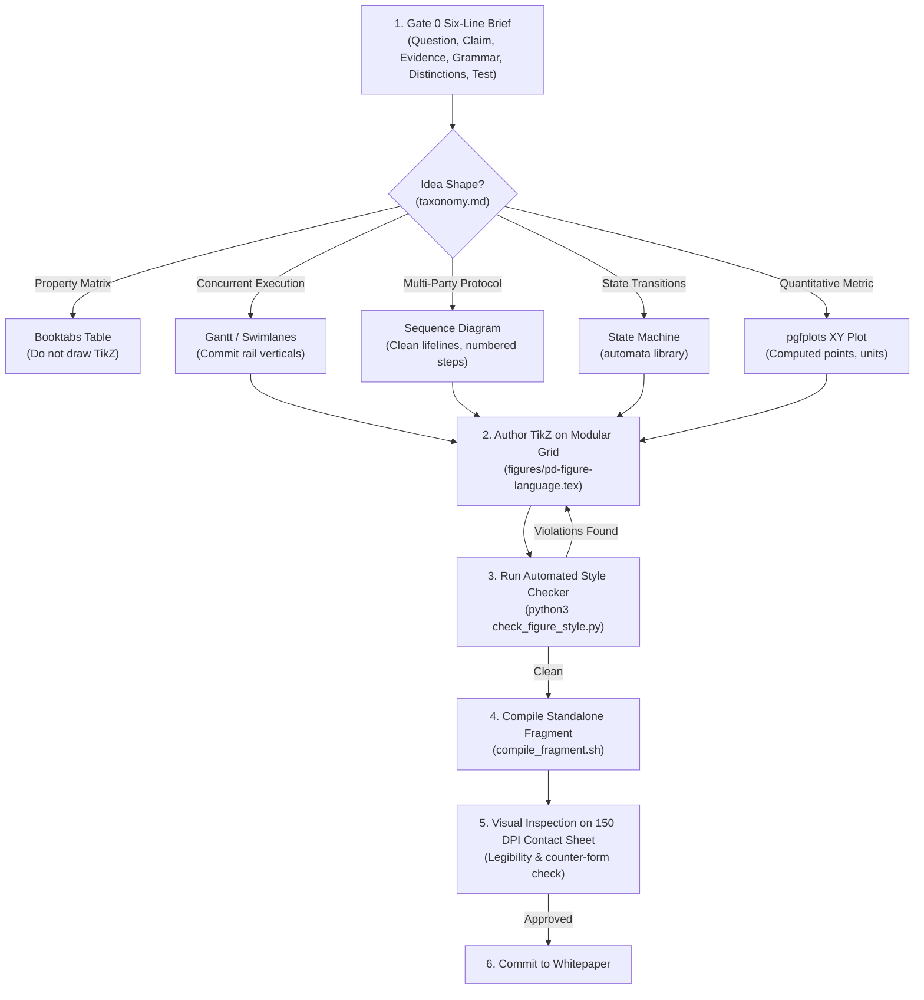

# Harbor Figure Style Guide & Verification System

This skill is the single authoritative source of truth for creating, styling, and verifying figures, diagrams, and plots across all whitepapers and chapters of *The Harbor, the Person, and the Economy*.

It unifies the **formal figure standards (S1–S9)**, **editorial craft rules**, **diagram taxonomy**, **Swiss Modernist design principles**, and **automated linter/geometry QA scripts**.

---

## When to Use

- **Drafting a new figure:** Settle the Gate 0 brief, select the grammar from `references/taxonomy.md`, and anchor layout to a modular grid.
- **Reviewing / Auditing an existing figure:** Check the figure against the 5-point legibility rubric in `references/craft-rules.md` and run `scripts/check_figure_style.py`.
- **Restyling an outdated fragment:** Migrate raw colors or non-conforming font commands onto the standard tokens in `figures/pd-figure-language.tex` using `references/figure-language-cheatsheet.md`.
- **Diagnosing CI build / geometry failures:** Debug font size violations (< 7 pt), text collisions, line-through-text defects, or mixed typeface families.

---

## The Core Invariants

1. **The Typographic Law (S2):** Exactly one font size across all text roles in a drawing — `\pdfiglabelsize` (`\footnotesize`, ~8.7 pt). **No `\tiny` (< 6 pt), no `\scriptsize` (< 7 pt).** Roles differentiate exclusively by weight (`pd title` bold) or posture (`pd note` italic), never by scale.
2. **Grotesk Inheritance:** All diagram text must inherit the book's grotesk face (TeX Gyre Heros / Source Sans 3). Never invoke Computer Modern or Pagella serif faces inside a drawing.
3. **Semantic Color Palette (S3):** Primary subject is drawn in `pd focus ...` (chapter hue). Other elements use fixed concept hues (`pd truth`, `pd ready`, `pd protocol`, `pd identity`, `pd reputation`, `pd value`, `pd breach`, `pd warn`). No raw hex or unnamed colors. Maximum 2 to 4 hues per figure. Every hue is doubled by a secondary physical channel (dash, shape, or text label).
4. **The Line Weight Ladder (S4):** Exactly three stroke weights: `0.5 pt` (hairlines/ticks), `0.9 pt` (rules/arrows/states), and `1.6 pt` (spines/focus edges).
5. **Enclosure & Surface Integrity (S5):** Every shaded fill must have a solid boundary edge. Fills must not bleed unbound into white space.
6. **No Decorative Templates (Swiss Principle 1):** The geometry must stem directly from the structure of the protocol or data. If removing the text leaves an interchangeable generic layout, the diagram is decoration and must be deleted or converted to a table.

---

## Quick Reference Links

- [`references/figure-standard.md`](references/figure-standard.md) — Normative rulebook (S1–S9).
- [`references/craft-rules.md`](references/craft-rules.md) — 5-point legibility rubric, Gate 0 brief, and page role evaluation.
- [`references/taxonomy.md`](references/taxonomy.md) — Idea shape to diagram kind mappings and perceptual channel rankings.
- [`references/swiss-principles.md`](references/swiss-principles.md) — The 10 Swiss Modernist design laws.
- [`references/figure-language-cheatsheet.md`](references/figure-language-cheatsheet.md) — TikZ macros, node styles, and weight cheat-sheet.

---

## The Figure Engineering Workflow



---

## The Automated Checking Tool: `check_figure_style.py`

Run the authoritative checker script against any TikZ fragment `.tex` file or rendered `.pdf` file:

```bash
# 1. Fast static check (validates typography, raw colors, line weights, bounding boxes)
python3 skills/harbor-figure-style-guide/scripts/check_figure_style.py path/to/figure.tex

# 2. Strict mode (warnings become fatal errors)
python3 skills/harbor-figure-style-guide/scripts/check_figure_style.py path/to/figure.tex --strict

# 3. Output as JSON or Markdown (for automated CI reports)
python3 skills/harbor-figure-style-guide/scripts/check_figure_style.py path/to/figure.tex --json report.json
python3 skills/harbor-figure-style-guide/scripts/check_figure_style.py path/to/figure.tex --md report.md

# 4. Standalone fragment compilation + geometry verification
skills/harbor-figure-style-guide/scripts/compile_fragment.sh path/to/figure.tex --out build/fig-test
python3 skills/harbor-figure-style-guide/scripts/check_figure_style.py build/fig-test/figure.pdf
```

### Checks Performed by the Tool
- **P10/P11 (Font Size Floor):** Detects `\tiny` or `\scriptsize` invocations.
- **P18/P19 (Typographic Law):** Catches inline font size overrides or invalid style pairings.
- **P20/P21 (Color Discipline):** Detects unthemed raw colors or unstyled paths.
- **P24 (Serif Leaks):** Detects `\rmfamily`, `\textrm`, or Computer Modern resets within drawings.
- **S1 (Measure):** Validates bounding box does not exceed column limits (4.5 in single, 6.0 in wide).
- **T1–T10 (Rendered Geometry):** Evaluates minimum glyph height ($\ge 7\,\text{pt}$), text overlap, line-through-text collisions, and font family consistency.

---

## Verification & Test Suite

The automated linter's own invariants are verified by unit tests:

```bash
python3 -m unittest skills/harbor-figure-style-guide/tests/test_check_figure_style.py
```
- [`tests/test_check_figure_style.py`](tests/test_check_figure_style.py) validates that font-size floors, serif leaks, raw unthemed colors, palette overloads, banned chart forms, and bounding-box limits are strictly caught.
- [`scripts/compile_fragment.sh`](scripts/compile_fragment.sh) provides standalone compilation against the real Book preamble.
- [`scripts/check_figure_style.py`](scripts/check_figure_style.py) performs source and geometry verification.

