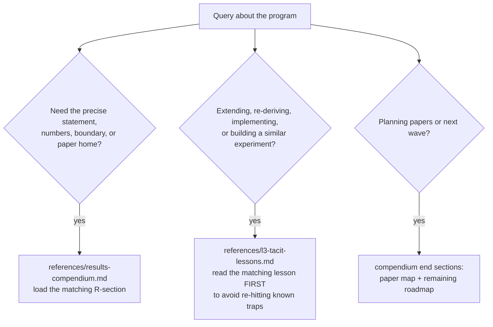

# Harbor Results: The Executed Corpus (R1–R9)

Nine results, executed and reproducible (program seed 20260816), each with a one-breath statement here and full depth in the references.

## When to Use
✅ Use for: citing or restating any R1–R9 result precisely; choosing which result underwrites a product claim; extending a result or checking whether a "new" idea is already covered or already refuted; packaging results into papers; onboarding a collaborator to the program.
❌ NOT for: general information theory / game theory / security reference unrelated to these nine; Port Daddy engineering outside the results (kernel schemas, CLI); exposition mechanics (harbor-exposition); running the validation discipline itself (falsification-first).

## The Nine, in one breath each
- **R1 — Information floor.** No digest below log₂C(N,k) − log₂C(m,k) bits can guarantee catching all k critical items among N while opening m; survived falsification (0/16 violations).
- **R2 — Split-digest.** One scalar summary serves two readers iff their orders are comonotone; successor-agent and operator provably are not; joint zero-miss floors are super-additive (≈2.13×, not 2×).
- **R3 — Derived regret head.** stakes × irreversibility × anomaly = exact expected unrecoverable loss iff anomaly is a calibrated posterior; optimal surfacing is the likelihood-ratio test; reputation enters only through the posterior.
- **R4 — Digest-zoom frontier.** Two-constraint rate-distortion R(δ,f) with the old floor as its zero-miss corner (R(0)=H(p), e.g. 0.286 bits at p=0.05); adaptive zoom needs ≈k·log₂(F/k) opens vs F flat — only in the sparse-flagged regime.
- **R5 — Hypervisor = supervisory control.** A policy is preventable (regimentable) iff controllable w.r.t. the uncontrollable event set (Ramadge–Wonham K̄Σᵤ∩L̄⊆K̄); "no egress after reading a secret" IS regimentable — gate the channel, never the token.
- **R6 — Sheaf verdict.** Cohomology detects equivocation beyond pairwise comparison iff the missing edge lies on a cycle (cocycle sum ≠ 0); on a cut edge, never. Conditional commit with that exact scope.
- **R7 — Inspection tower.** ρ* = G/(dB); sealed sampling from C cliques makes bribery uneconomical (profitable iff G_k > C·B), corruption decays (1−ρd)^k; reputation is amortized verification (Θ(log T) or O(1) audit spend).
- **R8 — Work-unit machine.** Six safety invariants hold in all 536 reachable states; all five guards proven load-bearing by mutation (shortest crimes: 4, 2, 4, 1, 7 steps).
- **R9 — Sealed-room noninterference.** Erin's view identical across equal-parity secrets under every interleaving to depth 7; schedule secret-independence checked separately; leaky-gate and bypass mutations caught with witnesses.

## Routing

## Anti-Patterns

### The Unpriced Side Channel
**Novice**: "My simulation's oracle knows the answer; I only charge bits for output resolution."
**Expert**: Information bounds constrain what a channel *carries*; charge bits for *identification*, not tie-breaking. A sim that smuggles identity past the meter will appear to beat the floor (R1's 8/16 spurious violations before the fix).
**Detection**: Any experiment "beating" an information-theoretic bound.

### Cohomology of the Sheaf, Not the Data
**Novice**: "dim H¹ of the sheaf detects the inconsistency."
**Expert**: dim H¹ of the abstract sheaf is a property of restriction maps, data-independent. Equivocation is an obstruction of the *observed assignment* (is the disagreement cochain a coboundary?). And the value-add exists only where the missing edge lies on a cycle.
**Timeline**: Both wrong turns hit and documented 2026-08; they *located* the boundary.
**Detection**: Computing H¹ without the observed data anywhere in the computation; testing on a bridge/tree topology.

### Zoom Everywhere
**Novice**: "Group testing always beats flat inspection."
**Expert**: It pays ≈F/(k·log₂(F/k)) only when positives are sparse in the flagged set; dense flags make splitting overhead dominate. Zoom is for the miss-averse over-flagging regime — exactly where a safe digest operates.
**Detection**: Claiming zoom savings without stating flagged-set density.

## References
- `references/results-compendium.md` — Load when citing, restating, packaging, or checking scope of any R1–R9: boxed statements, [verified] vs [internal] numbers, applications, boundaries, paper map, reproducibility pointers, and the treatise-corrections consensus.
- `references/l3-tacit-lessons.md` — Load BEFORE extending or re-implementing anything here, or designing a related experiment: the hard-won lessons (bugs hit, boundaries found, conventions that change answers) with transferable rules.

## Scripts (regenerate every [internal] number)
Self-contained; deps: numpy, scipy, matplotlib, networkx; seed 20260816 fixed inside each. Run from the skill root when re-verifying a number before citing it, or after modifying any claim these underwrite.
- `python3 scripts/a7_experiment.py` — R1 floor falsification: expect "0/16 violations", split-floor numbers (5.98 / 12.77 bits); writes a7_figure.png.
- `python3 scripts/b1_frontier.py` — R4: analytic R(δ,f) table (0.286 corner) + zoom-advantage table (15.3× at F=2500,k=10) with the dense-regime boundary.
- `python3 scripts/b2_tower.py` — R7: stage-game indifference to machine precision, tower decay per C, amortization spends + pointwise IC check; writes b2_figure.png.
- `python3 scripts/b3_controllability.py` — R5: regimentability table + the compound channel-not-token proof.
- `python3 scripts/c0_workunit.py` — R8: 536-state invariant check + 5-mutation suite printing shortest crime traces.
- `python3 scripts/c1_noninterference.py` — R9: exhaustive depth-7 NI check, schedule-independence check, 2 mutation witnesses.
- `python3 scripts/sheaf_mechanism_proof.py` — R6: cycle-vs-cut minimal proof (signal 1.225 vs 0.000).
