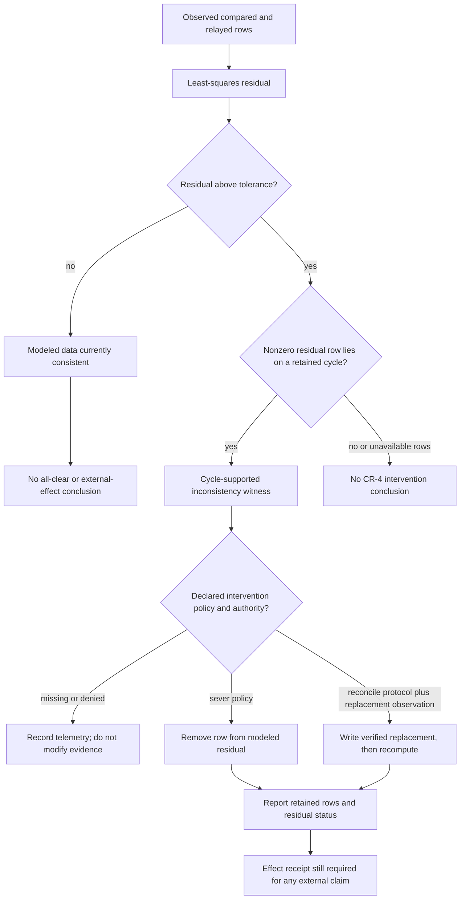

# R6 evidence and intervention scope

```mermaid
flowchart TD
  O[Observed compared and relayed rows] --> L[Least-squares residual]
  L --> Q{Residual above tolerance?}
  Q -->|no| Z[Modeled data currently consistent]
  Z --> N[No all-clear or external-effect conclusion]
  Q -->|yes| C{Nonzero residual row lies on a retained cycle?}
  C -->|yes| W[Cycle-supported inconsistency witness]
  C -->|no or unavailable rows| U[No CR-4 intervention conclusion]
  W --> P{Declared intervention policy and authority?}
  P -->|missing or denied| D[Record telemetry; do not modify evidence]
  P -->|sever policy| S[Remove row from modeled residual]
  P -->|reconcile protocol plus replacement observation| R[Write verified replacement, then recompute]
  S --> E[Report retained rows and residual status]
  R --> E
  E --> X[Effect receipt still required for any external claim]
```

The residual is calculated evidence. A zero residual, a severed row, and a completed external remediation are distinct states.
