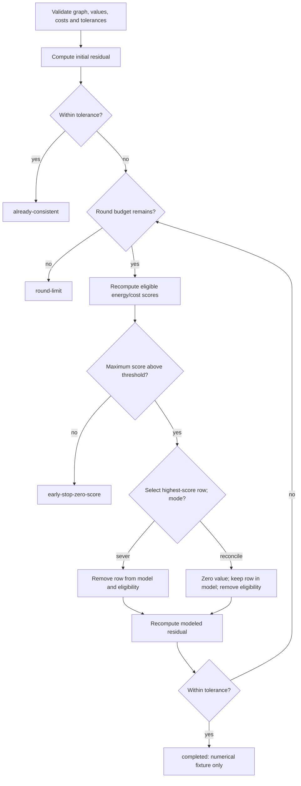

# CR-4 finite-fixture decision trace

Invalid shape, inconsistent edge binding or non-finite arithmetic raises a validation error. Every reported stop state returns the remaining residual and separates eligible rows from retained model rows. No stop state certifies an optimizer, truthful observations, or external authority. `reconcile` is a synthetic zero edit; a verified replacement protocol is separate.
