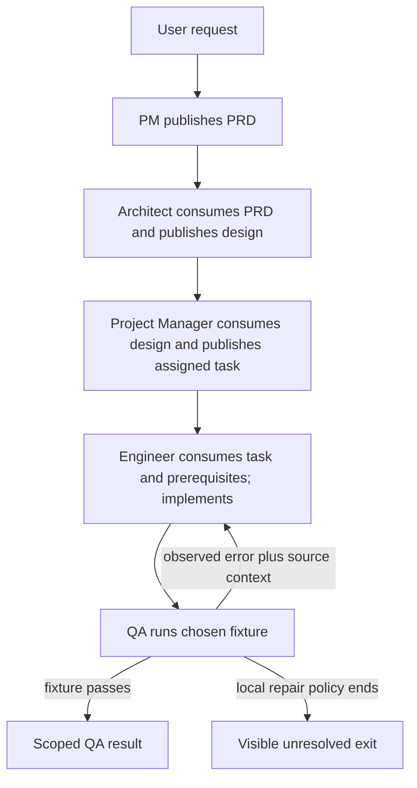

# MetaGPT artifact-pipeline design

## Source boundary

Hong et al., [MetaGPT](https://arxiv.org/html/2308.00352v7) (arXiv:2308.00352v7, 2024-11-01) supplies a software-development SOP and logical shared-pool/subscription model. The v0.8.1 `Role` and `Environment` sources supply only versioned implementation details. A paper result, a framework behavior, and a constructed local policy are separate claims.

## When this workflow fits

Ask whether the work has distinct handoffs that can be reviewed as artifacts, whether a consumer can name its prerequisites, and whether an acceptance method exists for each result. The paper's software SOP is one concrete fit. A single direct task, a creative task with no useful stable handoff, or an underspecified request may call for a looser, explicitly reviewed process instead. This is a fit prompt, not a claim that one architecture is superior.

## Artifact-first procedure

1. Turn the request into a PRD: user story, requirement, edge case, source or assumption, and unresolved item.
2. Have the Architect consume that PRD and produce a design with file/module list, data decision, interface definition, and interaction flow. Keep an unresolved PRD item open rather than silently deciding it in the design.
3. Have the Project Manager consume the design and publish assigned tasks. Each task names its owner, prerequisite artifact(s), intended action, produced artifact, and acceptance evidence.
4. A producer publishes its artifact to the logical pool. A subscribed dependent identifies itself, retrieves only its named context, and checks that **all** of its named prerequisites are present. A message for another role, or only one of two prerequisites, is not enough to act.
5. The eligible role consumes the context, performs its action, and publishes the new artifact. Repeat the prerequisite check for the next named consumer.
6. For executable work, QA runs a chosen fixture and returns the observed result or error together with the relevant PRD/design/task context to the responsible Engineer. A local repair policy ends in a scoped pass or a visible unresolved exit; it does not imply general correctness.

The overview is a constructed handoff variant: its QA role returns fixture evidence. In the paper’s §3.3 inner repair loop, the Engineer itself writes and runs tests and uses execution/debugging memory; QA also appears as a separate role in the broader §3.1 SOP. Do not attribute this exact QA-mediated variant to the paper.

The paper describes PM, Architect, Project Manager, Engineer, and QA roles; choose roles because their artifacts/prerequisites differ, not by a universal agent count. A role contract is: responsibility; accepted input; action; output; constraints/tools; and acceptance evidence. Structured documents make omissions inspectable, but do not validate truth unless a real consumer or validator checks it.

## Constructed worked traces

### Software handoff

This is a constructed exercise, not a MetaGPT experiment. A PRD says `export CSV summary`, requires total 0 for zero CSV rows, and leaves locale formatting unresolved. The design supplies `summarize(rows)` and a `Summary` shape. The task assigns Engineer the implementation only after both the design and task are present. QA runs an empty-input fixture and returns `TypeError: Reduce of empty array with no initial value`, plus the PRD edge case and interface signature. The Engineer adds the missing zero initial value to the reduction, and QA records either the next observed fixture result or an unresolved status when the local repair policy ends.

### Research and content handoffs

These are constructed workflows, not paper results. In a paper-analysis workflow, a Processor publishes an evidence record with source ID, claim, method, and counterevidence; a Trend Analyst consumes named records and publishes a trend claim linked back to those IDs; a reviewer checks the cited sources before a synthesis uses the claim. In a technical-content workflow, Research publishes a fact sheet with documentation URL, version, and open question; Outline and Writer consume it; a Technical Editor runs a chosen code example or checks the actual API response, then returns the observed mismatch to the Writer. Fields make the review traceable; they do not automatically verify a claim or regenerate a correction.

## Failure diagnosis and quality gates

- If a downstream artifact conflicts with a requirement, compare it to the PRD and design, identify the first changed interpretation, and record the owner of the correction.
- If roles repeatedly wait or publish conflicting work, inspect the named dependency graph for an unmet prerequisite or cycle; do not infer a cause from message count alone.
- If validation is claimed, inspect the test or review transcript and the exact artifact version it covered. A passing fixture has only that fixture's scope.
- If ownership is unclear, restate the role contract and name the required input, produced artifact, consumer, and acceptance evidence.
- Before handoff, check required artifact presence and open requirements; for executable work retain observed output/error; for structured work run a schema check only where a real consumer enforces it; for subjective work retain criteria and reviewer disposition.

## Paper and implementation boundary

In the MetaGPT paper (arXiv:2308.00352v7, §§3.1–3.3), the pool/subscription/dependency relation is a logical coordination model. In pinned MetaGPT v0.8.1, roles have message buffers and watched action causes; `Environment.publish_message` routes recipient addresses while roles run concurrently. An unmatched recipient logs and returns from publication, so a caller must not call it durable or reliable delivery. The paper’s up-to-three repair configuration is not a general retry rule. A finite test pass proves only the executed fixture.

## Read next

- [SOP artifacts](references/sops-as-decomposition-frameworks.md)
- [Shared pool and prerequisites](references/publish-subscribe-as-coordination-primitive.md)
- [Executable feedback](references/executable-feedback-as-reality-grounding.md)
- [Artifact pipeline diagram](diagrams/01-artifact-pipeline.md)
- [Feedback boundary diagram](diagrams/02-feedback-boundary.md)

## Bundle navigation

[diagrams index](diagrams/INDEX.md).
