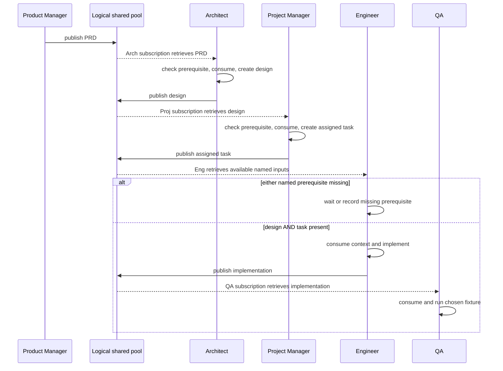

# Artifact prerequisites in the paper’s SOP

```mermaid
sequenceDiagram
  participant PM as Product Manager
  participant Pool as Logical shared pool
  participant Arch as Architect
  participant Proj as Project Manager
  participant Eng as Engineer
  participant QA as QA
  PM->>Pool: publish PRD
  Pool-->>Arch: Arch subscription retrieves PRD
  Arch->>Arch: check prerequisite, consume, create design
  Arch->>Pool: publish design
  Pool-->>Proj: Proj subscription retrieves design
  Proj->>Proj: check prerequisite, consume, create assigned task
  Proj->>Pool: publish assigned task
  Pool-->>Eng: Eng retrieves available named inputs
  alt either named prerequisite missing
    Eng->>Eng: wait or record missing prerequisite
  else design AND task present
    Eng->>Eng: consume context and implement
    Eng->>Pool: publish implementation
    Pool-->>QA: QA subscription retrieves implementation
    QA->>QA: consume and run chosen fixture
  end
```
