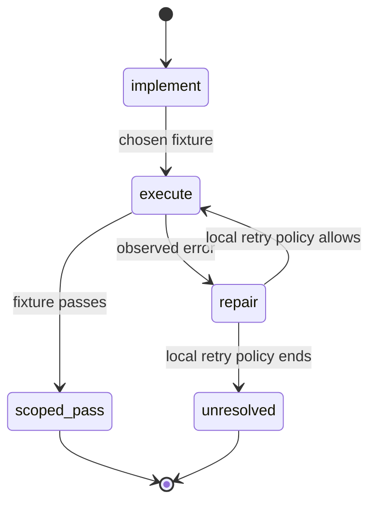

# Executable-feedback boundary

```mermaid
stateDiagram-v2
  [*] --> implement
  implement --> execute: chosen fixture
  execute --> repair: observed error
  repair --> execute: local retry policy allows
  execute --> scoped_pass: fixture passes
  repair --> unresolved: local retry policy ends
  scoped_pass --> [*]
  unresolved --> [*]
```
