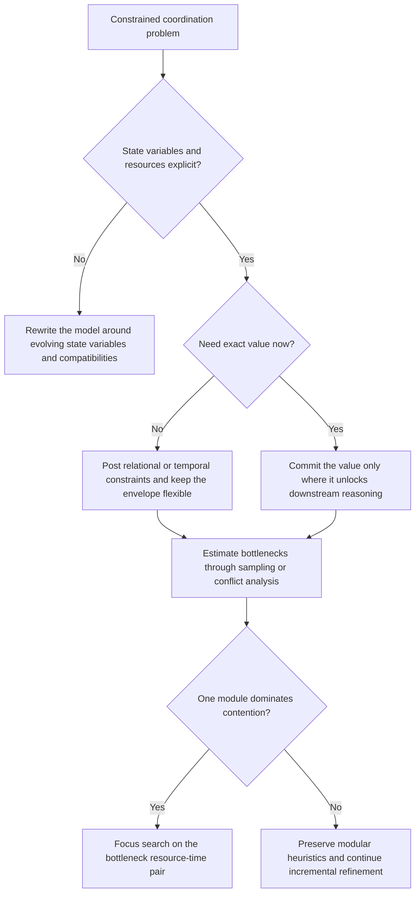

# HSTS Planning and Scheduling

Use this skill when the real difficulty is coordinating what happens, when it happens, and which resources make it legal, all inside one model.

## When to Use

- Planning and scheduling decisions keep entangling each other, so solving them as separate phases causes rework or infeasible plans.
- The domain has explicit state variables, temporal constraints, and shared resources whose interactions determine feasibility.
- Execution should preserve flexibility instead of collapsing everything into a single brittle nominal trajectory.
- The search space is too large to explore blindly, so commitment level and bottleneck focus matter.
- You need a principled way to decide whether to post constraints, bind values, or decompose the domain further.

## NOT for Boundaries

- Personal to-do organization, calendar hygiene, or generic PM advice with no formal resource or causal model.
- Pure route-finding or optimization tasks where there is no meaningful distinction between state evolution, resource contention, and commitment level.
- Fully reactive systems where there is no reusable plan envelope to maintain.
- Cases where the only missing piece is a faster solver, not a better representation of the domain.

## Core Mental Models

### Planning and scheduling are one representational problem

The split between "what to do" and "when to do it" is often an artifact of bad modeling. If the world is represented as state variables evolving through time, causal and resource reasoning can happen in one framework.

### Schedules should be behavioral envelopes

A strong schedule preserves sets of legal executions rather than overcommitting to one nominal trajectory too early. Flexibility is an asset, not a sign of incomplete work.

### Commitment level is a decision variable

Posting a precedence relation and pinning an exact start time are different acts. Choose the least commitment that still makes useful progress.

### Measure bottlenecks before spending search

Conflict Partition Scheduling treats bottleneck estimation as a first-class activity. Sample or simulate where contention is likely before committing expensive branching effort.

## Decision Points

1. Is the domain better represented as interacting state variables instead of separate planning and scheduling tables?
2. Should the next move bind an exact value, or should it merely constrain the legal envelope?
3. Which resource-time conflict is likely to dominate search if left unresolved?
4. Is the current decomposition modular enough that local heuristics can add instead of explode combinatorially?

## Failure Modes

| Failure mode | What it looks like | Recovery move |
| --- | --- | --- |
| Artificial plan/schedule split | The chosen plan becomes impossible once real resource timing is considered | Recast the domain as state variables with explicit compatibilities so causal and temporal reasoning happen together |
| Premature value commitment | Small timing disturbances trigger full replanning because every start time was fixed too early | Replace exact assignments with precedence or interval constraints until commitment buys something concrete |
| Nominal-trajectory brittleness | The executor has no legal alternatives when reality deviates from the ideal run | Build and maintain an execution envelope rather than a single brittle trace |
| Search without bottleneck focus | The solver thrashes across many branches with little progress | Estimate contention first, then prioritize the resource-time pair most likely to constrain the rest of the search |

## Worked Examples

### Example: Satellite observation planning

- Novice move: Pick an observation order first, then hand the schedule to a separate resource allocator and hope the timing works out.
- Expert move: Model pointing, instrument mode, power, and storage as interacting state variables. Keep observation windows flexible, post compatibilities early, and only bind exact times when a bottlenecked resource requires it.

### Example: Multi-agent maintenance workflow

- Novice move: Assign exact times to every agent and tool reservation up front, then backtrack aggressively once one delay appears.
- Expert move: Keep legal intervals and precedence relations broad, identify the most contested shared tool or review step, and focus commitment there while preserving downstream slack elsewhere.

## Reference Files

- `references/planning-scheduling-unification.md` — Why classical planning/scheduling split fails; unified state-variable model. **Read when** deciding whether to separate or integrate planning and scheduling phases.
- `references/state-variable-modeling-for-agents.md` — Decomposing complex domains into state variables to avoid combinatorial explosion. **Read when** designing the domain model or breaking down a large problem.
- `references/compatibility-constraints-as-causal-knowledge.md` — Encoding domain expertise as constraint templates instead of operator preconditions. **Read when** capturing temporal and resource structure that classical operators miss.
- `references/compatibility-specifications-and-causal-justification.md` — Representing conditions that must persist during actions, not just at execution instant. **Read when** modeling actions with complex temporal or resource dependencies.
- `references/schedules-as-behavioral-envelopes.md` — Why flexible commitment beats exact nominal trajectories; preserving feasible alternatives. **Read when** deciding how much to over-commit in the schedule.
- `references/token-networks-and-incremental-commitment.md` — Managing commitment level: when to bind values vs. post constraints vs. leave open. **Read when** choosing what decisions to make now and what to defer.
- `references/token-networks-as-executable-knowledge-representation.md` — Partial commitment architecture for constructive problem solving. **Read when** building schedules incrementally without locking in suboptimal choices.
- `references/bottleneck-detection-and-conflict-partition-scheduling.md` — Statistical guidance for where to focus search effort; conflict partition method. **Read when** analyzing which resource-time pairs dominate the search space.
- `references/bottleneck-centered-probabilistic-search.md` — Attention allocation in constraint systems; probabilistic confirmation of contention. **Read when** deciding whether detected bottlenecks are real or artifacts.
- `references/stochastic-estimation-for-constrained-search.md` — Using randomness to navigate combinatorial search in deterministic problems. **Read when** classical deterministic heuristics are insufficient.
- `references/hierarchical-abstraction-in-problem-solving.md` — Staged commitment through abstraction levels; managing high-level vs. low-level concerns. **Read when** the domain has natural hierarchical structure.
- `references/hierarchical-abstraction-for-scalable-problem-solving.md` — Scalability via abstraction; Hubble Space Telescope example. **Read when** facing combinatorial explosion in large real-world domains.
- `references/incremental-heuristics-and-the-scalability-condition.md` — Building systems that grow without exploding; computational effort scaling. **Read when** assessing whether a framework will handle domain growth.
- `references/resource-modeling-spectrum.md` — From binary availability to complex state representation; why simple capacity models fail. **Read when** modeling resources with non-trivial internal state.
- `references/failure-modes-in-constraint-based-systems.md` — Taxonomy of failures in classical approaches; design decisions as responses. **Read when** diagnosing why a current plan/schedule is brittle or infeasible.
- `references/failure-modes-in-planning-scheduling-systems.md` — Premature separation, over-commitment, and other structural failure patterns. **Read when** understanding what HSTS guards against.
- `references/unified-planning-scheduling-state-variables.md` — Core insight: the planning-scheduling divide is artificial; state variables unify both. **Read when** justifying unified representation to stakeholders.

### Diagrams

- `diagrams/01_flowchart_decision_framework:_when_to_co.md` — Decision tree for commitment level: reversible vs. now-or-never, bottleneck detection, ordering vs. exact time. **Read when** facing a specific pending decision about what to commit to.
- `diagrams/02_stateDiagram-v2_state_variable_evolution_and_r.md` — State variable evolution over time; resource contention transitions. **Read when** visualizing how commitment choices affect resource state.
- `diagrams/03_quadrantChart_problem_classification:_separa.md` — Problem classification by resource contention and causal interdependency; when to unify vs. separate. **Read when** assessing whether the domain warrants HSTS approach.
- `references/schedules-as-behavior-envelopes.md` — (auto-added; describe on next pass)

## Quality Gates

- The domain model names state variables, their values, and the compatibilities that make plans legal.
- The current schedule representation still exposes flexibility; it is not just a fully pinned nominal path in disguise.
- Commitment decisions are justified explicitly: why bind now instead of later?
- A bottleneck analysis exists for the dominant shared resources or temporal choke points.
- Deep treatment of resource models, failure modes, and diagrams lives in the bundled references and diagrams rather than swelling the wrapper.

## References and Diagrams

Read `references/INDEX.md` before loading the long-form material, and use [diagrams/INDEX.md](diagrams/INDEX.md) when a visual view of commitment or state evolution helps.

- Use `planning-scheduling-unification.md` for the representational argument.
- Use `schedules-as-behavioral-envelopes.md` when the question is about flexibility versus nominal plans.
- Use `bottleneck-detection-and-conflict-partition-scheduling.md` and `stochastic-estimation-for-constrained-search.md` when search focus is the main issue.

## Shibboleths

- Someone who actually understands HSTS talks about commitment level and behavioral envelopes, not just "better scheduling."
- They can explain why posting a relation is different from pinning a value.
- They instinctively ask which resource-time pair is the bottleneck before proposing heavier search.
