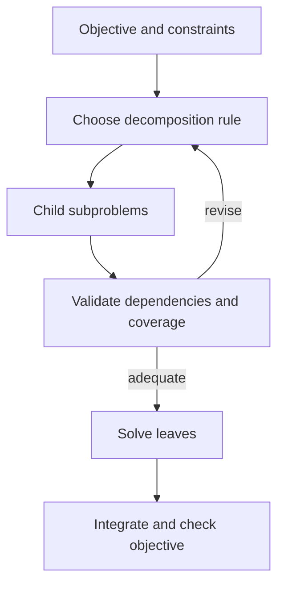

# HyperTree Planning

Use this skill for **planning method**, not for operating a fleet. The primary source is Gui et al., *HyperTree Planning: Enhancing LLM Reasoning via Hierarchical Thinking* (2025), [arXiv:2505.02322](https://arxiv.org/abs/2505.02322). The prior import called the paper “Gui et al. 2024” and another bundle used “Chen et al. 2025”; neither is the paper's first-author/year attribution.

## Outline procedure

1. List the objective, constraints, and deliverable checks.
2. Propose a small set of subproblems whose outputs can be inspected separately. State their shared inputs and cross-dependencies; do not claim independence merely because they have separate names.
3. Give each decomposition rule a trigger and resulting child set. Keep alternatives to a subproblem distinct from complementary children needed together.
4. Build the outline before committing to leaf details. Iterate the outline when a discovered dependency or constraint invalidates the cut.
5. Fill leaves, combine results, and check the parent objective and all global constraints. A locally valid leaf does not establish a valid whole plan.
6. Compare with a flat or ordinary tree outline only for the actual task distribution; record quality and planning cost.

## Evidence boundary

- The paper reports benchmark improvements under its specified setup; those numbers are not a universal speedup or guarantee for arbitrary projects.
- The formula `1-(1-ε)^n` assumes independent equal per-step failure probabilities. It is a toy illustration, not an empirical error law for LLM plans.
- A hierarchical outline does not turn 60 dependent operations into three reasoning steps; leaf work and integration remain.
- Shared structure can reduce coordination ambiguity, but independently running agents still need an explicit protocol for dependencies, conflicts, and integration.
- When subproblems are tightly coupled, use a global constraint model or iterate the cut rather than forcing parallel branches.

## Source material

- `references/` contains the prior imported topical notes; verify numerical and theoretical claims against the primary paper before repeating them.
- `sources/prior-entry/SKILL.md` preserves the former checked-in root text.
- `sources/chen-et-al-2025-hypertree-planning/` preserves the second complete bundle and its provenance files. Its directory name is historical provenance, not a citation.

For Port Daddy worktree and agent execution, load `pilot-hypertree-execution` after the planning outline is settled.
