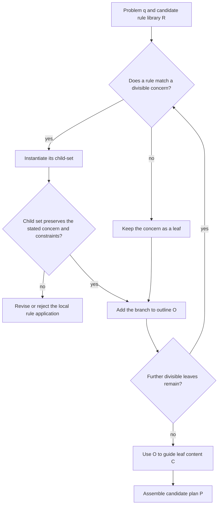

# HTP applicability and required local checks

The source describes a rule-guided outline procedure. This decision aid does not impose a chain-length threshold or select an execution architecture.

