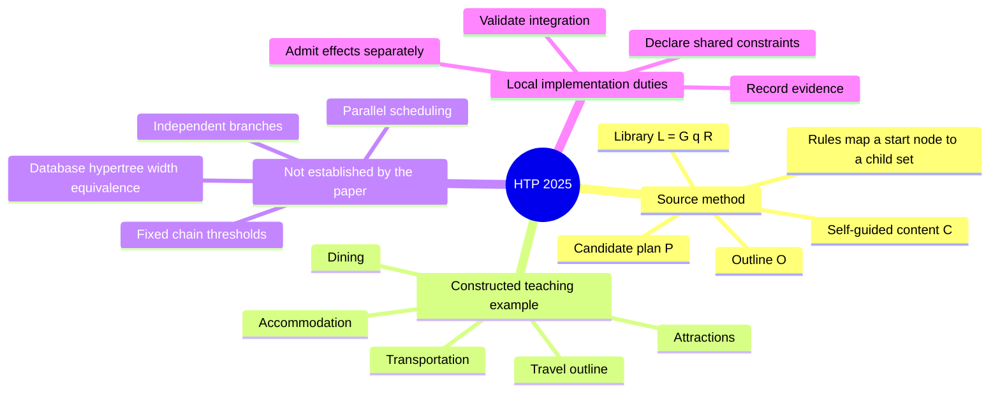

# HTP concepts and non-transfer boundaries

```mermaid
mindmap
  root((HTP 2025))
    Source method
      Library L = G q R
      Rules map a start node to a child set
      Outline O
      Self-guided content C
      Candidate plan P
    Constructed teaching example
      Travel outline
      Transportation
      Accommodation
      Attractions
      Dining
    Not established by the paper
      Independent branches
      Parallel scheduling
      Fixed chain thresholds
      Database hypertree width equivalence
    Local implementation duties
      Declare shared constraints
      Validate integration
      Record evidence
      Admit effects separately
```
