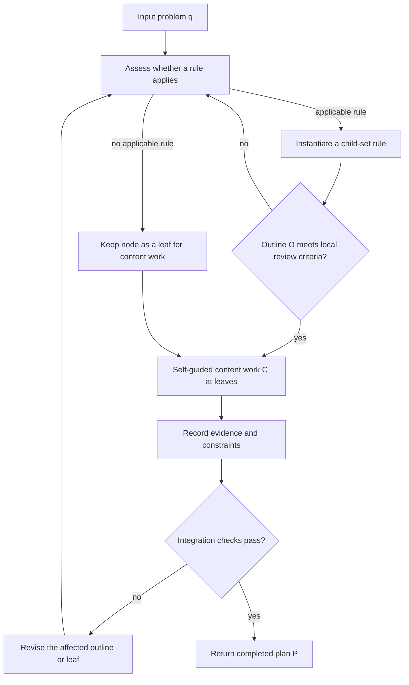

# Two-Phase Planning Architecture: outline then content

This is a proposed operating procedure, not a transcription of HTP Algorithm 1. It makes explicit the review gates that an implementation must supply. The HTP source establishes an outline `O` followed by self-guided content `C`; it does not establish branch independence, a scheduler, or automatic acceptance.

A rejection only identifies work for revision; it does not authorize an effect or prove an action succeeded.
