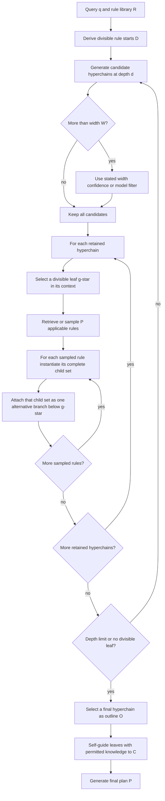

# HTP outline procedure: retained-hyperchain and sampled-rule loops

Each sampled rule is an alternative decomposition branch. Each selected rule’s child set remains together inside that branch. The diagram models source-level outline construction; it neither schedules children nor grants any execution effect.
