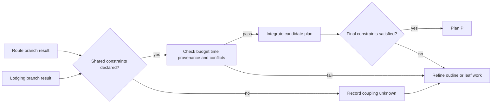

# Branch coupling and integration

```mermaid
flowchart LR
  R[Route branch result] --> I{Shared constraints declared?}
  L[Lodging branch result] --> I
  I -->|yes| C[Check budget time provenance and conflicts]
  I -->|no| U[Record coupling unknown]
  C -->|pass| G[Integrate candidate plan]
  C -->|fail| X[Refine outline or leaf work]
  U --> X
  G --> V{Final constraints satisfied?}
  V -->|yes| P[Plan P]
  V -->|no| X
```
