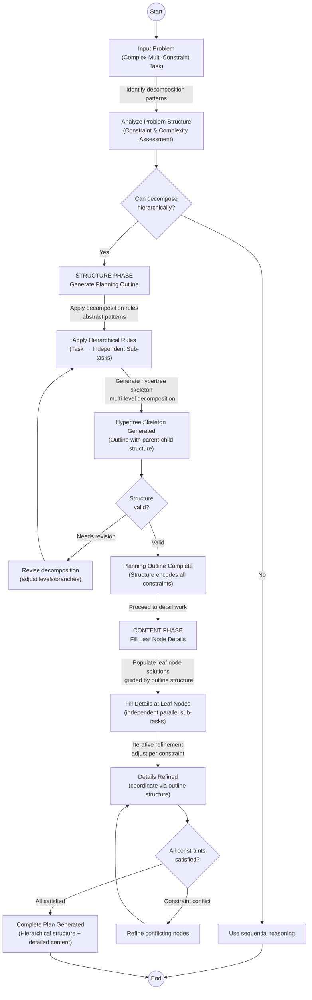

# Two-Phase Planning Architecture: Structure → Content

```mermaid
flowchart TD
    Start((Start)) --> InputProblem

    InputProblem["Input Problem<br/>(Complex Multi-Constraint Task)"]
    InputProblem -->|Identify decomposition patterns| AnalyzeStructure

    AnalyzeStructure["Analyze Problem Structure<br/>(Constraint & Complexity Assessment)"]
    AnalyzeStructure --> DecisionPoint1{"Can decompose<br/>hierarchically?"}

    DecisionPoint1 -->|No| LinearApproach["Use sequential reasoning"]
    DecisionPoint1 -->|Yes| StructurePhase
    LinearApproach --> End((End))

    StructurePhase["STRUCTURE PHASE<br/>Generate Planning Outline"]
    StructurePhase -->|Apply decomposition rules<br/> abstract patterns| ApplyRules

    ApplyRules["Apply Hierarchical Rules<br/>(Task → Independent Sub-tasks)"]
    ApplyRules -->|Generate hypertree skeleton<br/> multi-level decomposition| GenerateSkeleton

    GenerateSkeleton["Hypertree Skeleton Generated<br/>(Outline with parent-child structure)"]
    GenerateSkeleton --> ReviewStructure{"Structure<br/>valid?"}

    ReviewStructure -->|Needs revision| ReviseStructure["Revise decomposition<br/>(adjust levels/branches)"]
    ReviseStructure --> ApplyRules
    ReviewStructure -->|Valid| OutlineGenerated

    OutlineGenerated["Planning Outline Complete<br/>(Structure encodes all constraints)"]
    OutlineGenerated -->|Proceed to detail work| ContentPhase

    ContentPhase["CONTENT PHASE<br/>Fill Leaf Node Details"]
    ContentPhase -->|Populate leaf node solutions<br/> guided by outline structure| PopulateLeaves

    PopulateLeaves["Fill Details at Leaf Nodes<br/>(independent parallel sub-tasks)"]
    PopulateLeaves -->|Iterative refinement<br/> adjust per constraint| IterativeRefinement

    IterativeRefinement["Details Refined<br/>(coordinate via outline structure)"]
    IterativeRefinement --> ValidationCheck{"All constraints<br/>satisfied?"}

    ValidationCheck -->|Constraint conflict| BackToContent["Refine conflicting nodes"]
    BackToContent --> IterativeRefinement
    ValidationCheck -->|All satisfied| CompletePlan

    CompletePlan["Complete Plan Generated<br/>(Hierarchical structure + detailed content)"]
    CompletePlan --> End((End))
```
