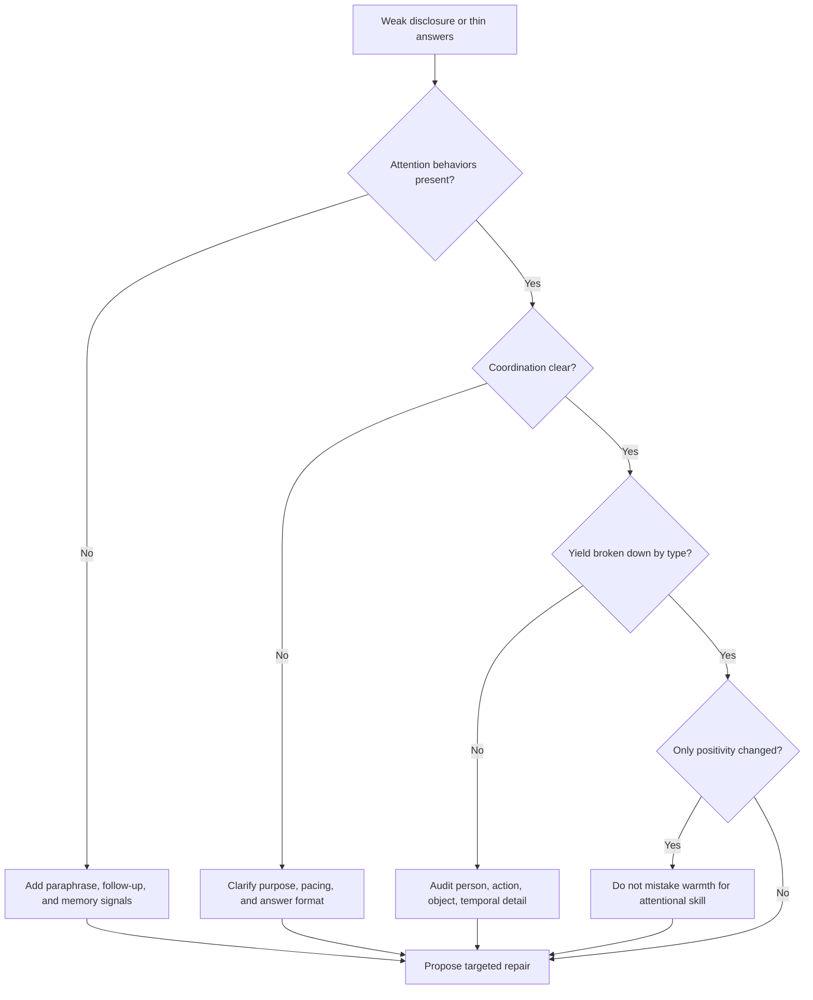

# The Impact of Rapport on Intelligence Yield

Source basis: field research on real intelligence-source phone calls showing which rapport behaviors actually increase usable disclosure.

## When to Use

- A conversational agent is friendly but still gets shallow, vague, or evasive answers.
- You need to audit information yield by transcript rather than trust an agent's self-assessment.
- Output quality is being treated as one score even though different detail types are failing differently.
- You are designing intake, interview, support, or research flows where cooperative disclosure matters.
- You need to decide whether to invest in tone, attention behaviors, or interaction structure.

## NOT for

- Coercive extraction, manipulation, or adversarial interrogation tactics.
- Generic conversation design where the goal is entertainment, persuasion, or style rather than reliable disclosure.
- Superficial tone rewrites that do not change behavioral attention or coordination.

## Decision Points

1. Decide whether the bottleneck is attention, coordination, or positivity. Audit attention first, then coordination, and only then warmth.
2. Decompose yield into typed detail categories before judging quality globally.
3. Treat self-report as a hypothesis. Use transcript evidence to confirm what behaviors actually occurred.
4. Check whether the relationship problem is local to one exchange or structural across sessions.

## Decision Flow

## Working Model

- Rapport is a count of behaviors, not a vague feeling. Back-channels, paraphrases, probes, and procedural framing are auditable.
- Attention dominates yield. Demonstrating that the other person's information was heard, remembered, and explored matters more than sounding nice.
- Coordination builds the scaffold for transfer. Shared purpose, pacing, and process framing make later disclosure easier.
- Self-report is unreliable for behavioral frequency. An agent or operator can sincerely believe it was attentive while the transcript shows otherwise.
- Yield is decomposable. Surrounding, object, person, action, and temporal detail can fail independently and should be inspected that way.

## Failure Modes

- Optimizing warmth before attention, producing pleasant but uninformative exchanges.
- Scoring quality as one number and missing which detail type is actually thin.
- Trusting the agent's own narrative about how it behaved instead of auditing transcripts.
- Ignoring coordination in openings and transitions, then blaming weak disclosure on tone.
- Treating rapport as coercion or compliance rather than cooperative transfer.

## Reference Files

- `references/attention-as-the-primary-yield-driver.md` — Empirical evidence that attention correlates r=.83 with intelligence yield and explains 69% of variance across all detail types. **Read when** deciding whether to prioritize attention behaviors over warmth or structure.

- `references/attention-dominates-yield-active-processing-over-warmth.md` — Counterintuitive finding that active processing outperforms warmth; positivity behaviors alone are insufficient for disclosure. **Read when** an agent is friendly but yields remain shallow or evasive.

- `references/coordination-as-structural-intelligence.md` — Coordination is underused (M=10.12) but statistically significant; clarifies process and shared goals. **Read when** attention is present but sources still withhold temporal or action details.

- `references/coordination-shared-goal-structure-enables-transfer.md` — Coordination's distinctive role in enabling action and temporal detail transfer through shared scaffolding. **Read when** designing interview structure or pacing to improve specific detail categories.

- `references/frequency-impact-asymmetry-in-skilled-performance.md` — Attention is most-used and most-impactful; positivity is second-most-used but weakest-impact. **Read when** auditing whether effort allocation matches actual yield drivers.

- `references/frequency-monitoring-as-quality-control.md` — Behavioral frequency counting provides better feedback than holistic ratings for system improvement. **Read when** designing audit methodology or quality-control metrics.

- `references/informal-vs-formal-interaction-elicitation-context-matters.md` — Formal vs. informal settings change which rapport components are available and effective. **Read when** adapting the framework to non-interview contexts (support, research, intake).

- `references/intelligence-yield-taxonomy-decomposing-output-quality.md` — Five detail types (person, action, object, temporal, surrounding) must be audited separately, not as monolithic quality. **Read when** creating a yield-type audit matrix or discovering uneven detail strength.

- `references/motivation-as-functional-intelligence.md` — Source motivation for sharing is a variable; understanding why changes how you elicit. **Read when** a source has information but is withholding or reluctant.

- `references/objective-measurement-vs-subjective-rating.md` — Behavioral coding (discrete units) outperforms Likert-scale ratings for actionable insight. **Read when** choosing how to measure rapport or yield in your audit.

- `references/rapport-as-behavioral-frequency-not-feeling.md` — Rapport is a count of back-channels, paraphrases, probes, and framing—not a gestalt feeling. **Read when** an agent claims good rapport but transcript shows few observable behaviors.

- `references/rapport-decomposition-and-differential-impact.md` — Disaggregating rapport reveals which sub-behaviors drive outcomes; holistic constructs prevent intervention. **Read when** deciding whether to repair warmth, attention, or coordination.

- `references/self-report-gap-behavioral-auditing-vs-perceived-practice.md` — Practitioners systematically misreport their own behavior; transcript audit is essential. **Read when** an agent's self-assessment conflicts with observed yield or behavioral frequency.

- `references/self-report-vs-behavior-gap.md` — Systematic gap between reported and actual communicative behavior; recording and analysis are mandatory. **Read when** validating whether claimed rapport-building actually occurred.

- `references/working-alliance-motivation-modeling-source-management.md` — Relationship is an ongoing asset; source motivation and welfare must be managed across sessions. **Read when** designing multi-turn or long-term elicitation flows.

- `references/working-alliance-vs-social-warmth.md` — Two definitions of rapport: social warmth vs. working alliance for reliable intelligence; choice determines system design. **Read when** deciding whether to optimize for likability or for shared purpose and transparency.

## Anti-Patterns and Shibboleths

- Anti-pattern: rewriting copy to sound warmer while leaving turn-taking, paraphrase, and follow-up behavior unchanged.
- Anti-pattern: grading the whole conversation with one satisfaction score instead of checking which detail types are missing.
- Shibboleth: if the audit cites vibes instead of transcript evidence, it is not a rapport diagnosis yet.

## Worked Examples

- An intake agent uses reassuring language but rarely paraphrases or asks follow-up questions. The fix is to add attention behaviors and yield-type auditing, not more empathy copy.
- A multi-session support workflow gets good person detail but weak action and temporal detail. The likely repair is stronger coordination about purpose, chronology, and what kind of answer is needed.

## Fork Guidance

- Stay in-process when you are auditing one transcript and only need to count behaviors plus yield types.
- Fork one subagent for behavior-count auditing and another for yield-type auditing when you want independent evidence before proposing a fix.

## Quality Gates

- The audit cites observable behaviors from transcripts or logs, not impressions.
- Yield is decomposed by detail type before any summary score is used.
- Optimization advice names whether it targets attention, coordination, or positivity.
- Self-report is never treated as ground truth.
- Recommendations stay within ethical, cooperative information elicitation boundaries.

## Reference Routing

- `references/rapport-as-behavioral-frequency-not-feeling.md`: load when you need the operational definition of rapport and its measurable behaviors.
- `references/attention-dominates-yield-active-processing-over-warmth.md`: load when warmth is being overvalued relative to actual yield.
- `references/coordination-shared-goal-structure-enables-transfer.md`: load when opening structure, pacing, or shared purpose looks weak.
- `references/intelligence-yield-taxonomy-decomposing-output-quality.md`: load when output quality needs to be broken into detail types.
- `references/self-report-gap-behavioral-auditing-vs-perceived-practice.md`: load when an operator or agent's self-story conflicts with observed behavior.
- `references/working-alliance-motivation-modeling-source-management.md`: load when long-run source motivation or multi-session relationship management is the real issue.
