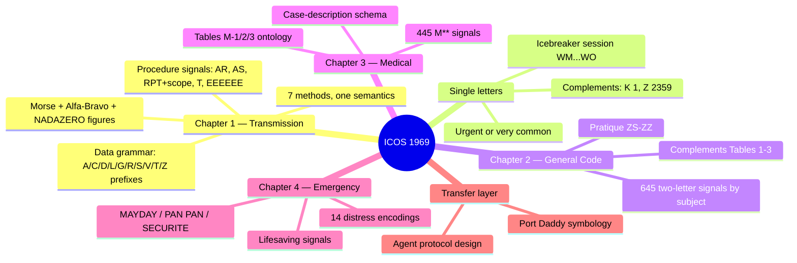
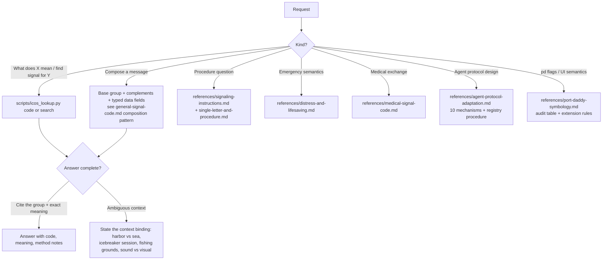

# International Code of Signals

Fluent command of Pub. 102 — the 1969 International Code of Signals — as a working signal book *and* as a century-hardened protocol-design casebook for agent systems and Port Daddy's maritime symbology.

## Use This For

- Decoding or composing any ICOS signal: single letters, two-letter groups (`NC`, `CB 6`), medical `M**` groups, complements, hoists with substitutes, procedure signals.
- Explaining signaling procedure per method: flag hoist etiquette (dip/close-up), flashing-light message anatomy, sound-signal restrictions, radiotelephony calls, MAYDAY/PAN PAN/SECURITE.
- Distress and lifesaving signals: the 14 COLREGS distress signals, shore-to-ship landing signals, breeches-buoy protocol.
- Designing inter-agent message registries, ack semantics, priority classes, or mode-scoped vocabularies on ICOS principles.
- Auditing or extending Port Daddy's flag symbology (`SIGNAL_FOR_STATE`, hoist combos, alert-tier colors) against the real Code.

## Do Not Use This For

- COLREGS navigation rules (right of way, lights, fog conduct) — the Code only touches COLREGS where sound signals overlap.
- Ship handling and maneuvering craft (`a-task-analysis-of-pier-side-ship-handli` — Jury-rig library, not bundled in this repo).
- Radio spectrum/licensing questions, GMDSS equipment carriage rules.
- Palette or branding work with no signal semantics (`color-theory-palette-harmony-expert`).

## Bundle Contents

Everything shipped with this skill (only this file auto-loads — the rest is here so you know to reach for it):

| Path | What it is |
|---|---|
| `data/signals.json` | THE ground-truth corpus, parsed from Pub. 102: 26 single-letter signals (+12 numeral-complement forms), 645 two-letter General Code signals + 723 complements, 445 Medical Code signals, procedure signals, Morse, phonetic tables, Complements Tables 1–3, icebreaker session table. Coverage verified against the raw extraction (645/645, 445/445) |
| `scripts/icos_lookup.py` | Query CLI over the corpus — exact lookup, hybrid search, spelling, hoists, tables (usage below) |
| `scripts/rebuild_corpus.py` | Regenerates `data/signals.json` from a `pdftotext -layout` extraction of the Pub. 102 PDF; only needed if the source book changes |
| `references/*.md` | Seven deep dives — five chapter distillations + two adaptation layers (index at the bottom of this file) |
| `examples/worked-examples.md` | Encode/decode walkthroughs across methods and both transfer layers |
| `agents/openai.yaml` | Codex/OpenAI agent binding (same corpus-first discipline) |

Provenance: *Pub. 102, International Code of Signals*, US Edition 1969 (Revised 2003), NIMA — a US Government publication, no copyright claimed under 17 U.S.C.

## The Code at a Glance



## Core Workflow



**Always verify a group against the corpus before asserting its meaning** — `python3 scripts/icos_lookup.py code <GROUP>`. The corpus (`data/signals.json`, parsed from Pub. 102) is ground truth over memory: 26 single letters, 645 two-letter signals + 723 complements, 445 medical signals, procedure signals, Morse, phonetics, complements tables, icebreaker table.

## The Lookup Tool

```bash
python3 scripts/icos_lookup.py code NC          # exact lookup (also: "AE 2", MAA, W)
python3 scripts/icos_lookup.py search towing    # HYBRID search: BM25 + `pd embed` cosine, RRF-fused
python3 scripts/icos_lookup.py spell MAYDAY     # phonetic + Morse spelling
python3 scripts/icos_lookup.py hoist 1100       # flag hoist incl. substitute logic
python3 scripts/icos_lookup.py table 2          # complements tables 1/2/3
```

Search follows the repo's hybrid policy (AGENTS.md "Search & Matching Policy"): semantic similarity comes from Port Daddy's one shared local embedding model via `pd embed`, with corpus vectors cached one-time under `~/.port-daddy/cache/`. If the model is unavailable it degrades to lexical-only **loudly** and points at `pd doctor`.

`scripts/rebuild_corpus.py <pdftotext-output> <out.json>` regenerates the corpus from a `pdftotext -layout` extraction of the Pub. 102 PDF (only needed if the source book changes).

## Non-Negotiables (the expert reflexes)

1. **Meaning = signal × context.** `P` differs in harbor / on fishing grounds / by sound; icebreaker sessions (`WM`...`WO`) re-bind letters wholesale. Never gloss a letter without stating which context you assumed.
2. **Complete-meaning principle.** Groups never compose into sentences; only complements, modality operators (`C`/`NO`/`RQ` — never on single letters), and typed data fields modify a group. Unallocated groups mean nothing.
3. **Transport vs semantics.** `RPT` = transmission failed; `ZL` = transmission fine, meaning opaque. Keep the distinction in every protocol you touch.
4. **R has no single-letter meaning** in the 1969 Code (procedure "Received" only) — the "way is off my ship" gloss is the 1931 code surviving as folklore.
5. **Distress is a legal category**, not an intensity knob: grave and imminent danger + need of immediate assistance, else it's PAN PAN or a code signal.
6. **Asterisked letters** (B C D E G H I S T Z) by *sound* only within COLREGS-compliant use.

## Anti-Pattern: Answering from Flag-Chart Folklore

**Novice**: quotes meanings from decorative flag charts or pre-1969 tables (R = "way is off my ship", U = "you are standing into danger" phrasings vary, invented meanings for numerals).
**Expert**: the 1969 revision (effective 1 April 1969) re-allocated the namespace; only Pub. 102 text is normative. Look the group up in `data/signals.json` and quote it exactly.
**Timeline**: 1857 first code → 1931/1932 two-volume code (vocabulary method, geographic sections) → 1965 IMCO adoption, effective 1969: complete-meaning signals only → 2003 US revision (this corpus).
**Detection**: a claimed meaning that isn't in the corpus.

## Anti-Pattern: Porting the Metaphor Without the Registry

**Novice**: adopts maritime flags in an agent UI as theming; meanings drift per surface and contradict the book.
**Expert**: the transfer value of ICOS is its *discipline* — registered meanings, control/content separation, priority preemption — not its aesthetics. Port the registry and its governance, then the flags carry real information (see `port-daddy-symbology.md`).
**Detection**: a `SIGNAL_FOR_STATE`-style table with glosses absent from the corpus.

## References

- `references/signaling-instructions.md` — Consult for transmission procedure by any method: flag/light/sound/RT/hand-flag protocol, data grammar (bearings, positions, times), substitutes, repetition scopes.
- `references/single-letter-and-procedure.md` — Consult for the 26 single-letter meanings, numeral complements, icebreaker session table, procedure signals, Morse, phonetic tables.
- `references/general-signal-code.md` — Consult for two-letter namespace layout, key signals per subject, Complements Tables 1–3, pratique handshake, composition pattern.
- `references/medical-signal-code.md` — Consult for the M** consultation schema, Tables M-1/2/3, and its lessons for structured triage vocabularies.
- `references/distress-and-lifesaving.md` — Consult for the 14 distress signals, lifesaving/landing signals, MAYDAY/PAN PAN/SECURITE procedure and preemption.
- `references/agent-protocol-adaptation.md` — Consult when designing agent message registries, ack/priority semantics, or reviewing coordination protocols.
- `references/port-daddy-symbology.md` — Consult when touching pd's flag mappings, hoist badges, alert-tier colors, or extending maritime UI semantics.
- `examples/worked-examples.md` — Worked encode/decode walkthroughs across methods and both adaptation layers.
- `agents/openai.yaml` — Codex/OpenAI agent binding for this skill (same corpus-first discipline, same IO contract).
