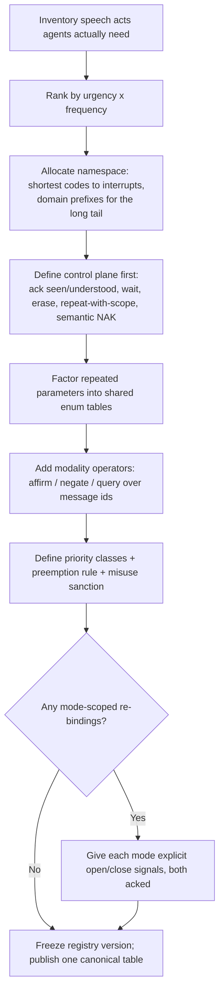

# ICOS → Inter-Agent Communication Protocols

The International Code of Signals is a century-hardened answer to the exact problem multi-agent systems face: **heterogeneous parties, no shared language, unreliable low-bandwidth channels, safety-critical content, no central runtime**. This reference maps each ICOS mechanism to an agent-protocol design move. Use it when designing or reviewing message schemas, ack semantics, priority systems, or coordination vocabularies for agent fleets.

## The Ten Transferable Mechanisms

| # | ICOS mechanism | Protocol principle | Agent-system application |
|---|---|---|---|
| 1 | Complete-meaning signals (1965 killed the vocabulary method) | Messages are registered speech acts, not composable words | Typed message contracts / verb registries beat free-text chat between agents; a truncated message fails safe instead of meaning something else |
| 2 | Urgency-ranked namespace (1 letter = urgent, 2 = general, 3 = domain) | Encoding length ∝ 1/(urgency × frequency) | Reserve the shortest, most privileged message types for interrupts (halt, danger, need-human); domain traffic gets longer, namespaced types |
| 3 | Complements + Tables 1–3 | Parameters are enums by reference, not prose | `CB 6` ≡ `{type: assist-request, kind: towing}` — shared enum tables keep payloads tiny and unambiguous across implementations |
| 4 | Procedure signals (`AR`, `AS`, `T`, `RPT AA/AB/BN/WA/WB`, `EEEEEE`, `OK`) | Control plane distinct from content plane | ACK, backpressure (`AS` = wait), selective retransmission (RPT+scope is ARQ), erase/correction — define these *before* domain messages, and never overload content types for transport control |
| 5 | `ZL` (received but not understood) vs `RPT` (not received) | Transport failure ≠ semantic failure | An agent that got the bytes but can't parse must NAK *semantically* (schema-validation error), never re-request transmission; ICOS forbids `RPT` for that case |
| 6 | Answering pennant: at the dip (seen) → close up (understood) | Two-phase acknowledgment | Delivery receipts ≠ comprehension receipts. An inbox that only tracks "delivered" hides the dangerous state: delivered-but-not-understood |
| 7 | Modality operators `C` / `NO` / `RQ` transform the previous group | Higher-order message algebra | Affirm/negate/query as *operators over a message id* instead of new message types; halves the registry size (`CW RQ` = "is boat/raft aboard?") |
| 8 | Cross-modality invariance (same group by flag, light, sound, RT) | Semantics above transport | One verb registry over CLI, daemon RPC, MCP, and UI surfaces — the meaning must not drift per channel (drift is the ladder-lie failure mode) |
| 9 | `WM`/`WO` icebreaker brackets re-bind single letters | Session-scoped semantics with explicit open/close | Mode-scoped vocabularies (migration mode, incident mode) are safe *only* with explicit enter/exit signals both parties acknowledge — never implicit context |
| 10 | MAYDAY / PAN PAN / SECURITE + imposed radio silence | Priority classes with preemption | Distress traffic silences the channel (`SEELONCE MAYDAY`): a true interrupt class must be able to suppress routine traffic, and its misuse must be a protocol violation, not a norm |

## The Deeper Lessons

**Meaning is (signal × context), and context must be signaled.** `P` in harbor = about to sail; at sea from a trawler = nets fast on an obstruction; by sound = I require a pilot. ICOS survives this only because context is *observable* (you can see the harbor). Agent systems lack shared observability, so every context that re-binds meaning needs an explicit bracket (mechanism 9) or the re-binding is a bug factory.

**Identity rides in the envelope, twice.** `DE` + call sign for *speaking as*; hoisting an identity with a group for *speaking to* or *of* (`YP LABC` vs `HY 1 LABC`). Distinguish sender-auth, addressee, and *subject* — protocols that conflate "message about agent X" with "message to agent X" misroute blame and commands alike.

**Redundancy across transports, not within one.** Distress has 14 encodings across sound/light/RF/pyro/motion (see `distress-and-lifesaving.md`) because any single transport can be down. An agent fleet's "I need a human NOW" should likewise reach the operator by more than one path (UI badge + push + inbox), all carrying the same registered meaning.

**Spend bandwidth to save round-trips.** The Medical Code's fixed case-description order exists because each round-trip costs minutes. High-latency agent hops (human review, cross-org relays) deserve the same: front-load the full structured case; a dedicated NAK (`MQB`, "use standard method of case description") beats an ambiguous clarifying dialogue.

**Registry governance is part of the protocol.** ICOS meanings are set by IMO revision, printed identically in nine languages; nobody mints new two-letter groups locally (local codes must be bracketed with `YV 1`). Agent verb registries need the same: a canonical schema source, versioned revisions, and an explicit escape hatch for experimental/local verbs — not silent dialect drift per agent.

## Designing a Fleet Signal Registry (procedure)

## Anti-Pattern: Chat as Protocol

**Novice**: lets agents coordinate in free prose because "LLMs understand language" — the vocabulary method, reinvented.
**Expert**: free text between agents has unbounded parse space; under truncation, summarization, or model swap, meaning silently shifts. ICOS's complete-meaning registry is the correct default for anything load-bearing (claims, halts, escalations); prose belongs only inside a `YZ`-style clearly-bracketed plain-language field.
**LLM mistake**: models over-trust their own NL robustness and under-price cross-model drift; two different models reading the same prose coordinate worse than two reading the same enum.
**Detection**: grep the coordination path for load-bearing decisions parsed out of unstructured message bodies.
