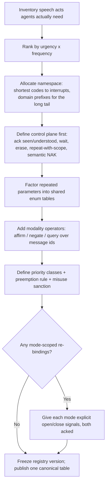

# ICOS → Inter-Agent Communication Protocols

The International Code of Signals is a century-hardened answer to the exact problem multi-agent systems face: **heterogeneous parties, no shared language, unreliable low-bandwidth channels, safety-critical content, no central runtime**. This reference maps each ICOS mechanism to an agent-protocol design move. Use it when designing or reviewing message schemas, ack semantics, priority systems, or coordination vocabularies for agent fleets.

## The Ten Transferable Mechanisms

| # | ICOS mechanism | Protocol principle | Agent-system application |
|---|---|---|---|
| 1 | Complete-meaning signals (1965 killed the vocabulary method) | Messages are registered speech acts, not composable words | Typed message contracts / verb registries beat free-text chat between agents; a truncated message fails safe instead of meaning something else |
| 2 | Urgency-ranked namespace (1 letter = urgent, 2 = general, 3 = domain) | Encoding length ∝ 1/(urgency × frequency) | Reserve the shortest, most privileged message types for interrupts (halt, danger, need-human); domain traffic gets longer, namespaced types |
| 3 | Complements + Tables 1–3 | Parameters are enums by reference, not prose | `CB 6` ≡ `{type: assist-request, kind: towing}` — shared enum tables keep payloads tiny and unambiguous across implementations |
| 4 | Procedure signals (`AR`, `AS`, `T`, `RPT AA/AB/BN/WA/WB`, `EEEEEE`, `OK`) | Control plane distinct from content plane | ACK, backpressure (`AS` = wait), selective retransmission (RPT+scope is ARQ), erase/correction — define these *before* domain messages, and never overload content types for transport control |
| 5 | `ZL` (received but not understood) vs `RPT` (not received) | Transport failure ≠ semantic failure | An agent that got the bytes but can't parse must NAK *semantically* (schema-validation error), never re-request transmission; ICOS forbids `RPT` for that case |
| 6 | Answering pennant: at the dip (seen) → close up (understood) | Two-phase acknowledgment | Delivery receipts ≠ comprehension receipts. An inbox that only tracks "delivered" hides the dangerous state: delivered-but-not-understood |
| 7 | Modality operators `C` / `NO` / `RQ` transform the previous group | Higher-order message algebra | Affirm/negate/query as *operators over a message id* instead of new message types; halves the registry size (`CW RQ` = "is boat/raft aboard?") |
| 8 | Cross-modality invariance (same group by flag, light, sound, RT) | Semantics above transport | One verb registry over CLI, daemon RPC, MCP, and UI surfaces — the meaning must not drift per channel (drift is the ladder-lie failure mode) |
| 9 | `WM`/`WO` icebreaker brackets re-bind single letters | Session-scoped semantics with explicit open/close | Mode-scoped vocabularies (migration mode, incident mode) are safe *only* with explicit enter/exit signals both parties acknowledge — never implicit context |
| 10 | MAYDAY / PAN PAN / SECURITE + imposed radio silence | Priority classes with preemption | Distress traffic silences the channel (`SEELONCE MAYDAY`): a true interrupt class must be able to suppress routine traffic, and its misuse must be a protocol violation, not a norm |

## The Deeper Lessons

**Meaning is (signal × context), and context must be signaled.** `P` in harbor = about to sail; at sea from a trawler = nets fast on an obstruction; by sound = I require a pilot. ICOS survives this only because context is *observable* (you can see the harbor). Agent systems lack shared observability, so every context that re-binds meaning needs an explicit bracket (mechanism 9) or the re-binding is a bug factory.

**Identity rides in the envelope, twice.** `DE` + call sign for *speaking as*; hoisting an identity with a group for *speaking to* or *of* (`YP LABC` vs `HY 1 LABC`). Distinguish sender-auth, addressee, and *subject* — protocols that conflate "message about agent X" with "message to agent X" misroute blame and commands alike.

**Redundancy across transports, not within one.** Distress has 14 encodings across sound/light/RF/pyro/motion (see `distress-and-lifesaving.md`) because any single transport can be down. An agent fleet's "I need a human NOW" should likewise reach the operator by more than one path (UI badge + push + inbox), all carrying the same registered meaning.

**Spend bandwidth to save round-trips.** The Medical Code's fixed case-description order exists because each round-trip costs minutes. High-latency agent hops (human review, cross-org relays) deserve the same: front-load the full structured case; a dedicated NAK (`MQB`, "use standard method of case description") beats an ambiguous clarifying dialogue.

**Registry governance is part of the protocol.** ICOS meanings are set by IMO revision, printed identically in nine languages; nobody mints new two-letter groups locally (local codes must be bracketed with `YV 1`). Agent verb registries need the same: a canonical schema source, versioned revisions, and an explicit escape hatch for experimental/local verbs — not silent dialect drift per agent.

## Wire-Format Grounding (2026 interchange formats)

The ten mechanisms map onto today's concrete agent interchange formats — use this table when translating ICOS discipline into an actual schema:

| ICOS mechanism | Wire-format counterpart |
|---|---|
| Complete-meaning registry (1) | Registered method/skill ids with input schemas: MCP tool definitions, A2A `AgentCard.skills[]`, JSON-RPC method names. No verb exists until registered with a schema; free composition of registered verbs is still not a message |
| Urgency-ranked namespace (2) | Priority classes in the envelope, not the payload — and a true interrupt travels out-of-band (push notification / control channel), never queued behind routine traffic |
| Complements tables (3) | Shared enum registries in JSON Schema `$defs`, referenced by `$ref` and versioned once — never inline-duplicated per message type (that's how Table 2 would drift) |
| Procedure vs content signals (4) | Envelope/lifecycle fields vs `parts[]` payload: A2A task states (`submitted → working → completed/failed`), sequence numbers on stream events, correlation via `conversationId`. Never encode transport control inside a domain payload |
| `ZL` vs `RPT` (5) | The `retryable` boolean on structured errors. Transport failure → `retryable: true` + `retryAfterMs` (retry same payload, backoff). Semantic NAK → `retryable: false` + `details.expectedSchema` (an `MQB`: resend *in standard form*, never byte-identical) |
| Two-phase ack (6) | Delivery receipt ≠ comprehension receipt: HTTP 202 / message-id echo is *at the dip*; the task state transition to `working` (schema validated, work accepted) is *close up*. Track both or delivered-but-unparsed hides |
| Modality operators (7) | Operations over message ids: `{op: "affirm" | "negate" | "query", ref: <messageId>}` as a small DataPart — instead of minting `X`, `not-X`, and `is-X?` as three registered types |
| Cross-modality invariance (8) | One schema source of truth projected to every surface (CLI, RPC, MCP, UI) — pd's `features.manifest.json` bijective-parity gates are exactly this enforcement |
| Session brackets `WM`/`WO` (9) | A mode is opened by an explicit acked message carrying its own id, scoped to a `conversationId`, and closed the same way. Inferring mode from recent traffic is the anti-pattern |
| Distress preemption (10) | A reserved top-priority class whose misuse is a protocol violation; distress traffic may suppress routine streams (SEELONCE MAYDAY = pausing non-involved producers, not just ranking the queue) |

An ICOS-shaped signal as an A2A-style envelope (pd flavor):

```json
{
  "id": "01JZC8...",
  "conversationId": "sortie-shared-embedder-078ce3",
  "timestamp": "2026-07-04T13:05:00Z",
  "sender": { "agentId": "pd:builder-3" },
  "recipient": { "agentId": "pd:harbormaster" },
  "parts": [{
    "kind": "data",
    "schema": "pd.signal.v1",
    "data": {
      "code": "F",
      "gloss": "disabled; communicate with me",
      "priority": "urgency",
      "refs": { "claim": "cli/commands/embed.ts", "task": "01JZC7..." }
    }
  }]
}
```

The `code` is the registered complete meaning; `gloss` is display-only (never parsed); `refs` are the typed data fields (`L`/`G`-style complements); priority is envelope-level. A receiver that can't validate `pd.signal.v1` answers with a `retryable: false` error naming the schema — `ZL`, not `RPT`.

## Conversation-Protocol Grounding (turn-taking, repair, termination)

Beyond message shape, ICOS encodes conversation *dynamics* — the concerns modern multi-agent conversation design names turn-taking, floor control, repair, and termination:

| ICOS mechanic | Conversation-design concept | Rule worth stealing |
|---|---|---|
| One hoist at a time, kept flying until answered | Strict alternation turn-taking | A sender may not advance to its next message until the receiver acks the current one — backpressure is built into the turn order, not bolted on |
| Flashing-light anatomy: call → identity → text → ending | Conversation lifecycle with explicit open/close | Sessions begin with mutual identification (both sides repeat back identities) and end with a handshake (`AR` answered by `R`) — never by silence or timeout alone |
| `CQ` / `AA AA AA` general call vs identity-addressed hoist | Broadcast vs star topology selection *per message* | The addressing mode is chosen per signal, not fixed per system; an unaddressed hoist means "all stations in visual range" and every receiver knows it must answer |
| `RPT` + `AA`/`AB`/`BN`/`WA`/`WB` scopes, `EEEEEE` erase | Repair sub-dialogues | Repair is a *scoped* side-conversation over a span of the failed transmission, then the main dialogue resumes from the last good point — not a restart of the whole exchange |
| Icebreaker table: same letter, paired role-specific meanings (`G` = "follow me" / "I am following you") | Role-asymmetric semantics in supervisor-worker protocols | A command vocabulary can double as its own ack vocabulary when meanings are role-indexed; the ack confirms *semantic uptake*, not just receipt — but only inside an explicitly opened session (`WM`...`WO`) |
| Medical consultation: fixed case-description order, `MQC` questions, `MQB` NAK, progress reports | Structured interview / critique-refine pattern | The information-holder front-loads a schema-complete report; the expert's turns are scoped questions; malformed turns get a format-NAK; progress reports keep the long-running exchange alive (heartbeats) |
| `SEELONCE MAYDAY` + controlling station | Floor control with preemption and a designated moderator | When a distress conversation opens, one station takes explicit control of the channel and *silences non-participants*; control is released explicitly. Interrupt-class traffic needs a floor-holder, not just a priority number |
| Answering pennant at the dip held while undecodable, then `ZL`/`ZQ` | Stall-state signaling | "I see your message and cannot yet process it" is a first-class conversational state, distinct from both silence and NAK — the equivalent of A2A's `input-required`/`working` distinction |

Termination discipline: every ICOS exchange has an explicit end (`AR`→`R` by light, answering pennant hoisted singly by flags, `AR` by radio). The transferable rule: **a conversation without an agreed termination handshake is not over, it is abandoned** — and abandoned conversations are where multi-agent systems leak claims, locks, and half-done work (pd's `pd done` + salvage queue is this exact distinction).

## Transport-Layer Grounding (IPC and channel selection)

Chapter 1's "methods of signaling" is a transport-selection layer: seven media carrying one semantics, each chosen by range, conditions, and failure properties. The selection logic transfers directly to IPC mechanism choice in agent systems:

| ICOS transport rule | IPC/channel principle |
|---|---|
| Flags by day at visual range; light by night; RT anywhere; sound as last resort | Select transport by locality and conditions, not habit: stdio pipes for parent-child agents, Unix sockets for same-machine daemons, HTTP/SSE/WebSocket only when the boundary demands it — semantics unchanged across all of them (mechanism 8) |
| Tackline separating groups on one halyard | Message framing on a stream: a shared channel needs an explicit delimiter (newline-framed JSON, length prefixes) — adjacent flags are *one group*, tackline-separated hoists are *distinct signals*, and a stream without framing can't tell the difference |
| Morse timing ratios (dot 1 : dash 3 : letter-gap 3 : word-gap 7), "err toward shorter dots" | Wire framing needs designed-in margins: the ratio is the spec, the shorter-dots advice is jitter tolerance. Standard rate 40 letters/min = an explicit, agreed rate limit rather than "as fast as the sender can flash" |
| Sound signaling in fog: reduce to a minimum, single letters only, long intervals so one-letter signals cannot be mistaken for two-letter groups | On a broadcast medium with collision risk, shrink to the urgent vocabulary, space transmissions out (backoff), and design codes so truncation/concatenation cannot alias one message into another |
| Substitutes: one flag set must still express repeats | Resource-constrained encoding: the protocol accommodates the sender's limited resources in-band (substitute flags) rather than assuming infinite buffers — the receiver's decode logic covers the constrained form |
| Stale hoist rule: keep flying until answered, haul down before the next | Channel occupancy is exclusive per message: don't multiplex unacked messages onto one channel; clean up the old signal (stale socket files, dangling claims) before hoisting the new one |

The three groundings compose: **wire formats** say what the bytes mean, **conversation protocols** say whose turn it is and how exchanges end, **transport selection** says which medium carries it — ICOS is the rare system that specified all three in one book and kept the semantics invariant across every combination.

## Designing a Fleet Signal Registry (procedure)



## Anti-Pattern: Chat as Protocol

**Novice**: lets agents coordinate in free prose because "LLMs understand language" — the vocabulary method, reinvented.
**Expert**: free text between agents has unbounded parse space; under truncation, summarization, or model swap, meaning silently shifts. ICOS's complete-meaning registry is the correct default for anything critical (claims, halts, escalations); prose belongs only inside a `YZ`-style clearly-bracketed plain-language field.
**LLM mistake**: models over-trust their own NL robustness and under-price cross-model drift; two different models reading the same prose coordinate worse than two reading the same enum.
**Detection**: grep the coordination path for critical decisions parsed out of unstructured message bodies.
