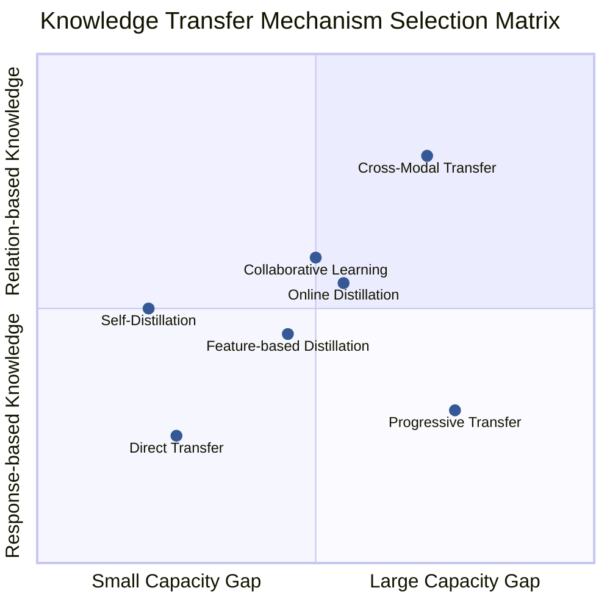

# Knowledge Transfer Mechanism Selection Matrix

```mermaid
quadrantChart
%%{init: {"themeVariables": {"quadrantPointFill": "#345995"}}}%%
    title Knowledge Transfer Mechanism Selection Matrix
    x-axis Small Capacity Gap --> Large Capacity Gap
    y-axis Response-based Knowledge --> Relation-based Knowledge
    
    Direct Transfer: [0.25, 0.25]
    Self-Distillation: [0.2, 0.5]
    Collaborative Learning: [0.5, 0.6]
    Progressive Transfer: [0.75, 0.3]
    Cross-Modal Transfer: [0.7, 0.8]
    Feature-based Distillation: [0.45, 0.45]
    Online Distillation: [0.55, 0.55]
```
