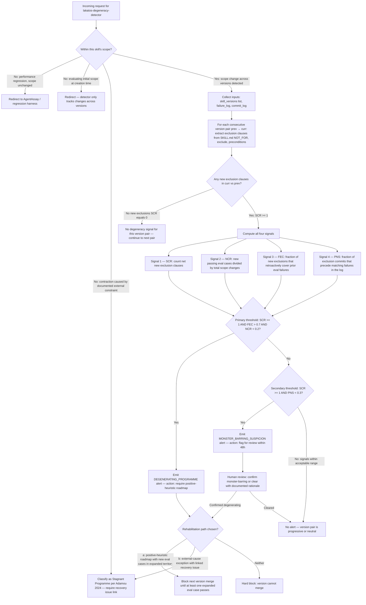

# Diagram 1: flowchart

```mermaid
flowchart TD
  A[Incoming request for lakatos-degeneracy-detector] --> B{Within this skill's scope?}
  B -->|No: performance regression, scope unchanged| C[Redirect to AgentAssay / regression harness]
  B -->|No: evaluating initial scope at creation time| D[Redirect — detector only tracks changes across versions]
  B -->|No: contraction caused by documented external constraint| E[Classify as Stagnant Programme per Adamou 2024 — require recovery issue link]
  B -->|Yes: scope change across versions detected| F[Collect inputs: skill_versions list, failure_log, commit_log]

  F --> G[For each consecutive version pair prev → curr: extract exclusion clauses from SKILL.md NOT_FOR, exclude, preconditions]

  G --> H{Any new exclusion clauses in curr vs prev?}
  H -->|No new exclusions SCR equals 0| I[No degeneracy signal for this version pair — continue to next pair]
  H -->|Yes: SCR >= 1| J[Compute all four signals]

  J --> K[Signal 1 — SCR: count net new exclusion clauses]
  J --> L[Signal 2 — NCR: new passing eval cases divided by total scope changes]
  J --> M[Signal 3 — FEC: fraction of new exclusions that retroactively cover prior eval failures]
  J --> N[Signal 4 — PNS: fraction of exclusion commits that precede matching failures in the log]

  K & L & M & N --> O{Primary threshold: SCR >= 1 AND FEC > 0.7 AND NCR < 0.2?}
  O -->|Yes| P[Emit DEGENERATING_PROGRAMME alert — action: require positive-heuristic roadmap]
  O -->|No| Q{Secondary threshold: SCR >= 1 AND PNS < 0.3?}
  Q -->|Yes| R[Emit MONSTER_BARRING_SUSPICION alert — action: flag for review within 48h]
  Q -->|No: signals within acceptable range| S[No alert — version pair is progressive or neutral]

  P --> T{Rehabilitation path chosen?}
  T -->|a: positive-heuristic roadmap with new eval cases in expanded territory| U[Block next version merge until at least one expanded eval case passes]
  T -->|b: external-cause exception with linked recovery issue| E
  T -->|Neither| V[Hard block: version cannot merge]

  R --> W[Human review: confirm monster-barring or clear with documented rationale]
  W -->|Confirmed degenerating| T
  W -->|Cleared| S
```
