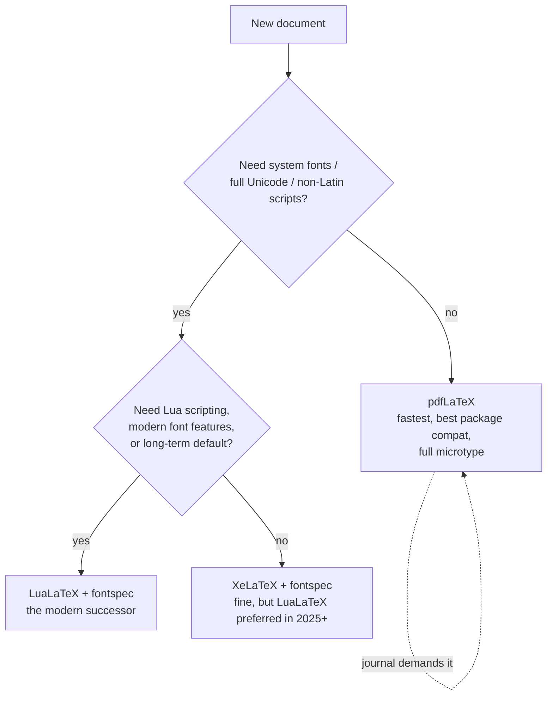

# LaTeX Authoring

Expert-level LaTeX: write documents that compile cleanly on the first pass of `latexmk`,
read like modern LaTeX (not 1995 LaTeX), and fail loudly instead of silently mis-rendering.

## Core Workflow

**Always build with `latexmk`, never hand-run passes.** It reruns pdflatex/biber exactly as
many times as cross-references require and is what CI and Overleaf use under the hood.

```bash
latexmk -pdf -interaction=nonstopmode -halt-on-error -outdir=build main.tex   # pdfLaTeX
latexmk -lualatex -outdir=build main.tex                                      # LuaLaTeX
latexmk -c -outdir=build            # clean aux files; -C also removes the PDF
latexmk -pvc -pdf main.tex          # watch mode: rebuild on save
```

Keep build artifacts in `-outdir=build` (add to `.gitignore`). Commit only sources — unless
the repo's convention is committed PDFs behind a registry, which is a different skill
(`latex-whitepaper-engineering`).

## Decision Trees

### Engine



Journals and arXiv overwhelmingly expect pdfLaTeX — stay with it unless you need `fontspec`.

### Document class

| Situation | Class |
|---|---|
| Article, paper, preprint | `article` (or journal's class: `IEEEtran`, `acmart`, `elsarticle`, `revtex`) |
| Book, thesis | `memoir` or `book`; check the institution's thesis class first |
| European typographic defaults, more layout knobs | `scrartcl`/`scrreprt`/`scrbook` (KOMA-Script) |
| Slides | `beamer` with `[aspectratio=169]` |
| A single figure/diagram as its own PDF | `standalone` |
| Letter | `scrlttr2` |

### Bibliography

```
New document, you control the toolchain → biblatex + biber
    \usepackage[backend=biber, style=numeric-comp]{biblatex}  \addbibresource{refs.bib}
Journal/conference template mandates natbib or a .bst → natbib + bibtex (don't fight it)
Tiny doc, <10 refs, no .bib wanted → thebibliography environment (last resort)
```

Never mix `natbib` and `biblatex` in one document. With biblatex, cite with `\autocite`/
`\textcite`; with natbib, `\citep`/`\citet`. If the log says `Please (re)run Biber` — run
latexmk, it handles it.

## The Modern Preamble (article)

```latex
\documentclass[11pt]{article}
\usepackage[T1]{fontenc}          % pdfLaTeX only; omit under Lua/XeLaTeX
\usepackage[utf8]{inputenc}       % no-op since 2018 kernels, harmless; omit if new
\usepackage{microtype}            % always. free typographic quality
\usepackage{mathtools}            % superset of amsmath
\usepackage{amssymb, amsthm}
\usepackage{booktabs}             % \toprule/\midrule/\bottomrule; never \hline grids
\usepackage{siunitx}              % \SI{9.8}{m/s^2}, \num{1e-5}, S table columns
\usepackage{graphicx}
\usepackage[margin=1in]{geometry}
\usepackage{hyperref}             % load LATE (see load order below)
\usepackage[capitalise]{cleveref} % \cref{fig:x} → "Figure 1"; load AFTER hyperref
```

**Load-order rules that actually bite:** `hyperref` near-last; `cleveref` after `hyperref`;
`babel`/`polyglossia` early; anything that redefines floats/captions (`caption`, `float`,
`subcaption`) before `hyperref`. When two packages clash, the fix is almost always order.

## Anti-Patterns (shibboleths)

| Novice writes | Expert writes | Why |
|---|---|---|
| `$$ ... $$` | `\[ ... \]` | `$$` is plain TeX: wrong vertical spacing, breaks `fleqn` |
| `\begin{eqnarray}` | `align`/`gather` from amsmath | eqnarray has broken spacing; deprecated ~2002 |
| `{\bf x}`, `{\it x}` | `\textbf{x}`, `\textit{x}`, `\bfseries` | 2.09-era font commands; no italic correction |
| `\\` to end paragraphs | blank line | `\\` is a line break inside a paragraph, causes `Underfull \hbox` |
| `figure[H]` everywhere | `[htbp]` + let floats float | fighting the float algorithm makes worse pages |
| `\ref{fig:x}` sprinkled | `\cref{fig:x}` | cleveref names the thing and non-breaks the space |
| vertical-ruled tables with `\hline` | booktabs, no vertical rules | typographic standard in every journal |
| `\usepackage{times}` | `\usepackage{newtxtext,newtxmath}` | times is obsolete, has no math companion |
| hand-running pdflatex 3× | `latexmk` | forgets a pass → stale refs, `??` in the PDF |
| ignoring warnings | fix `Overfull \hbox` > 10pt, all `undefined references` | silent quality rot; `??` in shipped PDFs |

**Timeline anchor:** advice mentioning `epsfig`, `subfigure` (package), `a4wide`, `eqnarray`,
or `\usepackage[utf8x]{inputenc}` is pre-2010 internet folklore — replace with `graphicx`,
`subcaption`, `geometry`, `align`, plain `utf8`/nothing.

## Compile-Error Triage

**Read the FIRST error in the `.log`, not the last** — everything after it is cascade noise.
Errors start with `!`; the line number follows `l.<n>`. With `-file-line-error` you get
`file:line:` prefixes.

| Log says | Actual cause |
|---|---|
| `! Undefined control sequence` | typo, or missing `\usepackage` for that macro |
| `! Missing $ inserted` | math-mode glyph (`_`, `^`, `\alpha`) in text mode |
| `! LaTeX Error: File 'x.sty' not found` | `tlmgr install <pkg>` (map .sty→pkg via `tlmgr search --global --file x.sty`) |
| `Runaway argument?` | unclosed brace `{` — often lines above the reported line |
| `! Extra }, or forgotten \endgroup` | brace mismatch, frequently inside a table row |
| `! Misplaced alignment tab character &` | `&` outside tabular/align — escape as `\&` |
| `Label(s) may have changed. Rerun` | not an error; latexmk reruns automatically |
| `! Package biblatex Error: Please (re)run Biber` | run latexmk (or `biber build/main`) |
| `! Dimension too large` | usually a corrupt/huge coordinate in TikZ or an image |
| PDF has `??` for refs/cites | undefined labels — grep log for `LaTeX Warning: Reference` |
| `Option clash for package X` | X loaded twice with different options; pass options via `\PassOptionsToPackage` or the class |

Minimization technique for mystery errors: bisect with `\end{document}` — move it halfway
up the body; error gone → problem is below; repeat. For preamble errors, comment out
packages in halves.

## Math, Tables, Figures — Quick Rules

- Multi-line math: `align` (aligned at `&`), `gather` (centered), `multline` (one long
  equation). Unnumbered: starred forms. Never blank lines inside math environments.
- Text inside math: `\text{...}` (mathtools), units via `siunitx`, differentials as
  `\,\mathrm{d}x`.
- Define `\DeclareMathOperator{\argmax}{arg\,max}` and semantic macros (`\newcommand{\R}{\mathbb{R}}`)
  in the preamble — never inline `\mathbb{R}` fifty times.
- Tables: `booktabs` + `S` columns (siunitx) for decimal alignment; `tabularx` for
  width-constrained; captions ABOVE tables, BELOW figures.
- Figures: `\includegraphics[width=.8\linewidth]{...}` — `\linewidth`, not `\textwidth`,
  inside columns/minipages. Vector formats (PDF/EPS) for plots; PNG only for rasters.

## References

Load these only when the task enters that territory:

- `references/math-typesetting.md` — amsmath/mathtools environments, theorem setups,
  operator/macro discipline, common math-mode errors. Read for heavy math documents.
- `references/tikz.md` — TikZ/PGF core idioms, positioning library, externalization for
  slow builds, standalone figures, pgfplots. Read when drawing diagrams or plots.
- `references/beamer.md` — frames, overlays, fragile verbatim, themes, 16:9, handout mode.
  Read when building slides.
- `references/bibliography.md` — biblatex styles and options, .bib field hygiene, natbib
  interop, switching backends, deduplication. Read for citation work beyond basic setup.
- `references/debugging.md` — full error/warning catalog, log anatomy, package-conflict
  resolution recipes, TeX Live maintenance (tlmgr). Read when the triage table above
  isn't enough.

## Templates

- `templates/article.tex` — modern article preamble, compiles as-is with pdfLaTeX.
- `templates/beamer.tex` — 16:9 beamer skeleton with overlay examples.
- `templates/tikz-standalone.tex` — standalone-class TikZ figure.

## NOT This Skill

- Committed-PDF whitepaper pipelines with metadata registries → `latex-whitepaper-engineering`
- Resume/CV generation → `cv-creator`
- HTML→PDF or programmatic PDF assembly (pdf-lib, Puppeteer) → `document-generation-pdf`
- Pandoc/Markdown-to-LaTeX conversion pipelines — adjacent but different toolchain
