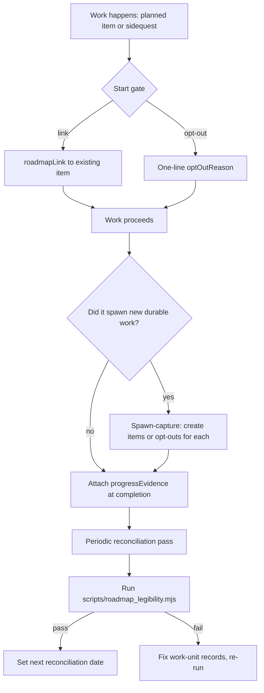

# Legible Roadmap With Sidequests

Keep one product roadmap as the through-line while letting real,
energy-driven sidequests happen — every unit of work traceable, nothing
lost, nothing claimed without proof.

## Use This For

- Designing a link-or-opt-out discipline so planned roadmap work and
  impromptu sidequests both stay traceable without a heavyweight planning
  tax on every impulse.
- Building the spawn-capture step that folds a sidequest's newly-surfaced
  follow-on work back into the roadmap instead of letting it evaporate.
- Running a periodic reconciliation pass that re-grounds burst-energy work
  against the current phases and catches drift early.
- Diagnosing whether a roadmap has become a rigid cage (sidequests get
  routed around it) or an ignored wishlist (status reported from optimism,
  not evidence).
- Auditing a work-unit log for the same shape of proof the `roadmap-link` CI
  gate demands of a PR: a real link, or an honest, explicit opt-out.

## Do Not Use This For

- Per-item tracker mechanics like assignees, columns, or ticket lifecycle
  (`agent-issue-tracker-workflow`).
- Decomposing one already-chosen problem into a dependency-ordered DAG of
  subtasks (`next-move`).
- PR title/body/description conventions once a change is ready to land
  (`agent-pr-authoring`).

## Process

1. Confirm there is exactly one canonical roadmap. Two "sources of truth"
   make every downstream link ambiguous — consolidate or archive the rest
   before doing anything else.
2. At the start of any unit of work (planned or sidequest), pay the one-line
   cost: attach `roadmapLink: <slug>` if it obviously advances an existing
   item, or `optOutReason: <one sentence>` if it genuinely doesn't. Never
   route around this — a heavyweight gate at this step is what pushes
   momentum underground.
3. As work proceeds, capture real evidence — `commit:<sha>`, `pr:<number>`,
   `receipt:<id>` — as it happens, not retroactively from memory.
4. At completion, ask whether the work spawned new durable follow-on tasks.
   If yes, create roadmap items (or opt-outs) for each one before closing
   the loop — spawned work not captured in the same sitting tends to vanish.
5. On a fixed cadence (≤14 days by default), pull every work unit touched
   since the last reconciliation and run the audit against it.
6. Fix every `critical`/`high` finding by correcting the work unit's record
   (add the missing link, capture the missing spawn, attach the missing
   evidence) — never by loosening the policy to make the finding disappear.
7. If the same sidequest shape recurs three or more times across
   reconciliations, escalate it to a named roadmap track at the next
   planning pass instead of opting it out again.

## Output Contract

Produce:

- `pass`: boolean — true only when no `critical` finding remains.
- `legibilityScore`: fraction (0-1) of work units that are both traceable
  (linked or opted out) and, where status implies progress, evidence-backed.
- `findings`: array of `{ id, severity, message, workUnitId? }`, covering
  roadmap fragmentation, untracked work, unresolved link/opt-out conflicts,
  uncaptured spawns, status-without-evidence, and missing/too-long
  reconciliation cadence.
- `recommendations`: one concrete, actionable fix per finding.

Use `scripts/roadmap_legibility.mjs` to compute this deterministically from a
JSON state describing the canonical roadmap count and recent work units.

## Anti-Patterns

### Heavyweight Planning Tax On Every Impulse

**Novice**: Require full roadmap grooming — proposal, priority score, phase
assignment — before an operator is allowed to start any sidequest.
**Expert**: The start-gate cost should be one line: a link if obvious, an
opt-out reason if not. Anything heavier and the operator routes around the
system, and the work happens anyway with zero trace.
**Detection**: Sidequests stop appearing in the audited work-unit log at all
while ad-hoc commits keep landing in git history — the tax pushed the work
underground instead of preventing it.

### Untracked Sidequests

**Novice**: Energy-driven work ships with no `roadmapLink` and no
`optOutReason` because "it's obviously fine, everyone knows what it was."
**Expert**: "Everyone knows" doesn't survive the session, the operator's
memory, or a new agent picking up the thread. Every work unit needs the
one-line declaration, full stop — that's the entire mechanism that keeps the
roadmap legible instead of vibes-based.
**Detection**: `scripts/roadmap_legibility.mjs` returns an `untracked-work`
finding at `critical` severity for any unit lacking both fields.

### Wishlist Roadmap / Status Theater

**Novice**: Mark a roadmap item `done` because the operator remembers doing
it, without a commit, PR, or receipt attached.
**Expert**: Status without evidence is a claim, not a fact — exactly the
failure `agent-work-receipt-designer` calls "self-reported success." A
roadmap that reports progress from optimism instead of artifacts will
eventually be wrong at the worst moment (a release, an audit, a handoff).
**Detection**: `status-without-evidence` finding at `critical` severity for
any `in-progress`/`done`/`shipped`/`merged` unit with empty
`progressEvidence[]`.

## References

| File | Load When |
| --- | --- |
| `references/roadmap-legibility-mechanics.md` | Need the link-or-opt-out mechanic, its verdict ladder, and the spawn-capture file-path detection rule. |
| `references/sidequest-reconciliation-playbook.md` | Need the start/spawn-capture/reconciliation gate ladder, or the decision table for fast-link vs. park vs. escalate. |
| `examples/expected-output.md` | Need to see a sidequest-sprawl state reconciled into a legible one, with the audit output for both. |
| `examples/sample-input.json` | Need a complete, already-legible state to test the script against (`pass: true`). |
| `templates/output-template.md` | Need a reusable reconciliation-report template to fill in. |
| `schemas/roadmap-state.schema.json` | Need to validate a state file's structure before auditing it. |
| `scripts/roadmap_legibility.mjs` | Need deterministic legibility scoring and findings for a roadmap + work-unit state. |
| `agents/openai.yaml` | Need a subagent descriptor for delegated reconciliation audits. |

<!-- BEGIN BUNDLE INDEX (auto: index_references.py) -->

## Skill Bundle Index

*Every file in this skill, and when to open it. Auto-generated; run `scripts/index_references.py --fix`.*

**root**
- [`CHANGELOG.md`](CHANGELOG.md) — Legible Roadmap With Sidequests — Changelog — - Initial skill creation - Core process defined - Reference files and deterministic roadmap_legibility script added
- [`README.md`](README.md) — Legible Roadmap With Sidequests — Steward one canonical product roadmap while honoring energy-driven sidequests — without either killing ADHD momentum or letting work become 

**`agents/`**
- [`agents/openai.yaml`](agents/openai.yaml) — openai (data/schema)

**`examples/`**
- [`examples/expected-output.md`](examples/expected-output.md) — Example Output: Legible Roadmap With Sidequests — Scenario: a two-week window on a port-daddy-shaped project.
- [`examples/sample-input.json`](examples/sample-input.json) — sample input (data/schema)

**`references/`**
- [`references/roadmap-legibility-mechanics.md`](references/roadmap-legibility-mechanics.md) — Roadmap Legibility Mechanics — Use this when you need the exact link-or-opt-out mechanic, how it maps to a CI gate, and why "legible" means evidence-backed, not merely tra
- [`references/sidequest-reconciliation-playbook.md`](references/sidequest-reconciliation-playbook.md) — Sidequest Reconciliation Playbook — Use this when you need to protect ADHD-driven momentum on real, energy-triggered work while stopping that work from becoming invisible or le

**`schemas/`**
- [`schemas/roadmap-state.schema.json`](schemas/roadmap-state.schema.json) — roadmap state.schema (data/schema)

**`scripts/`**
- [`scripts/roadmap_legibility.mjs`](scripts/roadmap_legibility.mjs)

**`templates/`**
- [`templates/output-template.md`](templates/output-template.md) — Roadmap Legibility Reconciliation — [Window: <start date> to <end date>] — [One sentence naming the product and the reconciliation window this covers.] - Source: [path/URL of the one canonical roadmap] - Count of co

<!-- END BUNDLE INDEX -->
