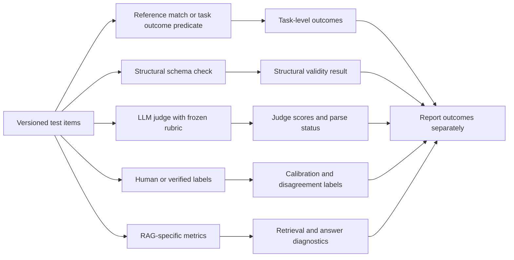

# L01 — Multi-method evaluation outputs remain distinct

```mermaid
flowchart LR
  D[Versioned test items] --> X[Reference match or task outcome predicate]
  D --> P[Structural schema check]
  P --> V[Structural validity result]
  D --> J[LLM judge with frozen rubric]
  D --> H[Human or verified labels]
  D --> R[RAG-specific metrics]
  X --> T[Task-level outcomes]
  J --> A[Judge scores and parse status]
  H --> C[Calibration and disagreement labels]
  R --> Q[Retrieval and answer diagnostics]
  T --> S[Report outcomes separately]
  V --> S
  A --> S
  C --> S
  Q --> S
```
