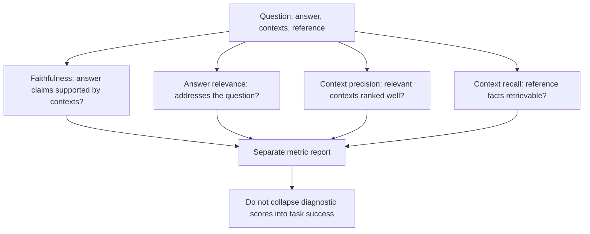

# L02 — RAG metric decomposition

```mermaid
flowchart TD
  I[Question, answer, contexts, reference] --> F[Faithfulness: answer claims supported by contexts?]
  I --> AR[Answer relevance: addresses the question?]
  I --> CP[Context precision: relevant contexts ranked well?]
  I --> CR[Context recall: reference facts retrievable?]
  F --> R[Separate metric report]
  AR --> R
  CP --> R
  CR --> R
  R --> N[Do not collapse diagnostic scores into task success]
```
