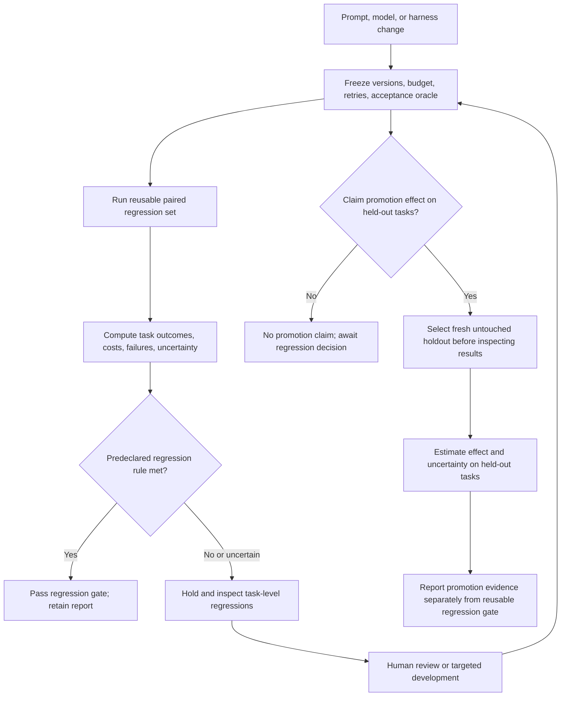

# L03 — Regression review with task-level uncertainty

```mermaid
flowchart TD
  P[Prompt, model, or harness change] --> V[Freeze versions, budget, retries, acceptance oracle]
  V --> E[Run reusable paired regression set]
  E --> C[Compute task outcomes, costs, failures, uncertainty]
  C --> B{Predeclared regression rule met?}
  B -->|Yes| G[Pass regression gate; retain report]
  B -->|No or uncertain| R[Hold and inspect task-level regressions]
  R --> H[Human review or targeted development]
  H --> V
  V --> Q{Claim promotion effect on held-out tasks?}
  Q -->|No| N[No promotion claim; await regression decision]
  Q -->|Yes| F[Select fresh untouched holdout before inspecting results]
  F --> I[Estimate effect and uncertainty on held-out tasks]
  I --> J[Report promotion evidence separately from reusable regression gate]
```
