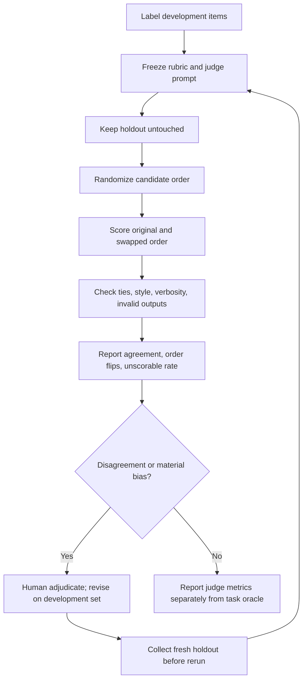

# L04 — Judge calibration and held-out evaluation

```mermaid
flowchart TD
  D[Label development items] --> R[Freeze rubric and judge prompt]
  R --> H[Keep holdout untouched]
  H --> O[Randomize candidate order]
  O --> S[Score original and swapped order]
  S --> T[Check ties, style, verbosity, invalid outputs]
  T --> A[Report agreement, order flips, unscorable rate]
  A --> K{Disagreement or material bias?}
  K -->|Yes| M[Human adjudicate; revise on development set]
  M --> N[Collect fresh holdout before rerun]
  N --> R
  K -->|No| F[Report judge metrics separately from task oracle]
```
