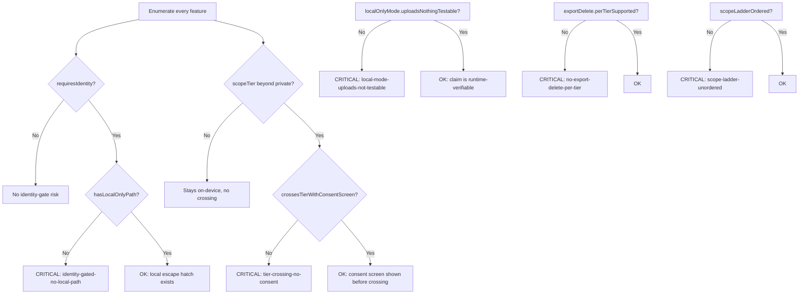

# Local-First Tenancy Boundary

Decide whether a local-first product's account/tenancy model actually keeps its local-first promise, or just
says it does.

## Use This For

- Verifying every identity-gated feature (passkey sign-in, device pairing, team invites) ships a real
  local-only equivalent, not a policy statement.
- Verifying every place data crosses a scope tier — private to repo, repo to team, team to public — shows an
  explicit data-boundary consent screen before the crossing, not a buried default.
- Proving the "local-only mode uploads nothing" claim is runtime-testable, not a doc comment.
- Checking export/delete controls exist and are verified for every scope tier a user's data can land in.
- Confirming the private/repo/team/public scope ladder is declared once, in order, before role or consent
  logic is built on top of it.

## Do Not Use This For

- Designing the crypto/PKI/relay mechanism underneath the zero-trust boundary itself (`pd-relay-zero-trust`).
- Modeling agent (not human-operator) identity continuity and reputation across respawns
  (`agent-identity-continuity-reputation`).
- General cryptographic security patterns for agent networking — signed envelopes, ocaps, mTLS, sandboxing
  (`agentic-zero-trust-security`).

## Tenancy Boundary Decision Model

1. **Enumerate every user-facing feature** with its `requiresIdentity`, `hasLocalOnlyPath`, `scopeTier`, and
   `crossesTierWithConsentScreen` fields — an incomplete inventory is not evidence of safety.
2. **For every identity-gated feature, verify a working local-only equivalent** — the "local-only no-account
   path" has to survive contact with the actual feature list, not just live on the onboarding screen.
3. **For every feature whose scope tier leaves `private`**, verify an explicit data-boundary consent screen
   fires at the moment of the crossing, not a settings default the user set once and forgot.
4. **Prove the local-only "uploads nothing" claim is runtime-testable** — a network-egress assertion or
   blocked-socket test in CI, not a marketing sentence.
5. **Verify export and delete controls exist for every scope tier** data can reach, re-auditing the full tier
   list whenever a new tier ships, not just the newest one.
6. **Confirm the private -> repo -> team -> public scope ladder** is declared once, in order, as the single
   source every role and consent check derives from.
7. **Run `scripts/tenancy_boundary_audit.mjs`** against the assembled spec; treat any critical finding as a
   regression on the local-first promise, not a nice-to-have.

## Output Contract

A safe tenancy boundary carries:

- `features[]`: every feature with `name`, `requiresIdentity`, `hasLocalOnlyPath`, `scopeTier`
  (`private`/`repo`/`team`/`public`), and `crossesTierWithConsentScreen` — non-empty; an empty inventory is
  never treated as safe.
- `localOnlyMode.uploadsNothingTestable`: `true` only when backed by a runtime-verifiable check.
- `exportDelete.perTierSupported`: `true` only when export/delete is implemented and verified per tier.
- `scopeLadderOrdered`: `true` only when the private/repo/team/public ordering is declared once and derived
  from everywhere else.

Use `scripts/tenancy_boundary_audit.mjs` to audit a spec JSON and return `{ pass, score, findings,
recommendations }`.

## Anti-Patterns

### The Account Wall With No Escape Hatch

**Novice**: Ships a feature that requires identity and assumes "we'll add the local-only mode later" — later
never comes, and sign-in quietly becomes critical for core functionality.
**Expert**: Every identity-gated feature ships alongside a working local-only equivalent on day one, or
doesn't ship gated at all until one exists.
**Detection**: `tenancy_boundary_audit.mjs` fires `identity-gated-no-local-path` (critical) when a feature has
`requiresIdentity: true` and `hasLocalOnlyPath: false`.

### Silent Tier Crossing

**Novice**: Data quietly syncs from private scope into repo/team/public scope behind a settings default,
with no user-facing moment where the user learns their data just left the device.
**Expert**: Every tier crossing pauses on an explicit data-boundary screen — named destination, affirmative
action required — the first time that feature's data would leave the private tier.
**Detection**: `tenancy_boundary_audit.mjs` fires `tier-crossing-no-consent` (critical) when a feature's
`scopeTier` is not `private` and `crossesTierWithConsentScreen` is `false`.

### The Unfalsifiable Local-Only Claim

**Novice**: Markets "local-only mode uploads nothing" as a claim no one can independently verify at runtime —
true until a background sync call gets added later and nobody notices.
**Expert**: The claim ships with a runtime-testable guarantee (a network-egress assertion, a blocked-socket
test) so "uploads nothing" is provable in CI, not just promised in a doc.
**Detection**: `tenancy_boundary_audit.mjs` fires `local-mode-uploads-not-testable` (critical) when
`localOnlyMode.uploadsNothingTestable` is `false`.

## References

| File | Load When |
| --- | --- |
| `references/local-only-and-consent-boundary.md` | Need the mechanics of a real local-only path, an explicit data-boundary consent screen, or how to make an "uploads nothing" claim runtime-testable. |
| `references/scope-ladder-and-tenancy-roles.md` | Need the private/repo/team/public scope ladder itself, team harbor roles, or the export/delete matrix per tier. |
| `examples/expected-output.md` | Need to see a bad spec audited, then the same spec fixed and passing, plus the empty-inventory edge case. |
| `templates/output-template.md` | Need a reusable data-boundary design doc template (feature inventory, consent screens, export/delete matrix, scope ladder). |
| `schemas/tenancy-boundary.schema.json` | Need to validate a tenancy-boundary spec JSON's structure before auditing it. |
| `scripts/tenancy_boundary_audit.mjs` | Need deterministic scoring of a tenancy boundary's safety. |
| `agents/openai.yaml` | Need a subagent descriptor for delegated tenancy-boundary auditing. |

<!-- BEGIN BUNDLE INDEX (auto: index_references.py) -->

## Skill Bundle Index

*Every file in this skill, and when to open it. Auto-generated; run `scripts/index_references.py --fix`.*

**root**
- [`CHANGELOG.md`](CHANGELOG.md) — Local-First Tenancy Boundary — Changelog — - Initial skill creation - Core decision model defined (identity-gated local paths, tier-crossing consent, local-only testability, export/de
- [`README.md`](README.md) — Local-First Tenancy Boundary — Audit a product's local-first account/tenancy model: every identity-gated feature keeps a real local-only path, every scope-tier crossing (p

**`agents/`**
- [`agents/openai.yaml`](agents/openai.yaml) — openai (data/schema)

**`examples/`**
- [`examples/expected-output.md`](examples/expected-output.md) — Example Output: Local-First Tenancy Boundary — Scenario: a team ships a "team harbor" collaboration feature straight to the cloud with no local-only fallback, a "sync to public gallery" f
- [`examples/sample-input.json`](examples/sample-input.json) — sample input (data/schema)

**`references/`**
- [`references/local-only-and-consent-boundary.md`](references/local-only-and-consent-boundary.md) — Local-Only Mode and the Data-Boundary Consent Screen — Use this when you need the mechanics of "local-only no-account path," the data-boundary consent screen, or proving a "local-only mode upload
- [`references/scope-ladder-and-tenancy-roles.md`](references/scope-ladder-and-tenancy-roles.md) — The Scope Ladder, Tenancy Roles, and Export/Delete Controls — Use this when you need the private/repo/team/public scope tiers themselves, how roles attach to them, or what "export/delete controls per ti

**`schemas/`**
- [`schemas/tenancy-boundary.schema.json`](schemas/tenancy-boundary.schema.json) — tenancy boundary.schema (data/schema)

**`scripts/`**
- [`scripts/tenancy_boundary_audit.mjs`](scripts/tenancy_boundary_audit.mjs)

**`templates/`**
- [`templates/output-template.md`](templates/output-template.md) — Tenancy Boundary Design Doc Template — Fill in every section before shipping an account/tenancy feature.

<!-- END BUNDLE INDEX -->
