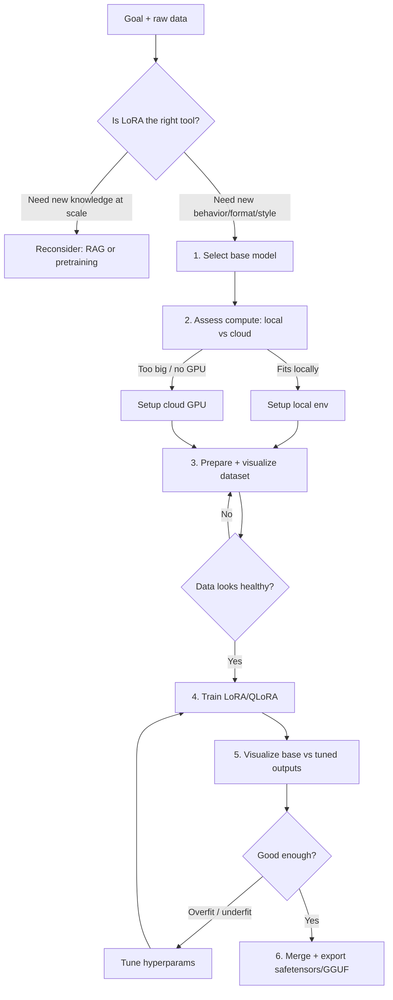

# LoRA Training 2026

Fine-tune an open-weight model with a LoRA adapter, made exceptionally easy. This skill
takes you from "I have some data and a goal" to a trained, previewed, exportable adapter —
choosing the base model, the hardware (your machine or a rented GPU), and showing you what
your data and your results actually look like at every step.

## When to Use

✅ **Use for**:
- Fine-tuning an open-weight LLM (Llama, Qwen, Gemma, Mistral, Phi, DeepSeek, SmolLM…) with LoRA/QLoRA/DoRA
- Choosing which base model fits your task, license, language, and VRAM budget
- Deciding whether to train **locally** or in the **cloud**, then setting up whichever fits
- Previewing/sanity-checking a training dataset before spending GPU hours
- Comparing base-model vs fine-tuned outputs side by side after a run

❌ **NOT for**:
- Full-parameter pretraining or continued pretraining from scratch (different scaling regime)
- Fine-tuning closed models via API (OpenAI, Gemini, Claude) — no LoRA, no weights
- Building a dataset from raw sources — delegate to `fine-tuning-dataset-curator`
- Prompt engineering or RAG when no weight update is actually needed
- Rigorous benchmark evaluation — delegate to `llm-evaluation-harness`

---

## Core Process



### Step 1 — Select the base model

Match the task to a model's **strengths, license, size, and context length** — never default to
"whatever is trending." Run the selector or read the registry:

```bash
python scripts/recommend_base_model.py --task "support-bot reply rewriting" \
  --vram 16 --license-need permissive --languages en,es
```

This ranks candidates from `references/base-models-2026.md`. For deep trade-offs (instruct vs base,
MoE vs dense, vision, reasoning distillation), read that reference. When in doubt, delegate the
nuanced call to the **base-model-selector** agent.

### Step 2 — Assess compute (local vs cloud)

Run hardware detection; it returns a verdict and a ready-to-run setup path for **either** route:

```bash
python scripts/assess_hardware.py --model qwen3-8b --method qlora --seq-len 4096
```

It estimates VRAM for the chosen model+method, reads your GPU, and prints `LOCAL OK` or
`USE CLOUD` with a concrete provider recommendation and launch command. The **compute-advisor**
agent handles ambiguous cases (e.g. "I have a 12 GB card but want a 32B model"). See
`references/local-vs-cloud.md` for the VRAM math, provider table, and cost comparison.

### Step 3 — Prepare and visualize the dataset

Convert to the trainer format, split, and **look at it** before training:

```bash
python scripts/prepare_dataset.py raw.jsonl --format chatml --split 0.9 --out data/
python scripts/visualize_dataset.py data/train.jsonl --out reports/dataset.html
```

The visualizer reports token-length distributions, role balance, duplicates, length outliers,
and renders sample conversations. Open the HTML; do not skip this — most failed runs are bad-data
runs. The **dataset-doctor** agent diagnoses anything the report flags.

### Step 4 — Train

One trainer drives local and cloud the same way (Unsloth/PEFT under the hood):

```bash
python scripts/train_lora.py --config configs/run.yaml          # local
bash   scripts/train_lora.sh  --provider modal --config configs/run.yaml   # cloud
```

The **training-orchestrator** agent writes `run.yaml`, picks rank/alpha/lr/scheduler from the
dataset size and method, and watches the loss. See `references/hyperparameters.md`.

### Step 5 — Visualize results

Generate a side-by-side base-vs-tuned preview on held-out prompts:

```bash
python scripts/compare_outputs.py --base <model> --adapter out/adapter \
  --prompts data/eval.jsonl --out reports/compare.html
```

The **eval-visualizer** agent reads this to judge overfit/underfit/regressions and recommends the
next move (more data, fewer epochs, lower lr, merge-and-ship).

### Step 6 — Merge and export

```bash
python scripts/merge_and_export.py --base <model> --adapter out/adapter \
  --format gguf --quant q4_k_m --out exports/
```

Exports a merged adapter for Ollama/llama.cpp (GGUF) or vLLM/TGI (safetensors).

---

## Anti-Patterns

### Anti-Pattern: "Bigger base model = better adapter"

**Novice**: "My task is hard, so I'll LoRA a 70B model."
**Expert**: Adapter quality is dominated by **data quality and task–model fit**, not raw parameter
count. A clean 1–2k-example set on Qwen3-8B usually beats a noisy set on Llama-4-70B, trains in
minutes on one consumer GPU, and serves cheaply. Scale the base only when the *base* can't do the
task even with perfect prompting. Start small, prove the loop, then scale.
**Timeline**: Pre-2024 the instinct was "scale solves it." Since QLoRA (2023) and the strong 7–9B
instruct models of 2025–2026, the bottleneck moved decisively to data.

### Anti-Pattern: Training before looking at the data

**Novice**: "The JSONL parses, so it's fine — start the run."
**Expert**: Parsing ≠ healthy. Run `visualize_dataset.py` first: look for label leakage, truncated
examples past your seq-len, role imbalance, near-duplicates inflating apparent size, and a length
tail that silently triples your token bill. Most "the model got dumber" outcomes are a 30-second
data look that nobody took.
**Timeline**: Always true; the 2026 tooling just makes the look fast enough that skipping it is
inexcusable.

### Anti-Pattern: Reaching for cloud GPUs by reflex

**Novice**: "Fine-tuning needs a datacenter, so rent an 8×H100 node."
**Expert**: With 4-bit QLoRA, an 8B model trains comfortably on a single 16 GB consumer GPU, and a
12–14B on 24 GB. `assess_hardware.py` tells you when local genuinely works — which is most small-to-mid
LoRA jobs. Cloud is for >24B, multi-GPU, or no-GPU laptops, not a default. Conversely, don't try to
full-fine-tune a 32B locally and conclude "LoRA doesn't work."
**Timeline**: 2026 consumer cards (16–24 GB) plus Unsloth's memory kernels made local the default
for adapters; cloud-by-reflex is a 2022 habit.

### Anti-Pattern: rank/alpha cargo-culting

**Novice**: "The blog used rank 8, alpha 16, so I will too."
**Expert**: Rank sets adapter capacity; for style/format tasks r=8–16 is plenty, for harder behavior
shifts r=32–64. Set `alpha ≈ 2×rank` (or use rsLoRA so scaling is rank-stable), target attention
**and** MLP projections, and tune learning rate to the method (2e-4 QLoRA is a starting point, lower
for DoRA). Copying a number without the regime behind it under- or over-fits silently.
**Timeline**: rsLoRA/DoRA (2024) changed the alpha intuition; the old "alpha=16 always" advice is stale.

---

## Bundle Map

### Agents (`agents/`) — load the one matching the step

| Agent | Use when |
|-------|----------|
| `base-model-selector.md` | Picking among open-weight models by task/license/VRAM/language trade-offs |
| `compute-advisor.md` | Deciding local vs cloud and producing the exact setup for the chosen route |
| `dataset-doctor.md` | A dataset visualization flagged problems and you need them diagnosed + fixed |
| `training-orchestrator.md` | Authoring the run config, choosing hyperparameters, and supervising the run |
| `eval-visualizer.md` | Interpreting the base-vs-tuned comparison and deciding the next move |

### References (`references/`) — NOT loaded by default

| File | Consult when |
|------|-------------|
| `base-models-2026.md` | Comparing source models and their strengths/weaknesses |
| `local-vs-cloud.md` | VRAM math, provider table, cost comparison, setup recipes |
| `hyperparameters.md` | Choosing rank/alpha/lr/scheduler/target-modules; QLoRA/DoRA/rsLoRA |
| `dataset-formats.md` | Formatting chatml/instruction/DPO/completion/vision data |
| `visualization-guide.md` | Reading the dataset and comparison HTML reports |
| `troubleshooting.md` | OOM, loss spikes/NaNs, overfitting, garbage outputs, slow training |

### Scripts (`scripts/`) — all self-contained, `--help` on each

| Script | Does |
|--------|------|
| `recommend_base_model.py` | Ranks base models from the registry for your task/constraints |
| `assess_hardware.py` | Detects GPU/VRAM, estimates need, prints LOCAL OK or USE CLOUD + setup |
| `prepare_dataset.py` | Validates, converts, dedups, and splits a dataset into trainer format |
| `visualize_dataset.py` | HTML report: token lengths, role balance, dupes, sample render |
| `train_lora.py` | Unified LoRA/QLoRA/DoRA trainer (Unsloth→PEFT fallback) driven by YAML |
| `train_lora.sh` | One-shot cloud launcher (Modal / RunPod / generic SSH) wrapping the trainer |
| `compare_outputs.py` | Side-by-side base-vs-adapter generations → HTML diff report |
| `merge_and_export.py` | Merges the adapter and exports safetensors or GGUF (quantized) |
| `model_registry.json` | Data backing `recommend_base_model.py` (editable source of truth) |

### Assets (`assets/`)

| File | Consult when |
|------|-------------|
| `run.example.yaml` | Starting a new run config; copy and edit rather than writing one from scratch |

---

## Quality Checklist (before declaring done)

- [ ] Base model chosen with an explicit reason (task fit + license + VRAM), not by trend
- [ ] `assess_hardware.py` run; local-vs-cloud decision is recorded, not assumed
- [ ] `visualize_dataset.py` report opened and reviewed; no truncation/leak/dup flags
- [ ] Eval prompts are **held out** of training data
- [ ] `compare_outputs.py` shows improvement on the target behavior **without** regressing general ability
- [ ] Run config (`run.yaml`) committed for reproducibility
- [ ] Exported in the format the serving target actually consumes (GGUF for Ollama, safetensors for vLLM)
