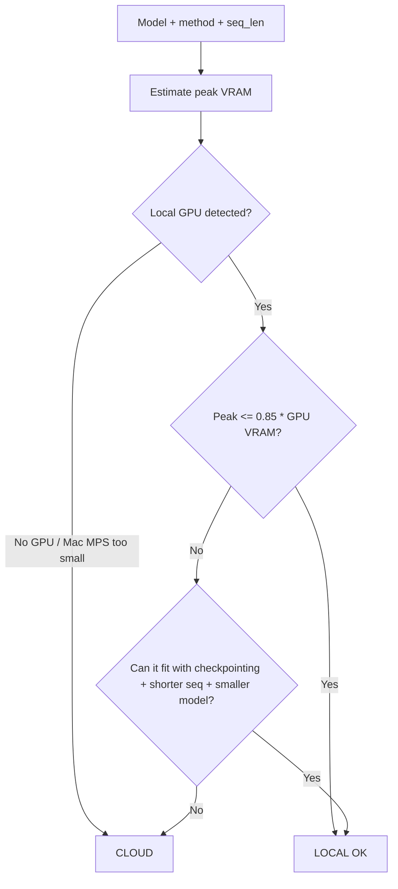

# Local vs Cloud: The Compute Decision

The goal is to make either route *easy*, and to pick correctly instead of by reflex.
`scripts/assess_hardware.py` automates this; this file is the reasoning it encodes.

## The one-line rule

> **If 4-bit QLoRA of your model + sequence length fits your GPU with headroom, train local.
> Otherwise, rent the smallest cloud GPU that fits.**

## VRAM estimation (QLoRA, 4-bit)

Approximate peak VRAM ≈ **base weights (4-bit)** + **activations (∝ seq_len × batch)** + overhead.

Rule-of-thumb peak for QLoRA at seq_len ≤ 4096, micro-batch 1–2 (use gradient accumulation for
effective batch):

| Base params | 4-bit weights | Typical QLoRA peak | Minimum GPU |
|-------------|---------------|--------------------|-------------|
| 1–3B | ~1–2 GB | 4–6 GB | 8 GB |
| 7–9B | ~5 GB | 10–14 GB | 16 GB |
| 12–14B | ~8 GB | 16–22 GB | 24 GB |
| 24B | ~14 GB | 28–34 GB | 40–48 GB |
| 32B | ~18 GB | 36–44 GB | 48 GB |
| 70B | ~38 GB | 70–90 GB | 2×48 GB or 1×80 GB |

Adjustments:
- **16-bit LoRA (not QLoRA)** ≈ 2.5–3× the weight memory of the 4-bit numbers above. Only if you
  have the headroom and want max quality.
- **Longer sequences cost a lot**: activations scale ~linearly with seq_len. 8k context can double
  the activation term vs 4k. Gradient checkpointing trades ~20–30% speed for big memory savings.
- **DoRA** adds a small overhead over LoRA. **MoE** models need *all* experts resident — size by
  total params, not active.

## Decision flow



`assess_hardware.py` applies exactly this, including the 15% safety headroom.

## When LOCAL wins
- ≤14B with QLoRA on a 16–24 GB consumer card (RTX 4080/4090/5080/5090-class, or 24 GB workstation).
- You iterate frequently (data churns hourly) — no upload latency, no per-minute meter.
- Data is sensitive and can't leave your machine.
- Apple Silicon: MLX-LoRA works for small models (≤8B) on 32 GB+ unified memory, slower than CUDA.

## When CLOUD wins
- Model >24B, multi-GPU, or you simply have no/weak GPU (laptop iGPU, 8 GB card + big model).
- One-off job where renting an A100/H100 for an hour is cheaper than your time.
- You need many parallel runs (hyperparameter sweep).

## Cloud provider quick-table

| Provider | Best for | Setup feel | Notes |
|----------|----------|------------|-------|
| **Modal** | Python-native, serverless, sweeps | `modal run` a function; no infra | Pay per second; great for `train_lora.sh --provider modal` |
| **RunPod** | Cheap on-demand/community GPUs | Pick a pod template, SSH/Jupyter | Community Cloud is cheapest; spot can be reclaimed |
| **Lambda / Vast.ai** | Cheap raw GPUs | SSH into a box | Vast = marketplace pricing, variable reliability |
| **Colab Pro / Kaggle** | Free-ish small jobs | Notebook | T4/L4 fits ≤8B QLoRA; sessions time out |
| **AWS/GCP/Azure** | Enterprise, existing cloud | Most setup | Quota approval can take days; priciest on-demand |
| **HF AutoTrain / Together / Fireworks** | Managed FT, no infra | Upload data, click | Less control, but zero ops |

Pick the cheapest GPU **tier** that fits the table above:
- 8B QLoRA → 1×L4/A10 (24 GB) or even T4 (16 GB) at short seq.
- 14B → 1×A100 40GB.
- 32B → 1×A100/H100 80GB.
- 70B → 1×H100 80GB (QLoRA) or 2×A100.

## Cost intuition (order-of-magnitude, verify current pricing)
- A small (≤8B, ~1–2k examples, 2–3 epochs) QLoRA run is **minutes to ~1 hour** of GPU.
- At rough 2026 rates, that's **single-digit dollars** on a rented A100/H100, often **free** locally.
- The expensive mistakes are: long sequences you didn't need, too many epochs, and re-running
  because you skipped the dataset visualization.

## Setup recipes

### Local (CUDA, Linux/WSL)
```bash
# uv is fast and reproducible; pip works too
uv venv && source .venv/bin/activate
uv pip install "unsloth[cu124] @ git+https://github.com/unslothai/unsloth.git" \
               trl peft transformers datasets accelerate bitsandbytes
nvidia-smi          # confirm driver/VRAM
python scripts/assess_hardware.py --model qwen3-8b --method qlora --seq-len 4096
```

### Local (Apple Silicon, MLX)
```bash
uv pip install mlx-lm
# Small models only; expect slower steps than CUDA. assess_hardware.py flags MPS.
```

### Cloud (Modal — serverless, recommended for "just works")
```bash
pip install modal && modal token new
bash scripts/train_lora.sh --provider modal --config configs/run.yaml
# Uploads config+data, provisions the GPU sized by assess_hardware.py, runs, downloads the adapter.
```

### Cloud (RunPod / SSH box)
```bash
# On the pod (template with CUDA + PyTorch):
git clone <your-data-repo> && cd <repo>
uv pip install unsloth trl peft transformers datasets accelerate bitsandbytes
python scripts/train_lora.py --config configs/run.yaml
# Then scp/huggingface-cli the adapter back BEFORE the pod is reclaimed.
```

> **Cloud hygiene**: always push the adapter to HF Hub or download it the moment training ends —
> ephemeral pods and serverless containers are reclaimed and your artifact is gone.
