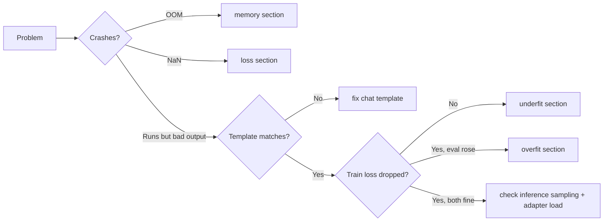

# Troubleshooting LoRA Training

Symptom → cause → fix. Ordered by how often each bites. The **training-orchestrator** agent consults
this when a run misbehaves.

## CUDA out of memory (OOM)
1. **Lower micro-batch to 1**, raise `gradient_accumulation_steps` to keep effective batch.
2. **Enable gradient checkpointing** (`gradient_checkpointing: true`) — biggest single saver.
3. **Switch to QLoRA** (4-bit) if you were on 16-bit LoRA.
4. **Cut `max_seq_len`** to your data's p95 (from the dataset report) — activations scale with it.
5. **Use `adamw_8bit`** optimizer (paged) instead of full AdamW.
6. Still OOM? The model is too big for this GPU → `assess_hardware.py` and go cloud one tier up.
- *MoE note*: all experts must be resident; "active params" is not your memory budget.

## Loss is NaN or spikes
- **Halve the learning rate.** 2e-4 too hot for some bases/methods.
- Ensure **bf16**, not fp16, on Ampere+ (`fp16` overflows more easily).
- Set `max_grad_norm: 1.0` (gradient clipping).
- Inspect data for empty/garbage/extremely-long rows (the outlier panel) — one poison row can spike.
- DoRA needs a lower lr than LoRA; drop to 5e-5–1e-4.

## Loss won't go down (underfitting)
- Raise `learning_rate` 1.5–2×; raise `r` (16→32→64); add an epoch.
- Verify you're actually training on responses (masking correct) and the template matches the model.
- Check the data isn't trivial/degenerate, and that the base *can* learn this (right base?).

## Eval loss rises while train loss falls (overfitting)
- Fewer epochs; lower `r`; add `lora_dropout: 0.05–0.1`.
- Get more/diverse data — the real fix. Dedup first (memorizing duplicates fakes "learning").

## Model outputs garbage / ignores fine-tuning
- **#1 cause: chat-template mismatch** between training and inference. Use the model's own template at
  both ends; don't hand-build special tokens. Re-check `apply_chat_template`.
- Confirm the adapter actually loaded (path correct, base matches the adapter's `base_model`).
- For QLoRA inference, load the base in the **same** 4-bit config or merge first.
- System prompt at inference must match (or intentionally generalize) the one trained on.

## Outputs are short, repetitive, or verbatim from training
- Overfit/memorization → fewer epochs, more diverse data, lower r.
- At inference, set sane sampling (`temperature`, `repetition_penalty`) — some loops are decode-config,
  not the weights.

## Catastrophic forgetting (general ability dropped)
- Too many epochs / too-high rank / lr → the adapter overwrote general behavior.
- Lower epochs and r; mix 5–15% general instruction data into your set; consider rsLoRA.
- The **regression probes** in `compare_outputs.py` are how you catch this early.

## Training is extremely slow
- Enable Unsloth (2–5× speedups + memory) if not already; enable packing for short examples.
- Turn **off** gradient checkpointing if you have VRAM headroom (it trades speed for memory).
- Right-size `max_seq_len`; long sequences dominate step time.
- On cloud, confirm you got the GPU you paid for (`nvidia-smi`), not a throttled/shared slice.

## Adapter won't merge / export fails
- Base must be loaded in a mergeable precision (16-bit) to `merge_and_unload`, not 4-bit.
- For GGUF: merge to safetensors first, then convert with llama.cpp's converter at your target quant.
- Tokenizer mismatch on export → copy the base tokenizer alongside the merged weights.

## Cloud-specific
- **Pod reclaimed mid-run**: checkpoint every N steps to persistent storage / HF Hub; resume from it.
- **Artifact lost**: push to HF Hub or download the moment training ends — ephemeral disks vanish.
- **Quota denied (AWS/GCP)**: request GPU quota days ahead, or use Modal/RunPod which need none.

## Quick diagnostic order

