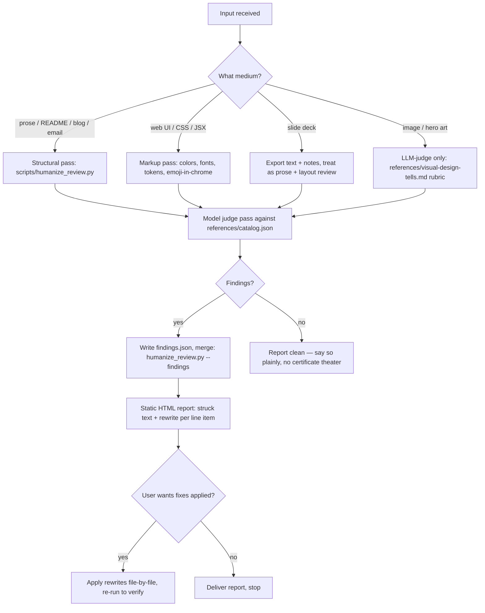

# Make Copy and Media Human

Strip the machine accent from anything outward-facing. The skill catalogs the tells — per model dialect and per medium — detects them with a two-layer pipeline, strikes them, and hands back a line-item fix plan as a self-contained static HTML report.

## Philosophy

AI output has an accent. Not one accent — dialects: Claude's staccato and em-dashes, GPT's service voice and emoji headers, Gemini's caveat stacks, Codex's narrating comments, and the v0/Lovable visual register of Inter, indigo, and glassmorphism. Humans clock these in seconds even when they can't name them. The fix is never "paraphrase it" — it is to find each tell, understand why a person wouldn't have produced it, and make the decision a person would have made.

Two laws bind this skill:

1. **No keyword-list NLP.** Phrase-level tropes are judged by the model against a rubric, never by substring lists over free text. The script layer measures only structural signals: densities, variances, ratios, codepoints, hex values, font names — values you control or can count.
2. **The output must pass its own review.** The report template uses Georgia/Menlo, an oxide-red accent, ≥14px text, no emoji, no indigo. If this skill's own artifacts look generated, nothing it says is credible.

## Decision Tree



## Process

### 1. Scope the input
Identify medium and stakes. A tweet gets the judge pass only; a marketing site gets both layers plus a render check. For decks (`.pptx`/Keynote), dump text and speaker notes first (python-pptx), review as prose, then review the visual idiom separately.

### 2. Run the structural layer

```bash
python3 scripts/humanize_review.py FILE [FILE...] --out report.html --json structural.json
```

Detects (measurable signals only): em-dash density >1.2/100w, staccato fragment share, uniform sentence length, zero contractions, broetry line-break runs, heading spam, bullet colonization, bold-label-colon grids, unattributed blockquotes, arrow chains, emoji-as-structure, AI-default hex accents (#6366F1 family), AI-default typefaces (Inter/Geist/Sora/Manrope/Space Grotesk), glassmorphism/rounded-2xl/gradient token repetition, emoji inside UI chrome.

### 3. Run the judge pass (you, the model)
Read `references/catalog.json`. For each item with `detection_type: llm-judge`, ask its rubric question of the text. Read the text **as a hostile, taste-having human editor**, not as a checklist executor. Write findings to JSON matching the schema in the script docstring and in `templates/output-template.md` — file, line, excerpt, ism, dialect, severity, explanation, rewrite. The rewrite field is mandatory for high-severity findings: a finding without a fix is a complaint.

### 4. Merge and render

```bash
python3 scripts/humanize_review.py FILE... --findings judge.json --out report.html
```

One self-contained HTML file. Struck originals, inset rewrites, severity-sorted.

### 5. Fix, then re-run
Apply rewrites if asked, working through `templates/rewrite-checklist.md` — it covers surgical-edit verification, voice restoration, and specificity checks. Re-run both layers; the report after fixes should be empty or low-only. Never declare clean without the re-run.

### Maintaining the catalog
`references/catalog.json` is the source of truth. To add or sharpen a tell, edit the JSON, then run `python3 scripts/regenerate_references.py` — the per-dialect markdown files are generated views and must not be edited by hand.

## The Dialects (load on demand)

| Reference | Load when |
|---|---|
| `references/catalog.json` | Always, at judge-pass time — the machine-readable rubric |
| `references/claudeisms.md` | Text suspected from Claude: staccato, em-dashes, "not X but Y", escalating compliments, unattributed quotes |
| `references/gptisms-codexisms.md` | READMEs, code comments, service-voice copy, emoji headers |
| `references/other-model-dialects.md` | Gemini caveat stacks, DeepSeek/Qwen register, Grok edge-lord voice, cross-model translationese |
| `references/visual-design-tells.md` | Any web UI, landing page, slide visuals, or generated imagery |
| `references/structure-and-deck-tells.md` | Long docs, slide decks, marketing pages, LinkedIn posts, email |
| `references/sources.md` | When you need citations — published catalogs and stylometry research |
| `templates/output-template.md` | When drafting a judge-pass finding or the delivery summary for a completed review |
| `agents/openai.yaml` | When delegating a humanization review to a subagent |

## Shibboleths

- **The em-dash is not the crime; the rate is.** Human essayists use em-dashes. 1.2+ per 100 words across a document is machine cadence. Count before you cut.
- **"You're absolutely right" has no human attestation.** No person writes this in review feedback. Same family: the escalating compliment — "you're the only [role] who [trait], [more specific], [more specific still]" — flattery shaped like a binary search.
- **A quote nobody said is not a pull quote.** Pull quotes excerpt the document itself. An italicized aphorism with no source is manufactured gravitas: attribute it or kill it.
- **Inter at 400 weight on #6366F1 buttons means nobody made a decision.** The tell isn't the font or the hex; it's that they co-occur with rounded-2xl and a gradient headline. Defaults cluster.
- **Codex narrates; engineers annotate.** `// increment the counter` above `count++` is generated. A human comment states the constraint the code can't: `// TAO writes dogpile above 50qps — batch`.
- **Perfect parallelism is a tell, not a virtue.** Twelve bullets with identical grammatical shape and length were generated. Humans drift.
- **The fix for staccato is not longer sentences. It is fewer sentences.** Merge the fragments back into the thought they were chopped from.

## Dos and Don'ts

**Do**
- Quantify before flagging prose rhythm (the script gives you the numbers).
- Preserve meaning exactly when rewriting; you are removing accent, not content.
- Match the property's established voice — read 2–3 adjacent published pieces first.
- Flag your own draft output with the same pipeline before delivering it.
- Say "clean" when it's clean. A zero-finding report is a valid result.

**Don't**
- Don't paraphrase-launder: running text through one more LLM pass adds a second accent on top of the first.
- Don't build keyword lists to catch phrases. Judge pass only.
- Don't strip personality along with tropes — contractions, opinions, and irregularity are the goal, not casualties.
- Don't add the report's findings as comments in the source file; the HTML report is the deliverable.
- Don't treat severity:low as a to-do list; low items are taste calls the author may keep.

## Failure Modes

### Paraphrase Laundering
**Detection**: "fixed" text has new tropes the original lacked.
**Fix**: rewrites must be surgical — edit the flagged span, leave the rest byte-identical.

### Voice Flattening
**Detection**: post-fix text is clean but beige; the author's tics went with the machine's.
**Fix**: diff against 2–3 pieces of the author's known-human writing; restore their fingerprints.

### Checklist Myopia
**Detection**: judge pass returns only catalog items, zero novel observations.
**Fix**: the catalog is a floor, not a ceiling. One free-form "what else smells generated?" pass is mandatory.

### Forensics Drift
**Detection**: user asks "did a student/employee write this with AI?" and the skill answers.
**Fix**: out of scope. This skill edits; it does not accuse. Detection-for-accusation has miserable false-positive economics.

## Examples

`examples/before-after-prose.md` — a launch announcement, machine accent vs. edited.
`examples/before-after-landing-page.md` — the v0 look vs. a designed page, token by token.
`examples/sample-report.html` — what a finished fix plan looks like.

<!-- BEGIN BUNDLE INDEX (auto: index_references.py) -->

## Skill Bundle Index

*Every file in this skill, and when to open it. Auto-generated; run `scripts/index_references.py --fix`.*

**root**
- [`CHANGELOG.md`](CHANGELOG.md) — Changelog — Upgraded to the port-daddy agentic-family bundle standard.
- [`README.md`](README.md) — Make Copy and Media Human — Strip the machine accent from copy, web UI, slides, READMEs, marketing pages, and generated imagery before anything outward-facing ships.

**`agents/`**
- [`agents/openai.yaml`](agents/openai.yaml) — openai (data/schema)

**`examples/`**
- [`examples/before-after-landing-page.md`](examples/before-after-landing-page.md) — Before / After — Landing Page (the v0 look, token by token) — | Token | Ism | Severity | |---|---|---| | `Inter` (Google Fonts) | ai-default-typeface | high | | `#6366f1`, `from-indigo-500 to-violet-500
- [`examples/before-after-prose.md`](examples/before-after-prose.md) — Before / After — Launch Announcement — The same announcement, machine accent vs.
- [`examples/sample-report.html`](examples/sample-report.html)

**`references/`**
- [`references/catalog.json`](references/catalog.json) — catalog (data/schema)
- [`references/claudeisms.md`](references/claudeisms.md) — Claudeisms — and the generic prose tells Claude amplifies — Tells most associated with Claude-family output, plus the cross-model prose tells that show up strongest in Claude registers.
- [`references/gptisms-codexisms.md`](references/gptisms-codexisms.md) — GPT-isms and Codexisms — ChatGPT's service voice and README register, and the code-comment tells of Codex/Copilot-shaped generation.
- [`references/other-model-dialects.md`](references/other-model-dialects.md) — Other model dialects — Gemini, Kimi, DeepSeek, Qwen, Llama, Grok — and cross-model translationese — Distinctive tics per model family, plus the affect-flatness tells that mark any machine register.
- [`references/sources.md`](references/sources.md) — Sources — Published catalogs, stylometry research, and essays the catalog draws on.
- [`references/structure-and-deck-tells.md`](references/structure-and-deck-tells.md) — Structure, deck, and marketing-copy tells — Document-shape tells: how generated long-form docs, slides, posts, and emails are assembled, independent of any sentence.
- [`references/visual-design-tells.md`](references/visual-design-tells.md) — Visual design tells — the v0/Lovable look and AI imagery — What makes a UI, slide, or image read as generated: the defaults nobody chose, clustering together.

**`scripts/`**
- [`scripts/humanize_review.py`](scripts/humanize_review.py) — humanize_review.py — flag AI-isms in copy/media and emit a static HTML fix plan.
- [`scripts/regenerate_references.py`](scripts/regenerate_references.py) — Regenerate references/*.md from references/catalog.json. Stdlib only.

**`templates/`**
- [`templates/output-template.md`](templates/output-template.md) — Judge-Pass Finding + Delivery Template — Fill this in during step 3 (judge pass) and step 4 (delivery) of the process in `SKILL.md`.
- [`templates/rewrite-checklist.md`](templates/rewrite-checklist.md) — Rewrite Checklist — run after every humanizing pass — Work the report top-down (high severity first), then verify: - [ ] Every fix touched only the flagged span; surrounding text is byte-identic

<!-- END BUNDLE INDEX -->
