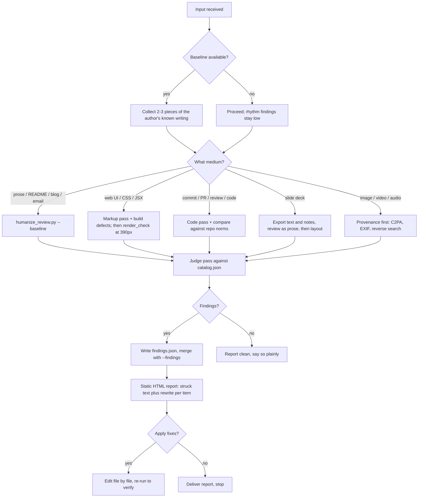

# Make Copy and Media Human

Strip the machine accent from anything outward-facing. This skill catalogs the
tells per model dialect and per medium, detects them in two layers, strikes them,
and hands you a line-item fix plan as one self-contained HTML file.

## Read this first

You are going to find things. Before you act on them, understand what a finding
means, because the evidence here is uncomfortable and the skill is built around
it.

AI-text detectors are biased toward calling things human. They miss most machine
output, and the things they do catch skew heavily toward unusual people: seven
commercial detectors produced a mean 61.3% false-positive rate on essays by
non-native English speakers, and 19% of those essays were flagged unanimously by
all seven. So when a signal fires here, it is more likely to be a second-language
writer, an autistic writer, or someone who simply loves dashes than a caught
machine.

That is why this skill edits and never accuses. Every fix in the catalog makes
writing better whether a person or a model produced it, which means you never
have to answer the authorship question to do the work. If someone asks you to
determine whether a colleague or a student used AI, decline and offer to edit the
text instead. `references/fairness-and-false-positives.md` has the full argument
and the citations, and you should read it before your first review.

## Three laws

**No topical keyword lists.** Phrase-level tropes get judged by you against a
rubric, never by substring matching over free text. Three narrow exceptions are
allowed because they are not about topic or taste. The first is a closed set of
<!-- humanize:ignore-start -->machine artifacts that have no human source, such
as `oaicite` tokens or a `utm_source=chatgpt.com` parameter.<!-- humanize:ignore-end --> The second is closed sets of grammatical
forms measured as a rate, like sentence-final participles or nominalization
suffixes, which carry published effect sizes. The third is the era-versioned
excess-vocabulary marker list, reported as density against a baseline and always
labelled with its era. Everything else belongs to the judge pass.

**Judge the delta, not the absolute.** This is the law that makes the skill fair
and also makes it work. Rhythm signals such as em-dash rate, comma rate,
contraction rate and sentence-length variance are fluency proxies, and they
overlap badly between people and models. Melville runs more em dashes than
GPT-4-class output does. Llama runs none at all. One anti-slop linter measured
its em-dash rule warning on roughly 64% of legitimate technical blog posts before
recalibration. So pass `--baseline` with a few pieces of the author's own prior
writing whenever you can get it. Without a baseline the script caps that whole
family at low severity, on purpose.

**The output has to pass its own review.** The report uses Georgia and Menlo, an
oxide-red accent, nothing under 14px, no emoji, no indigo. Every file in this
bundle is checked by `scripts/humanize_review.py` and the checked-in state is
clean. If this skill's own artifacts looked generated, nothing it says would
land.

## The six families

Findings carry a `family`, and the family tells you how much to trust the
finding. This matters more than severity.

`residue` covers machine artifacts with essentially no human source: invisible
codepoints such as U+202F, vendor citation tokens, chat tracking parameters,
leaked assistant boilerplate. Act on these with full confidence. They tell you
text passed through a chat window, which is not the same as telling you nobody
thought about it.

`form` covers grammatical patterns with measured effect sizes, like participial
tails at 5.3 times the human rate or nominalizations at roughly twice. Humans do
these too, so read the `false_positive_when` line before you cut.

`rhythm` covers punctuation and sentence-length habits. Weak on their own, real
against a baseline. This is where false accusations come from.

`shape` covers document assembly: heading density, bullet colonization, rules
between every section, the obligatory future-directions block. Usually safe to
act on, because the fix improves the document regardless.

Weight `form` and `shape` over the phrase-level items when the two disagree. The
largest community analysis of what makes writing sound like AI concluded against
its own premise on this, finding cosmetic tells mostly noise. The quantitative
version is stronger still: a study of 61,608 stories separated human from
generated fiction at 93.2% macro-F1 using discourse-level narrative features
alone, with every stylistic cue stripped out. Structure survives a model that has
learned not to say "delve". Phrases do not.

`code` covers engineering artifacts. The highest-precision checks here are all
relative, comparing a change against the repo's own log, idiom, and PR norms.
A contributor who read the surrounding code passes them automatically.

### Declared but not wired

One signature inside `defect` deserves naming on its own, because it is the most
genuinely model-flavoured thing in this catalog and it tells you where to look.

A model reliably emits the recognisable, visible half of a pattern and drops the
half that only matters under failure or assistive technology. Across roughly
three thousand browser-driven trials, generated modals carried an Escape handler
79% of the time and Escape actually closed the dialog 59% of the time. The gap is
not the interesting part. This is: **1,031 of the 1,032 failures threw no console
error.** Every non-interactive check reports success, including this skill's
static pass.

So when auditing anything interactive, ask of each affordance whether its label
is present without its behaviour. A sort caret with no `aria-sort`. A disabled
button with no reason. A `<dialog>` written but opened with `.show()` rather than
`.showModal()`. An `onMutate` with no `onError`. A "Last 30 days" label with no
range control. Two related shapes travel with it: the interface that is a
one-to-one rendering of the data model rather than a designed view (every column
a column, every config key a switch), and the content whose cardinality exactly
equals a layout constant (four cards because the grid has four columns).

These three are what separate "a model wrote this" from "nobody polished this".
Most of the `defect` family is the second thing, which is worth fixing and not
worth attributing. This one is the first.

`defect` is the odd one out, and the most useful. These are not inferences about
who built something; they are things that are broken. The page scrolls sideways
at 390px. The button is not a button. The grey text fails contrast. You reproduce
them by opening the page, so they carry no fairness caveat at all and you act on
them with full confidence. Work this family first: a site that does not work on a
phone has a bigger problem than a site that reads a bit generated.

`defect` findings share their standing with one more class that sits outside the
families and outranks everything. Citation pathology is about truth rather than
authorship: a dead DOI, a reference that
does not support its sentence, a statistic with no study behind it. Check those
with complete confidence, because you are verifying a claim rather than inferring
an author. It is the highest-yield check in the skill and it has no fairness cost.

## The one rubric that matters most

If you only ever run one judge question, run this one: **what detail in this
passage could only have come from this author, this reader, or this thing?**

Five communities arrived at it independently, in their own vocabularies. People
flagging LinkedIn slop call it generic abstraction. Researchers studying fake
reviews call it emphasizing generic product merits over idiosyncratic
experience. Reddit moderators, cold-email testers and dating-app users all
describe the same failure. It's the rubric behind `specificity-starvation`,
`textureless-anecdote`, `substitutable-reply`, `synthetic-review-shape` and
`mirror-back-research-opener`, and it survives every model improvement, because
the thing it asks for is knowledge the model doesn't have.

## Placeholder copy produces placeholder layout

For web pages the taste findings and the content findings are one family, and
the arrow runs in a direction worth knowing. Underspecified input gets answered
with the statistical average of every page on the internet, and the average page
is mediocre. Ask for a landing page without giving it real content and it invents
placeholder copy, and placeholder copy forces placeholder layout.

That explains the tells together rather than separately. The eyebrow is empty
because the template has an eyebrow slot and nothing true was available to fill
it. The hero has no image because there is no product to photograph. The grid has
three cards because three is what you pick when the number of real things is
unknown. The pull quote quotes nothing because a quote is a provenance relation
and there was no document to pull from.

So the fix usually runs upstream of the design. Supply the real content, and most
of the layout problems stop being layout problems. When you cannot supply it,
that absence is the finding, and a page that admits it beats a page that fills
the gap with a gradient.

## Ask what the reader already knows

Expository writing fails in ways sentence-level review never catches. A blog post
touts improvements over a v2 nobody saw. Internal codenames arrive unglossed. A
term of art is used three times and defined never. Everything is explained at the
same depth, so nothing is signposted as hard.

It is tempting to call these one failure, and I did until the evidence said
otherwise. There are three mechanisms, and they need different fixes.

**Context leakage.** The model writes from its context window, which holds the
previous versions, the internal thread and the repository, and nothing in the
loop marks which parts the reader was present for. It treats availability as
sharedness. This is the curse of knowledge with a machine behind it, and it is
the family `unearned-prior-reference`, `repo-context-leak` and
`definition-after-use` catch. **Fix it with a referent audit:** for every back-
reference, name, and term, check that the thing it points at exists on the page.

**Altitude lock**, and this is the one that breaks the tidy story. When the
audience is stated explicitly in the prompt — so the model has been told what the
reader knows and the context confusion is gone — it still fails. Explanations
generated for different stated audiences come out indistinguishable in reading
level, and match their intended level about half the time against roughly
four-fifths for human-written ones. **Prompting the audience does not fix this.**
The author has to supply a depth plan: which two ideas are hard, which get a
worked example, which get one sentence.

**Template completion.** The structure is announced rather than built, the
promised idea never arrives, the release notes wear an essay's clothes. Form
before content, which is the `shape` family. **Fix it by deleting the scaffold.**

The diagnostic, when you want one question: **could a competent stranger who
arrived from a search result follow this, and where is the first place they would
have to stop and look something up?** That spot is the fix. But note it only
surfaces the first family reliably — altitude lock produces prose a stranger can
follow and learn nothing from, so for that one ask instead which two things here
are hard, and whether the piece spends more time on them than on the easy parts.

## Scale severity by the venue's base rate

The same tell deserves different weight in different places, because the prior
differs by more than an order of magnitude. Measured rates run around 40% fully
generated for LinkedIn long-form posts and 24% for their comments, roughly 24%
for posts on X, and about 4% on Reddit overall with replies near 2%.

So a formatted, structured, correctly punctuated comment on LinkedIn is worth
acting on. The same comment on a Reddit reply is firing against a 2% prior and
will be wrong most of the time. Adjust before you speak, especially anywhere a
person might feel accused.

## Decision tree



## Process

### Scope the input and find a baseline

Identify the medium and the stakes. A tweet gets the judge pass only; a marketing
site gets both layers plus a render check. Then go looking for the author's own
earlier work, because it turns the weakest half of the catalog into the strongest.
Two or three published pieces are enough. For a repo, the baseline is the repo:
read `git log --oneline -30` and three recently merged PRs before you judge a
commit or a description.

For decks, dump the text and speaker notes first with python-pptx, review that as
prose, then review the visual idiom separately.

### Run the structural layer

```bash
python3 scripts/humanize_review.py FILE... --baseline 'posts/*.md' \
    --out report.html --json structural.json
```

It measures countable things only: densities, variances, ratios, codepoints, hex
values, font names, identifier overlap. Thresholds come from
`references/catalog.json`, so the rubric and the code cannot drift apart. Run
`--validate` if you ever doubt that they agree.

### Render the page before you judge it

For anything that ships as a web page, the static pass is half the story. It can
tell you there are no responsive variants; it cannot tell you the pricing table
is 1180px wide inside a 390px screen, or which element is at fault.

```bash
python3 scripts/render_check.py URL_OR_FILE --json render.json
python3 scripts/humanize_review.py page.html --findings render.json --out report.html
```

That script is the one thing in this bundle with a dependency, on Playwright, and
it says so when it is missing rather than failing obscurely. It opens the page at
390, 768 and 1280, and reports horizontal overflow with the offending elements
named, tap targets under 44px, text under 12px, and contrast below AA. Those
findings merge into the same report through the normal `--findings` path.

If you cannot run it, open the page yourself at phone width. Half the findings in
`references/web-build-defects.md` are visible in ten seconds that way.

Two of its flags turn a source-level guess into a verdict, and both cover states
the author's own browser is never in:

```bash
python3 scripts/render_check.py URL --probe-modals --probe-a11y
```

`--probe-modals` opens each plausible trigger and tests the four behaviours that
matter — focus moves in, Escape closes, Tab stays contained, focus returns.
`--probe-a11y` applies the WCAG 1.4.12 text-spacing values and measures what
stops fitting, then switches to forced colors and confirms which elements lost
their only visible boundary. Both matter because a static pass reports success on
exactly these: the Escape handler is present in source whether or not it runs,
and a gradient looks like a boundary right up until the OS reverts it.

### Optimised the source, never the delivery

A generator can see the markup it is writing. It cannot see a network waterfall,
a byte count, a decode time, or which element wins LCP. So the findings in
`references/performance-as-a-design-tell.md` cluster where correctness-in-source
and correctness-in-delivery come apart: the `` is valid and the format is
wrong; the font stack is tasteful and six weights ship; the component is correct
React and it did not need to be React.

**Say UNREVIEWED, not AI-generated, and mean it.** Three or four entries there
are genuinely model-flavoured and say so; the rest would look identical coming
from a person who shipped without watching the page load once. Be especially
careful with the population-level claim, because it is the one that gets
repeated: the mechanism is well understood and every individual tell is
measurable on any given page, but **there is no published measurement that
AI-generated sites are heavier**. What exists measures AI-adjacent signals —
builder subdomains, the spread of the indigo palette — and explicitly does
not measure page weight.

Read `references/performance-budget-and-folklore.md` before reporting any of it.
It carries eleven budget numbers a designer can check in a review without
opening a profiler, and ten pieces of circulating folklore to drop — the
Lighthouse score as a proxy for speed, the per-KB parse-time constant, the shared
font cache, and the weight claim above. A score tells you where you landed; a
budget tells a designer what they can spend before they spend it.

### One value where a function belonged

`references/typographic-craft-and-tokens.md` has a single governing idea and it
is worth carrying into any stylesheet review. A generator emits CSS that is
internally consistent and has no craft in it, because craft in typography is
almost entirely per-context judgement: this heading at this size on this measure
needs 1.05 leading — `line-height`, the distance from one baseline to the
next, expressed as a multiple of the font size — and slightly negative
tracking, while the one three sections down does not. A default is by construction context-free.

So the tell is never a **wrong value** — any individual number in that file
is defensible somewhere. The tell is **one value where there should have been a
function of context**, and every check there is the same computation: does this
property vary with the thing it is supposed to vary with? Leading with size and
measure. Tracking with size. Weight with role. Contrast with theme. Colour with
surface.

That changes how you report it. You are not telling an author their 1.6
line-height is wrong; you are telling them a 64px headline and 16px body copy
cannot both want it.

Two cautions, or this lane generates noise. Read **computed** values rather than
declaration counts — utility frameworks bundle a tightening line-height into
their size scale, so a page with no explicit `line-height` anywhere is usually
correct and flagging it is the error. And restraint is not absence: a
deliberately single-weight, single-ratio system is a real tradition, so the tell
is one value **plus no other axis carrying the hierarchy**, never a low count on
its own.

### Where hard string matching is allowed

Everywhere else in this skill, a closed phrase list is a bad detector: the words
have honest uses, and the list ages out as models change. In-product UI strings
are different in kind. A product's user-facing string table is small,
enumerable and extractable — from i18n catalogs, from string literals in the
render and error path, from the error and empty and toast slots in the DOM —
and within that surface the phrase space is genuinely narrow, because there are
only so many ways to say nothing. "Something went wrong" is not a phrase with a
good use at a different frequency; it is a phrase with no good use at all in a
product that knows what went wrong.

So `references/product-ux-writing.md` ships closed sets as hard matches, and the
script runs them only over extracted UI strings. It will not fire on an article
that quotes the same phrase, and that narrowness is the whole reason the sets are
defensible.

The mechanism underneath them is worth carrying into any review of product copy.
Under uncertainty about what failed, every substantive clause a model could write
risks being wrong, and exactly one clause carries zero risk: the one about how
sorry everyone is. So the string is optimised for the writer's uncertainty
rather than the reader's blockage — and the two are anti-correlated. **The
less the system knows about the failure, the warmer the copy gets.** A person who
does not know what went wrong writes something terse and slightly embarrassed. A
model writes something fluent and kind.

### Two surfaces worth naming separately

Most of this skill asks whether something reads generated. Two reference files do
not, and they need a different sentence when you report them.

`references/unopened-surfaces.md` is about surfaces a model has no way to open.
There is no printer, no Outlook, no German tester, no screen reader and no second
page to navigate to, so the tell is not that the output is strange — it is
that a whole class of output was never looked at. Report these as what the author
has not yet checked, never as a claim about who wrote it. Its navigation entries
share one cause, which is worth saying out loud when you find two of them:
`ia-is-a-projection-of-the-filesystem`. The flat nav, the fat footer, the empty
mega-menu and the four-deep sidebar are four symptoms of an information
architecture that is a rendering of the directory listing, because enumeration is
free and prioritisation needs knowledge the generator does not have.

### Provenance is a separate question, and a separate mode

```bash
python3 scripts/humanize_review.py page.html --provenance
```

This reports which tool published the page and stops. It writes no report and
carries no severity, and that separation is the point: **a fingerprint tells you
what made the page, never who wrote it and never whether it is any good.**

Three collapses to refuse. Provenance is not authorship — a scaffold
dependency proves where a project started, not who has committed since.
Provenance is not defect — a CDN host is infrastructure, and stripping it
gains nothing. And absence proves nothing, because every badge in that table is
removable by paying, so "no badge" is not evidence of hand-building. Wix and
Squarespace are the sharpest case: their AI flows now seed the ordinary editor,
so AI-built and hand-built output are identical in markup, and "this is
AI-generated because it is on Wix" is false.

What does earn a finding is the overlap set, where a provenance string and a
craft problem are the same bytes: a meta description reading `Generated by v0`,
a share card that is the builder's logo or an auto-screenshot of a preview
build, a favicon that is a build tool's logo, a palette still at a library's
exact default values, a generated headshot on an author byline. The structural
pass reports those as ordinary findings. For every one of them the fix is to do
the work the string points at, never to hide the string — after which the
string disappears on its own. An audit that says "strip the generator meta" is
teaching concealment.

`references/dark-patterns-the-model-inherits.md` is about shapes the commercial
web supplied. A model producing a fake countdown or an accept-only cookie banner
is not choosing to deceive; Princeton found 1,818 dark-pattern instances across
1,254 of 11,000 shopping sites, so these ARE the majority pattern. The output is
still deceptive and sometimes unlawful, which makes it the author's decision, not
yours. The useful thing to notice is that the violation usually lives in the gap
BETWEEN two correct components rather than inside either one: the analytics
snippet is right, the consent banner is right, nothing gates one on the other.
So the checks that matter most there are relational and rendered — load the
page in a fresh profile and watch the network, rather than reading either half.

### Run the judge pass

Read `references/catalog.json`. For every item whose `detection_type` is
`llm-judge`, ask its rubric question of the text. For every item whose
`detection_type` is `structural` but which the script does not implement, ask it
yourself; the script covers the countable subset, not all of them.

Each catalog item carries a `detection_type` — the kind of evidence that
settles it. Three of the four are mechanical: `structural` (decidable from the
source text), `rendered` (needs a real browser at a real viewport), and
`llm-judge` (needs you to read it and answer the item's rubric question).

The fourth is `assistive`, and it means what it says: a headless browser cannot
settle it, because the finding is what a person *hears*.
Do not write an assertion for one and treat a pass as evidence — that is how a
manual check gets laundered into a green tick, which is the failure this whole
skill exists to name. Report those as "not checked" unless someone actually put a
screen reader on, and point them at `references/five-minute-manual-pass.md`.

Read as a hostile editor with taste, not as a checklist executor. Then do one
free-form pass asking what else smells generated, because the catalog is a floor
rather than a ceiling.

Write findings to JSON matching `templates/output-template.md`. Each one needs a
file, a line, an excerpt, an ism that exists in the catalog, a dialect, a
severity, an explanation, and a rewrite. A high-severity finding without a
rewrite is a complaint, not a fix.

### Merge, render, fix, re-run

```bash
python3 scripts/humanize_review.py FILE... --findings judge.json --out report.html
```

Work `templates/rewrite-checklist.md` top-down, highest severity first. Then run
both layers again. Use `--fail-on high` if you want this in CI. Never call
something clean without the re-run.

### Maintaining the catalog

`references/catalog.json` is the source of truth for rubrics, thresholds, false
positives, and currency. Edit it, then run
`python3 scripts/regenerate_references.py`, which rebuilds every per-dialect
markdown view and refuses to write if any item would land in no file. The
markdown files are generated, so do not hand-edit them.

Every item carries a `currency` field, because tells decay. Vendors patch the
famous ones: one provider's em-dash rate fell from 10.62 per thousand words to
0.29 across model generations. Items marked `obsolete` stay in the catalog as
cautions rather than tests. The entry on mangled hands in generated images is
already one of them.

## The references

| Reference | Load when |
|---|---|
| `references/fairness-and-false-positives.md` | Before your first review, and any time someone asks you to judge authorship |
| `references/catalog.json` | Always, at judge-pass time; the machine-readable rubric with thresholds and false positives |
| `references/claudeisms.md` | Text suspected from Claude: staccato, dashes, negation frames, escalating compliments |
| `references/gptisms-codexisms.md` | READMEs, code comments, service-voice copy, emoji headers |
| `references/other-model-dialects.md` | Gemini caveat stacks, DeepSeek and Qwen register, Grok voice, register leveling |
| `references/visual-design-tells.md` | Web UI, landing pages, slide visuals, generated imagery, video, audio |
| `references/structure-and-deck-tells.md` | Long docs, decks, marketing pages, social posts, email |
| `references/fiction-and-narrative-tells.md` | Fiction, narrative, and anything told as a story; the strongest tells in the catalog live here |
| `references/web-build-defects.md` | Any web page, before anything else: responsive, semantics, contrast, scaffold residue |
| `references/engineering-artifact-tells.md` | Commits, PRs, code review, tests, docs, source files |
| `references/unopened-surfaces.md` | Navigation, i18n, docs sites, commerce, email templates, print and PDF — the surfaces a model has no way to open |
| `references/dark-patterns-the-model-inherits.md` | Consent banners, countdowns, activity counters, cancellation and checkout: shapes the commercial web supplied, several of them unlawful |
| `references/tool-fingerprints.md` | Asked which tool built a page, or about to report a generator string as a finding — read the first two items before the other nineteen |
| `references/five-minute-manual-pass.md` | Reviewing any web page for accessibility — eleven keyboard and screen-reader steps, written for someone who has never used one |
| `references/accessibility-beyond-the-checklist.md` | After the manual pass, or when an automated scan came back clean and you need the other 70% |
| `references/product-ux-writing.md` | Any string a logged-in user reads mid-task: errors, empty states, button labels, confirmations, notifications, field hints |
| `references/typographic-craft-and-tokens.md` | Reviewing a stylesheet or a design system: leading, tracking, scale, weight, numerals, colour roles, tokens |
| `references/performance-budget-and-folklore.md` | Before any performance finding — eleven budget numbers a designer can hold, and ten pieces of folklore to drop |
| `references/performance-as-a-design-tell.md` | Images, fonts, video, libraries and the head stack: where the source is right and the delivery is not |
| `references/sources.md` | When you need citations |
| `templates/output-template.md` | Drafting a judge-pass finding or the delivery summary |
| `agents/openai.yaml` | Delegating a review to a subagent |

## Shibboleths

The rate is the crime, never the glyph. Human essayists use em dashes, and some
use more than the models do. Count, compare against the author, and only then cut.

A quote nobody said is not a pull quote. A real pull quote excerpts the document
in front of you. An italicized aphorism from nowhere is manufactured gravitas, so
attribute it or kill it.

Inter at 400 weight on indigo buttons means nobody made a decision. The tell is
not the font or the hex on its own; it is that they turn up together with
rounded corners and a gradient headline. Defaults cluster.

Codex narrates and engineers annotate. A comment reading "increment the counter"
above `count++` is generated. A human comment states the constraint the code
cannot: "TAO writes dogpile above 50qps, so batch."

Perfect parallelism is a tell rather than a virtue. Twelve bullets of identical
grammatical shape and length were generated. People drift.

The fix for staccato is fewer sentences, not longer ones. Merge the fragments
back into the thought somebody chopped them out of.

The participial tail is the highest-signal grammatical tell there is. When a
finished sentence grows a clause that says why it matters, delete the clause or
promote it to a real sentence with a checkable claim.

Absence is evidence too. Copy with no proper nouns, no numbers and no dates is
confident about nothing, and that is a harder problem than any phrase in the
catalog.

## Dos and don'ts

Do quantify before you flag rhythm, and get a baseline whenever you can. Do
preserve meaning exactly when you rewrite, since you are removing an accent
rather than content. Do read two or three adjacent published pieces to learn the
property's voice first. Do run this pipeline over your own draft before you
deliver it. Do say "clean" when it is clean, because a zero-finding report is a
real result.

Don't paraphrase-launder. Running text through one more model adds a second
accent on top of the first, and the fixes have to be surgical instead: edit the
flagged span and leave the rest byte-identical.

Don't build keyword lists to catch phrases. Don't strip personality along with
tropes, since contractions, opinions and irregularity are the goal rather than
the casualties. Don't treat low-severity items as a to-do list; they are taste
calls the author gets to keep. Don't add findings as comments in the source file,
because the HTML report is the deliverable.

Don't strip an agent attribution trailer without checking the repo first. Roughly
forty projects in the public contribution-policy survey require disclosure, so
removing an honest one can violate policy. Detect it and ask.

## Failure modes

**Paraphrase laundering.** You spot it when the fixed text has new tropes the
original lacked. Rewrites should touch only the flagged span.

**Voice flattening.** The post-fix text is clean but beige, because the author's
tics went out with the machine's. Diff against their known-human writing and put
the fingerprints back. A baseline run makes this visible instead of a matter of
taste.

**Checklist myopia.** The judge pass returns only catalog items and no novel
observations. The free-form pass is not optional.

**Flagging quoted evidence.** A document that demonstrates AI-isms will flag the
AI-isms it demonstrates. Wrap those regions in `<!-- humanize:ignore-start -->`
and `<!-- humanize:ignore-end -->`, which is what this bundle's own examples do.

**Stale advice.** Acting on an `obsolete` catalog item produces confident wrong
answers. Check the currency line, especially on image forensics, where hands and
garbled text stopped working as tests around 2025. Lead with provenance instead.

**Forensics drift.** Someone asks whether a student or employee used AI, and the
skill answers. It is out of scope. Detection-for-accusation has miserable
false-positive economics, and the fairness reference exists so you can say why.

Worked examples live alongside those: `examples/before-after-prose.md` is a
launch announcement in machine accent and then edited,
`examples/before-after-landing-page.md` walks the v0 look token by token, and
`examples/sample-report.html` shows what a finished fix plan looks like.

<!-- humanize:ignore-start -->
<!-- BEGIN BUNDLE INDEX (auto: index_references.py) -->

## Skill Bundle Index

*Every file in this skill, and when to open it. Auto-generated; run `scripts/index_references.py --fix`.*

**root**
- [`CHANGELOG.md`](CHANGELOG.md) — Changelog — <!-- humanize:ignore-start A changelog is heading-and-bullet dense by design, which is the documented false positive for heading-spam and bu
- [`README.md`](README.md) — Make Copy and Media Human — Strip the machine accent from copy, web UI, slides, READMEs, commits, PRs, marketing pages, and generated imagery before anything outward-fa

**`agents/`**
- [`agents/openai.yaml`](agents/openai.yaml) — openai (data/schema)

**`examples/`**
- [`examples/before-after-landing-page.md`](examples/before-after-landing-page.md) — Before / After — Landing Page (the v0 look, token by token) — Verified by running `scripts/humanize_review.py` against the Before block above.
- [`examples/before-after-prose.md`](examples/before-after-prose.md) — Before / After — Launch Announcement — The same announcement, machine accent vs.
- [`examples/sample-report.html`](examples/sample-report.html)

**`references/`**
- [`references/accessibility-beyond-the-checklist.md`](references/accessibility-beyond-the-checklist.md) — Accessibility beyond the checklist — Everything in this file is in the part of accessibility that automation cannot reach.
- [`references/catalog.json`](references/catalog.json) — catalog (data/schema)
- [`references/claudeisms.md`](references/claudeisms.md) — Claudeisms — and the generic prose tells Claude amplifies — Tells most associated with Claude-family output, plus the cross-model prose tells that show up strongest in Claude registers.
- [`references/dark-patterns-the-model-inherits.md`](references/dark-patterns-the-model-inherits.md) — Dark patterns the model inherits — A model that produces a fake countdown or an asymmetric cookie banner is not choosing to deceive.
- [`references/engineering-artifact-tells.md`](references/engineering-artifact-tells.md) — Engineering-artifact tells — commits, PRs, reviews, code, tests, docs — What generated engineering work looks like in the artifacts maintainers actually read.
- [`references/fairness-and-false-positives.md`](references/fairness-and-false-positives.md) — Fairness and false positives — read this before you act on any finding — Hand-written, not generated from the catalog.
- [`references/fiction-and-narrative-tells.md`](references/fiction-and-narrative-tells.md) — Fiction and narrative tells — What generated fiction does at the level of story rather than sentence.
- [`references/five-minute-manual-pass.md`](references/five-minute-manual-pass.md) — The five-minute manual pass — Written for someone who has never used a screen reader.
- [`references/gptisms-codexisms.md`](references/gptisms-codexisms.md) — GPT-isms and Codexisms — ChatGPT's service voice and README register, and the code-comment tells of Codex/Copilot-shaped generation.
- [`references/other-model-dialects.md`](references/other-model-dialects.md) — Other model dialects — Gemini, Kimi, DeepSeek, Qwen, Llama, Grok — and cross-model translationese — Distinctive tics per model family, plus the affect and register tells that mark any machine output regardless of vendor.
- [`references/performance-as-a-design-tell.md`](references/performance-as-a-design-tell.md) — Performance and payload as a design tell — **The organising idea.** A generator can see the markup it is writing.
- [`references/performance-budget-and-folklore.md`](references/performance-budget-and-folklore.md) — A performance budget a designer can hold, and the folklore to drop — Two things in one file, because they are the same argument.
- [`references/product-ux-writing.md`](references/product-ux-writing.md) — UX writing inside the product — The strings a logged-in user reads mid-task: errors, empty states, button labels, confirmations, notifications, field hints.
- [`references/sources.md`](references/sources.md) — Sources — Published catalogs, stylometry research, and essays the catalog draws on.
- [`references/structure-and-deck-tells.md`](references/structure-and-deck-tells.md) — Structure, deck, and marketing-copy tells — Document-shape tells: how generated long-form docs, slides, posts, and emails are assembled, independent of any sentence in them.
- [`references/tool-fingerprints.md`](references/tool-fingerprints.md) — Tool fingerprints — provenance, and the few that are also defects — Read the first two items in this file before the other nineteen, because they are the rules the rest depends on.
- [`references/typographic-craft-and-tokens.md`](references/typographic-craft-and-tokens.md) — Typographic craft and design-system structure — **The governing mechanism, and the thing to say when you report any item here.** A generator emits a stylesheet that is internally consisten
- [`references/unopened-surfaces.md`](references/unopened-surfaces.md) — Unopened surfaces — navigation, i18n, docs, commerce, email, print — Everything in this file is about a surface that was never opened.
- [`references/visual-design-tells.md`](references/visual-design-tells.md) — Visual design tells — the v0/Lovable look and generated imagery — What makes a UI, slide, or image read as generated: the defaults nobody chose, clustering together.
- [`references/web-build-defects.md`](references/web-build-defects.md) — Web build defects — the half you can reproduce — A different KIND of finding from the rest of this catalog.

**`scripts/`**
- [`scripts/humanize_review.py`](scripts/humanize_review.py) — humanize_review.py — flag AI-isms in copy/media and emit a static HTML fix plan.
- [`scripts/regenerate_references.py`](scripts/regenerate_references.py) — Regenerate references/*.md from references/catalog.json. Stdlib only.
- [`scripts/render_check.py`](scripts/render_check.py) — render_check.py — open a page at real viewports and report what breaks.

**`templates/`**
- [`templates/output-template.md`](templates/output-template.md) — Judge-Pass Finding + Delivery Template — Fill this in during step 3 (judge pass) and step 4 (delivery) of the process in `SKILL.md`.
- [`templates/rewrite-checklist.md`](templates/rewrite-checklist.md) — Rewrite Checklist — run after every humanizing pass — Work the report top-down, highest severity first, then verify each line below.

<!-- END BUNDLE INDEX -->
<!-- humanize:ignore-end -->
