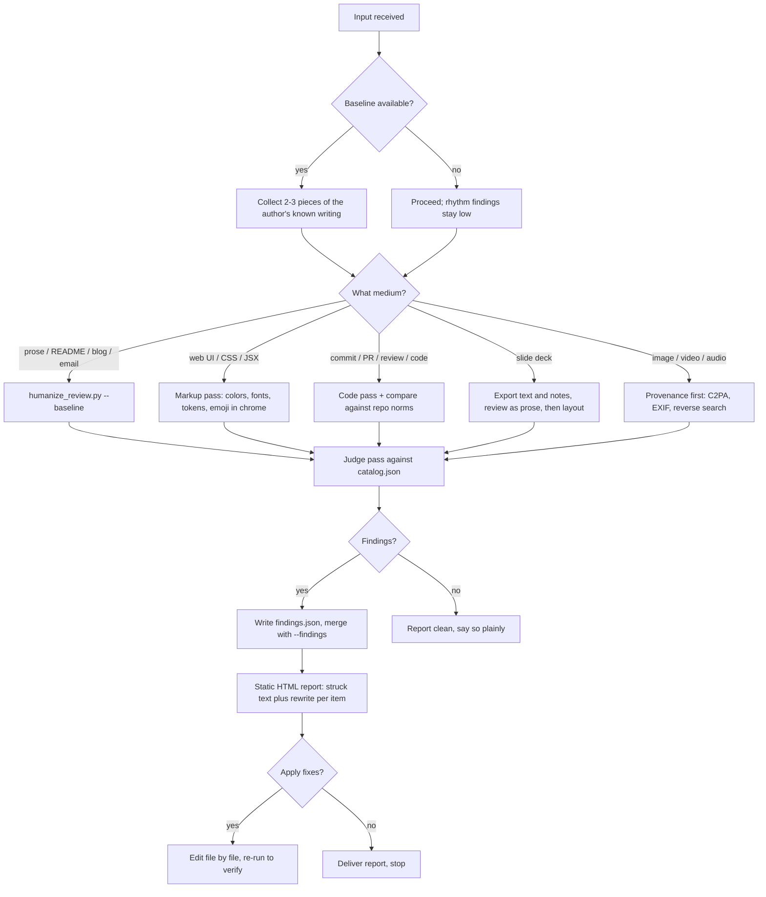

# Make Copy and Media Human

Strip the machine accent from anything outward-facing. This skill catalogs the
tells per model dialect and per medium, detects them in two layers, strikes them,
and hands you a line-item fix plan as one self-contained HTML file.

## Read this first

You are going to find things. Before you act on them, understand what a finding
means, because the evidence here is uncomfortable and the skill is built around
it.

AI-text detectors are biased toward calling things human. They miss most machine
output, and the things they do catch skew heavily toward unusual people: seven
commercial detectors produced a mean 61.3% false-positive rate on essays by
non-native English speakers, and 19% of those essays were flagged unanimously by
all seven. So when a signal fires here, it is more likely to be a second-language
writer, an autistic writer, or someone who simply loves dashes than a caught
machine.

That is why this skill edits and never accuses. Every fix in the catalog makes
writing better whether a person or a model produced it, which means you never
have to answer the authorship question to do the work. If someone asks you to
determine whether a colleague or a student used AI, decline and offer to edit the
text instead. `references/fairness-and-false-positives.md` has the full argument
and the citations, and you should read it before your first review.

## Three laws

**No topical keyword lists.** Phrase-level tropes get judged by you against a
rubric, never by substring matching over free text. Three narrow exceptions are
allowed because they are not about topic or taste. The first is a closed set of
<!-- humanize:ignore-start -->machine artifacts that have no human source, such
as `oaicite` tokens or a `utm_source=chatgpt.com` parameter.<!-- humanize:ignore-end --> The second is closed sets of grammatical
forms measured as a rate, like sentence-final participles or nominalization
suffixes, which carry published effect sizes. The third is the era-versioned
excess-vocabulary marker list, reported as density against a baseline and always
labelled with its era. Everything else belongs to the judge pass.

**Judge the delta, not the absolute.** This is the law that makes the skill fair
and also makes it work. Rhythm signals such as em-dash rate, comma rate,
contraction rate and sentence-length variance are fluency proxies, and they
overlap badly between people and models. Melville runs more em dashes than
GPT-4-class output does. Llama runs none at all. One anti-slop linter measured
its em-dash rule warning on roughly 64% of legitimate technical blog posts before
recalibration. So pass `--baseline` with a few pieces of the author's own prior
writing whenever you can get it. Without a baseline the script caps that whole
family at low severity, on purpose.

**The output has to pass its own review.** The report uses Georgia and Menlo, an
oxide-red accent, nothing under 14px, no emoji, no indigo. Every file in this
bundle is checked by `scripts/humanize_review.py` and the checked-in state is
clean. If this skill's own artifacts looked generated, nothing it says would
land.

## The five families

Findings carry a `family`, and the family tells you how much to trust the
finding. This matters more than severity.

`residue` covers machine artifacts with essentially no human source: invisible
codepoints such as U+202F, vendor citation tokens, chat tracking parameters,
leaked assistant boilerplate. Act on these with full confidence. They tell you
text passed through a chat window, which is not the same as telling you nobody
thought about it.

`form` covers grammatical patterns with measured effect sizes, like participial
tails at 5.3 times the human rate or nominalizations at roughly twice. Humans do
these too, so read the `false_positive_when` line before you cut.

`rhythm` covers punctuation and sentence-length habits. Weak on their own, real
against a baseline. This is where false accusations come from.

`shape` covers document assembly: heading density, bullet colonization, rules
between every section, the obligatory future-directions block. Usually safe to
act on, because the fix improves the document regardless.

`code` covers engineering artifacts. The highest-precision checks here are all
relative, comparing a change against the repo's own log, idiom, and PR norms.
A contributor who read the surrounding code passes them automatically.

One more class sits outside the families and outranks all of them. Citation
pathology is about truth rather than authorship: a dead DOI, a reference that
does not support its sentence, a statistic with no study behind it. Check those
with complete confidence, because you are verifying a claim rather than inferring
an author. It is the highest-yield check in the skill and it has no fairness cost.

## Decision tree



## Process

### Scope the input and find a baseline

Identify the medium and the stakes. A tweet gets the judge pass only; a marketing
site gets both layers plus a render check. Then go looking for the author's own
earlier work, because it turns the weakest half of the catalog into the strongest.
Two or three published pieces are enough. For a repo, the baseline is the repo:
read `git log --oneline -30` and three recently merged PRs before you judge a
commit or a description.

For decks, dump the text and speaker notes first with python-pptx, review that as
prose, then review the visual idiom separately.

### Run the structural layer

```bash
python3 scripts/humanize_review.py FILE... --baseline 'posts/*.md' \
    --out report.html --json structural.json
```

It measures countable things only: densities, variances, ratios, codepoints, hex
values, font names, identifier overlap. Thresholds come from
`references/catalog.json`, so the rubric and the code cannot drift apart. Run
`--validate` if you ever doubt that they agree.

### Run the judge pass

Read `references/catalog.json`. For every item whose `detection_type` is
`llm-judge`, ask its rubric question of the text. For every item whose
`detection_type` is `structural` but which the script does not implement, ask it
yourself; the script covers the countable subset, not all of them.

Read as a hostile editor with taste, not as a checklist executor. Then do one
free-form pass asking what else smells generated, because the catalog is a floor
rather than a ceiling.

Write findings to JSON matching `templates/output-template.md`. Each one needs a
file, a line, an excerpt, an ism that exists in the catalog, a dialect, a
severity, an explanation, and a rewrite. A high-severity finding without a
rewrite is a complaint, not a fix.

### Merge, render, fix, re-run

```bash
python3 scripts/humanize_review.py FILE... --findings judge.json --out report.html
```

Work `templates/rewrite-checklist.md` top-down, highest severity first. Then run
both layers again. Use `--fail-on high` if you want this in CI. Never call
something clean without the re-run.

### Maintaining the catalog

`references/catalog.json` is the source of truth for rubrics, thresholds, false
positives, and currency. Edit it, then run
`python3 scripts/regenerate_references.py`, which rebuilds every per-dialect
markdown view and refuses to write if any item would land in no file. The
markdown files are generated, so do not hand-edit them.

Every item carries a `currency` field, because tells decay. Vendors patch the
famous ones: one provider's em-dash rate fell from 10.62 per thousand words to
0.29 across model generations. Items marked `obsolete` stay in the catalog as
cautions rather than tests. The entry on mangled hands in generated images is
already one of them.

## The references

| Reference | Load when |
|---|---|
| `references/fairness-and-false-positives.md` | Before your first review, and any time someone asks you to judge authorship |
| `references/catalog.json` | Always, at judge-pass time; the machine-readable rubric with thresholds and false positives |
| `references/claudeisms.md` | Text suspected from Claude: staccato, dashes, negation frames, escalating compliments |
| `references/gptisms-codexisms.md` | READMEs, code comments, service-voice copy, emoji headers |
| `references/other-model-dialects.md` | Gemini caveat stacks, DeepSeek and Qwen register, Grok voice, register leveling |
| `references/visual-design-tells.md` | Web UI, landing pages, slide visuals, generated imagery, video, audio |
| `references/structure-and-deck-tells.md` | Long docs, decks, marketing pages, social posts, email |
| `references/engineering-artifact-tells.md` | Commits, PRs, code review, tests, docs, source files |
| `references/sources.md` | When you need citations |
| `templates/output-template.md` | Drafting a judge-pass finding or the delivery summary |
| `agents/openai.yaml` | Delegating a review to a subagent |

## Shibboleths

The rate is the crime, never the glyph. Human essayists use em dashes, and some
use more than the models do. Count, compare against the author, and only then cut.

A quote nobody said is not a pull quote. A real pull quote excerpts the document
in front of you. An italicized aphorism from nowhere is manufactured gravitas, so
attribute it or kill it.

Inter at 400 weight on indigo buttons means nobody made a decision. The tell is
not the font or the hex on its own; it is that they turn up together with
rounded corners and a gradient headline. Defaults cluster.

Codex narrates and engineers annotate. A comment reading "increment the counter"
above `count++` is generated. A human comment states the constraint the code
cannot: "TAO writes dogpile above 50qps, so batch."

Perfect parallelism is a tell rather than a virtue. Twelve bullets of identical
grammatical shape and length were generated. People drift.

The fix for staccato is fewer sentences, not longer ones. Merge the fragments
back into the thought somebody chopped them out of.

The participial tail is the highest-signal grammatical tell there is. When a
finished sentence grows a clause that says why it matters, delete the clause or
promote it to a real sentence with a checkable claim.

Absence is evidence too. Copy with no proper nouns, no numbers and no dates is
confident about nothing, and that is a harder problem than any phrase in the
catalog.

## Dos and don'ts

Do quantify before you flag rhythm, and get a baseline whenever you can. Do
preserve meaning exactly when you rewrite, since you are removing an accent
rather than content. Do read two or three adjacent published pieces to learn the
property's voice first. Do run this pipeline over your own draft before you
deliver it. Do say "clean" when it is clean, because a zero-finding report is a
real result.

Don't paraphrase-launder. Running text through one more model adds a second
accent on top of the first, and the fixes have to be surgical instead: edit the
flagged span and leave the rest byte-identical.

Don't build keyword lists to catch phrases. Don't strip personality along with
tropes, since contractions, opinions and irregularity are the goal rather than
the casualties. Don't treat low-severity items as a to-do list; they are taste
calls the author gets to keep. Don't add findings as comments in the source file,
because the HTML report is the deliverable.

Don't strip an agent attribution trailer without checking the repo first. Roughly
forty projects in the public contribution-policy survey require disclosure, so
removing an honest one can violate policy. Detect it and ask.

## Failure modes

**Paraphrase laundering.** You spot it when the fixed text has new tropes the
original lacked. Rewrites should touch only the flagged span.

**Voice flattening.** The post-fix text is clean but beige, because the author's
tics went out with the machine's. Diff against their known-human writing and put
the fingerprints back. A baseline run makes this visible instead of a matter of
taste.

**Checklist myopia.** The judge pass returns only catalog items and no novel
observations. The free-form pass is not optional.

**Flagging quoted evidence.** A document that demonstrates AI-isms will flag the
AI-isms it demonstrates. Wrap those regions in `<!-- humanize:ignore-start -->`
and `<!-- humanize:ignore-end -->`, which is what this bundle's own examples do.

**Stale advice.** Acting on an `obsolete` catalog item produces confident wrong
answers. Check the currency line, especially on image forensics, where hands and
garbled text stopped working as tests around 2025. Lead with provenance instead.

**Forensics drift.** Someone asks whether a student or employee used AI, and the
skill answers. It is out of scope. Detection-for-accusation has miserable
false-positive economics, and the fairness reference exists so you can say why.

Worked examples live alongside those: `examples/before-after-prose.md` is a
launch announcement in machine accent and then edited,
`examples/before-after-landing-page.md` walks the v0 look token by token, and
`examples/sample-report.html` shows what a finished fix plan looks like.

<!-- humanize:ignore-start -->
<!-- BEGIN BUNDLE INDEX (auto: index_references.py) -->

## Skill Bundle Index

*Every file in this skill, and when to open it. Auto-generated; run `scripts/index_references.py --fix`.*

**root**
- [`CHANGELOG.md`](CHANGELOG.md) — Changelog — Upgraded to the port-daddy agentic-family bundle standard.
- [`README.md`](README.md) — Make Copy and Media Human — Strip the machine accent from copy, web UI, slides, READMEs, marketing pages, and generated imagery before anything outward-facing ships.

**`agents/`**
- [`agents/openai.yaml`](agents/openai.yaml) — openai (data/schema)

**`examples/`**
- [`examples/before-after-landing-page.md`](examples/before-after-landing-page.md) — Before / After — Landing Page (the v0 look, token by token) — | Token | Ism | Severity | |---|---|---| | `Inter` (Google Fonts) | ai-default-typeface | high | | `#6366f1`, `from-indigo-500 to-violet-500
- [`examples/before-after-prose.md`](examples/before-after-prose.md) — Before / After — Launch Announcement — The same announcement, machine accent vs.
- [`examples/sample-report.html`](examples/sample-report.html)

**`references/`**
- [`references/catalog.json`](references/catalog.json) — catalog (data/schema)
- [`references/claudeisms.md`](references/claudeisms.md) — Claudeisms — and the generic prose tells Claude amplifies — Tells most associated with Claude-family output, plus the cross-model prose tells that show up strongest in Claude registers.
- [`references/gptisms-codexisms.md`](references/gptisms-codexisms.md) — GPT-isms and Codexisms — ChatGPT's service voice and README register, and the code-comment tells of Codex/Copilot-shaped generation.
- [`references/other-model-dialects.md`](references/other-model-dialects.md) — Other model dialects — Gemini, Kimi, DeepSeek, Qwen, Llama, Grok — and cross-model translationese — Distinctive tics per model family, plus the affect-flatness tells that mark any machine register.
- [`references/sources.md`](references/sources.md) — Sources — Published catalogs, stylometry research, and essays the catalog draws on.
- [`references/structure-and-deck-tells.md`](references/structure-and-deck-tells.md) — Structure, deck, and marketing-copy tells — Document-shape tells: how generated long-form docs, slides, posts, and emails are assembled, independent of any sentence.
- [`references/visual-design-tells.md`](references/visual-design-tells.md) — Visual design tells — the v0/Lovable look and AI imagery — What makes a UI, slide, or image read as generated: the defaults nobody chose, clustering together.

**`scripts/`**
- [`scripts/humanize_review.py`](scripts/humanize_review.py) — humanize_review.py — flag AI-isms in copy/media and emit a static HTML fix plan.
- [`scripts/regenerate_references.py`](scripts/regenerate_references.py) — Regenerate references/*.md from references/catalog.json. Stdlib only.

**`templates/`**
- [`templates/output-template.md`](templates/output-template.md) — Judge-Pass Finding + Delivery Template — Fill this in during step 3 (judge pass) and step 4 (delivery) of the process in `SKILL.md`.
- [`templates/rewrite-checklist.md`](templates/rewrite-checklist.md) — Rewrite Checklist — run after every humanizing pass — Work the report top-down (high severity first), then verify: - [ ] Every fix touched only the flagged span; surrounding text is byte-identic

<!-- END BUNDLE INDEX -->
<!-- humanize:ignore-end -->
