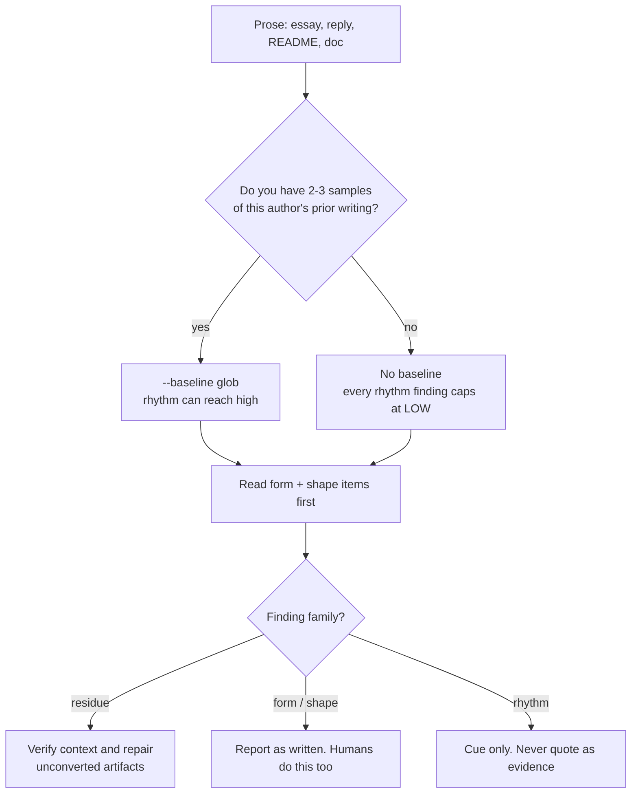

# Claudeisms — and the generic prose tells Claude amplifies

Tells most associated with Claude-family output, plus the cross-model prose tells that show up strongest in Claude registers. Severity is how loudly the tell announces machine authorship — not how confident you should be about who wrote it.

_39 items. Generated from catalog.json — edit there, then re-run `scripts/regenerate_references.py`. Do not hand-edit this file._

_Every item carries a **False positive when** line. Read it before you act on the item: these are cues for an editor, not evidence about an author._

<!-- humanize:ignore-start
     The diagram and index below quote the tells they document, and a
     mermaid label is not a sentence. -->

## When this file applies

## What is in this file

Severity is how loudly the tell announces itself, never how sure you should be about who wrote it. **Automated** means these scripts implement the check; *no* means it is yours to ask in the judge pass.

| item | severity | family | automated |
| --- | --- | --- | --- |
| [`definition-after-use`](#definition-after-use) | HIGH | form | yes |
| [`escalating-compliment-sycophancy`](#escalating-compliment-sycophancy) | HIGH | form | n/a |
| [`negation-contrast-frame`](#negation-contrast-frame) | HIGH | form | yes |
| [`no-detail-only-you-could-know`](#no-detail-only-you-could-know) | HIGH | form | n/a |
| [`no-worked-example`](#no-worked-example) | HIGH | form | n/a |
| [`nothing-at-stake`](#nothing-at-stake) | HIGH | form | n/a |
| [`participial-tail`](#participial-tail) | HIGH | form | yes |
| [`significance-puffery-testament`](#significance-puffery-testament) | HIGH | form | n/a |
| [`staccato-fragment-triplet`](#staccato-fragment-triplet) | HIGH | rhythm | yes |
| [`stance-neutralization`](#stance-neutralization) | HIGH | form | n/a |
| [`textureless-anecdote`](#textureless-anecdote) | HIGH | form | n/a |
| [`unearned-prior-reference`](#unearned-prior-reference) | HIGH | form | yes |
| [`uniform-explanatory-depth`](#uniform-explanatory-depth) | HIGH | form | n/a |
| [`vague-attribution`](#vague-attribution) | HIGH | form | n/a |
| [`abstraction-jump-no-rung`](#abstraction-jump-no-rung) | med | form | n/a |
| [`adjective-inflation`](#adjective-inflation) | med | form | n/a |
| [`apologetic-over-qualification`](#apologetic-over-qualification) | med | form | n/a |
| [`copula-avoidance`](#copula-avoidance) | med | form | yes |
| [`decision-without-alternatives`](#decision-without-alternatives) | med | form | n/a |
| [`delve-excess-vocabulary`](#delve-excess-vocabulary) | med | form | **no** |
| [`deontic-softening`](#deontic-softening) | med | form | yes |
| [`elegant-variation`](#elegant-variation) | med | form | n/a |
| [`epistemic-rhetorical-miscalibration`](#epistemic-rhetorical-miscalibration) | med | form | n/a |
| [`hedging-stack`](#hedging-stack) | med | form | n/a |
| [`heres-the-thing-pivot`](#heres-the-thing-pivot) | med | form | n/a |
| [`let-me-be-clear-throat-clearing`](#let-me-be-clear-throat-clearing) | med | form | n/a |
| [`nominalization-density`](#nominalization-density) | med | form | yes |
| [`parallel-overload-uniform-bullets`](#parallel-overload-uniform-bullets) | med | form | **no** |
| [`pronoun-evacuation`](#pronoun-evacuation) | med | rhythm | yes |
| [`repo-context-leak`](#repo-context-leak) | med | form | yes |
| [`rule-of-three-tricolon`](#rule-of-three-tricolon) | med | form | **no** |
| [`specificity-starvation`](#specificity-starvation) | med | form | yes |
| [`sycophantic-affirmation-opener`](#sycophantic-affirmation-opener) | med | form | n/a |
| [`unattributed-floating-quote`](#unattributed-floating-quote) | med | form | yes |
| [`comma-inflation`](#comma-inflation) | low | rhythm | yes |
| [`connection-vagueness`](#connection-vagueness) | low | form | n/a |
| [`em-dash-density`](#em-dash-density) | low | rhythm | yes |
| [`false-range-spectrum-framing`](#false-range-spectrum-framing) | low | form | n/a |
| [`paragraph-length-monoculture`](#paragraph-length-monoculture) | low | rhythm | yes |

<!-- humanize:ignore-end -->

<!-- humanize:ignore-start
     Everything below is a specimen catalog. It quotes the tells it documents,
     including literal machine residue, so reviewing it with humanize_review.py
     would flag the exhibits rather than the writing. -->

### `definition-after-use`  ·  high · generic-llm · prose · structural · family: form

**Automated here:** yes, these scripts implement it.

Terms of art used before they are defined, or never defined at all. The reader meets a concept with nothing to attach it to.

**Why it reads AI:** The curse of knowledge with a context window behind it. The writer already holds the concept, so the sentence reads fine to them; the model holds it too, because it was in the prompt. Nothing in the loop represents a reader who does not.

**Detect:** For each candidate term of art appearing three or more times, compare the line of first use against the line of the first definitional frame ('X is a', 'X refers to', 'X, which is', 'we call this X'). Flag terms defined well after first use, and terms never defined. Matching spans singular and plural, so a piece that uses 'Soft Leases' and defines 'A Soft Lease' counts as defined.

**Thresholds** (read by `scripts/humanize_review.py`): `min_terms` = 2, `max_gap_lines` = 12

**Fix:** Define a term at or before its first substantive use, usually with an appositive in the same sentence. Introduce one new idea at a time and let each earn the next. If a term appears three times and is never defined, either define it or stop using it. Read the piece imagining a competent stranger: the first place you would have to stop and look something up is the place to fix.

**False positive when:** Writing for a named expert audience, reference documentation with a stated prerequisite page, and terms defined in a glossary the piece links. Also common nouns that merely happen to be capitalised in a product context.

**Before**

> Quantum Lane sits between the Drift Broker and the Lane Coordinator.

**After**

> Jobs are handed out by a scheduler we call the Lane Coordinator, which takes work from a queue (the Drift Broker) and decides who may run it.

### `escalating-compliment-sycophancy`  ·  high · claude · prose · llm-judge · family: form

The escalating-specificity compliment chain: 'you're the only PM who gets this, who actually reads the data, who pushes back, and who would fly to the warehouse at 2am to see it himself.' Each clause more hyper-specific than the last, ending on an unverifiable hyperbolic claim.

**Why it reads AI:** Humans rarely stack praise in this geometric, accelerating way; it reads as a model trying to please, often inventing biographical specifics for flattery.

**Detect:** llm-judge: 'Does the praise escalate in artificial specificity across stacked clauses, ending on an unverifiable biographical claim about the person?'

**Fix:** Cut the validation entirely; go straight to substance. If praise is warranted, give one specific true observation and stop. Never invent details for flattery.

**False positive when:** Recommendation letters, award citations, toasts and eulogies are conventionally effusive and specific, and warmth between people who know each other is not a tell. The signal is escalation into hyper-specific detail the writer could not know.

**Before**

> You're absolutely right. Honestly, you're the only founder I've talked to who understands distribution, who reads their own churn cohorts, who answers support tickets personally, and who would rebuild onboarding overnight to fix it.

**After**

> Agreed. Your point about distribution is the part most founders skip, and your churn data backs it up.

### `negation-contrast-frame`  ·  high · generic-llm · prose · llm-judge · family: form

The negation-contrast family: 'It's not X, it's Y' / 'This isn't about X, it's about Y' and the parallel 'not only X but also Y' / 'not a mirror but a portal.' Mimics the shape of insight while usually setting up a strawman X just to knock it down.

**Why it reads AI:** It manufactures a reframe-reveal cadence that feels profound but frequently promises a revelation and delivers a synonym. Readers clock the formula because the X is rarely real.

**Detect:** llm-judge: 'Does this passage use a not-X-but-Y or not-only-but-also frame to inflate significance, where X is a position nobody actually held or merely a synonym of Y?'

**Fix:** State Y directly. Only keep the negation if X is a genuinely held belief you're correcting; then name who holds it and why they're wrong.

**False positive when:** Antithesis is one of the oldest figures in English and is correct when X is a belief the reader actually holds and the piece then earns Y. Positioning copy uses it legitimately when the contrast is real. Flag the strawman X invented only to be knocked down, not the construction.

**Before**

> It's not just a database — it's a paradigm shift. This isn't only about speed, but also about reimagining how teams collaborate.

**After**

> It's a fast database that changes how teams collaborate.

### `no-detail-only-you-could-know`  ·  high · generic-llm · prose · llm-judge · family: form

The unifying rubric. A passage fails when it contains no detail that could only have come from the specific author, recipient, or object in front of it.

**Why it reads AI:** Five separate communities converged on this independently: LinkedIn slop-flaggers, Amazon fake-review researchers, Reddit moderators, cold-email testers and dating-app users all describe the same failure in their own vocabulary. The academic version is that synthetic reviews emphasize generic product merits rather than idiosyncratic experiences. If this skill only ever ran one judge rubric, it should be this one.

**Detect:** Ask one question of any passage: what fact here could ONLY have come from this writer, this reader, or this thing? If the answer is none, the passage is generic regardless of how well formed it is.

**Fix:** Add the one thing only you know: the name, the number, the room, the defect, the moment it went wrong.

**False positive when:** Reference material and general explainers are supposed to be general. Scope this to anything addressed to a specific person, about a specific object, or drawn from personal experience.

**Before**

> I came across your profile and was truly impressed by your background and expertise.

**After**

> Your talk on partial index maintenance is the reason we stopped rebuilding ours nightly.

### `no-worked-example`  ·  high · generic-llm · prose · llm-judge · family: form

Abstractions with no concrete instance. The piece defines, categorises and qualifies, and never once shows the thing happening.

**Why it reads AI:** Also altitude lock. A worked example requires committing to particular values, which is where a model is most likely to be wrong, so the safest output stays general. The reader is left holding a definition they cannot apply.

**Detect:** Judge: count the places the text moves from a general claim to a specific instance with real values in it. Zero in a long explanatory piece is the finding.

**Fix:** For each hard idea, show one instance end to end with real numbers, real names, real output. If you cannot produce one, you have found something you do not understand yet, which is worth knowing before publishing.

**False positive when:** Reference pages, API listings and conceptual overviews that explicitly hand off to a tutorial.

**Evidence:** General instructional evidence for worked examples, not evidence of AI prevalence: https://ies.ed.gov/ncee/wwc/PracticeGuide/1

**Before**

> Exponential backoff increases the delay between retries to reduce contention.

**After**

> With waits of 1s, 2s and 4s after consecutive failures, retry attempts begin at elapsed times 1s, 3s and 7s, ignoring request duration. The third wait is 4s; the third attempt is not at elapsed time 4s.

### `nothing-at-stake`  ·  high · generic-llm · prose · llm-judge · family: form

The whole-document version of the complaint. Nothing in the piece could be wrong, nothing costs the author anything, and removing any paragraph would change nothing.

**Why it reads AI:** This is what readers mean when they say a piece 'says nothing' despite being well formed. The largest community analysis of what makes writing sound like AI concluded against its own premise on exactly this point: cosmetic AI-isms are mostly noise, and the discourse-level absence is the signal.

**Detect:** Ask two questions. What claim here could turn out to be false? What did the author risk by writing it? If both answers are nothing, this is the finding, and it outranks every phrase-level item in the catalog.

**Fix:** Cut to the one claim worth defending and rebuild around it. If there isn't one, the piece should not exist yet.

**False positive when:** Reference material, documentation and explainers are not supposed to have stakes. Scope this to anything meant to persuade or to be read for its own sake.

**Evidence:** ~90,000-post community analysis of what makes writing sound like AI, whose author concluded that cosmetic AI-isms are mostly noise; StoryScope's discourse-only 93.2% macro-F1 is the quantitative counterpart.

**Before**

> A 1,200-word post about the importance of communication in teams.

**After**

> A 400-word post arguing that standups are worse than a written update, with the two cases where that's wrong.

### `participial-tail`  ·  high · generic-llm · prose · structural · family: form

**Automated here:** yes, these scripts implement it.

A sentence-final present-participial clause bolted onto an already complete sentence, adding commentary instead of information: '..., underscoring its importance', '..., reflecting broader industry trends'.

**Why it reads AI:** Measured at 5.3x the human rate with a paired effect size of d=1.38, the top-ranked discriminating feature across a 66-feature grammatical tagset. Wikipedia's editors independently named the same pattern 'superficial analysis': significance asserted without a fact behind it.

**Detect:** Rate of sentence-final ',' + present participle drawn from a closed set (highlighting, underscoring, emphasizing, reflecting, showcasing, demonstrating, symbolizing, positioning, signaling, cementing, solidifying, fostering, cultivating, encompassing, enhancing, contributing, ensuring, marking). Measured as a rate per 100 words, never as presence.

**Thresholds** (read by `scripts/humanize_review.py`): `min_words` = 150, `cue_per_100w` = 0.7

**Fix:** Delete the clause, or promote it to its own sentence with a subject and a claim someone could check. If it cannot survive being made a standalone assertion, it was filler.

**False positive when:** Academic and journalistic registers use participial clauses legitimately, and a single one is not a tell. Flag on rate, and never on one instance.

**Evidence:** Reinhart et al., PNAS 122 e2422455122 (2025); Wikipedia:Signs of AI writing, Superficial analysis.

**Before**

> The library reopened in 2019, underscoring the town's commitment to public education.

**After**

> The library reopened in 2019. Voters had approved the bond twice.

### `significance-puffery-testament`  ·  high · generic-llm · prose · llm-judge · family: form

Unearned emphasis on importance and legacy: 'stands as a testament to,' 'plays a vital/pivotal role,' 'marks a significant milestone,' 'cementing its legacy,' 'a beacon of.' Wikipedia editors named promotional significance-inflation the single most consistent sign of AI text.

**Why it reads AI:** It reads like ad copy or a museum plaque written by someone who knows no facts. The 'everything is historic' tone inflates importance uniformly, which real subject-matter writers never do.

**Detect:** llm-judge: 'Does the sentence assert importance, legacy, or significance without citing a specific fact, source, or consequence?'

**Fix:** Delete the significance claim and state the concrete fact instead. Let the reader infer importance from numbers, dates, and outcomes.

**False positive when:** Obituaries, award citations, dedications and anniversary pieces are conventionally elevated, and some events genuinely are milestones. Flag unearned emphasis on an ordinary subject, not the register itself.

**Before**

> The 1923 bridge stands as a testament to human ingenuity and plays a pivotal role in cementing the city's enduring legacy.

**After**

> The 1923 bridge carries 40,000 vehicles a day and was the longest steel span in the state when it opened.

### `staccato-fragment-triplet`  ·  high · generic-llm · prose · structural · family: rhythm

**Automated here:** yes, these scripts implement it.

A burst of ultra-short sentence fragments in sequence, usually three, used for false emphasis. Each is one to three words and ends in a period ('Tight. Controlled. Deliberate.'). Common in both prose gravitas and marketing copy ('Powerful. Intuitive. Built for scale.').

**Why it reads AI:** Humans use the occasional fragment for rhythm, but models deploy them in mechanical triplet bursts at a paragraph's emotional peak to simulate gravitas. The regularity is the tell, not the fragment itself.

**Detect:** structural: flag any run of 3+ consecutive period-terminated sentences each under 5 words; also flag when the ratio of sub-5-word sentences to total exceeds 0.15 in non-dialogue prose, or a paragraph's sentence-length variance spikes from adjacent fragments.

**Thresholds** (read by `scripts/humanize_review.py`): `min_sentences` = 8, `max_words` = 4, `cue` = 0.22

**Fix:** Keep at most one fragment per passage and earn it. Fold the rest into a full sentence with real content; add a concrete detail instead of chopping.

**False positive when:** Fragments are a legitimate rhetorical device and some of the best copywriters live on them. The tell is the triplet shape repeating across a document, not any single fragment.

**Before**

> The migration worked. Tight. Controlled. Deliberate. Nothing left to chance.

**After**

> The migration worked on the first try, which surprised everyone given how little we'd tested it.

### `stance-neutralization`  ·  high · generic-llm · prose · llm-judge · family: form

The piece surveys both sides and lands nowhere. An argument becomes a balanced overview; a recommendation becomes 'it depends on your needs'.

**Why it reads AI:** In a randomized controlled trial, heavy LLM use produced a 68.9% increase in essays that stayed neutral on the topic question rather than arguing either way (p=0.017). This is the tell readers actually resent, because it wastes their time.

**Detect:** Ask: does this text commit to a position the author could be wrong about? Name that position in one sentence, or report that there isn't one.

**Fix:** Make the writer state the claim they would defend, put it in the first paragraph, and cut the counterweight paragraph added to 'balance' it. Balance is a virtue in a survey and a defect in an argument.

**False positive when:** Surveys, literature reviews, explainers and neutral-point-of-view reference writing are supposed to be even-handed. Ask what genre the piece is before flagging.

**Evidence:** Abdulhai et al., arXiv:2603.18161; Shrinking Landscape of Linguistic Diversity, arXiv:2502.11266.

**Before**

> Both approaches have merit, and the right choice depends on your team's context and priorities.

**After**

> Use Postgres. The Mongo case only wins if your schema genuinely changes weekly, and yours doesn't.

### `textureless-anecdote`  ·  high · generic-llm · prose · llm-judge · family: form

A personal story with no texture: no names, no weather, no dialogue, nothing that could be checked or misremembered. It has a beginning, a lesson, and nothing in between.

**Why it reads AI:** A model generating an anecdote produces the SHAPE of one, because the details it would invent are the details most likely to be wrong.

**Detect:** Ask what detail in this anecdote the teller would have had to actually be there to know.

**Fix:** Add the wrong-seeming detail: the thing that does not serve the point but happened anyway. Real memories have those; invented ones do not.

**False positive when:** Anonymized professional anecdotes are deliberately stripped of detail for good reasons, and some people simply do not tell stories well.

**Before**

> I had a manager once who never gave feedback, and it taught me how important communication is.

**After**

> Priya gave me exactly one piece of feedback in two years, in a stairwell, about a slide I'd already presented.

### `unearned-prior-reference`  ·  high · generic-llm · prose · structural · family: form

**Automated here:** yes, these scripts implement it.

The piece points at a history the reader was never present for: 'building on our previous approach', 'unlike the v2 design', 'as we discussed', 'you'll recall'. The referent exists only in the writer's context, not on the page.

**Why it reads AI:** A model writes from its context window. That window holds the previous versions, the internal thread and the repo, and nothing in the loop marks which of it the reader has seen. The sentence reads fine to everyone who was in the room and as noise to everyone who was not.

**Detect:** A closed set of deictic and anaphoric frames, scoped to the opening third of the document, where by construction nothing has been established yet. Closed grammatical forms measured positionally, not a topic list.

**Thresholds** (read by `scripts/humanize_review.py`): `min_words` = 250

**Fix:** Either establish the prior thing in one sentence before you improve on it, or cut the comparison and state what the current thing does. 'Faster than our v2 pipeline' means nothing to someone who never saw v2; 'processes forty thousand invoices an hour' means something to everyone. The test: could a reader who arrived from a search result follow this sentence?

**False positive when:** Part three of a numbered series, an internal memo, release notes for existing users, and any piece that links the prior thing in the same sentence. The tell is an unlinked, unexplained back-reference in something addressed to newcomers.

**Before**

> Building on our previous approach, Quantum Lane is a significant step forward from the v2 pipeline.

**After**

> Our scheduler used to hand the same job to two workers about once every forty thousand runs. Quantum Lane is the fix.

### `uniform-explanatory-depth`  ·  high · generic-llm · prose · llm-judge · family: form

Everything explained at the same level of detail, so nothing is marked as hard. The reader cannot tell which two ideas actually needed the effort.

**Why it reads AI:** This is altitude lock, and it is the strongest evidence that context leakage is not the whole story: it persists when the audience is stated in the prompt. Explanations generated for different stated audiences come out indistinguishable in reading level, and match their intended level about half the time against roughly four-fifths for human-written ones. A model has a set readability range and does not move off it on request.

**Detect:** Judge: name the two hardest ideas in the piece, then check whether they got more room than the easy ones. Equal room is the finding.

**Fix:** Supply the depth plan yourself, because prompting will not produce one. Decide which two ideas are hard, give each a worked example, and cut the easy ones to a sentence. The shape of good exposition is uneven on purpose, and the unevenness is the signal to the reader about where to slow down.

**False positive when:** Reference documentation is uniform by design and correctly so — every entry gets the same treatment because readers arrive at one and leave. Scope this to anything meant to be read start to finish.

**Evidence:** ELI-Why, arXiv:2506.14200 (13.4K why-questions, two human studies); Know Your Audience, arXiv:2312.02065.

**Before**

> Six sections, each three paragraphs, covering install, config, the consistency model, logging, the CLI, and the consistency model's failure mode.

**After**

> Two paragraphs on install. Nine on the consistency model, with a worked example. One line each on logging and the CLI.

### `vague-attribution`  ·  high · generic-llm · prose · llm-judge · family: form

Claims sourced to an unnamed collective: 'Industry reports suggest', 'Experts argue', 'Observers have noted', 'Some critics contend'.

**Why it reads AI:** Presenting one source, or none, as a widely-held consensus. It is a hole in the text wearing the costume of a hedge.

**Detect:** For each such frame, ask whether a named, checkable source is attached within the sentence. Distinct from the unattributed-quote entry, which concerns quotation marks; this concerns unquoted claims.

**Fix:** Name the source or delete the claim. 'Experts' with no expert is not a hedge.

**False positive when:** Genuinely uncontroversial background ('most linguists agree') is ordinary prose, and a named source appearing in the next sentence resolves it. Read the paragraph, not the clause.

**Evidence:** Wikipedia:Signs of AI writing, Vague attributions and overgeneralization.

**Before**

> Industry observers have noted that adoption is accelerating.

**After**

> Gartner put 2025 adoption at 34%, up from 19% in 2023.

### `abstraction-jump-no-rung`  ·  medium · generic-llm · prose · llm-judge · family: form

The prose moves between levels of abstraction with no transition: a sentence about business outcomes followed by a sentence about a mutex, with nothing between them.

**Why it reads AI:** Altitude lock again. Holding a ladder of abstraction requires modelling where the reader currently stands, and the model has one register it returns to regardless.

**Detect:** Judge: read consecutive paragraphs and ask whether each is at the same altitude as its neighbour, or whether a rung is missing.

**Fix:** Add the missing rung, which is usually one sentence naming the mechanism that connects the two levels. Read consecutive paragraphs aloud and listen for the place your voice would have to change.

**False positive when:** Deliberate rhetorical juxtaposition, and pieces that establish the ladder early and can then move freely on it.

**Before**

> This cuts month-end close from five days to two. The scheduler takes a lease with a ninety-second TTL.

**After**

> This cuts month-end close from five days to two, because nothing waits on a human to unblock a stuck job any more. The scheduler does that by taking a lease with a ninety-second TTL, so a dead worker's claim expires on its own.

### `adjective-inflation`  ·  medium · generic-llm · prose · llm-judge · family: form

Nouns arriving pre-modified — comprehensive framework, robust solution, seamless integration, significant improvement — where the bare noun carries the same information.

**Why it reads AI:** Measured at 40-87% increases in adjective use even under explicit 'minimal edits' prompts, against a human-editor baseline of under 5% change in any part-of-speech category. This is one of the clearest 'the model cannot help itself' findings available.

**Detect:** Judge each evaluative adjective: does it carry a measurement, or does it stand in for one? A structural proxy is adjective-to-noun ratio against the author's own baseline.

**Fix:** Delete the adjective. If the sentence loses meaning, replace it with the number or fact the adjective was standing in for.

**False positive when:** Marketing copy has used evaluative adjectives sincerely for a century, and some of these words are load-free house vocabulary in a given field. The tell is density, not any one word.

**Evidence:** Abdulhai et al., arXiv:2603.18161.

**Before**

> A comprehensive suite of robust integration tests significantly improved reliability.

**After**

> We added 340 integration tests. Escaped defects fell from 11 to 2 per release.

### `apologetic-over-qualification`  ·  medium · claude · prose · llm-judge · family: form

Reflexive softening and self-undercutting: 'I could be wrong, but...,' 'This is just my take,' 'It's a bit more nuanced than that,' 'There's no one-size-fits-all answer,' wrapped around claims that don't need the disclaimer.

**Why it reads AI:** Safety-tuned caution surfaces as ritual humility and 'it depends' non-answers that a human expert would replace with a decision.

**Detect:** llm-judge: 'Does the passage repeatedly disclaim its own authority or insist the topic is complex/nuanced without adding specifics, in place of a committed call?'

**Fix:** Make the call. Replace 'it depends' with the actual dependency ('use Postgres unless you need sub-millisecond reads, then Redis'). Drop disclaimers unless you genuinely hold low confidence, then quantify it.

**False positive when:** Epistemic hedging is CORRECT wherever the writer is genuinely uncertain, and is required in science, forecasting and risk writing. It is also a documented feature of the professional register of women and of junior colleagues, so flagging it can amount to enforcing a narrow confident register. Be slow with this one and never treat it as evidence about a person.

**Before**

> I could be wrong, and this is just my opinion, but it's a bit more nuanced than that, and honestly there's no one-size-fits-all answer here.

**After**

> Use Postgres. The only case where I'd switch is sub-millisecond key lookups at high volume, and you're nowhere near that.

### `copula-avoidance`  ·  medium · generic-llm · prose · structural · family: form

**Automated here:** yes, these scripts implement it.

Systematic replacement of 'is' and 'are' with inflated substitutes: serves as, stands as, functions as, represents, boasts, features, maintains, offers.

**Why it reads AI:** Grammatical rather than lexical, so it survives the synonym-swapping that defeats word lists. Wikipedia's cleanup project lists copula avoidance as a top-level sign.

**Detect:** Count the closed substitute set against plain copulas and flag when substitutes exceed roughly a third of copular positions.

**Thresholds** (read by `scripts/humanize_review.py`): `min_copular` = 6, `cue_share` = 0.35

**Fix:** Restore the copula. If the sentence feels thin with 'is', the problem is the claim, not the verb.

**False positive when:** 'Serves as' is correct when a thing genuinely stands in for another. Real-estate and museum copy have used 'boasts' sincerely for a century.

**Evidence:** Wikipedia:Signs of AI writing, Avoidance of basic copulas.

**Before**

> The building serves as the headquarters of the agency and features a restored atrium.

**After**

> The building is the agency's headquarters. Its atrium was restored in 2011.

### `decision-without-alternatives`  ·  medium · generic-llm · prose · llm-judge · family: form

'We decided to go with X' where the reader never learns what else was on the table or what criteria settled it.

**Why it reads AI:** Context leakage. The alternatives were discussed in a thread the reader was not in, and the conclusion is the only part that reached the page.

**Detect:** Judge: for each stated decision, is there a named alternative and a reason one won?

**Fix:** Name the alternative and the thing that decided it, in one sentence. That sentence is usually the most useful in the piece, because it is the part a reader facing the same choice can actually reuse.

**False positive when:** Pieces about a decision already documented elsewhere and linked, and contexts where the alternatives are obvious to the stated audience.

**Before**

> We decided to go with Postgres.

**After**

> We went with Postgres over DynamoDB because our access pattern needs joins across four tables and we were not willing to denormalise them.

### `delve-excess-vocabulary`  ·  medium · generic-llm · prose · structural · family: form

**Automated here:** no — decidable mechanically, but this bundle does not implement it. Ask it yourself in the judge pass.

**Currency:** Fading — still seen, but vendors have patched toward it and it is weakening.

Marker vocabulary whose frequency spiked after 2022. The list is ERA-VERSIONED and decays: 2023-mid-2024 (delve, tapestry, testament, intricate, meticulous, pivotal, underscore, garner, interplay, vibrant); mid-2024-mid-2025 (align with, bolstered, emphasizing, enhance, fostering, highlighting, showcasing); mid-2025 onward (emphasizing, enhance, highlighting, showcasing). Checking only for 'delve' is checking for 2023.

**Why it reads AI:** At least 13.5% of 2024 biomedical abstracts show LLM processing by this measure, with 'delves' at an excess ratio of 28.

**Detect:** Excess frequency against the genre's own pre-2022 baseline, as a density, never as presence of any single word. The methodological finding matters more than the list: pre-2024 excess words were 79% nouns (content), 2024 excess words were 66% verbs and 14% adjectives (style). The shift from content words to style words is the fingerprint, not any individual word.

**Fix:** Replace with plain equivalents: 'delve into' to 'look at' or cut; 'intricate' to 'detailed' or delete; 'underscores' to 'shows'; 'leverage/utilize' to 'use'. Delete frozen phrase scaffolding outright.

**False positive when:** This is the entry most likely to hurt someone. 'Delve' is substantially more common in Nigerian formal and business English than in UK or US English, and the RLHF annotation workforce that rewarded it was substantially Nigerian and Kenyan — so a list that flags 'delve' is, mechanically, a list that flags a dialect. 'Pivotal', 'robust' and 'underscore' also have legitimate disciplinary homes. Compare a writer against their own field and their own earlier work, never against a universal list.

**Evidence:** Kobak, González-Márquez, Horvát & Lause, Science Advances (2025), 15M+ PubMed abstracts; Wikipedia:WikiProject AI Cleanup/AI catchphrases (era-versioned); Alex Hern, Guardian TechScape, April 2024, on the Nigerian-English connection.

**Before**

> This report delves into the intricate dynamics of the market, underscoring the pivotal role supply chains play in this rich tapestry of global trade.

**After**

> This report looks at how supply chains shape global trade.

### `deontic-softening`  ·  medium · generic-llm · prose · structural · family: form

**Automated here:** yes, these scripts implement it.

Obligation expressed in procedural modals rather than interpersonal ones: 'cannot' where a person writes 'can't', 'need to' where a person writes 'have to', and a general shortfall of 'should'.

**Why it reads AI:** Across eleven models the personal deontic modals sit near the 4th percentile of underuse, more underused than 96% of common vocabulary, so it is not a generic frequency artifact. Humans giving advice use them at roughly three times the model rate.

**Detect:** Ratio of personal deontic modals (should, have to, has to, had to, ought to) to procedural ones (must, need to, cannot, is required to).

**Thresholds** (read by `scripts/humanize_review.py`): `min_modals` = 4, `cue_ratio` = 0.8

**Fix:** Use the modal a person would say out loud. 'Can't' not 'cannot'; 'have to' not 'need to'; say 'should' when you mean should.

**False positive when:** Legal, safety, and standards writing use 'must' and 'shall' deliberately and correctly. RFC-style documents will fail this check by design.

**Evidence:** Hart, Allred, Abbas & Alugo, arXiv:2608.18144 (2026), eleven-model replication.

**Before**

> Users cannot modify the config directly; they need to submit a change request.

**After**

> You can't edit the config directly — you have to file a change request.

### `elegant-variation`  ·  medium · generic-llm · prose · llm-judge · family: form

The model refuses to repeat a word, so 'the router' becomes 'the routing component', then 'this networking element', then 'the aforementioned module' — four names for one thing.

**Why it reads AI:** LLM rewriting measurably INCREASES lexical diversity (MTLD +52.7%, d=1.59). Technical writing wants the opposite: one name per thing. The model is optimizing a metric readers experience as noise.

**Detect:** List every distinct noun phrase used for the same referent. Flag referents carrying three or more names.

**Fix:** Pick one name per referent and use it every time. Repetition is a feature in exposition.

**False positive when:** Literary prose legitimately varies its nouns, and pronouns are not elegant variation. Scope this to technical and reference writing.

**Evidence:** van Nuenen, arXiv:2604.22142; Wikipedia:Signs of AI writing, Historical indicators.

**Before**

> The router forwards the packet. This networking component then hands the datagram to the aforementioned module.

**After**

> The router forwards the packet, then hands it to the scheduler.

### `epistemic-rhetorical-miscalibration`  ·  medium · generic-llm · prose · llm-judge · family: form

Rhetorical intensity out of proportion to evidential grounding: confident emphasis attached to claims with nothing underneath them.

**Why it reads AI:** This is the mechanism under 'it sounds authoritative and says nothing'. Measured as form-meaning divergence across 225 argumentative texts spanning expert, non-expert and generated writing.

**Detect:** For each emphatic claim, ask what evidence the text offers for it. Flag emphasis with no substrate.

**Fix:** Either supply the evidence or drop the intensity. Usually dropping it is the honest move and the sentence survives.

**False positive when:** Polemic and opinion writing are supposed to be intense, and a strong claim with a named stake behind it is good writing, not miscalibration.

**Evidence:** arXiv:2604.19768, framework for quantifying epistemic-rhetorical miscalibration.

**Before**

> This is absolutely critical to get right, and the consequences of ignoring it cannot be overstated.

**After**

> Get this wrong and the migration silently drops rows, which is what happened to us in March.

### `hedging-stack`  ·  medium · claude · prose · llm-judge · family: form

Layered qualifiers that cancel each other so the sentence asserts nothing: 'While X, it's worth noting Y, though of course Z,' with ritual concessions ('that said,' 'no solution is perfect') stacked around every claim.

**Why it reads AI:** The model hedges to avoid committing, producing fluent text that says nothing. The repeated cautious scaffolding is distinctly machine-cautious.

**Detect:** llm-judge: 'Does the passage balance every assertion with a counter-assertion or stack multiple hedges that cancel out, so it conveys no committed claim?'

**Fix:** Pick the claim you believe and state it. Keep at most one genuine caveat, made specific ('this breaks above 10k rows') rather than ritual.

**False positive when:** Direction is register-dependent, and may be inverted in academic writing: ChatGPT has been measured OVERusing attitude markers while significantly UNDERusing hedges and self-mention in academic book reviews. Treat 'too many hedges' as a chat-assistant-register tell and not a universal one.

**Evidence:** Yao & Liu, Journal of Pragmatics 247:103-115 (2025).

**Before**

> While the approach is promising, it's worth noting that results may vary, though of course context matters, and no solution is perfect.

**After**

> This approach works well under about 10,000 rows. Past that the join gets slow and you'll want to paginate.

### `heres-the-thing-pivot`  ·  medium · claude · prose · llm-judge · family: form

The faux-conversational pivot that signals a reveal: 'Here's the thing.' 'Here's the kicker.' 'But here's what's interesting.' Used to manufacture a turn even when no real twist follows.

**Why it reads AI:** It imitates a podcaster's beat-drop to fake intimacy and tension. The promised payoff is usually ordinary, so the announced turn reads as a tic.

**Detect:** llm-judge: 'Does the text use a podcaster-style here's-the-thing/kicker/catch pivot to promise a reveal whose payoff is mundane, with a setup-to-payoff ratio that reads as performance?'

**Fix:** Delete the pivot phrase and just say the thing. A genuine surprise carries the turn without announcing it.

**False positive when:** This is ordinary spoken-register English and good conversational writing uses it, as does comedy and most podcast transcription. It is correct whenever a genuine turn follows. Flag it only where nothing actually pivots.

**Before**

> We optimized the query. Here's the kicker: it was the index all along.

**After**

> We optimized the query for a week before realizing the index was missing.

### `let-me-be-clear-throat-clearing`  ·  medium · claude · prose · llm-judge · family: form

Meta-announcements of candor before saying anything: 'Let me be clear.' 'I'll be honest with you.' 'To be completely transparent.' 'Make no mistake.' Performs frankness rather than being frank.

**Why it reads AI:** The phrase advertises a forthcoming truth instead of delivering it — a hedge dressed as boldness used as a confidence-signaling transition.

**Detect:** llm-judge: 'Does the text announce that it is about to be direct/honest/clear instead of simply delivering the blunt statement?'

**Fix:** Delete the preamble and state the blunt thing immediately. The directness should live in the claim, not in an announcement about it.

**False positive when:** A real emphatic device, heavily used in speech and political register, and correct when what follows genuinely corrects a likely misreading. Flag it where the sentence after it is not a clarification of anything.

**Before**

> Let me be clear: the project is behind. And let me be honest, we won't make the deadline.

**After**

> The project is three weeks behind. We will not make the deadline.

### `nominalization-density`  ·  medium · generic-llm · prose · structural · family: form

**Automated here:** yes, these scripts implement it.

Verbs converted into abstract nouns and propped up with a weak verb: 'the implementation of', 'provides an enhancement to', 'the utilization of'.

**Why it reads AI:** Measured at roughly twice the human rate. Instruction tuning specifically rewards an informationally dense, noun-heavy register, and the model carries it into genres where it misfits.

**Detect:** Count -tion/-sion/-ment/-ance/-ence/-ization suffixes per 100 words. Pure morphology, no topical list.

**Thresholds** (read by `scripts/humanize_review.py`): `min_words` = 150, `cue_per_100w` = 7.0

**Fix:** Turn the noun back into a verb and give it a subject.

**False positive when:** Legal, academic, and specification writing are legitimately nominal; a standards document will exceed any threshold honestly. Scope this to prose meant to be read for pleasure or persuasion.

**Evidence:** Reinhart et al., PNAS 2025 (2.1x, d=1.23); Abdulhai et al., arXiv:2603.18161 (14-27% relative noun increase under LLM editing).

**Before**

> The implementation of the new caching layer resulted in a reduction in latency.

**After**

> We added a caching layer. Latency dropped.

### `parallel-overload-uniform-bullets`  ·  medium · generic-llm · prose · structural · family: form

**Automated here:** no — decidable mechanically, but this bundle does not implement it. Ask it yourself in the judge pass.

Every bullet in a list has identical grammatical shape and near-identical length — all start with an imperative verb, all run 6-9 words, all end without punctuation. Reads like a generated template.

**Why it reads AI:** AI lists cluster tightly in length and opening POS; human lists are lumpy, with one three-word bullet next to a clause with an exception.

**Detect:** structural: compute word-count variance and opening-part-of-speech uniformity across list items; flag low length variance combined with the same leading POS for every item.

**Fix:** Let items differ in length and shape. Some bullets are one word; some carry a caveat. Vary the opening word. If every bullet is the same template, you're padding to hit a count.

**False positive when:** Parallel structure in lists is a style-guide REQUIREMENT in Chicago and the Microsoft Style Guide, so this entry sits closest of any to flagging correct writing. Flag only where uniformity has visibly flattened items of genuinely different weight into the same shape and length.

**Before**

> - Improve customer satisfaction across all channels
> - Increase operational efficiency through automation
> - Enhance product quality with better testing
> - Expand market reach into new regions

**After**

> - Stop the churn (we lost 200 accounts last quarter to one bug)
> - Automate the refund flow — it's the #1 support ticket
> - Ship to Canada
> - Quality: figure out why test coverage keeps dropping

### `pronoun-evacuation`  ·  medium · generic-llm · prose · structural · family: rhythm

**Automated here:** yes, these scripts implement it.

First- and second-person pronouns stripped out, so the writer disappears from their own sentences.

**Why it reads AI:** LLM editing removes 40-61% of pronouns, and voice-preserving prompts recover only 10-15% of that. Users have far more leverage over what a model adds than over what it removes.

**Detect:** First/second-person pronoun density per 100 words, compared against the author's own baseline where one is available.

**Thresholds** (read by `scripts/humanize_review.py`): `min_words` = 250, `cue_per_100w` = 0.8, `baseline_ratio` = 0.5

**Fix:** Put the person back. If the sentence describes something someone did, decided, or saw, name them as the subject.

**False positive when:** Encyclopedic, technical-reference and news registers exclude first person by convention and should never be flagged for it.

**Evidence:** Abdulhai et al., arXiv:2603.18161; van Nuenen, arXiv:2604.22142 (d=-0.57 across 300 personal narratives).

**Before**

> The decision was ultimately made to postpone the launch.

**After**

> I postponed the launch.

### `repo-context-leak`  ·  medium · generic-llm · prose · structural · family: form

**Automated here:** yes, these scripts implement it.

File paths, function names, ticket ids and branch names in prose meant for someone who does not have the repository open.

**Why it reads AI:** The writer had the repo open and the model had it in context. Neither noticed that an identifier is a pointer into a workspace the reader cannot see.

**Detect:** Density of repo-shaped tokens outside code fences: path/like/this.ext, snake_case(), ABC-123, feat/branch-name. Countable, and specific to prose regions.

**Thresholds** (read by `scripts/humanize_review.py`): `min_count` = 4, `cue_per_1000w` = 3.0

**Fix:** Name the thing by what it does, and move the identifier into a code block or a link if it is genuinely needed. 'The scheduler' beats 'lib/fleet/conductor.ts' in a sentence someone reads on a phone. Ticket ids almost never belong in outward-facing prose at all.

**False positive when:** Engineering blog posts written for contributors, internal docs, changelogs, and any piece whose subject IS the codebase. Scope this to outward-facing writing.

**Before**

> This removes the contention we saw in lib/fleet/conductor.ts, which PD-4471 tracked.

**After**

> This removes the contention in the scheduler, which we had been chasing since March.

### `rule-of-three-tricolon`  ·  medium · generic-llm · prose · structural · family: form

**Automated here:** no — decidable mechanically, but this bundle does not implement it. Ask it yourself in the judge pass.

Compulsive triplets: three adjectives, three nouns, three parallel clauses or list items, used far beyond what the content warrants ('fast, reliable, and scalable'; 'plan, build, ship').

**Why it reads AI:** The tricolon is a real device, but models default to three for everything, including cases where the true count is two or five. The uniform landing on three signals a template, not a thought.

**Detect:** structural: count comma-separated parallel triples ('X, Y, and Z' adjective/noun runs joined by and/or) per 200 words and measure list-length variance. More than ~1 per 120 words, 3+ in a paragraph, or near-constant landing on three regardless of topic, flags.

**Fix:** Let the real number of items dictate the count. Use two when there are two, four when there are four. Reserve the deliberate tricolon for one genuine rhetorical peak.

**False positive when:** The tricolon is deliberate craft in speechwriting, liturgy and advertising, and is correct whenever the content genuinely has three distinct parts. Flag recurrence across a piece where the third item is padding, not any single triplet.

**Before**

> Our platform is fast, flexible, and powerful, helping teams plan, execute, and deliver with clarity, confidence, and speed.

**After**

> The platform is fast, and flexible enough that teams stop fighting it. Mostly they just ship sooner.

### `specificity-starvation`  ·  medium · generic-llm · prose · structural · family: form

**Automated here:** yes, these scripts implement it.

Confident copy about nothing: no proper nouns, no numbers, no dates, nothing a reader could check, date, or attribute.

**Why it reads AI:** People write from particulars — a name, a number, a Tuesday. A model writes from the average of everything, and the average has no particulars in it.

**Detect:** Count mid-sentence capitalized tokens plus numerals per 100 words. Counting specificity is possible; classifying vagueness is not.

**Thresholds** (read by `scripts/humanize_review.py`): `min_words` = 300, `cue_per_100w` = 2.0

**Fix:** Add the specifics you actually know: who, how many, when, which version. If you cannot, you may not have anything to say yet.

**False positive when:** Conceptual, philosophical and instructional writing legitimately carries few proper nouns. A tutorial explaining recursion is not starved; it is abstract on purpose.

**Evidence:** Follows from the excess-vocabulary finding that 2024 marker words shifted from content words to style words (Kobak et al., Science Advances 2025).

**Before**

> Many teams have found that adopting modern tooling significantly improves their workflow.

**After**

> Three of the four teams that moved to Bazel cut CI time from 22 minutes to under 6.

### `sycophantic-affirmation-opener`  ·  medium · claude · prose · llm-judge · family: form

Reflexive unconditional praise or agreement openers: 'You're absolutely right!', 'Great question!', 'Absolutely! Here's...', often echoing the request back. The 'You're absolutely right' tic was filed as a bug against Claude Code and appears even when the user is wrong.

**Why it reads AI:** The eager, unconditional praise has no information content and often contradicts what follows ('You're absolutely right!' then a correction). It's a documented RLHF sycophancy artifact now read as obsequious filler.

**Detect:** llm-judge: 'Does the text open with unconditional affirmation or praise of the interlocutor before engaging the substance, including when the praise is unearned or contradicts what follows?'

**Fix:** Delete the opener and start with the substance. Agreement should be earned and specific; if the user is wrong, say so plainly.

**False positive when:** Genuine encouragement is correct in teaching, mentoring, support and code review, and a real compliment is not a tic. Flag the reflexive opener that precedes every response regardless of what was said.

**Before**

> You're absolutely right! That's a great question. I'd be happy to help you think through this. Here's what I found...

**After**

> Here's what I found...

### `unattributed-floating-quote`  ·  medium · claude · prose · structural · family: form

**Automated here:** yes, these scripts implement it.

An italicized or block-quoted line dropped in as if it were a quotation or someone's words, but no one said it and it isn't a pull quote from the piece. Aphoristic filler standing alone on its own line.

**Why it reads AI:** It borrows the visual authority of a quotation without any source, creating fake profundity. Human editors attribute quotes or write the line as plain prose.

**Detect:** structural: flag italic/blockquote lines that have no attribution, do not appear verbatim elsewhere as a cited source, and sit isolated as a standalone paragraph.

**Fix:** Attribute it to a real source, cut it, or rewrite it as a normal sentence in your own voice. Don't dress your own assertion as an anonymous epigraph.

**False positive when:** An epigraph the author wrote, a pull quote lifted from the piece itself, a line of verse, or a quotation whose source is given nearby are all legitimate. Flag a line presented AS someone's words with no source and no origin in the text.

**Before**

> The team shipped the feature.
> 
> *Sometimes the bravest thing you can build is the thing you can't yet see.*
> 
> And that changed everything.

**After**

> The team shipped the feature even though no one could prove it would matter, which was the bravest call of the quarter.

### `comma-inflation`  ·  low · generic-llm · prose · structural · family: rhythm

**Automated here:** yes, these scripts implement it.

Parenthetical smoothing: every clause acquires an appositive, every sentence a mid-sentence aside.

**Why it reads AI:** Measured at +66.6% comma frequency under LLM rewriting, travelling with dash inflation as one punctuation-smoothing dimension.

**Detect:** Commas per 100 words. Weak standalone; meaningful as a delta against the author's own earlier drafts.

**Thresholds** (read by `scripts/humanize_review.py`): `min_words` = 200, `cue` = 9.0, `baseline_ratio` = 1.5

**Fix:** Break the sentence in two instead of adding a clause to it.

**False positive when:** Plenty of excellent human prose is comma-rich. This is a cue only, and should never be reported above low severity without a baseline.

**Evidence:** van Nuenen, arXiv:2604.22142 (d=1.40).

**Before**

> The migration, which had been planned for months, finally shipped, though not without incident, on a Tuesday.

**After**

> The migration shipped on a Tuesday. We had been planning it for months, and it still went wrong.

### `connection-vagueness`  ·  low · generic-llm · prose · llm-judge · family: form

Relationships stated indirectly rather than claimed: 'in connection with', 'associated with', 'has been linked to', 'widely associated with'.

**Why it reads AI:** A model hedging a relationship it cannot verify. It reads as legal-department prose in contexts with no legal department.

**Detect:** Judge whether a verb could replace the frame. If 'X founded Y' works, the hedge was doing nothing.

**Fix:** State the relationship with a verb.

**False positive when:** Legal, journalistic and medical writing hedge causation deliberately and correctly — 'linked to' is the honest verb when causation is unproven.

**Evidence:** Wikipedia:Signs of AI writing, Vague expression of connection.

**Before**

> Chen is widely associated with the founding of the lab.

**After**

> Chen founded the lab in 2014.

### `em-dash-density`  ·  low · generic-llm · prose · structural · family: rhythm

**Automated here:** yes, these scripts implement it.

**Currency:** Fading — still seen, but vendors have patched toward it and it is weakening.

Em dashes used at a rate well above the author's own habit — typically as a substitute for commas, colons, parentheses and full stops all at once.

**Why it reads AI:** The rate, never the glyph. Human writing averages roughly 0.32 em dashes per 100 words and GPT-4-class output roughly 1.06 — but the distributions overlap so badly that the absolute number is nearly useless on its own.

**Detect:** Em dashes per 100 prose words, code fences and blockquotes excluded. Reported LOW on its own and escalated to high only when it is a multiple of the same author's own baseline. Absolute thresholds do not work here.

**Thresholds** (read by `scripts/humanize_review.py`): `min_words` = 120, `cue` = 1.0, `baseline_ratio` = 2.5

**Fix:** Replace most with periods, commas, or parentheses. Keep the ones doing work no other mark can do.

**False positive when:** This is the single most over-applied tell in circulation, and the reason people get falsely accused. Melville runs 0.81 per 100 words in Moby-Dick and Twain runs 1.01 in Huckleberry Finn — both above GPT-4-class means. Llama emits zero. One anti-slop detector measured its em-dash rule warning on roughly 64% of legitimate technical blog posts. Never treat this as evidence; treat it as a prompt to look.

**Evidence:** Freeburg, arXiv:2603.27006 (12 models, 5 providers, ~240k words; human control mean 3.23/1000w); van Nuenen, arXiv:2604.22142 (+325.7% under LLM rewriting, d=1.12); gptme anti-slop calibration notes. Note it is a DIALECT signal, not a generic one: GPT-4.1 10.62/1000w and Claude Opus 4.6 9.09, but Gemini 2.5 Pro 3.53 (indistinguishable from human) and Llama 3.1 0.00. Vendors suppress it on request, and later models suppress it by default. A signal that one sentence of instruction can remove is not a signal to build a case on.

**Before**

> We shipped it Friday — and everything broke. The fix was simple — once we found it — but finding it took the whole weekend — every hour of it.

**After**

> We shipped it Friday and everything broke. The fix was simple once we found it, but finding it took the whole weekend.

### `false-range-spectrum-framing`  ·  low · generic-llm · prose · llm-judge · family: form

The sweeping 'from X to Y' / 'whether you're a beginner or an expert' construction used to imply comprehensiveness ('from startups to enterprises,' 'from healthcare to finance').

**Why it reads AI:** The construction gestures at universal coverage cheaply, usually in intros and conclusions; the chosen endpoints add no real information.

**Detect:** llm-judge: 'Does the text use a from-X-to-Y or whether-you're-A-or-B range to imply broad coverage, where the endpoints are arbitrary and scope nothing specific?'

**Fix:** Name the specific audience or domain you actually mean, or cut the range. Breadth claims should come with at least one concrete example.

**False positive when:** A scope statement whose endpoints are real and meaningful is doing useful work: 'from 10 to 10,000 seats' tells the reader something. Flag ranges chosen to imply comprehensiveness the piece does not deliver.

**Before**

> From startups to enterprises, from healthcare to finance, whether you're a beginner or an expert, this tool transforms how you work.

**After**

> This tool is built for two-to-ten-person data teams who are tired of maintaining Airflow themselves.

### `paragraph-length-monoculture`  ·  low · generic-llm · prose · structural · family: rhythm

**Automated here:** yes, these scripts implement it.

Every paragraph is roughly the same length, usually three to four sentences.

**Why it reads AI:** People break a paragraph where the idea breaks, which is irregular. A model breaks on a rhythm. Unlike sentence-length variation, this has no published baseline behind it, so the threshold is a judgment call and the severity is capped to match what the evidence actually supports.

**Detect:** Coefficient of variation of paragraph length in sentences. Human documents have a one-line paragraph somewhere, and a long one.

**Thresholds** (read by `scripts/humanize_review.py`): `min_paragraphs` = 8, `cue_cv` = 0.25

**Fix:** Put a one-sentence paragraph where the argument turns. Let another run long.

**False positive when:** News writing, house styles that cap paragraph length, and documentation all enforce evenness deliberately. A six-paragraph document has too few samples for a variance claim at all, which is why this needs eight.

**Before**

> Six consecutive paragraphs of exactly four sentences.

**After**

> Four sentences, then one, then seven, then two.

<!-- humanize:ignore-end -->
