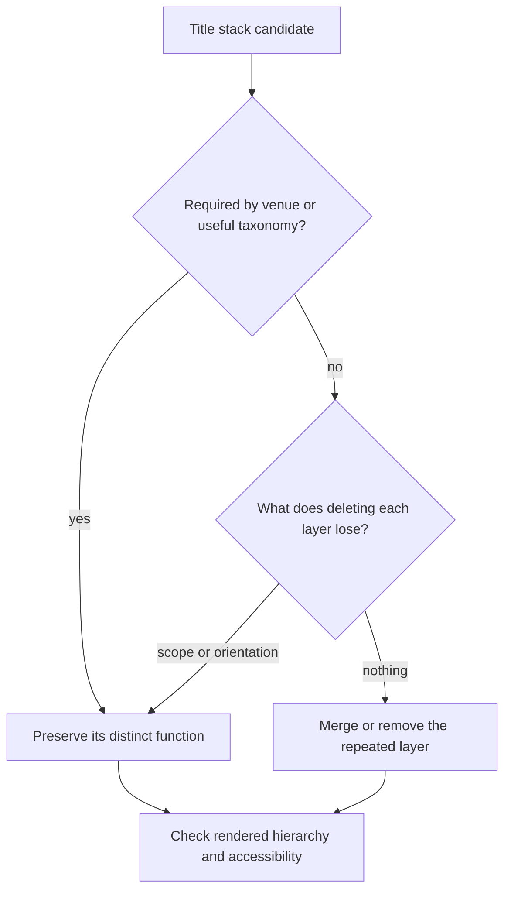

# Title layers and content chrome

Count visible layers, then ask what each contributes. A caption, heading and subtitle can all be useful. The defect is repeated meaning or lost orientation, not a particular font, number of lines or fashionable palette. The structural scanner emits candidates only; inspect the rendered page or PDF before editing.

_4 items. Generated from catalog.json — edit there, then re-run `scripts/regenerate_references.py`. Do not hand-edit this file._

_Every item carries a **False positive when** line. Read it before you act on the item: these are cues for an editor, not evidence about an author._

<!-- humanize:ignore-start
     The diagram and index below quote the tells they document, and a
     mermaid label is not a sentence. -->

## When this file applies

## What is in this file

Severity is how loudly the tell announces itself, never how sure you should be about who wrote it. **Automated** means these scripts implement the check; *no* means it is yours to ask in the judge pass.

| item | severity | family | automated |
| --- | --- | --- | --- |
| [`callout-saturation`](#callout-saturation) | med | shape | n/a |
| [`section-preface-justifies-existence`](#section-preface-justifies-existence) | med | shape | n/a |
| [`title-stack-redundancy`](#title-stack-redundancy) | med | shape | n/a |
| [`title-stack-candidate`](#title-stack-candidate) | low | shape | yes |

<!-- humanize:ignore-end -->

<!-- humanize:ignore-start
     Everything below is a specimen catalog. It quotes the tells it documents,
     including literal machine residue, so reviewing it with humanize_review.py
     would flag the exhibits rather than the writing. -->

### `callout-saturation`  ·  medium · generic-llm · structure · llm-judge · family: shape · lane: content-chrome

Every small idea is boxed, labeled, badged or followed by a takeaway so the page no longer distinguishes main argument from exceptions.

**Why it reads AI:** Review hypothesis about unexamined assembly or task mismatch. This pattern can occur in human work and does not establish authorship.

**Detect:** Read only the main text, then only the callouts; identify whether emphasis still selects anything important.

**Fix:** Return ordinary explanation to paragraphs and reserve callouts for genuine exceptions, definitions or tasks.

**False positive when:** A workbook or reference card may intentionally consist of individually addressable units.

**Evidence:** Editorial application of https://www.w3.org/WAI/WCAG22/Understanding/headings-and-labels.html. This source supports the mechanism or repair within its studied setting, not AI authorship detection or prevalence of this exact pattern.

### `section-preface-justifies-existence`  ·  medium · generic-llm · structure · llm-judge · family: shape · lane: content-chrome

A repeated prefatory label explains why each section exists instead of helping the reader use its content.

**Why it reads AI:** Review hypothesis about unexamined assembly or task mismatch. This pattern can occur in human work and does not establish authorship.

**Detect:** Does the rationale supply a prerequisite or consequence, or simply announce that the topic matters?

**Fix:** Remove generic motivation, preserve a concrete consequence, and move straight to the example or argument.

**False positive when:** A curriculum rationale or research-design justification can itself be necessary content.

**Evidence:** Editorial application of https://www.w3.org/WAI/WCAG22/Understanding/headings-and-labels.html. This source supports the mechanism or repair within its studied setting, not AI authorship detection or prevalence of this exact pattern.

### `title-stack-redundancy`  ·  medium · generic-llm · structure · llm-judge · family: shape · lane: content-chrome

Eyebrow, title, subtitle and lead repeat the same proposition rather than adding scope or orientation.

**Why it reads AI:** Review hypothesis about unexamined assembly or task mismatch. This pattern can occur in human work and does not establish authorship.

**Detect:** Temporarily delete each layer; name the information or navigation lost. A count alone cannot settle this.

**Fix:** Retain one subject heading and any distinct constraint; start the content at the first useful sentence.

**False positive when:** News decks, chapter subtitles and taxonomy captions often add essential scope.

**Evidence:** Editorial application of https://design-system.service.gov.uk/styles/headings/. This source supports the mechanism or repair within its studied setting, not AI authorship detection or prevalence of this exact pattern.

### `title-stack-candidate`  ·  low · generic-llm · structure · structural · family: shape · lane: content-chrome

**Automated here:** yes, these scripts implement it.

Three or more consecutive explicitly styled title-like blocks appear before substantive content.

**Why it reads AI:** Review hypothesis about unexamined assembly or task mismatch. This pattern can occur in human work and does not establish authorship.

**Detect:** Count supported markup blocks with review_learning_structure.py; this candidate requires rendered and semantic review.

**Fix:** Name each layer's distinct job; keep useful orientation and merge only demonstrated repetition.

**False positive when:** A chapter caption, title and meaningful subtitle may all carry distinct information.

**Evidence:** Editorial application of https://design-system.service.gov.uk/styles/headings/. This source supports the mechanism or repair within its studied setting, not AI authorship detection or prevalence of this exact pattern.

<!-- humanize:ignore-end -->
