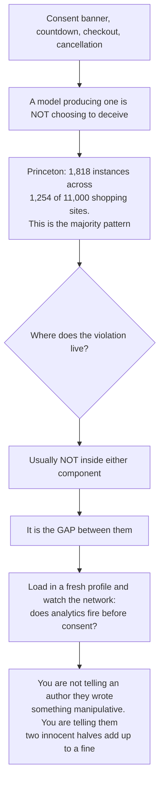

# Dark patterns the model inherits

A model that produces a fake countdown or an asymmetric cookie banner is not choosing to deceive. These patterns are statistically NORMAL on the commercial web — Princeton found 1,818 dark-pattern instances across 1,254 of 11,000 shopping sites — so they are what "build me a product page" or "add a cookie banner" retrieves. Treat every item here as a high-confidence finding the author must decide about, never as an inference about intent.

The surprising part, and the reason this file exists separately: the unlawful thing is usually not the generated component but the GAP between two generated components. `tracking-before-consent` is the clean case — the analytics snippet is correct, the consent banner is correct, nothing connects them, and the site ends up with a compliant-looking banner sitting on top of a completed violation that no static check of either half would find. `cancellation-has-no-path` and `cost-revealed-at-last-step` have the same shape. So the highest-value checks in this file are RELATIONAL and RENDERED: load the page in a fresh profile and watch the network, rather than grepping either component.

Which also makes the fairness framing different here from the rest of the catalog. You are not telling an author they wrote something manipulative. You are telling them that two innocent halves add up to a fine.

_9 items. Generated from catalog.json — edit there, then re-run `scripts/regenerate_references.py`. Do not hand-edit this file._

_Every item carries a **False positive when** line. Read it before you act on the item: these are cues for an editor, not evidence about an author._

<!-- humanize:ignore-start
     The diagram and index below quote the tells they document, and a
     mermaid label is not a sentence. -->

## When this file applies

## What is in this file

Severity is how loudly the tell announces itself, never how sure you should be about who wrote it. **Automated** means these scripts implement the check; *no* means it is yours to ask in the judge pass.

| item | severity | family | automated |
| --- | --- | --- | --- |
| [`cancellation-has-no-path`](#cancellation-has-no-path) | HIGH | defect | yes |
| [`consent-choice-asymmetry`](#consent-choice-asymmetry) | HIGH | defect | yes |
| [`cost-revealed-at-last-step`](#cost-revealed-at-last-step) | HIGH | defect | **no** |
| [`countdown-that-resets`](#countdown-that-resets) | HIGH | defect | yes |
| [`fabricated-live-activity-counter`](#fabricated-live-activity-counter) | HIGH | defect | yes |
| [`prechecked-optin`](#prechecked-optin) | HIGH | defect | yes |
| [`tracking-before-consent`](#tracking-before-consent) | HIGH | defect | yes |
| [`confirmshaming-decline-label`](#confirmshaming-decline-label) | med | form | yes |
| [`modal-on-first-paint`](#modal-on-first-paint) | med | defect | yes |

<!-- humanize:ignore-end -->

<!-- humanize:ignore-start
     Everything below is a specimen catalog. It quotes the tells it documents,
     including literal machine residue, so reviewing it with humanize_review.py
     would flag the exhibits rather than the writing. -->

### `cancellation-has-no-path`  ·  high · generic-llm · web-ui · structural · family: defect · lane: dark-patterns

**Automated here:** yes, these scripts implement it.

Signup is two clicks and a hosted checkout; cancellation is an email address. No route, no handler, no button — the subscription can be started by the app and only ended by a human reading a mailbox.

**Why it reads AI:** The happy path is what gets specified and what the corpus is full of; the exit path is specified by nobody. This reads UNREVIEWED more than deceptive — but the effect is a roach motel and the exposure is the same either way. The FTC's Negative Option Rule was vacated in July 2025 on procedural grounds; ROSCA still requires a simple mechanism to stop recurring charges.

**Detect:** The build contains subscription creation (stripe.checkout.sessions.create, subscriptions.create, or a Paddle/Lemon Squeezy/RevenueCat equivalent) AND no route or handler matching /cancel|unsubscribe|downgrade|close-account|delete-account|billing\/portal/ AND /cancel/i appears only inside a mailto: or a "contact us" string. Also flag a cancel flow needing more steps than signup, or routed only through a chat widget.

**Fix:** For Stripe, mount the Billing Portal — one API call, giving self-serve cancel, plan change and invoice history. Cancellation must be at least as easy as signup, in the same medium the user signed up in. One retention offer maximum, skippable.

**False positive when:** Enterprise contracts with negotiated terms where cancellation is genuinely contractual. Free products with no subscription. Apps where cancellation is handled by the app store and the in-app text correctly points there. Pre-launch products with no live subscribers.

**Before**

> "To cancel, email support@example.com" with no route

**After**

> POST /api/billing/portal → stripe.billingPortal.sessions.create({customer}), linked from account settings

### `consent-choice-asymmetry`  ·  high · generic-llm · web-ui · structural · family: defect · lane: dark-patterns

**Automated here:** yes, these scripts implement it.

The cookie banner's first layer has a prominent "Accept all" and no equivalent reject — only "Manage preferences", a link, a smaller or greyer control, or nothing at all.

**Why it reads AI:** A model producing an asymmetric banner is not choosing to deceive — this shape is statistically normal on the commercial web, so it is what "add a cookie banner" retrieves. The output is nonetheless non-compliant: the EDPB taskforce and the CPPA both require symmetry of choice, and the privacy-protective path may not be longer or harder.

**Detect:** Locate the consent container ([id*=cookie], [class*=consent], [aria-label*=cookie], a CMP script). Classify first-layer controls: accept-ish /accept|allow|agree|got it|ok|i understand|continue/i, reject-ish /reject|decline|deny|refuse|only necessary|necessary only|essential only/i. Flag when accept exists and reject does not; or when both exist but differ in element type (button vs a), in computed area by area_ratio or more, or one is a filled button and the other plain text.

**Thresholds** (read by `scripts/humanize_review.py`): `area_ratio` = 1.5

**Fix:** Put "Reject all" on the first layer: same element, same size, same visual weight as "Accept all". A third "Manage" option may be a link. Default every non-essential category to off.

**False positive when:** The site sets no non-essential cookies and the banner is purely informational with a dismiss — no consent is being collected, so symmetry does not apply (better still: remove the banner). Non-EU/UK/CA-facing intranets.

**Before**

> [ Accept all ]  manage preferences

**After**

> [ Accept all ] [ Reject all ]  Manage preferences

### `cost-revealed-at-last-step`  ·  high · generic-llm · web-ui · rendered · family: defect · lane: dark-patterns

**Automated here:** no — decidable mechanically, but this bundle does not implement it. Ask it yourself in the judge pass.

The price shown on the product page and in the cart excludes shipping, service fees or mandatory taxes, which first appear on the final checkout screen after the address and card have been entered.

**Why it reads AI:** The generated cart computes what it can compute locally — line items — and defers anything needing an address or a rate table. The result is textbook drip pricing produced by arithmetic convenience rather than intent, landing precisely on the UK DMCC Act's total-price requirement, in force since April 2025.

**Detect:** Crawl product → cart → checkout. Flag when the first DOM occurrence of /shipping|delivery|postage|tax|VAT|service fee|handling|booking fee/i alongside a monetary value happens only on the final step, and the displayed total changes between the penultimate and final step. Static proxy: a cart summary rendering only subtotal where the order model carries shipping and tax fields.

**Fix:** Show a shipping estimate on the product page (or a clear "free over X"), and expose the full breakdown in the cart before checkout begins. Where the exact figure needs a destination, show a range and the threshold.

**False positive when:** Taxes that genuinely cannot be computed before a destination is known — the requirement is disclosure of their existence and basis, not a precise figure. B2B checkouts quoting ex-VAT to VAT-registered buyers as the market convention. Genuinely optional add-ons are outside the mandatory-fee rule.

**Before**

> Cart: Total £49.00  →  Checkout step 3: Total £57.95

**After**

> Cart: Subtotal £49.00 · Shipping from £3.95 · Estimated total £52.95, with a postcode estimator

### `countdown-that-resets`  ·  high · generic-llm · web-ui · structural · family: defect · lane: dark-patterns

**Automated here:** yes, these scripts implement it.

An offer timer whose deadline is computed client-side from "now", so it restarts on every load, in every tab, forever. The urgency is manufactured and the claim is false.

**Why it reads AI:** A client-side countdown is a tidy, self-contained component; a real deadline requires a server, a promotion record and an end date. The model builds the component it can complete. Princeton found 393 countdown timers across 361 of 11,000 shopping sites.

**Detect:** Rendered (definitive): load, note the value, clear storage, reload — flag if it restarts at the same figure. Static: a countdown initialised from a relative constant rather than an absolute server-provided deadline — new Date() + N, Date.now() + N, useState(15 * 60), or setInterval decrementing a literal seed — within a few lines of an identifier or string matching /countdown|timer|offerEnd|expires|deadline|flashSale/i.

**Fix:** If the offer has a real end, render it from a server timestamp and let the timer stop and the offer actually end. If it does not, delete the timer — a fake countdown is a false statement about price and availability.

**False positive when:** Genuine session or cart-hold timers (ticketing, checkout reservations) that really do release inventory — these reset per session legitimately. Timers seeded from a server value fetched at mount, where the scan sees the local arithmetic but not the source. A countdown to a fixed public date hardcoded as an absolute ISO string is honest.

**Before**

> const [s,setS]=useState(15*60)  // "Offer ends in 15:00"

**After**

> const end = new Date(promo.endsAt);  // server-issued; renders nothing once end < now

### `fabricated-live-activity-counter`  ·  high · generic-llm · web-ui · structural · family: defect · lane: dark-patterns

**Automated here:** yes, these scripts implement it.

"23 people are viewing this right now", "14 sold in the last hour", "Only 3 left!" — generated from Math.random(), a hash of the clock, or a hardcoded integer, with no data source.

**Why it reads AI:** Near-universal on the commercial web — Princeton counted 313 activity messages and 632 low-stock messages. Adjacent to unbacked-social-proof, which covers COPY claims; this is the narrower and more serious case of a live-data widget with no live data, asserting a present-tense fact that is verifiably false.

**Detect:** A string matching /\d{1,3}\s*(people|others|shoppers|customers|visitors)\b.{0,30}(viewing|watching|looking|bought|purchased|in their cart)/i or /only \d+ (left|remaining|in stock)/i, where the number is a literal or derived from Math.random(), Date.now() %, or a seeded PRNG rather than an inventory or analytics field. Also flag setInterval mutating such a number.

**Fix:** Wire it to real inventory or real concurrent-session data, and let it show nothing when the number is unremarkable. If you cannot, delete it.

**False positive when:** Real telemetry — some hotel and ticketing inventory is genuinely tight, and Amazon's low-stock counts do constrain the cart. Randomisation in a demo or fixture environment clearly labelled as such. Static "N sold" totals that are historical facts rather than live claims.

**Before**

> const viewers = Math.floor(Math.random()*40)+5;

**After**

> const viewers = await getActiveSessions(productId); if (viewers < 5) return null;

### `prechecked-optin`  ·  high · generic-llm · web-ui · structural · family: defect · lane: dark-patterns

**Automated here:** yes, these scripts implement it.

A marketing, newsletter or data-sharing checkbox that ships already ticked, so consent is obtained by inattention.

**Why it reads AI:** Pre-ticked boxes are the majority shape in the corpus of signup forms. The inverted variant is worse and easier for a generator to produce accidentally, because negated labels are hard to reason about. CJEU C-673/17 Planet49: consent "is not validly constituted by way of a pre-ticked checkbox".

**Detect:** input[type=checkbox][checked], defaultChecked, :checked="true", v-model initialised true, or useState(true) — where the associated label matches /newsletter|marketing|updates|offers|promotions|partners|third[- ]part|share my|keep me posted/i. Also flag the inverted variant: an unchecked box whose label matches /do not|opt out|unsubscribe me from/i.

**Fix:** Ship unchecked. Separate consents get separate boxes — never bundle marketing consent with terms acceptance. Phrase the label positively so the checked state means yes.

**False positive when:** "Remember me" and other convenience toggles that are not consent. Settings pages where a checked box reflects a saved preference. Contexts where soft opt-in for existing customers is lawful — still worth surfacing, but not a violation.

**Before**

> <input type="checkbox" name="marketing" checked> Send me product updates and offers

**After**

> <input type="checkbox" name="marketing"> Send me product updates and offers

### `tracking-before-consent`  ·  high · generic-llm · web-ui · structural · family: defect · lane: dark-patterns

**Automated here:** yes, these scripts implement it.

The banner is present and correct-looking, and GA4, Meta Pixel, Hotjar or Clarity have already fired and set cookies by the time it renders. The banner is decoration over a fait accompli.

**Why it reads AI:** The purest declared-but-not-wired defect in this lane, and the clearest case of two correct halves that add up to a violation. Each vendor documents a paste-into-head snippet; the banner is a separate component; both are generated correctly in isolation and nothing connects them.

**Detect:** Rendered (definitive): fresh profile, load, do not interact; flag any request to a tracking host or any cookie matching /_ga|_gid|_fbp|_fbc|_hj|_clck|_uetsid|IDE/. Static: a script src matching googletagmanager|google-analytics|connect.facebook.net|hotjar|clarity.ms|segment in <head> with no consent gate — not type="text/plain" with a CMP class, not behind gtag('consent','default',{analytics_storage:'denied'}), not conditionally injected after a consent event — while a consent banner exists in the same build.

**Fix:** Block non-essential tags until consent: a CMP that rewrites script tags, or Google Consent Mode v2 initialised BEFORE the gtag snippet with all storage denied by default, flipping on the consent event. Verify in a fresh profile with devtools, not by reading the code.

**False positive when:** Cookieless, IP-truncating analytics used under legitimate interest where a DPA has accepted it — check what actually gets stored. Strictly-necessary cookies (session, CSRF, the consent record itself) are exempt. Non-EU/UK-facing properties.

**Before**

> GTM in <head>, <CookieBanner/> mounted in <body>, no connection between them

**After**

> gtag('consent','default',{ad_storage:'denied',analytics_storage:'denied'}) before the tag; gtag('consent','update',…) in the banner's accept handler

### `confirmshaming-decline-label`  ·  medium · generic-llm · marketing-copy · structural · family: form · lane: dark-patterns

**Automated here:** yes, these scripts implement it.

The decline control is written as a first-person confession of stupidity: "No thanks, I hate saving money", "I'd rather pay full price", "No, I don't want to grow my business".

**Why it reads AI:** This is a COPYWRITING CONVENTION in the corpus — the model has read thousands of these and produces them as the house style for a dismiss link. It is the most easily removed entry in this lane and the one most likely to be there by pure imitation.

**Detect:** On any modal or banner dismiss control: /^\s*no,?\s*(thanks,?\s*)?i\b/i, /i'?d rather/i, /i (don'?t|do not) (want|like|need|care)/i, /i (hate|prefer to)/i, /i'?m (fine|ok|good) (with|being|staying)/i, /no thanks,? i'?ll/i. Judge pass for the general case: does this decline label express a negative judgement about the person declining?

**Fix:** Label the action, not the person: "No thanks", "Not now", "Close". Keep the decline as findable and as clickable as the accept.

**False positive when:** Brands with a genuinely jokey voice where the copy is self-deprecating rather than reader-deprecating — the test is whether declining is made to feel bad, not whether it is funny. Confirmation dialogues for destructive actions legitimately state consequences ("Delete — this cannot be undone") and are not confirmshaming.

**Before**

> No thanks, I'd rather pay full price

**After**

> No thanks

### `modal-on-first-paint`  ·  medium · generic-llm · web-ui · structural · family: defect · lane: dark-patterns

**Automated here:** yes, these scripts implement it.

A newsletter, discount or app-download overlay that opens in the first render, before the visitor has read a word, with no scroll, delay, exit-intent or suppression condition — and often stacked on top of the cookie banner.

**Why it reads AI:** "Add an email capture modal" retrieves the simplest possible implementation, and the simplest is unconditional. The suppression logic — show once, remember the dismissal, never during checkout — is the part that requires someone to have USED the site.

**Detect:** A dialog or overlay whose open state is initialised true, or set true in a mount effect with no condition: useEffect(() => setShowModal(true), []) with an empty dependency array, no setTimeout beyond a few seconds, no scroll or IntersectionObserver trigger, no mouseleave exit-intent, and no localStorage or cookie suppression read. Rendered: an aria-modal element visible one second after load with no interaction.

**Fix:** Gate it: 50–60% scroll depth, or 30+ seconds, or exit intent. Persist the dismissal and do not show it again for at least 30 days. Never stack it over a consent banner, and never show it on checkout or on a page a visitor reached from search with a specific intent.

**False positive when:** Age gates, jurisdiction gates and consent banners legally required on first paint. Onboarding dialogues inside an authenticated app after signup. A/B-tested variants where immediate display was a measured decision.

**Before**

> useEffect(()=>setShowModal(true),[])

**After**

> show on scrollDepth > 0.6 && !localStorage.getItem('nl-dismissed'), then record the dismissal on close

<!-- humanize:ignore-end -->
