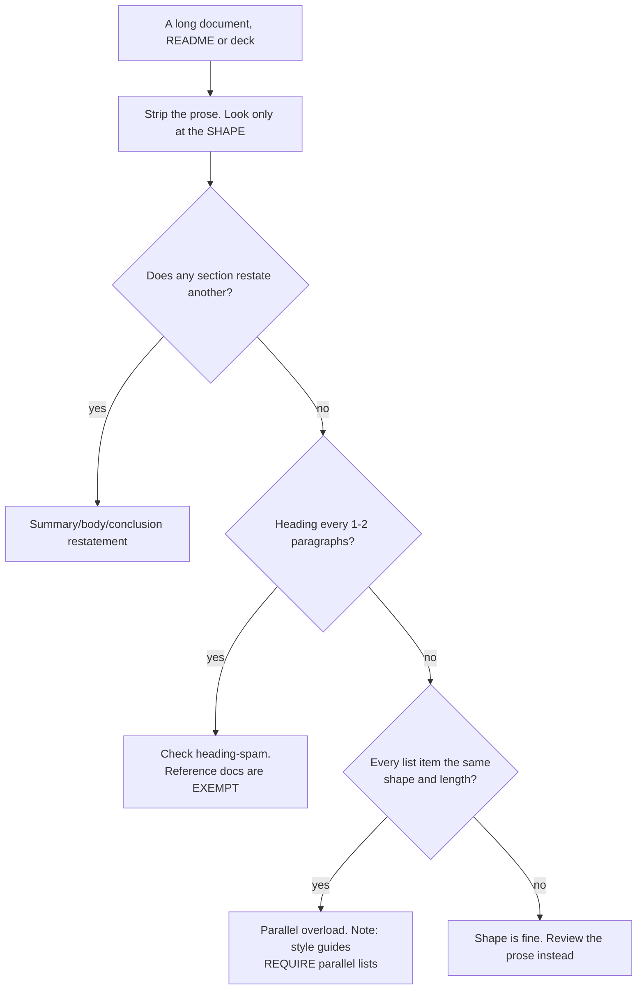

# Document and deck structure — how the thing was assembled

Document-shape tells: how generated long-form docs, READMEs and slide decks are put together, independent of any sentence in them. These are findings about ASSEMBLY — what order the parts arrive in, which parts restate which — so they survive a full rewrite of the prose and they are the ones a reader feels without being able to name.

_28 items. Generated from catalog.json — edit there, then re-run `scripts/regenerate_references.py`. Do not hand-edit this file._

_Every item carries a **False positive when** line. Read it before you act on the item: these are cues for an editor, not evidence about an author._

<!-- humanize:ignore-start
     The diagram and index below quote the tells they document, and a
     mermaid label is not a sentence. -->

## When this file applies



## What is in this file

Severity is how loudly the tell announces itself, never how sure you should be about who wrote it. **Automated** means these scripts implement the check; *no* means it is yours to ask in the judge pass.

| item | severity | family | automated |
| --- | --- | --- | --- |
| [`bold-label-colon-bullet`](#bold-label-colon-bullet) | HIGH | shape | yes |
| [`challenges-and-future-directions`](#challenges-and-future-directions) | HIGH | form | yes |
| [`citation-pathology`](#citation-pathology) | HIGH | residue | n/a |
| [`conclusion-recap-tag`](#conclusion-recap-tag) | HIGH | shape | **no** |
| [`emoji-section-headers`](#emoji-section-headers) | HIGH | shape | yes |
| [`h2-spam-full-sentence-headings`](#h2-spam-full-sentence-headings) | HIGH | shape | **no** |
| [`key-takeaways-box-everywhere`](#key-takeaways-box-everywhere) | HIGH | shape | **no** |
| [`markdown-leak-in-unrendered-medium`](#markdown-leak-in-unrendered-medium) | HIGH | form | yes |
| [`model-markup-residue`](#model-markup-residue) | HIGH | residue | yes |
| [`promised-idea-never-delivered`](#promised-idea-never-delivered) | HIGH | shape | n/a |
| [`summary-restates-title-conclusion-restates-summary`](#summary-restates-title-conclusion-restates-summary) | HIGH | shape | n/a |
| [`tracking-param-residue`](#tracking-param-residue) | HIGH | residue | yes |
| [`unsolicited-faq-section`](#unsolicited-faq-section) | HIGH | shape | n/a |
| [`arrow-chain-as-explanation`](#arrow-chain-as-explanation) | med | shape | yes |
| [`bullet-colonization-of-prose`](#bullet-colonization-of-prose) | med | shape | yes |
| [`checkmark-bullet-grid`](#checkmark-bullet-grid) | med | form | yes |
| [`heading-spam`](#heading-spam) | med | form | yes |
| [`horizontal-rule-spam`](#horizontal-rule-spam) | med | form | yes |
| [`markdown-bold-title-case-scaffold`](#markdown-bold-title-case-scaffold) | med | shape | **no** |
| [`readme-boilerplate-shape`](#readme-boilerplate-shape) | med | shape | n/a |
| [`signposting-without-structure`](#signposting-without-structure) | med | shape | yes |
| [`tables-for-non-tabular-content`](#tables-for-non-tabular-content) | med | shape | **no** |
| [`unattributed-inspirational-quote-slide`](#unattributed-inspirational-quote-slide) | med | shape | n/a |
| [`agent-namespaced-branch`](#agent-namespaced-branch) | low | residue | **no** |
| [`heading-level-skip`](#heading-level-skip) | low | form | yes |
| [`headline-then-bullets-disease`](#headline-then-bullets-disease) | low | shape | **no** |
| [`title-case-heading-uniformity`](#title-case-heading-uniformity) | low | form | yes |
| [`title-echo`](#title-echo) | low | shape | n/a |

<!-- humanize:ignore-end -->

<!-- humanize:ignore-start
     Everything below is a specimen catalog. It quotes the tells it documents,
     including literal machine residue, so reviewing it with humanize_review.py
     would flag the exhibits rather than the writing. -->

<a id="bold-label-colon-bullet"></a>
### `bold-label-colon-bullet`  ·  high · generic-llm · structure · structural · family: shape

**Automated here:** yes, these scripts implement it.

The most recognizable AI list shape: every bullet is '**Bold Label:** explanation sentence,' uniform across the whole list. On some models (Gemini) each bullet is also separated by a blank line, producing a tall double-spaced wall.

**Why it reads AI:** Real human lists vary item structure; the rigidly uniform 'bold term: gloss' across every bullet is the single most identifiable AI list fingerprint and is never typed by hand for casual answers.

**Detect:** structural: flag any list where >=60% of items match `^\s*[-*]\s*(\*\*|__).+?(\*\*|__):\s`; 3+ consecutive items in this exact shape is a strong signal. Additional signal: blank line between every bullet combined with the bold-colon template.

**Thresholds** (read by `scripts/humanize_review.py`): `min_count` = 4

**Fix:** Vary the items. Drop the bold labels unless they're true scannable keys in a reference table. Let some items be a phrase and others a full sentence; collapse to prose where it's really reasoning.

**False positive when:** Glossaries, API parameter lists and definition lists are exactly this shape for good reason. The tell is using it for prose that should have been paragraphs.

**Before**

> - **Speed:** It is fast.
> - **Reliability:** It rarely fails.
> - **Scalability:** It grows with you.
> - **Security:** It keeps data safe.

**After**

> It's fast and almost never falls over. We've pushed it to 40k concurrent users without tuning anything, and the security review came back clean.

<a id="challenges-and-future-directions"></a>
### `challenges-and-future-directions`  ·  high · generic-llm · structure · structural · family: form

**Automated here:** yes, these scripts implement it.

The obligatory penultimate move: a 'Challenges and Future Directions' / 'Future Outlook' section whose body runs 'Despite its X, it faces challenges... Despite these challenges, it continues to...'.

**Why it reads AI:** A rigid formula that ends in speculative positive assessment regardless of subject. The model is completing a document template, not finishing a thought.

**Detect:** Heading regex over the closed set, plus body regex for 'Despite (its|these|the)'.

**Thresholds** (read by `scripts/humanize_review.py`): `min_count` = 1

**Fix:** Delete the section. If a real open problem exists, state it as a specific unresolved question with a name attached to it.

**False positive when:** Grant proposals and review articles have a genuine, long-standing convention of a future-work section. Judge the body, not the heading, in those genres.

**Evidence:** Wikipedia:Signs of AI writing, Outline-like conclusions.

**Before**

> ## Challenges and Future Directions
> 
> Despite its rapid growth, the project faces challenges typical of open-source ecosystems.

**After**

> Maintainer burnout is the live risk: two of the three core committers stepped back in 2024 and neither has been replaced.

<a id="citation-pathology"></a>
### `citation-pathology`  ·  high · generic-llm · structure · llm-judge · family: residue

References that exist but do not do their job: DOIs resolving to an unrelated paper, invalid DOIs and ISBNs, links to search results rather than documents, named refs declared and never used, and refs attached to sentences they do not support.

**Why it reads AI:** Models use legitimate sources inappropriately and invent plausible ones. Wikipedia's cleanup guidance is emphatic that the highest-yield check is not style at all — it is opening the citations.

**Detect:** Structural for the mechanical subset (DOI/ISBN checksum, HTTP status, '/search?q=' in an href, unused named refs). Judge for the one that matters: does the cited source actually support the sentence it is attached to?

**Fix:** Open every reference. Delete or replace any that does not support its sentence.

**False positive when:** Almost none, and note this is the ONE finding class in this catalog that is about truth rather than authorship. Act on it with full confidence — you are checking a claim, not inferring an author.

**Evidence:** Wikipedia:WikiProject AI Cleanup.

**Before**

> Latency fell 40% after the migration.[12]  (ref 12 is a 2011 paper about a different system)

**After**

> Latency fell 40% after the migration (our own p99 dashboard, 12-19 March).

<a id="conclusion-recap-tag"></a>
### `conclusion-recap-tag`  ·  high · generic-llm · structure · structural · family: shape

**Automated here:** no — decidable mechanically, but this bundle does not implement it. Ask it yourself in the judge pass.

A closing paragraph flagged with 'In conclusion,' 'In short,' 'Ultimately,' 'Overall,' or 'At the end of the day' that re-states the body without adding anything.

**Why it reads AI:** Five-paragraph-essay scaffolding makes the model ring a bell to announce the wrap-up and repeat itself, even in short pieces. Real writing ends when the argument is done.

**Detect:** structural: flag a final/penultimate paragraph whose n-gram overlap with the preceding body exceeds ~50% (high lexical recall of earlier topic sentences = pure recap), independent of the opener word.

**Fix:** End on the strongest concrete point or a forward-looking specific. If a reader could skip the last paragraph and lose nothing, cut it.

**False positive when:** Academic, legal and standards writing require a conclusion section by convention, and a genuinely long document earns a recap the reader needs. Flag a closing paragraph that adds nothing to a piece short enough not to need one.

**Before**

> In conclusion, caching is a powerful tool that, when used correctly, can significantly improve performance and enhance user experience.

**After**

> The trap is stale reads after a write; if you can't tolerate them, skip the cache on that path rather than tuning a TTL you'll forget.

<a id="emoji-section-headers"></a>
### `emoji-section-headers`  ·  high · chatgpt · structure · structural · family: shape

**Automated here:** yes, these scripts implement it.

Headings and list items prefixed with a decorative emoji mapped to topic: rocket Getting Started, sparkles Features, wrench Configuration, package Installation, bulb Tips. Especially common in READMEs and release notes.

**Why it reads AI:** The rocket-for-getting-started, sparkles-for-features mapping is a near-deterministic GPT habit; the specific emoji-to-section pairing is rarely how individual maintainers decorate docs.

**Detect:** structural: regex headings and bullet leads for a leading emoji codepoint (U+1F300-1FAFF, U+2600-27BF) plus VS16. Flag if >=2 headers carry a leading emoji, or the rocket/sparkles/wrench/package set appears as header decoration.

**Thresholds** (read by `scripts/humanize_review.py`): `min_count` = 2

**Fix:** Remove emoji from headers; rely on heading hierarchy and whitespace for scanning. Reserve emoji for genuine human asides in prose.

**False positive when:** Some projects mandate emoji in their own heading or commit conventions. Flag on introduction into a property that does not already use them.

**Before**

> ## 🚀 Getting Started
> ## ✨ Features
> ## 🔧 Configuration

**After**

> ## Getting Started
> ## Features
> ## Configuration

<a id="h2-spam-full-sentence-headings"></a>
### `h2-spam-full-sentence-headings`  ·  high · chatgpt · structure · structural · family: shape

**Automated here:** no — decidable mechanically, but this bundle does not implement it. Ask it yourself in the judge pass.

A heading appears every one to two paragraphs, and the headings are full title-case sentences ('How To Structure Your Onboarding For Maximum Retention') rather than short labels. Heading density approaches paragraph density.

**Why it reads AI:** SEO/AEO scaffolding pushes the model to chunk everything under semantic headers. Humans write multi-paragraph sections under terse labels.

**Detect:** structural: compute the heading-to-paragraph ratio and heading length; flag a ratio near 1:2 combined with sentence-length, title-cased headings, or any heading whose section is a single paragraph.

**Fix:** Target a heading every 4-6 paragraphs. Make headings short noun phrases in sentence case. Delete any heading whose section is one paragraph.

**False positive when:** Reference documentation legitimately has high heading density, accessibility guidance favours descriptive headings over bare labels, and question-shaped headings are a deliberate choice in help content. Flag a heading every one or two paragraphs in a narrative piece.

**Before**

> ## Why Choosing The Right CRM Matters For Your Growing Team
> A CRM keeps your data in one place.
> ## How To Evaluate CRM Pricing Tiers Effectively
> Look at per-seat costs.

**After**

> ## Choosing a CRM
> A CRM keeps customer data in one place, which matters more than the feature checklist most vendors push. Start with pricing: per-seat costs balloon once your team crosses ten people, so model the 18-month bill, not the sticker.

<a id="key-takeaways-box-everywhere"></a>
### `key-takeaways-box-everywhere`  ·  high · chatgpt · structure · structural · family: shape

**Automated here:** no — decidable mechanically, but this bundle does not implement it. Ask it yourself in the judge pass.

A 'Key Takeaways,' 'TL;DR,' or 'In Summary' box bolted onto every section, not just the document top, often restating the heading and the paragraph just above it.

**Why it reads AI:** Answer-engine-optimization advice trains models to front-load standalone bullets after every heading, producing a document that summarizes itself at every level, which no human does mid-flow.

**Detect:** structural: count standalone summary/TL;DR/takeaways blocks per document and per H2; flag when they appear after most sections rather than once, especially with high n-gram overlap with the section above.

**Fix:** Keep at most one summary, at the top or bottom, never per-section. If a section needs a recap, it's too long; split or tighten it.

**False positive when:** Per-section summaries are a documented comprehension aid and are standard in textbooks, journalism and technical documentation. Flag a box on EVERY section, especially one restating the heading immediately above it.

**Before**

> ## Pricing
> We moved to usage-based billing in March...
> **Key Takeaways:**
> - We use usage-based billing
> - It started in March

**After**

> ## Pricing
> We moved to usage-based billing in March. Every plan now meters API calls instead of seats, which is why your invoice line items changed shape.

<a id="markdown-leak-in-unrendered-medium"></a>
### `markdown-leak-in-unrendered-medium`  ·  high · chatgpt · structure · structural · family: form

**Automated here:** yes, these scripts implement it.

Markdown syntax pasted into a medium that does not render it — a LinkedIn post, an email body, a Slack message, a YouTube description — so the reader sees literal asterisks and hashes.

**Why it reads AI:** Nobody typing into that box would produce them. The syntax is a fossil of the interface the text was generated in, and it survives only because no one previewed the result.

**Detect:** Count **bold** spans and ATX headings in files whose extension does not render markdown.

**Thresholds** (read by `scripts/humanize_review.py`): `min_count` = 3

**Fix:** Strip the syntax and carry the emphasis in the words. If the emphasis cannot survive that, it was decoration.

**False positive when:** Plain-text files destined for a markdown renderer, and anything in a repo where .txt files are processed. Check the destination before flagging.

**Evidence:** Widely reported by social-platform users; the literal-asterisk artifact is among the most-named giveaways in platform folklore.

**Before**

> **Key takeaway:** we shipped it. ## What's next

**After**

> The key takeaway is that we shipped it. Here's what's next.

<a id="model-markup-residue"></a>
### `model-markup-residue`  ·  high · chatgpt · structure · structural · family: residue

**Automated here:** yes, these scripts implement it.

Vendor scaffolding tokens leaking into shipped text: oaicite, contentReference, turn0search0, attributableIndex (ChatGPT); [cite_start] and (start_span) (Gemini); grok_render_citation_card_json (Grok); ppl-ai-file-upload (Perplexity); lenticular brackets in DeepSeek output.

**Why it reads AI:** These are the model's own internal citation and rendering markup. Nobody writes them; they survive a copy-paste that nobody proofread.

**Detect:** Literal token match against the closed vendor list. Essentially zero false positives outside a document about this very topic.

**Thresholds** (read by `scripts/humanize_review.py`): `min_count` = 1

**Fix:** Grep and delete. Then check whether the citation each token was attached to points at anything real, because it frequently does not.

**False positive when:** Documentation about AI output artifacts (including this catalog) contains these strings deliberately. Wrap such passages in the ignore markers.

**Evidence:** Wikipedia:Signs of AI writing maintains the per-vendor token list.

**Before**

> The study found a 40% reduction :contentReference[oaicite:0]{index=0}.

**After**

> Kobak et al. found a 40% reduction.

<a id="promised-idea-never-delivered"></a>
### `promised-idea-never-delivered`  ·  high · generic-llm · structure · llm-judge · family: shape

The piece sets up an idea it never returns to. A question posed in the opening, a tension introduced, a 'we will come back to this' that never comes back.

**Why it reads AI:** Template completion. An opening that raises a question is a learned move; closing it requires holding the promise across the whole document, which nothing in the generation loop enforces.

**Detect:** Judge: list every promise the opening makes, then check each against the body. An unclosed loop is the finding.

**Fix:** Close the loop or cut the setup. Usually cutting is right, because the setup was rhetorical furniture rather than a real question. If it was a real question, answering it is probably the best part of the piece.

**False positive when:** Part one of a stated series, and pieces that explicitly defer to a linked follow-up.

**Before**

> The interesting part is what happens when the clock skews — more on that below. [no more on that below]

**After**

> The interesting part is what happens when the clock skews. [three paragraphs on clock skew]

<a id="summary-restates-title-conclusion-restates-summary"></a>
### `summary-restates-title-conclusion-restates-summary`  ·  high · generic-llm · structure · llm-judge · family: shape

An Executive Summary that paraphrases the title, a body that paraphrases the summary, and a Conclusion that paraphrases both, often opening with 'This document outlines...' / 'In this article, we will explore...'.

**Why it reads AI:** Models are trained to restate the thesis in summaries and conclusions without adding information, so the same sentence appears three times across layers.

**Detect:** llm-judge: 'Do the title, summary, and conclusion restate the same content across three layers without adding a finding, number, or implication — and does it open with a meta-announcing this-document-outlines frame?'

**Fix:** The summary should contain the single most important finding or number. The conclusion should add the implication or next decision. Delete 'This document outlines' openers.

**False positive when:** Several document standards REQUIRE this shape -- executive summaries, IMRaD, briefing formats -- and 'tell them what you will tell them' is taught deliberately for spoken delivery. Flag it where no convention demands it and each layer adds nothing.

**Before**

> Title: Q3 Marketing Performance
> Executive Summary: This document outlines our Q3 marketing performance.
> Conclusion: In conclusion, this report has covered our Q3 marketing performance.

**After**

> Executive Summary: Paid spend doubled but CAC stayed flat — the channel scaled, which it wasn't supposed to at this budget.
> Conclusion: The Q4 question is whether flat CAC survives once we exhaust the warm retargeting pool, and we don't yet know.

<a id="tracking-param-residue"></a>
### `tracking-param-residue`  ·  high · chatgpt · structure · structural · family: residue

**Automated here:** yes, these scripts implement it.

URLs carrying utm_source=chatgpt.com, utm_source=perplexity, or a sibling attribution parameter, pasted straight out of a chat UI.

**Why it reads AI:** The chat product appends the parameter to links it surfaces. The person pasting never strips it because they never looked at the URL.

**Detect:** Regex over URLs for utm_source=(chatgpt|openai|perplexity|copilot|claude). A literal fingerprint, not a stylistic inference.

**Thresholds** (read by `scripts/humanize_review.py`): `min_count` = 1

**Fix:** Strip query parameters from every URL before shipping. While you are in there, open each link and check it says what the sentence claims.

**False positive when:** A genuine analytics campaign could in principle use the same parameter value, but no real campaign names itself after a chatbot. Treat a hit as reliable.

**Evidence:** Wikipedia:Signs of AI writing lists utm_source parameters among citation artifacts.

**Before**

> See the report at https://example.org/report?utm_source=chatgpt.com

**After**

> See the report at https://example.org/report

<a id="unsolicited-faq-section"></a>
### `unsolicited-faq-section`  ·  high · chatgpt · structure · llm-judge · family: shape

A document, email, or landing page ends with an 'FAQ' section no actual user asked, inventing well-formed questions that map one-to-one to points already made above.

**Why it reads AI:** Q&A blocks are recommended for answer-engine retrieval, so models append them by default. The questions read as reverse-engineered from the body, not from real confusion.

**Detect:** llm-judge: 'Are the FAQ questions reverse-engineered from the body (What is X? Why does X matter? How do I get started?) rather than drawn from real, recurring user confusion?'

**Fix:** Cut the FAQ unless you have logged real recurring questions. If kept, use the actual words users asked and answer only what the body didn't cover.

**False positive when:** An FAQ built from real support tickets is genuinely useful and is one of the highest-value things a docs site can carry. Flag questions invented to map one-to-one onto points already made above.

**Before**

> ## Frequently Asked Questions
> **What is our analytics platform?** It is a tool for tracking metrics.
> **Why is analytics important?** It helps you make decisions.

**After**

> ## Questions we actually get
> **Does this double-count sessions across subdomains?** No. We key on the root domain, which is why your numbers dropped ~8% after the migration.

<a id="arrow-chain-as-explanation"></a>
### `arrow-chain-as-explanation`  ·  medium · generic-llm · slide-deck · llm-judge · family: shape

Causal or process logic compressed into an arrow chain (Data -> AI -> Insights -> Revenue) that stands in for an actual explanation, often with '<- this is the key' annotations or a labeled 'money slide.'

**Why it reads AI:** Arrow chains let the model imply a mechanism without committing to one. The 'this is the key' framing mimics the gestures of a confident presenter without the reasoning that earns them.

**Detect:** llm-judge: 'Does an arrow chain imply a mechanism without explaining any link, paired with self-congratulatory this-is-the-key / money-slide labels rather than evidence for the non-obvious step?'

**Thresholds** (read by `scripts/humanize_review.py`): `min_arrows` = 2

**Fix:** Pick the one non-obvious link and explain why it holds, with evidence. Delete the self-congratulatory labels; if a slide is the key, the audience should feel it.

**False positive when:** Pipelines, state machines and build stages are genuinely arrow-shaped, and a parenthetical process gloss is ordinary shorthand. The detector skips fully-parenthesized lines and list items for this reason.

**Before**

> Data -> AI -> Insights -> Revenue
> <- this is the key
> The money slide.

**After**

> The non-obvious step is Data -> AI. Competitors have the same revenue model; what they don't have is 4 years of labeled support tickets. That corpus is why our model resolves tickets 30% faster, and that speed is the whole margin.

<a id="bullet-colonization-of-prose"></a>
### `bullet-colonization-of-prose`  ·  medium · generic-llm · structure · structural · family: shape

**Automated here:** yes, these scripts implement it.

Breaking flowing argument or narrative into headline-plus-bullet lists, including forcing a simple connected answer into a numbered listicle. Causal and temporal relationships get flattened into co-equal bullets.

**Why it reads AI:** RLHF rewarded scannable structure, so the model enumerates everything because lists are easy to generate and look organized, even when ideas are connected and need prose.

**Detect:** Bullet lines as a share of content lines, which is what the catalog always said; the earlier implementation used a bullets-to-paragraphs ratio instead and disagreed with its own rubric.

**Thresholds** (read by `scripts/humanize_review.py`): `min_bullets` = 10, `cue_share` = 0.45

**Fix:** Reserve bullets for genuinely parallel, order-independent items (steps, options, specs). Write reasoning, cause-and-effect, and narrative as paragraphs.

**False positive when:** Reference docs, changelogs, release notes and checklists are legitimately mostly bullets. Scope this to documents that are supposed to argue something.

**Before**

> Why the launch failed:
> - The timing was bad
> - This caused low signups
> - Which meant we cut the budget
> - So marketing stopped

**After**

> The launch failed mostly on timing: we shipped the week of a competitor's conference, signups came in low, and once the numbers looked bad leadership cut the budget, which ended marketing entirely.

<a id="checkmark-bullet-grid"></a>
### `checkmark-bullet-grid`  ·  medium · chatgpt · structure · structural · family: form

**Automated here:** yes, these scripts implement it.

List items led by status glyphs — checkmarks, crosses, warning triangles, target and lightbulb emoji — turning every claim into a satisfied requirement.

**Why it reads AI:** It reads as a compliance table rather than as writing. The glyph asserts that each line has been verified, which is exactly the claim the document has not earned.

**Detect:** Count list lines whose first character is a status dingbat. Kept separate from emoji headings because a single checkmark is a much milder tell than an emoji H2.

**Thresholds** (read by `scripts/humanize_review.py`): `min_count` = 3

**Fix:** Use a plain list, or a real table if the items genuinely compare along an axis.

**False positive when:** Migration checklists, test matrices and compatibility tables use these glyphs correctly and legibly. The tell is using them for claims, not for states.

**Evidence:** Observed across README and marketing-copy generation; sibling of emoji-section-headers.

**Before**

> ✅ Fast
> ✅ Secure
> ✅ Scalable

**After**

> It handles about 4,000 requests a second, runs in our SOC 2 boundary, and has survived two regional failovers.

<a id="heading-spam"></a>
### `heading-spam`  ·  medium · generic-llm · structure · structural · family: form

**Automated here:** yes, these scripts implement it.

A heading every paragraph or two, labelling single paragraphs rather than organizing sections.

**Why it reads AI:** It is the outline the model was given, left in place. Scaffolding that was never taken down after the building went up.

**Detect:** Static: ratio of headings to paragraph-start lines, scoped to narrative prose. Reference shape is excluded mechanically -- 60% or more of headings being short labels (five words or fewer) AND a code block present -- so an API or CLI reference does not trip it.

**Thresholds** (read by `scripts/humanize_review.py`): `min_headings` = 5, `ratio` = 0.5

**Fix:** Cut headings that label a single paragraph. Let the prose carry the transitions.

**False positive when:** Reference documentation and API docs are legitimately heading-dense, because readers arrive by search and leave immediately. Scope to narrative prose.

**Evidence:** Wikipedia:Signs of AI writing, Excessive headings.

**Before**

> ## Why speed matters
> 
> Speed matters because users leave.
> 
> ## Why reliability matters
> 
> Reliability matters because users return.

**After**

> Speed matters because users leave; reliability matters because they come back. Both are the same argument about attention.

<a id="horizontal-rule-spam"></a>
### `horizontal-rule-spam`  ·  medium · generic-llm · structure · structural · family: form

**Automated here:** yes, these scripts implement it.

A thematic break inserted between every section of a document.

**Why it reads AI:** Markdown-shaped training: the model emits a document template rather than a document, and the rule is a boundary it does not trust the prose to signal.

**Detect:** Count standalone --- / *** / ___ lines outside code fences.

**Thresholds** (read by `scripts/humanize_review.py`): `min_count` = 3

**Fix:** Delete them. If two sections need separating, the heading already does it.

**False positive when:** A single rule before a footer, an afterword, or a scene break in fiction is ordinary typography. Three or more across one document is the signal.

**Evidence:** Wikipedia:Signs of AI writing, Thematic breaks; Freeburg, arXiv:2603.27006, finds markdown structural features suppressible to zero under a prose-only instruction, so their presence is an uninstructed default.

**Before**

> ...end of section.
> 
> ---
> 
> ## Next section

**After**

> ...end of section.
> 
> ## Next section

<a id="markdown-bold-title-case-scaffold"></a>
### `markdown-bold-title-case-scaffold`  ·  medium · chatgpt · structure · structural · family: shape

**Automated here:** no — decidable mechanically, but this bundle does not implement it. Ask it yourself in the judge pass.

Structural over-formatting carried into contexts that don't call for it: bolded **key terms** mid-sentence, Title Case On Every Heading, and a recurring intro/numbered-points/'In conclusion' skeleton. Raw markdown (** and #) leaking into plain-text or wiki fields is a hard tell.

**Why it reads AI:** The bold-and-bullet scaffold is the visual signature of a chat response pasted into a document. Humans writing prose rarely bold individual terms or title-case every heading.

**Detect:** structural: count bold spans per 100 words (>2 in prose is suspicious), detect Title Case in >50% of headings, and flag literal markdown syntax where the medium renders differently (e.g. ** in a plain-text or wikitext field).

**Fix:** Strip mid-sentence bold; emphasis belongs in word choice. Use sentence case for headings. Remove 'In conclusion' wrap-ups and convert bold-lead bullet lists to prose unless genuinely a reference list.

**False positive when:** Title Case headings are house style at many publications, and bolded key terms are standard in textbooks, glossaries and reference documentation. Flag raw markdown leaking into a medium that does not render it, and formatting applied where no structure exists.

**Before**

> ## Key Benefits Of Our Approach
> - **Speed:** It is very fast.
> - **Reliability:** It rarely fails.
> In conclusion, our solution delivers **significant value**.

**After**

> ## What you get
> It's fast and it rarely falls over. That's the whole pitch.

<a id="readme-boilerplate-shape"></a>
### `readme-boilerplate-shape`  ·  medium · chatgpt · structure · llm-judge · family: shape

A README with a fixed, project-agnostic skeleton: badge row, one-line tagline, then Features / Installation / Usage / Contributing / License in that order, every section generic and nothing specific to what the project does or why it exists.

**Why it reads AI:** The model emits the average README. Real projects front-load a quirky motivation, skip Contributing, or have idiosyncratic Usage; uniform template plus zero specifics is the tell.

**Detect:** llm-judge: 'Is this the modal open-source README template with zero project-specific motivation, examples, or quirks — interchangeable with any other repo's readme?'

**Fix:** Lead with the problem this project solves and one real example of output. Keep only sections you have content for. Delete a Contributing section that just says 'PRs welcome'.

**False positive when:** That section order is the community convention and it is genuinely good for discoverability -- a reader knows where to look. Flag a README where every section is generic, not one that follows the standard shape with specific content in it.

**Before**

> # Project
> ![badges]
> A powerful and flexible tool.
> ## Features
> - Fast
> - Easy to use
> ## Installation
> ## Usage
> ## Contributing
> ## License

**After**

> # pg-slowlog
> Finds the 10 queries eating your Postgres CPU and shows the missing index for each.
> ```
> $ pg-slowlog --since 1h
> ```
> ## Install / ## Caveats (it only reads pg_stat_statements)

<a id="signposting-without-structure"></a>
### `signposting-without-structure`  ·  medium · generic-llm · structure · structural · family: shape

**Automated here:** yes, these scripts implement it.

Meta-navigation substituted for structure: 'First we'll explore... Next we'll examine... Finally we'll conclude.' The outline is read aloud instead of being enacted.

**Why it reads AI:** The model was given an outline and emits it as prose, because announcing a structure is cheaper than building one. It costs the reader a paragraph before anything is said, and it promises a shape the piece often does not deliver.

**Detect:** Count sentences matching an ordinal plus a first-person-plural intention verb plus an exploration verb. A closed frame set, not a topic list.

**Thresholds** (read by `scripts/humanize_review.py`): `min_count` = 3

**Fix:** Delete the announcements and let headings and prose do the work. Where a transition is genuinely needed, make it carry information: say what changed or what the last section established, not that a new section is beginning.

**False positive when:** Tutorials and long reference documents legitimately tell the reader what the path looks like, and a single roadmap paragraph in a long piece is a kindness. Three or more is the signal.

**Before**

> First, we'll explore the architecture. Next, we will examine performance. Finally, we'll look at what comes next.

**After**

> The fix had two halves, and the second one is the interesting part.

<a id="tables-for-non-tabular-content"></a>
### `tables-for-non-tabular-content`  ·  medium · chatgpt · structure · structural · family: shape

**Automated here:** no — decidable mechanically, but this bundle does not implement it. Ask it yourself in the judge pass.

A two-column markdown table used for things that aren't comparative data: a single concept's pros against a one-item cons, a three-row Term/Definition gloss, or prose forced into 'Aspect | Description' cells.

**Why it reads AI:** Models learned that tables 'win' in AI readability guidance, so they reach for a grid even when the content has no second axis to compare. A one-column table betrays the reflex.

**Detect:** structural: flag tables with only one data column, or rows whose cells are full sentences, or an 'Aspect | Description' header where there is no second axis to compare across.

**Fix:** Use a table only when 2+ items are compared across 2+ shared attributes. For a term gloss use a definition list or inline bold; for one concept's tradeoffs use a short paragraph.

**False positive when:** A two-column term/definition table is a legitimate glossary format, and a comparison table with two real alternatives is tabular. Flag prose forced into 'Aspect | Description' cells and one-row tables.

**Before**

> | Aspect | Description |
> |---|---|
> | Speed | The system is fast |
> | Reliability | It rarely goes down |
> | Cost | It is affordable |

**After**

> The system is fast and rarely goes down, and it stays affordable because we run it on spot instances. The tradeoff: those spot instances are why the 2am batch job occasionally slips an hour.

<a id="unattributed-inspirational-quote-slide"></a>
### `unattributed-inspirational-quote-slide`  ·  medium · generic-llm · slide-deck · llm-judge · family: shape

A full-bleed slide carries a generic inspirational quote in large type, unattributed, misattributed to 'Anonymous,' or pinned to a famous name it doesn't belong to, used as filler gravitas unconnected to the argument.

**Why it reads AI:** Models reach for a motivational quote to manufacture an emotional beat and generic-ify the attribution. The quote rarely advances the argument, which is the tell.

**Detect:** llm-judge: 'Is the quote decorative gravitas — generic, hallucinated/missing attribution, and not advancing the specific next point?'

**Fix:** Cut the quote unless it's real, correctly attributed, and central. Better: replace it with a concrete artifact — a customer's actual words, a real data point.

**False positive when:** A correctly attributed quotation that bears on the argument is fine and often good. Flag the missing attribution, the wrong attribution, or 'Anonymous' standing in for a source nobody checked.

**Before**

> Slide (full bleed): "The only way to do great work is to love what you do." — Anonymous

**After**

> Slide (full bleed): "I almost cancelled in week two. The thing that kept me was your support team answering at 11pm." — actual churn-survey response, account #4471

<a id="agent-namespaced-branch"></a>
### `agent-namespaced-branch`  ·  low · generic-llm · structure · structural · family: residue

**Automated here:** no — decidable mechanically, but this bundle does not implement it. Ask it yourself in the judge pass.

Branch names prefixed with an agent namespace (claude/, codex/, copilot/, cursor/, ai/, bot/) or suffixed with a session hash or timestamp.

**Why it reads AI:** Tool defaults, not human naming. They survive into the merge commit and the PR URL, so they outlive the diff.

**Detect:** Regex on the branch name for the namespace prefixes and for a trailing hex or ISO-timestamp suffix.

**Fix:** Rename to what the branch does: kebab-case, explicit, brief.

**False positive when:** Teams that deliberately namespace agent branches for routing or cleanup are doing something sensible. Check the repo's branch list.

**Evidence:** libusb/hidapi AGENTS.md explicitly forbids agent-derived branch namespaces.

**Before**

> claude/fix-auth-20260914-a3f91c2

**After**

> fix-session-expiry

<a id="heading-level-skip"></a>
### `heading-level-skip`  ·  low · generic-llm · structure · structural · family: form

**Automated here:** yes, these scripts implement it.

Heading levels jumped rather than nested — H1 straight to H3, or H1s used where H2s belong.

**Why it reads AI:** The outline was emitted, not read back. A person writing an outline notices the gap because they see the document as a shape.

**Detect:** Check monotonicity of heading levels in document order; flag jumps of two or more.

**Thresholds** (read by `scripts/humanize_review.py`): `min_headings` = 3

**Fix:** Renumber the headings contiguously.

**False positive when:** Some documentation generators legitimately emit skipped levels from templates. Check whether the file is generated before flagging it.

**Evidence:** Wikipedia:Signs of AI writing, Skipping heading levels.

**Before**

> # Overview
> ### Installation

**After**

> # Overview
> ## Installation

<a id="headline-then-bullets-disease"></a>
### `headline-then-bullets-disease`  ·  low · generic-llm · slide-deck · structural · family: shape

**Automated here:** no — decidable mechanically, but this bundle does not implement it. Ask it yourself in the judge pass.

Every slide is a declarative claim followed by 3-5 bullets, with no connective narrative or prose. The deck becomes a stack of identically-shaped claim+list units; nothing argues, everything asserts and enumerates.

**Why it reads AI:** Humans build a talk around an arc with build-up and uneven emphasis. AI defaults to the average slide: a topic sentence plus a tidy list, repeated. The total absence of prose between bullets is the tell.

**Detect:** structural: measure the fraction of slides matching a single topic line plus a 3-5 item bullet list with no prose, and the absence of single-idea or chart-only slides; flag a deck that is near-uniformly claim+list.

**Fix:** Convert at least one in three slides to a single-idea statement, a chart with one annotation, or a narrative card. Let bullet counts vary. Add a 'so what' sentence instead of another bullet.

**False positive when:** Assertion-evidence slide structure is a researched, deliberate design and some organisations mandate it. Flag a deck where nothing argues -- every unit asserts and enumerates and no connective thread runs between slides.

**Evidence:** Practitioner/editorial hypothesis. No calibrated individual-authorship inference or universal quality threshold is established here. Escalate only after demonstrating a reader or task failure.

**Before**

> Slide: 'Our Q3 Strategy'
> - Expand into three new markets
> - Increase retention by 15%
> - Launch the mobile app
> - Strengthen the partner channel

**After**

> Slide: 'We bet everything on retention this quarter'
> Last year we chased new markets and leaked customers out the back. So Q3 is one number: 15% better retention. Markets wait until that holds.

<a id="title-case-heading-uniformity"></a>
### `title-case-heading-uniformity`  ·  low · chatgpt · structure · structural · family: form

**Automated here:** yes, these scripts implement it.

Every heading in the document set in Title Case, with no drift.

**Why it reads AI:** A house style nobody chose. Human writers drift between sentence case and title case within a document; generators do not drift.

**Detect:** Share of multi-word headings whose significant words are all capitalized.

**Thresholds** (read by `scripts/humanize_review.py`): `min_headings` = 4, `share` = 0.8

**Fix:** Pick sentence case and use it. It reads faster and dates less.

**False positive when:** Publications with an enforced Title Case style guide (many US magazines, most marketing sites) are following house style correctly. Check the property's other pages first.

**Evidence:** Wikipedia:WikiProject AI Cleanup notes heading-case habits among markdown-shaped formatting signs.

**Before**

> ## Getting Started With The New Dashboard

**After**

> ## Getting started with the new dashboard

<a id="title-echo"></a>
### `title-echo`  ·  low · generic-llm · structure · llm-judge · family: shape

The document repeats its own title as its first heading, or opens by restating the title as a sentence.

**Why it reads AI:** Markdown-shaped training: the model emits a self-contained document that re-announces itself, because in its training the title and the body were separate contexts.

**Detect:** Compare the first heading, and the first sentence, against the document title.

**Fix:** Delete the echo and open on the first real sentence.

**False positive when:** Some publishing systems require an H1 matching the front-matter title, and generated docs sites do this legitimately.

**Evidence:** Wikipedia:Signs of AI writing, Title heading.

**Before**

> # Caching in Production
> 
> ## Caching in Production
> 
> Caching in production is an important topic.

**After**

> # Caching in Production
> 
> We cache three things, and two of them were mistakes.

<!-- humanize:ignore-end -->
