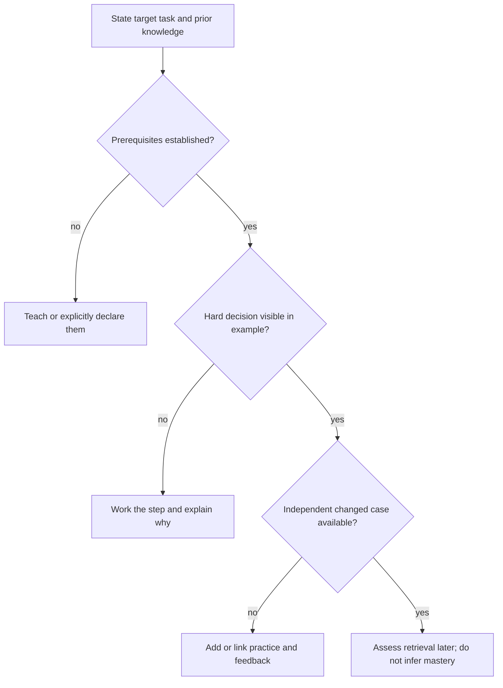

# Educational exposition and concept progression

Audit what a reader can do with an idea before later material depends on it. These are pedagogical and editorial checks, not authorship tests. General learning research supports many repairs; evidence specific to AI tutoring is labeled and bounded in education-and-chrome-research.md. Learning-map checks validate reviewer annotations rather than learner mastery.

_18 items. Generated from catalog.json — edit there, then re-run `scripts/regenerate_references.py`. Do not hand-edit this file._

_Every item carries a **False positive when** line. Read it before you act on the item: these are cues for an editor, not evidence about an author._

<!-- humanize:ignore-start
     The diagram and index below quote the tells they document, and a
     mermaid label is not a sentence. -->

## When this file applies

## What is in this file

Severity is how loudly the tell announces itself, never how sure you should be about who wrote it. **Automated** means these scripts implement the check; *no* means it is yours to ask in the judge pass.

| item | severity | family | automated |
| --- | --- | --- | --- |
| [`definition-without-discrimination`](#definition-without-discrimination) | HIGH | shape | n/a |
| [`formalism-before-referents`](#formalism-before-referents) | HIGH | shape | n/a |
| [`full-solution-dependency`](#full-solution-dependency) | HIGH | shape | n/a |
| [`notation-churn-without-mapping`](#notation-churn-without-mapping) | HIGH | shape | n/a |
| [`one-example-overgeneralization`](#one-example-overgeneralization) | HIGH | shape | n/a |
| [`scaffolding-difficulty-cliff`](#scaffolding-difficulty-cliff) | HIGH | shape | n/a |
| [`source-exists-claim-does-not`](#source-exists-claim-does-not) | HIGH | shape | n/a |
| [`toy-example-promoted-to-evidence`](#toy-example-promoted-to-evidence) | HIGH | shape | n/a |
| [`worked-example-hides-decision`](#worked-example-hides-decision) | HIGH | shape | n/a |
| [`analogy-without-boundary`](#analogy-without-boundary) | med | shape | n/a |
| [`example-carousel-no-invariant`](#example-carousel-no-invariant) | med | shape | n/a |
| [`expertise-insensitive-scaffolding`](#expertise-insensitive-scaffolding) | med | shape | n/a |
| [`feedback-without-error-model`](#feedback-without-error-model) | med | shape | n/a |
| [`recognition-masquerades-as-retrieval`](#recognition-masquerades-as-retrieval) | med | shape | n/a |
| [`seductive-detail-detour`](#seductive-detail-detour) | med | shape | n/a |
| [`practice-evidence-missing`](#practice-evidence-missing) | low | shape | yes |
| [`prerequisite-not-established`](#prerequisite-not-established) | low | shape | yes |
| [`transfer-evidence-missing`](#transfer-evidence-missing) | low | shape | yes |

<!-- humanize:ignore-end -->

<!-- humanize:ignore-start
     Everything below is a specimen catalog. It quotes the tells it documents,
     including literal machine residue, so reviewing it with humanize_review.py
     would flag the exhibits rather than the writing. -->

### `definition-without-discrimination`  ·  high · generic-llm · education · llm-judge · family: shape · lane: educational-exposition

A definition is immediately reused without showing how to distinguish the concept from a plausible near miss.

**Why it reads AI:** Review hypothesis about unexamined assembly or task mismatch. This pattern can occur in human work and does not establish authorship.

**Detect:** Can a novice classify one example and one near miss and explain the difference using only the chapter?

**Fix:** Add a contrasting pair at the difficult boundary and explain the distinguishing feature.

**False positive when:** An expert monograph can rely on prerequisite definitions established in an earlier course.

**Evidence:** Editorial application of https://ies.ed.gov/ncee/wwc/PracticeGuide/1. This source supports the mechanism or repair within its studied setting, not AI authorship detection or prevalence of this exact pattern.

### `formalism-before-referents`  ·  high · generic-llm · education · llm-judge · family: shape · lane: educational-exposition

An equation arrives before its symbols and quantities have concrete referents for the intended novice.

**Why it reads AI:** Review hypothesis about unexamined assembly or task mismatch. This pattern can occur in human work and does not establish authorship.

**Detect:** Ask what each symbol measures and instantiate the expression with one checked set of values.

**Fix:** Name the quantities and relationship, work a concrete case, then connect it to the general expression.

**False positive when:** Expert treatments and deliberate discovery tasks can introduce formalism first with appropriate support.

**Evidence:** Editorial application of https://ies.ed.gov/ncee/wwc/PracticeGuide/1. This source supports the mechanism or repair within its studied setting, not AI authorship detection or prevalence of this exact pattern.

### `full-solution-dependency`  ·  high · generic-llm · education · llm-judge · family: shape · lane: educational-exposition

Every exercise exposes its complete solution before the learner has an opportunity to attempt the relevant step.

**Why it reads AI:** Review hypothesis about unexamined assembly or task mismatch. This pattern can occur in human work and does not establish authorship.

**Detect:** Compare supported practice with a later unaided problem; do not count assisted completion as learning.

**Fix:** Offer staged hints, completion problems and an independent exit task; preserve access to feedback.

**False positive when:** A solution manual is legitimately answer-rich; it should be identified as that genre.

**Evidence:** Editorial application of https://doi.org/10.1073/pnas.2422633122. This source supports the mechanism or repair within its studied setting, not AI authorship detection or prevalence of this exact pattern.

### `notation-churn-without-mapping`  ·  high · generic-llm · education · llm-judge · family: shape · lane: educational-exposition

The same quantity changes name, symbol, color or units between prose, derivation and figure without a mapping.

**Why it reads AI:** Review hypothesis about unexamined assembly or task mismatch. This pattern can occur in human work and does not establish authorship.

**Detect:** Trace one quantity end to end and reproduce the substitutions from the stated definitions.

**Fix:** Choose stable notation or place an explicit conversion beside the transition.

**False positive when:** Comparing conventions is legitimate when the conversion is itself the lesson.

**Evidence:** Editorial application of https://ies.ed.gov/ncee/wwc/PracticeGuide/1. This source supports the mechanism or repair within its studied setting, not AI authorship detection or prevalence of this exact pattern.

### `one-example-overgeneralization`  ·  high · generic-llm · education · llm-judge · family: shape · lane: educational-exposition

One favorable worked case is presented as if it establishes an unrestricted rule.

**Why it reads AI:** Review hypothesis about unexamined assembly or task mismatch. This pattern can occur in human work and does not establish authorship.

**Detect:** Test a boundary case or a case violating an assumption; does the stated rule survive?

**Fix:** State the domain and assumptions, show a near miss, and distinguish illustration from proof.

**False positive when:** A theorem already proved may use a single example simply to illustrate its application.

**Evidence:** Editorial application of https://ies.ed.gov/ncee/wwc/PracticeGuide/1. This source supports the mechanism or repair within its studied setting, not AI authorship detection or prevalence of this exact pattern.

### `scaffolding-difficulty-cliff`  ·  high · generic-llm · education · llm-judge · family: shape · lane: educational-exposition

The lesson jumps from a complete solution to an independent problem requiring several untaught decisions.

**Why it reads AI:** Review hypothesis about unexamined assembly or task mismatch. This pattern can occur in human work and does not establish authorship.

**Detect:** Compare the last supported task and first independent task: list newly required operations.

**Fix:** Insert a completion problem or a smaller challenge, then fade support as performance permits.

**False positive when:** A diagnostic challenge may intentionally reveal missing prerequisites before teaching begins.

**Evidence:** Editorial application of https://ies.ed.gov/ncee/wwc/PracticeGuide/1. This source supports the mechanism or repair within its studied setting, not AI authorship detection or prevalence of this exact pattern.

### `source-exists-claim-does-not`  ·  high · generic-llm · education · llm-judge · family: shape · lane: educational-exposition

A real citation is treated as verification even though its design, population or result does not support the attached claim.

**Why it reads AI:** Review hypothesis about unexamined assembly or task mismatch. This pattern can occur in human work and does not establish authorship.

**Detect:** Check existence, sentence alignment, method and transfer scope separately.

**Fix:** Cite the precise supporting result, narrow the claim, or remove it; record unresolved evidence.

**False positive when:** A citation may legitimately be background or a counterposition when its role is stated.

**Evidence:** Editorial application of https://www.nature.com/articles/s41598-023-41032-5. This source supports the mechanism or repair within its studied setting, not AI authorship detection or prevalence of this exact pattern.

### `toy-example-promoted-to-evidence`  ·  high · generic-llm · education · llm-judge · family: shape · lane: educational-exposition

An invented teaching dataset or illustrative simulation is presented as an empirical research finding.

**Why it reads AI:** Review hypothesis about unexamined assembly or task mismatch. This pattern can occur in human work and does not establish authorship.

**Detect:** Trace every number to observed data, a reproducible model or an explicitly synthetic example.

**Fix:** Label teaching data as synthetic and separate the demonstration from empirical evidence.

**False positive when:** Synthetic data are valid for a declared simulation or conceptual demonstration.

**Evidence:** Editorial application of https://www.nature.com/articles/s41598-023-41032-5. This source supports the mechanism or repair within its studied setting, not AI authorship detection or prevalence of this exact pattern.

### `worked-example-hides-decision`  ·  high · generic-llm · education · llm-judge · family: shape · lane: educational-exposition

A worked example shows inputs and answer while concealing the step the learner is supposed to acquire.

**Why it reads AI:** Review hypothesis about unexamined assembly or task mismatch. This pattern can occur in human work and does not establish authorship.

**Detect:** Locate the most difficult choice; does the explanation say why that operation is valid rather than merely announce its result?

**Fix:** Show that step with values, assumptions, units and a reason; check the calculation independently.

**False positive when:** Routine arithmetic can be omitted when it is already an explicit prerequisite.

**Evidence:** Editorial application of https://doi.org/10.1207/s15516709cog1302_1. This source supports the mechanism or repair within its studied setting, not AI authorship detection or prevalence of this exact pattern.

### `analogy-without-boundary`  ·  medium · generic-llm · education · llm-judge · family: shape · lane: educational-exposition

An analogy introduces a concept but its limitations are never stated before the learner reasons from it.

**Why it reads AI:** Review hypothesis about unexamined assembly or task mismatch. This pattern can occur in human work and does not establish authorship.

**Detect:** Name one inference that works in the analogy and fails in the target system; check whether the text blocks it.

**Fix:** Map the relevant relation and explicitly retire the analogy where it stops matching.

**False positive when:** A brief motivational comparison need not teach a complete model when no subsequent inference depends on it.

**Evidence:** Editorial application of https://ies.ed.gov/ncee/wwc/PracticeGuide/1. This source supports the mechanism or repair within its studied setting, not AI authorship detection or prevalence of this exact pattern.

### `example-carousel-no-invariant`  ·  medium · generic-llm · education · llm-judge · family: shape · lane: educational-exposition

Several examples change story, notation and representation without naming what remains structurally the same.

**Why it reads AI:** Review hypothesis about unexamined assembly or task mismatch. This pattern can occur in human work and does not establish authorship.

**Detect:** Ask the learner to map corresponding quantities across examples; identify whether the text supplies the mapping.

**Fix:** Keep a running example until the invariant is clear, then vary one dimension and make the mapping explicit.

**False positive when:** A comparison exercise may intentionally withhold the invariant until the learner proposes it.

**Evidence:** Editorial application of https://ies.ed.gov/ncee/wwc/PracticeGuide/1. This source supports the mechanism or repair within its studied setting, not AI authorship detection or prevalence of this exact pattern.

### `expertise-insensitive-scaffolding`  ·  medium · generic-llm · education · llm-judge · family: shape · lane: educational-exposition

Novices and experts receive identical explanation depth, or redundant novice narration obscures the new result.

**Why it reads AI:** Review hypothesis about unexamined assembly or task mismatch. This pattern can occur in human work and does not establish authorship.

**Detect:** Identify what this audience already knows and which two decisions are genuinely new.

**Fix:** State prerequisites and offer a short route for prepared readers while preserving support for novices.

**False positive when:** A mixed-audience reference may deliberately offer optional detailed derivations.

**Evidence:** Editorial application of https://doi.org/10.1207/S15326985EP3801_4. This source supports the mechanism or repair within its studied setting, not AI authorship detection or prevalence of this exact pattern.

### `feedback-without-error-model`  ·  medium · generic-llm · education · llm-judge · family: shape · lane: educational-exposition

Feedback gives a verdict and the correct answer without locating the misconception that produced the error.

**Why it reads AI:** Review hypothesis about unexamined assembly or task mismatch. This pattern can occur in human work and does not establish authorship.

**Detect:** For one plausible wrong response, does feedback explain why it fails and invite repair?

**Fix:** Identify the mistaken assumption or operation and offer a targeted next attempt.

**False positive when:** Simple factual recall can need only corrective feedback rather than a long diagnosis.

**Evidence:** Editorial application of https://doi.org/10.1073/pnas.2422633122. This source supports the mechanism or repair within its studied setting, not AI authorship detection or prevalence of this exact pattern.

### `recognition-masquerades-as-retrieval`  ·  medium · generic-llm · education · llm-judge · family: shape · lane: educational-exposition

A recap or an answer-visible quiz is treated as evidence the reader can reconstruct the idea.

**Why it reads AI:** Review hypothesis about unexamined assembly or task mismatch. This pattern can occur in human work and does not establish authorship.

**Detect:** Hide the explanation and answer: what must the learner produce rather than recognize?

**Fix:** Ask for a short unaided reconstruction, then reveal explanatory feedback and revisit later.

**False positive when:** Recognition can be the target skill, and accessible support may be intentionally available.

**Evidence:** Editorial application of https://ies.ed.gov/ncee/wwc/PracticeGuide/1. This source supports the mechanism or repair within its studied setting, not AI authorship detection or prevalence of this exact pattern.

### `seductive-detail-detour`  ·  medium · generic-llm · education · llm-judge · family: shape · lane: educational-exposition

A striking story, analogy or image interrupts the hardest conceptual step without helping explain it.

**Why it reads AI:** Review hypothesis about unexamined assembly or task mismatch. This pattern can occur in human work and does not establish authorship.

**Detect:** Remove the detail and attempt the target task; determine whether any necessary relation disappears.

**Fix:** Move optional context after the model or replace it with an example that carries the needed relation.

**False positive when:** Motivation, history or narrative can be the learning objective rather than decoration.

**Evidence:** Editorial application of https://doi.org/10.1037/0022-0663.90.3.414. This source supports the mechanism or repair within its studied setting, not AI authorship detection or prevalence of this exact pattern.

### `practice-evidence-missing`  ·  low · generic-llm · education · structural · family: shape · lane: educational-exposition

**Automated here:** yes, these scripts implement it.

The reviewer map contains no located worked example, independent practice, or retrieval opportunity for a target concept.

**Why it reads AI:** Review hypothesis about unexamined assembly or task mismatch. This pattern can occur in human work and does not establish authorship.

**Detect:** Check reviewer-supplied evidence locations; an absent annotation is a review gap, not proof the chapter lacks an exercise.

**Fix:** Locate the existing learning activity or add a task aligned to the intended skill.

**False positive when:** Conceptual overviews and reference entries may route readers to exercises elsewhere.

**Evidence:** Editorial application of https://ies.ed.gov/ncee/wwc/PracticeGuide/1. This source supports the mechanism or repair within its studied setting, not AI authorship detection or prevalence of this exact pattern.

### `prerequisite-not-established`  ·  low · generic-llm · education · structural · family: shape · lane: educational-exposition

**Automated here:** yes, these scripts implement it.

A later concept depends on knowledge neither declared as prior knowledge nor established earlier in the annotated lesson.

**Why it reads AI:** Review hypothesis about unexamined assembly or task mismatch. This pattern can occur in human work and does not establish authorship.

**Detect:** Check explicit learning-map dependencies and first-use order; the script validates annotations, not comprehension.

**Fix:** Teach the prerequisite, move the dependent step, or state and link the assumed knowledge.

**False positive when:** Expert references may declare prior knowledge and legitimately omit its introduction.

**Evidence:** Editorial application of https://ies.ed.gov/ncee/wwc/PracticeGuide/1. This source supports the mechanism or repair within its studied setting, not AI authorship detection or prevalence of this exact pattern.

### `transfer-evidence-missing`  ·  low · generic-llm · education · structural · family: shape · lane: educational-exposition

**Automated here:** yes, these scripts implement it.

A lesson claims reusable understanding but its annotated evidence includes no changed-case task.

**Why it reads AI:** Review hypothesis about unexamined assembly or task mismatch. This pattern can occur in human work and does not establish authorship.

**Detect:** Inspect the supplied learning map, then judge whether the claimed transfer task actually changes relevant conditions.

**Fix:** Add or link an unaided problem with changed representation or context and a reasoned solution.

**False positive when:** A first orientation or reference sheet may explicitly make no transfer claim.

**Evidence:** Editorial application of https://ies.ed.gov/ncee/wwc/PracticeGuide/1. This source supports the mechanism or repair within its studied setting, not AI authorship detection or prevalence of this exact pattern.

<!-- humanize:ignore-end -->
