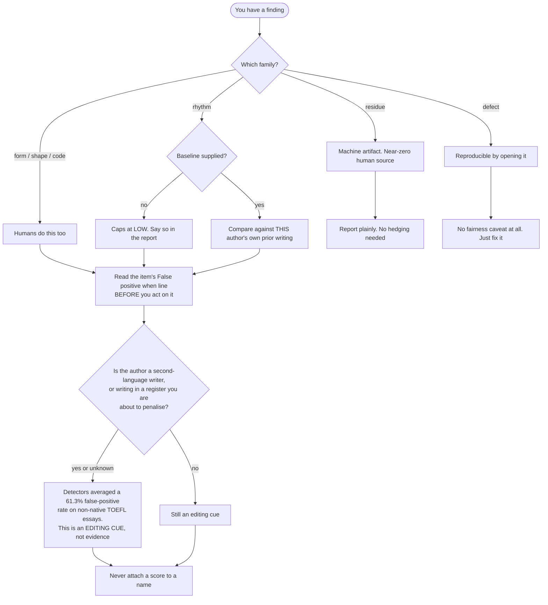

# Fairness and false positives — read this before you act on any finding

Hand-written, not generated from the catalog. The per-item `false_positive_when`
lines live in `catalog.json`; this file is the argument behind them.

**The whole file argues one thing:** almost every finding in this catalog is an
editing cue and almost none is evidence about a person. Here is that argument as
a procedure, before the argument itself.

## The base rate is the whole problem

Start here, because it reframes everything else. AI-text detectors are biased
toward calling things human: one 14-tool study found none exceeding 80% accuracy,
with recall collapsing to roughly 45% on AI text that a person lightly edited and
31% on machine-paraphrased text. Most actual machine output sails through.

Now put that next to the false-positive side. Seven commercial detectors produced
a mean 61.3% false-positive rate on TOEFL essays written by non-native English
speakers. Nineteen percent of those essays were flagged by all seven detectors
unanimously.

Both facts at once give you the base rate that matters: when something here fires,
it is more likely to be an unusual *person* than a caught machine. Someone writing
in their second language. Someone autistic, whose prose is consistent and
low-variance because that is how they write. Someone who genuinely loves em
dashes. The catalog in this skill is a good catalog, and it will still find more
people than models.

That is not a reason to throw it away. It is the reason the skill edits and does
not accuse.

The mechanism explains both halves. Detectors score perplexity, which tracks lexical richness and syntactic complexity.
A second-language writer has less of both, so the detector reads low fluency as
machine origin. The proof is in the fix: prompting GPT-4 to "enhance the word
choices to sound more like that of a native speaker" dropped the TOEFL
misclassification rate from 61.3% to 11.6%. The detector was never measuring
machine-ness. It was measuring fluency and calling the low end a robot.

Every rhythm signal in this skill inherits that flaw. Sentence-length variance,
contraction rate, comma density and em-dash density are all fluency proxies
wearing different hats. This is why `humanize_review.py` caps the whole rhythm
family at low severity unless you supply `--baseline`.

## Who gets hurt

**Second-language writers.** Covered above. Note that machine *translation* alone
triggers it: in the 14-tool study, human-written text that had been machine
translated saw false-accusation risk rise from 2.4% to 11.1%. Someone who drafts
in Polish and translates gets flagged for the translation.

**Neurodivergent writers.** Repeated phrasing, consistent structure and low
stylistic variance are common in autistic and ADHD writing, and they are exactly
what low perplexity and low burstiness measure. There are documented cases of
autistic students being failed on detector output alone, then disciplined for
explaining their communication style.

**People who write with dashes.** On the same measurement that puts GPT-4.1 at
10.62 em dashes per thousand words, Twain sits at 10.13 in *Huckleberry Finn* and
Melville at 8.12 in *Moby-Dick*. Llama emits zero. A punctuation habit Melville
had cannot be evidence of a language model. One anti-slop linter measured its own
em-dash rule warning on roughly 64% of legitimate technical blog posts before the
authors recalibrated it.

**Academics in fields where the flagged words are normal.** "Pivotal", "robust",
"underscore" and "delve" all have real disciplinary homes. The excess-vocabulary
method works precisely because it compares a discipline against its *own*
pre-2022 baseline. A global word list does not know what field it is reading.

**Speakers of the dialect that trained the tell.** This one deserves to be said
plainly. "Delve" is substantially more common in Nigerian formal and business
English than in British or American English, and the RLHF annotation workforce
whose preferences shaped the model was substantially Nigerian and Kenyan. So the
most famous AI tell in the world is a West African English usage that got
rewarded into a model and then held against everyone who uses it, including the
people it came from. A list that flags "delve" is, mechanically, a list that
flags a dialect.

Vanderbilt disabled Turnitin's AI detector in August 2023 and has not turned it
back on. Their arithmetic was simple: Turnitin claimed a 1% false-positive rate,
Vanderbilt processed 75,000 papers a year, so roughly 750 students could be
wrongly labelled. Northwestern, Michigan State and UT Austin followed. OpenAI
withdrew its own classifier six months after shipping it, citing low accuracy; at
launch it had caught 26% of AI text while falsely flagging 9% of human text.

## The researchers who build the best tell-lists refuse to use them as evidence

This is the strongest thing in the file, because it is not an outsider's
objection. The team behind the 66-feature grammatical study built a classifier
separating human from LLM text at 93-98% accuracy, and then wrote that their
intention was "not to propose another way to construct LLM detectors or to police
the writing of students and learners," but to find "teachable moments in the
revision of machine-generated text."

That is this skill's posture, stated by the people with the best reason to claim
otherwise.

Wikipedia's AI Cleanup project, which maintains the richest catalog anywhere,
says the same operationally: the signs are "most useful in combination, weighed
against context, not treated as a checklist," and they mainly warrant suspicion
when there is a dramatic and otherwise unexplained shift in one editor's own
style.

Reported honestly: Wikipedia's companion page for accused editors is notably less
sympathetic than the academic fairness literature, and declines to treat limited
English proficiency as an excuse. The two bodies of work are not fully aligned.
What both endorse is the operational rule below.

## Tells that do not work, and why they are still repeated

Some of the most-cited giveaways are the worst detectors. Recording them here
stops the catalog re-acquiring them.

**The em dash.** Covered above, and worth one more fact: nobody arguing about it
agrees on what the tell even is. In a single thread one person says models use a
closed em dash with no spaces and another says they consistently add spaces
around it, while a third says the opposite of both. When the sub-claims
contradict each other, nobody is measuring anything. Later models suppress the
character by default, and one sentence of instruction removes it, so a case built
on it collapses on contact.

**Perfect grammar and no typos.** The most socially destructive item in the set,
because it selects almost perfectly for the groups least able to defend
themselves: autistic writers with consistent structural habits, second-language
speakers taught formal English, and anyone who writes for a living. Detectors
looking for "a style of writing" are looking for formal English. There is a
subreddit substantially populated by people accused on this basis.

**The rule of three.** Homer used it. So does every speechwriter alive. Models
learned it because it works.

**Semicolons.** Circulating in fiction communities with no corpus study behind
it, and in direct tension with the em-dash claim, since one analysis reports
models substituting semicolons as dashes get suppressed. You cannot run both
directions as evidence.

**Purple prose and bad writing generally.** In 2026 a publisher cancelled a
novel after a community-led AI accusation. The reviewer who actually read the
manuscript concluded the individual markers were unreliable, because plenty of
human writers, including non-native speakers and autistic writers, write that
way. A commercial detector returned 78% on the book, which is not a verdict
either.

**Mangled hands and garbled text in images.** Dead. Current models render both
correctly, and repeating this produces confident wrong answers in both
directions. The catalog entry is retained with `currency: obsolete` as a caution.

**A missing C2PA manifest.** Proves nothing. Every social upload, screenshot,
re-save and CDN transform strips it, and the most widely used image generator
does not embed one at all. A signed manifest naming a generator is strong
positive evidence; its absence is no evidence whatsoever, and reading the
converse is where most current guidance goes wrong.

## The rules this skill follows

1. **Every finding is a prompt to edit a sentence, never a verdict on who wrote
   it.** The output says "this sentence is weaker than it could be." It never
   says "a machine wrote this."

2. **Judge the delta against the author's own baseline, not a universal
   template.** Pass `--baseline` with a few pieces of the writer's known prior
   work. This single rule disarms most of the fairness objection, because a
   second-language writer's baseline is their own second-language writing. It
   also produces better editing, since the goal was always to sound like
   *this person* rather than to sound like nobody.

3. **Verify the context of residue.** Unconverted citation tokens, tracking
   parameters, and assistant boilerplate can require editing in ordinary prose,
   while quotations and documentation may include them deliberately. They do
   not establish the author's identity or how much work was human. Unicode
   spacing is a separate typography concern: preserve meaningful locale spacing
   and script joiners unless there is a demonstrated defect. In particular,
   [CLDR 34](https://cldr.unicode.org/downloads/cldr-34) documents U+202F in
   French number and unit formatting.

4. **Citations are the other exception, and they are about truth, not
   authorship.** A dead DOI, a reference that does not support its sentence, an
   invented statistic: check these with full confidence, because you are
   verifying a claim rather than inferring an author. This is the highest-yield
   check in the whole skill and it has no fairness cost at all.

5. **Never present a score.** A number invites an accusation; a marked-up
   sentence invites a revision. The reliability study singles out detectors
   reporting things like "Burstiness Score: 17104.959" as false precision that
   helps nobody.

6. **Assume the list is expiring.** Vendors patch named tells: one provider's
   em-dash rate fell from 10.62 per thousand words to 0.29 across model
   generations, and the community vocabulary list has already turned over twice.
   Every catalog item carries a `currency` field for this reason. The image
   entry on mangled hands is already marked obsolete, because repeating that
   advice in 2026 produces confident wrong answers in both directions.

7. **If someone asks you to determine whether a person used AI, decline.** That
   is out of scope, and the numbers above are why. Offer to edit the text
   instead. It is the more useful answer anyway, because the fixes in this
   catalog improve human writing and machine writing identically.

## What to say when someone pushes back

If a writer objects that they wrote it themselves: they are probably telling the
truth, and it does not matter. Every fix in this catalog is worth making either
way. "Your sentence would be stronger without the participial tail" survives the
question of authorship completely, which is the point of framing the tool this
way in the first place.
