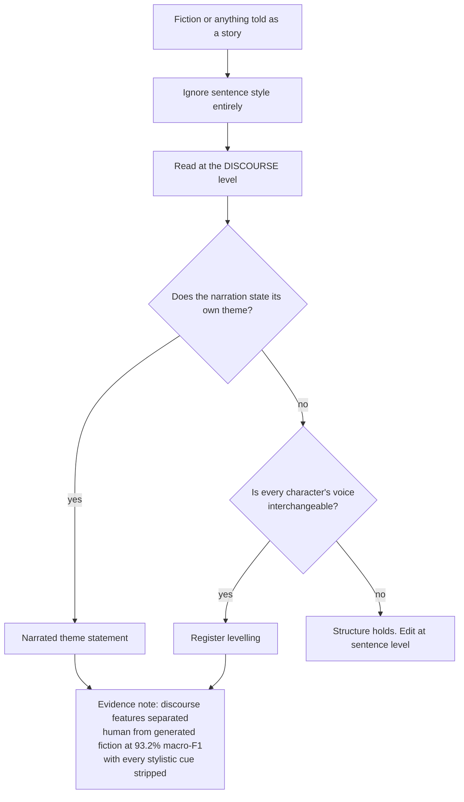

# Fiction and narrative tells

What generated fiction does at the level of story rather than sentence. This file matters out of proportion to its length: a 61,608-story study separated human from AI fiction at 93.2% macro-F1 using discourse-level narrative features ALONE, with every stylistic cue stripped out. Which means the tells here are stronger than any phrase in the rest of the catalog, and they survive a model that has learned not to say "delve".

_6 items. Generated from catalog.json — edit there, then re-run `scripts/regenerate_references.py`. Do not hand-edit this file._

_Every item carries a **False positive when** line. Read it before you act on the item: these are cues for an editor, not evidence about an author._

<!-- humanize:ignore-start
     The diagram and index below quote the tells they document, and a
     mermaid label is not a sentence. -->

## When this file applies

## What is in this file

Severity is how loudly the tell announces itself, never how sure you should be about who wrote it. **Automated** means these scripts implement the check; *no* means it is yours to ask in the judge pass.

| item | severity | family | automated |
| --- | --- | --- | --- |
| [`narrated-theme-statement`](#narrated-theme-statement) | HIGH | form | n/a |
| [`single-register-cast`](#single-register-cast) | HIGH | form | n/a |
| [`uplift-closing-line`](#uplift-closing-line) | HIGH | form | n/a |
| [`body-sensation-emotion-substitution`](#body-sensation-emotion-substitution) | med | form | n/a |
| [`no-cultural-anchors`](#no-cultural-anchors) | med | form | n/a |
| [`simile-stacking`](#simile-stacking) | med | form | n/a |

<!-- humanize:ignore-end -->

<!-- humanize:ignore-start
     Everything below is a specimen catalog. It quotes the tells it documents,
     including literal machine residue, so reviewing it with humanize_review.py
     would flag the exhibits rather than the writing. -->

### `narrated-theme-statement`  ·  high · generic-llm · fiction · llm-judge · family: form

The story stops to explain what it means. A character, or the narration, states the theme outright near the end, usually as a short italicized realization.

**Why it reads AI:** Fiction earns meaning through event and consequence. A model optimizes for the reader understanding, so it states the conclusion rather than staging it. Discourse-level narrative features like this separate human from AI fiction at 93% macro-F1 with every stylistic cue removed, which is the strongest evidence in this catalog for weighting structure over phrases.

**Detect:** Find the sentence that tells the reader what the story was about. If cutting it loses nothing but the explanation, it is this.

**Fix:** Delete the statement. If the story does not already carry the meaning, the problem is upstream in the events.

**False positive when:** Some literary traditions and most fables state their theme on purpose, and a first-person narrator reflecting is a legitimate mode.

**Evidence:** StoryScope, arXiv:2604.03136: 61,608 stories, 93.2% macro-F1 from discourse-level narrative features with stylistic cues removed.

**Before**

> She looked at the empty chair and understood, finally, that grief was just love with nowhere left to go.

**After**

> She looked at the empty chair. Then she moved it into the hall, where she would not have to see it.

### `single-register-cast`  ·  high · generic-llm · fiction · llm-judge · family: form

Every character speaks in the same voice. Vocabulary, sentence length, humor and hedging are indistinguishable across the cast.

**Why it reads AI:** One model, one register. Producing genuinely different idiolects requires holding several different competence and personality models at once, and the default collapses them toward the mean.

**Detect:** Strip the dialogue tags from a scene and ask whether you can still tell who is speaking.

**Fix:** Give at least two characters a verbal habit the others do not have: a filler, a register, a thing they will not say.

**False positive when:** Stylized work where uniform dialogue is the point, and some authors genuinely write one voice throughout.

**Before**

> Two characters who both speak in measured, complete, faintly explanatory sentences.

**After**

> One of them interrupts, swears, and never finishes a clause.

### `uplift-closing-line`  ·  high · generic-llm · fiction · llm-judge · family: form

The piece resolves upward regardless of what came before: a final line of quiet hope, acceptance, or gentle forward motion bolted onto an unresolved story.

**Why it reads AI:** Alignment training rewards endings that leave the reader well. The model resolves because resolution is preferred, not because the story reached one.

**Detect:** Read only the last two sentences. Do they belong to this story, or to any story?

**Fix:** Cut the last paragraph. Most of the time the real ending is two sentences earlier and harder.

**False positive when:** Plenty of good fiction ends hopefully, and whole genres require it. The tell is uplift that contradicts the story it ends.

**Before**

> It wouldn't be easy. But for the first time in a long while, she felt ready to try.

**After**

> She locked the door behind her and did not check whether it caught.

### `body-sensation-emotion-substitution`  ·  medium · generic-llm · fiction · llm-judge · family: form

Emotion rendered exclusively as somatic report: her chest tightened, his stomach dropped, a knot formed in her throat, breath she didn't know she was holding.

**Why it reads AI:** It is 'show don't tell' applied as a compulsion. The model has learned the surface rule and applies it uniformly, so every feeling arrives through the same three organs.

**Detect:** Count somatic-reaction clauses per thousand words and check whether any emotion in the piece is conveyed any other way.

**Fix:** Let emotion show in what the character does, says, or refuses to say. Keep one somatic beat if it is the right one.

**False positive when:** Somatic detail is a legitimate and much-taught technique; romance and thriller conventions lean on it hard. Density is the tell, not presence.

**Before**

> Her chest tightened. Her stomach dropped. She let out a breath she didn't know she'd been holding.

**After**

> She read it twice, put the phone face down, and went back to chopping onions.

### `no-cultural-anchors`  ·  medium · generic-llm · fiction · llm-judge · family: form

A world with no specific music, brands, slang, politics, or period detail. Everything is legible everywhere, which means it belongs nowhere.

**Why it reads AI:** Specific references risk being wrong or dated, and the model's training rewards safe generality. The result is fiction set in a beige everywhere.

**Detect:** List every proper noun and period-specific reference in the piece. A long story with almost none is this.

**Fix:** Anchor one scene hard: a real song, a real chain restaurant, the year.

**False positive when:** Secondary-world fantasy, fable, and allegory deliberately float free of cultural anchors.

**Before**

> They met at a coffee shop downtown and talked about work.

**After**

> They met at the Dunkin' on Mass Ave and argued about whether the Sox should have kept Betts.

### `simile-stacking`  ·  medium · generic-llm · fiction · llm-judge · family: form

Figurative language arriving in clusters, often two or three comparisons for one image, none of them load-carrying.

**Why it reads AI:** Simile is the most legible marker of literary writing, so a model optimizing for literary output produces more of it than any writer would.

**Detect:** Count 'like' and 'as if' constructions per page and check whether any of them changes what the reader understands.

**Fix:** Keep the one that does work. Delete the others.

**False positive when:** Some prose stylists genuinely stack figures, and certain genres reward density.

**Before**

> The silence hung like a held breath, like a curtain about to fall, as if the room itself were waiting.

**After**

> The silence went on a beat too long.

<!-- humanize:ignore-end -->
